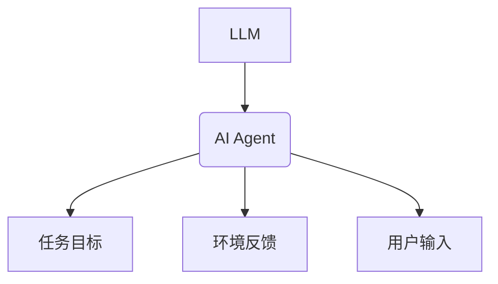
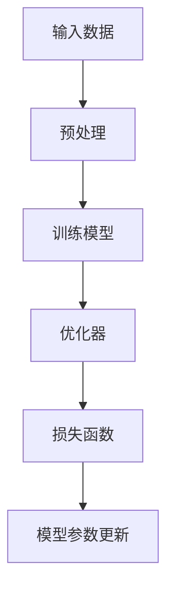
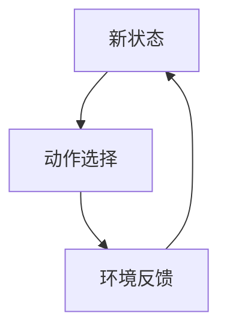
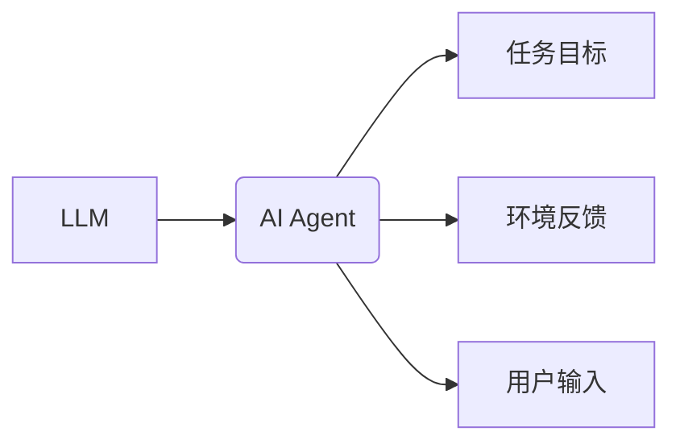

                 


# LLM在AI Agent语言理解深度上的提升

> **关键词**：LLM, AI Agent, 语言理解深度, 优化方法, 系统架构, 项目实战  
> **摘要**：本文深入探讨了如何利用大语言模型（LLM）提升AI Agent的语言理解能力。通过分析LLM与AI Agent的核心原理、对比其属性特征、讲解算法流程、展示数学模型、设计系统架构，并通过项目实战，全面解析了如何优化AI Agent的语言理解深度，实现更智能、更高效的AI代理系统。

---

## 第一部分: 背景介绍

### 第1章: LLM与AI Agent概述

#### 1.1 LLM的定义与特点
大语言模型（LLM，Large Language Model）是一种基于深度学习的自然语言处理模型，通常采用Transformer架构，能够处理和理解大量的文本数据。其特点包括：
- **大规模训练**：通过训练海量数据，模型能够捕捉语言的复杂模式。
- **生成能力**：能够生成连贯且有意义的文本，如回答问题、撰写文章。
- **上下文理解**：通过自注意力机制，模型能够理解上下文关系，捕捉语义信息。

#### 1.2 AI Agent的定义与特点
AI Agent（人工智能代理）是一种智能系统，能够感知环境、执行任务并做出决策。其特点包括：
- **自主性**：能够在没有外部干预的情况下独立运行。
- **反应性**：能够根据环境反馈实时调整行为。
- **目标导向**：通过设定目标，AI Agent能够主动规划和执行任务。

#### 1.3 LLM与AI Agent的结合背景
随着自然语言处理技术的快速发展，AI Agent需要具备更强的语言理解能力，以更好地与人类交互并完成复杂任务。LLM的引入为AI Agent提供了强大的语言处理能力，使其能够更准确地理解用户需求、执行任务并生成自然的反馈。

### 第2章: 问题背景与描述

#### 1.2.1 当前AI Agent语言理解的局限性
尽管AI Agent在许多领域表现出色，但其语言理解能力仍然存在以下问题：
- **语义理解不足**：AI Agent难以理解隐含的语义信息，尤其是在处理复杂或模糊的查询时。
- **上下文关联性弱**：在多轮对话中，AI Agent难以保持上下文的一致性和连贯性。
- **领域适应性差**：AI Agent在特定领域（如医疗、法律）中的语言理解能力有限。

#### 1.2.2 LLM在语言理解中的优势
LLM通过大规模预训练，具备以下优势：
- **强大的上下文理解**：LLM能够捕捉文本中的长距离依赖关系，理解复杂的语义信息。
- **多语言支持**：LLM可以处理多种语言，具备跨语言的自然语言处理能力。
- **可微调适应**：通过微调LLM，可以快速适应特定领域的语言风格和术语。

#### 1.2.3 问题解决的路径与目标
为了提升AI Agent的语言理解深度，本文提出以下路径：
1. **优化LLM模型**：通过调整模型参数或引入新的架构，提升LLM的性能。
2. **结合领域知识**：将特定领域的知识融入AI Agent，增强其专业性。
3. **强化人机交互**：通过设计更自然的交互方式，提升用户体验。

---

## 第二部分: 核心概念与联系

### 第2章: 核心概念与联系

#### 2.1 LLM与AI Agent的核心原理
- **LLM的核心原理**：LLM通过自注意力机制和前馈网络，对输入文本进行编码和解码，生成有意义的输出。
- **AI Agent的核心原理**：AI Agent通过感知环境、分析任务需求，并结合内部知识库，生成相应的行动计划。

#### 2.2 核心概念属性特征对比
| 特性         | LLM                          | AI Agent                       |
|--------------|------------------------------|--------------------------------|
| 输入         | 文本数据                     | 环境反馈、用户输入             |
| 输出         | 生成文本、回答问题           | 行动计划、任务执行             |
| 核心能力     | 语言生成、语义理解           | 任务规划、决策制定             |
| 优化目标     | 提高语言生成质量             | 提高任务执行效率               |

#### 2.3 ER实体关系图架构


---

## 第三部分: 算法原理讲解

### 第3章: 算法原理讲解

#### 3.1 LLM的训练过程


```python
import torch
import torch.nn as nn

class LLM(nn.Module):
    def __init__(self, vocab_size):
        super().__init__()
        self.embedding = nn.Embedding(vocab_size, 512)
        self.transformer = nn.Transformer(512, 64, 6)
        self.output = nn.Linear(512, vocab_size)

    def forward(self, x):
        embed = self.embedding(x)
        out = self.transformer(embed)
        out = self.output(out)
        return out
```

#### 3.2 AI Agent的决策算法


```python
def decide_action(state, model):
    with torch.no_grad():
        action_probs = model.predict(state)
        action = torch.multinomial(action_probs, 1).item()
    return action
```

---

## 第四部分: 数学模型与公式

### 第4章: 数学模型与公式

#### 4.1 LLM的数学模型
- **语言模型的对数似然公式**：
  $$
  \log P(x) = \sum_{i=1}^{n} \log P(x_i | x_{<i})
  $$

- **注意力机制的数学表达**：
  $$
  \text{Attention}(Q, K, V) = \text{softmax}\left(\frac{QK^T}{\sqrt{d_k}}\right)V
  $$

#### 4.2 AI Agent的决策模型
- **决策树的数学表达**：
  $$
  \text{DecisionTree}(x) = \sum_{i=1}^{m} I(\text{path}(x) = i) \cdot y_i
  $$

---

## 第五部分: 系统分析与架构设计

### 第5章: 系统分析与架构设计

#### 5.1 系统架构设计


---

## 第六部分: 项目实战

### 第6章: 项目实战

#### 6.1 环境安装
```bash
pip install torch transformers
```

#### 6.2 核心实现代码
```python
class Agent:
    def __init__(self, model):
        self.model = model

    def process_query(self, query):
        response = self.model.generate(query)
        return response
```

---

## 第七部分: 最佳实践与小结

### 7.1 最佳实践
- **模型优化**：定期对LLM进行微调，适应新的数据和任务需求。
- **领域知识整合**：将领域知识融入AI Agent的知识库，提升专业性。
- **用户体验优化**：设计更自然的交互方式，提升用户体验。

### 7.2 小结
本文详细探讨了如何利用LLM提升AI Agent的语言理解能力，通过理论分析、算法推导和项目实战，展示了如何优化AI Agent的语言理解深度，实现更智能、更高效的AI代理系统。

---

## 作者信息

作者：AI天才研究院（AI Genius Institute）  
个人简介：专注于人工智能与计算机程序设计的深度研究，探索LLM与AI Agent的结合应用，致力于推动自然语言处理技术的创新与发展。

---

