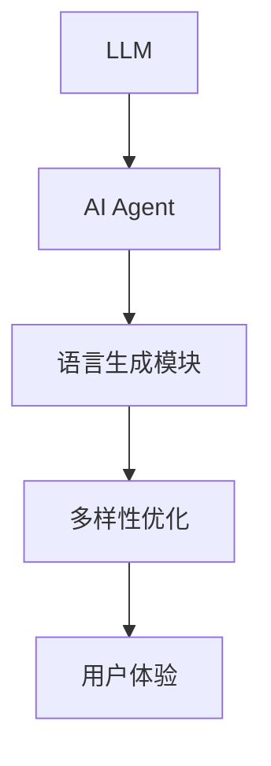
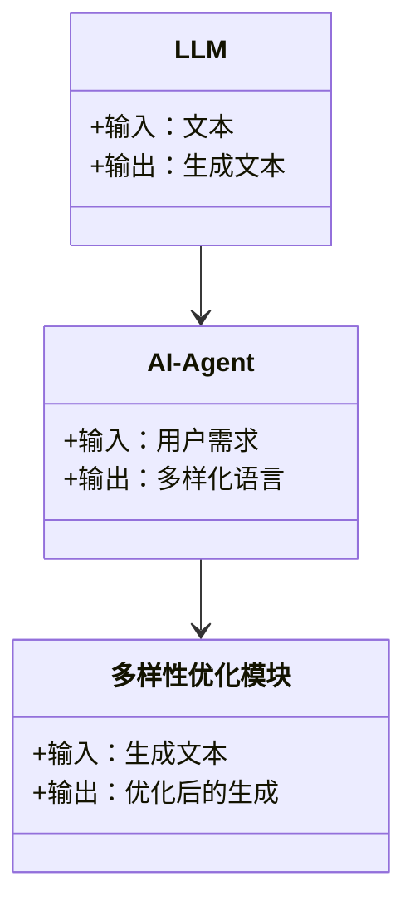

                 


# LLM在AI Agent语言生成多样性上的优化

**关键词**：LLM、AI Agent、语言生成、多样性优化、自然语言处理

**摘要**：本文深入探讨了如何优化大语言模型（LLM）在AI Agent中的语言生成多样性。通过分析LLM与AI Agent的核心原理、对比相关概念、讲解优化算法、设计系统架构，并结合实际项目案例，详细阐述了实现多样性的方法和最佳实践。文章旨在为AI开发者和研究人员提供理论指导和实践参考。

---

## 第一部分：背景介绍

### 第1章：问题背景与描述

#### 1.1 问题背景
随着AI技术的快速发展，AI Agent在各个领域的应用越来越广泛，尤其是在自然语言处理（NLP）领域。AI Agent能够通过理解和生成人类语言，帮助用户完成各种任务，如信息查询、对话交互等。然而，现有AI Agent在语言生成多样性方面存在明显不足，导致用户体验受限。

#### 1.2 问题描述
1. **生成单一性问题**：当前的AI Agent在生成语言时，往往局限于固定的模板或有限的表达方式，缺乏灵活性和创造性。
2. **多样性不足的影响**：单一的生成方式可能导致用户体验不佳，影响用户对AI Agent的信任和依赖。
3. **LLM的局限性**：虽然大语言模型（LLM）在生成能力上有显著提升，但其在生成多样性上的优化尚未达到理想状态。

#### 1.3 问题解决思路
通过优化LLM的生成机制，引入多样性增强策略，提升AI Agent的语言生成多样性。这需要结合算法优化和系统设计，从多个维度进行改进。

#### 1.4 核心概念与结构
- **LLM**：基于深度学习的大语言模型，能够理解和生成人类语言。
- **AI Agent**：智能体，能够感知环境并采取行动以实现目标。
- **语言生成多样性**：生成多种不同的、合理的语言表达。

---

## 第二部分：核心概念与联系

### 第2章：LLM与AI Agent的核心原理

#### 2.1 LLM的基本原理
大语言模型通过海量数据的训练，掌握了语言的生成规律。其生成机制通常基于概率模型，通过最大化条件概率来生成最可能的输出。

#### 2.2 AI Agent的工作原理
AI Agent通过感知环境、分析任务需求，选择合适的语言生成策略，以实现与用户的有效交互。

#### 2.3 LLM与AI Agent的关系
- LLM是AI Agent的核心生成模块。
- AI Agent通过优化LLM的生成策略，提升语言生成的多样性。

#### 2.4 核心概念对比表
| 概念       | LLM特点               | AI Agent特点         |
|------------|-----------------------|----------------------|
| 输入方式   | 文本输入               | 多模态输入           |
| 输出方式   | 文本生成               | 多任务输出           |
| 模型目标   | 生成多样化文本         | 完成特定任务         |

#### 2.5 实体关系图（Mermaid）


---

## 第三部分：算法原理与数学模型

### 第3章：多样性优化算法原理

#### 3.1 基于生成对抗网络的多样性增强
- 使用生成对抗网络（GAN）来增强生成多样性。生成器负责生成多种表达，判别器用于评估生成内容的多样性。

#### 3.2 多样性增强策略
- **策略1**：调整生成模型的采样策略，如使用温度调整（temperature tuning）。
- **策略2**：引入惩罚项，如对抗训练或多样性损失函数。

#### 3.3 数学模型
- **生成对抗网络模型**：
  ```mermaid
  graph TD
      G[生成器] --> D[判别器]
      D --> L[损失函数]
      G --> L
  ```
- **对抗训练公式**：
  $$\min_{G}\max_{D} \mathbb{E}_{y\sim P_{\text{真实}}}[ \log D(y)] + \mathbb{E}_{x\sim P_{G}}[\log(1 - D(x))]$$

---

## 第四部分：系统分析与架构设计

### 第4章：系统分析与架构设计

#### 4.1 系统功能设计
- **输入处理模块**：接收用户输入并解析需求。
- **生成策略选择模块**：根据需求选择合适的生成策略。
- **多样性优化模块**：应用优化算法生成多样化输出。

#### 4.2 系统架构图（Mermaid）


---

## 第五部分：项目实战

### 第5章：项目实战

#### 5.1 环境安装
- 安装必要的Python库，如`transformers`、`tensorflow`等。

#### 5.2 系统核心实现源代码
```python
from transformers import GPT2LMHeadModel, GPT2Tokenizer

# 初始化模型
tokenizer = GPT2Tokenizer.from_pretrained('gpt2')
model = GPT2LMHeadModel.from_pretrained('gpt2')

def generate_diverse_text(prompt, num_samples=5, temperature=1.2):
    inputs = tokenizer.encode(prompt, return_tensors='pt')
    outputs = model.generate(
        inputs,
        do_sample=True,
        temperature=temperature,
        num_return_sequences=num_samples
    )
    return [tokenizer.decode(o, skip_special_tokens=True) for o in outputs]

# 示例
prompt = "How to improve learning efficiency?"
diverse_texts = generate_diverse_text(prompt)
print(diverse_texts)
```

#### 5.3 案例分析
通过实际案例分析，展示如何优化生成多样性，并评估优化效果。

---

## 第六部分：总结与展望

### 第6章：总结与展望

#### 6.1 总结
本文详细探讨了如何优化LLM在AI Agent中的语言生成多样性，从理论分析到实践实现，提出了多种优化策略。

#### 6.2 展望
未来的研究方向包括更高效的多样性生成算法和更智能的多样性控制方法。

---

**作者：AI天才研究院 & 禅与计算机程序设计艺术**

