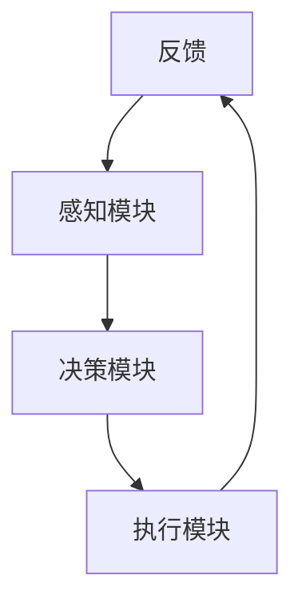

                 


# LLM在AI Agent跨模态理解中的应用

> 关键词：大语言模型（LLM）、人工智能（AI）智能体（Agent）、跨模态理解、多模态数据、自然语言处理（NLP）

> 摘要：本文详细探讨了大语言模型（LLM）在AI Agent跨模态理解中的应用，从LLM的基本概念、技术原理到跨模态理解的核心原理、系统架构，再到实际项目实战，全面分析了LLM在AI Agent中的应用现状、挑战与解决方案，为读者提供了一个系统性的知识框架。

---

# 第一部分: LLM与AI Agent基础概述

## 第1章: LLM与AI Agent基础概述

### 1.1 LLM的基本概念与技术背景
#### 1.1.1 大语言模型（LLM）的定义
大语言模型（Large Language Model, LLM）是一种基于深度学习的自然语言处理（NLP）模型，通常采用Transformer架构，通过大量文本数据的预训练，能够理解和生成人类语言。LLM的核心目标是实现接近人类水平的文本理解和生成能力。

#### 1.1.2 LLM的核心技术特点
- **Transformer架构**：LLM采用多层的自注意力机制（Self-Attention）和前馈神经网络，能够捕捉文本中的长距离依赖关系。
- **预训练与微调**：LLM通过大规模的无监督预训练（如Masked Language Model任务）获得通用语言表示能力，再通过特定任务的有监督微调进行优化。
- **多模态扩展**：LLM可以结合视觉、听觉等模态信息，实现跨模态理解和生成。

#### 1.1.3 LLM与AI Agent的关系
LLM作为AI Agent的核心组件之一，负责处理和生成语言信息。AI Agent需要通过LLM来理解用户的意图、进行对话交互，并结合其他模态信息（如视觉、听觉）做出更智能的决策。

---

### 1.2 AI Agent的基本概念与功能
#### 1.2.1 AI Agent的定义与分类
AI Agent（人工智能代理）是指能够感知环境、自主决策并执行任务的智能系统。根据功能和应用场景的不同，AI Agent可以分为以下几类：
- **简单反射型Agent**：基于当前感知做出简单反应，适用于规则明确的任务。
- **基于模型的反射型Agent**：通过内部状态和环境模型进行决策，适用于复杂任务。
- **目标驱动型Agent**：基于明确的目标进行规划和决策。
- **学习型Agent**：通过机器学习技术不断优化自身行为。

#### 1.2.2 AI Agent的核心功能模块
1. **感知模块**：负责接收来自环境的多模态输入（如文本、图像、语音等）。
2. **决策模块**：基于感知信息和内部状态，制定行动计划。
3. **执行模块**：通过执行动作与环境交互，完成任务目标。
4. **学习模块**：通过与环境的交互，不断优化自身的模型和策略。

#### 1.2.3 AI Agent的应用场景
- **智能助手**：如Siri、Alexa等，通过语音交互帮助用户完成日常任务。
- **智能客服**：通过自然语言处理技术，提供个性化的客户服务。
- **自动驾驶**：结合视觉、雷达等多模态信息，实现智能驾驶。

---

### 1.3 跨模态理解的基本概念
#### 1.3.1 跨模态理解的定义
跨模态理解是指智能系统能够同时处理和理解来自不同模态（如文本、图像、语音等）的数据，并在此基础上进行推理、判断和生成。跨模态理解的核心目标是让AI Agent能够像人类一样，通过多感官的信息融合，做出更智能的决策。

#### 1.3.2 跨模态数据的类型与特点
- **文本**：包括书籍、网页、对话等。
- **图像**：包括照片、视频、图表等。
- **语音**：包括音频、音乐、语音指令等。
- **其他模态**：如触觉、位置信息等。

#### 1.3.3 跨模态理解的意义与挑战
- **意义**：跨模态理解能够增强AI Agent的感知能力，使其能够处理更复杂和多样化的任务。
- **挑战**：
  - 不同模态数据的异构性（Heterogeneity）：文本、图像等数据形式差异大，难以直接融合。
  - 数据对齐（Alignment）问题：如何将不同模态的数据关联起来，使其能够协同工作。
  - 计算资源需求：跨模态理解通常需要处理大量的多模态数据，对计算能力要求较高。

---

## 1.4 本章小结
本章从LLM和AI Agent的基本概念入手，介绍了LLM的核心技术特点以及AI Agent的功能模块和应用场景。同时，详细探讨了跨模态理解的定义、类型、意义与挑战，为后续章节的深入分析奠定了基础。

---

# 第2章: LLM的技术原理与实现

## 2.1 LLM的模型架构
#### 2.1.1 Transformer模型的基本结构
Transformer由编码器（Encoder）和解码器（Decoder）组成，每个编码器和解码器由多个层堆叠而成。每一层包含自注意力机制（Self-Attention）和前馈网络（Feed-Forward Network）。

#### 2.1.2 大语言模型（LLM）的训练方法
- **预训练**：通过无监督学习（如Masked Language Model任务）对模型进行初始化。
- **微调**：针对具体任务（如问答系统、文本摘要）进行有监督微调。

#### 2.1.3 模型参数量与性能的关系
模型的参数量越大，通常能够捕捉更复杂的语言特征，但计算资源需求也越高。例如，GPT-3有1750亿个参数，参数规模直接影响模型的生成能力和理解能力。

---

## 2.2 LLM的训练与优化
#### 2.2.1 预训练与微调的定义
- **预训练**：在大规模通用数据集上进行无监督学习，提取语言的通用特征。
- **微调**：在特定任务的有标注数据上进行有监督训练，优化模型在具体任务上的性能。

#### 2.2.2 预训练目标函数的数学模型
$$ \text{损失函数} = -\sum_{i=1}^{n} \log p(x_i) $$
其中，$x_i$表示输入序列中的第i个词，$p(x_i)$表示模型预测该词的概率。

#### 2.2.3 微调的策略与优化方法
- **策略**：根据具体任务调整模型的输出层（如添加任务相关的全连接层）。
- **优化方法**：采用Adam优化器，结合学习率衰减策略（如Cosine Annealing）。

---

## 2.3 LLM的数学模型与公式
#### 2.3.1 注意力机制的数学表达
$$ \text{Attention}(Q, K, V) = \text{softmax}\left(\frac{QK^T}{\sqrt{d_k}}\right)V $$
其中，$Q$、$K$、$V$分别为查询（Query）、键（Key）、值（Value）向量，$d_k$为键的维度。

#### 2.3.2 梯度下降与优化算法
$$ \theta_{t+1} = \theta_t - \eta \nabla L(\theta_t) $$
其中，$\theta$表示模型参数，$\eta$表示学习率，$L$表示损失函数。

---

## 2.4 本章小结
本章详细介绍了LLM的技术原理，包括模型架构、训练方法和数学公式。通过对LLM的训练过程和模型结构的分析，为后续章节中LLM在AI Agent中的应用奠定了技术基础。

---

# 第3章: 跨模态理解的原理与技术

## 3.1 跨模态数据的处理方法
#### 3.1.1 多模态数据的表示方法
- **模态嵌入（Modality Embedding）**：将不同模态的数据（如文本、图像）转换为统一的向量表示。
- **特征对齐（Feature Alignment）**：通过模态间的关系（如语义相似性）对齐不同模态的特征。

#### 3.1.2 跨模态特征的提取与融合
- **模态融合（Fusion）**：通过加性融合、乘性融合等方式，将不同模态的特征进行融合。
- **注意力机制**：在融合过程中，引入注意力机制，动态调整不同模态的权重。

#### 3.1.3 跨模态数据的对齐技术
- **基于相似性对齐**：通过计算不同模态数据之间的相似性，调整其表示方式。
- **基于深度学习的对齐**：通过对比学习、生成对抗网络等方法，实现模态间的信息对齐。

---

## 3.2 跨模态理解的模型设计
#### 3.2.1 多模态模型的基本架构
- **多模态编码器**：将不同模态的数据分别编码为统一的向量表示。
- **跨模态交互层**：通过自注意力机制，实现模态间的交互和信息共享。

#### 3.2.2 模型的跨模态交互机制
- **交叉注意力（Cross-Attention）**：在不同模态之间引入注意力机制，捕捉模态间的相互关系。
- **融合层（Fusion Layer）**：通过门控机制（Gate）动态调整不同模态的贡献权重。

#### 3.2.3 模型的可解释性问题
- **可视化技术**：通过热力图、注意力权重图等方式，展示模型对不同模态数据的关注程度。
- **可解释性模型**：设计可解释的模型结构，如基于规则的解释模型。

---

## 3.3 跨模态理解的算法实现
#### 3.3.1 多模态数据的预处理
- **文本预处理**：包括分词、去除停用词、文本向量化等。
- **图像预处理**：包括图像增强、特征提取、图像向量化等。

#### 3.3.2 跨模态模型的训练流程
1. 将多模态数据输入模型，提取各模态的特征表示。
2. 通过跨模态交互机制，融合不同模态的特征。
3. 对融合后的特征进行任务相关的预测或生成。

#### 3.3.3 模型性能的评估指标
- **准确率（Accuracy）**：适用于分类任务。
- **F1分数（F1-Score）**：适用于分类任务的综合指标。
- **困惑度（Perplexity）**：适用于生成任务。

---

## 3.4 本章小结
本章从跨模态理解的原理出发，详细探讨了多模态数据的处理方法、模型设计和算法实现。通过对跨模态理解的技术细节分析，为后续章节中LLM在AI Agent中的应用提供了理论支持。

---

# 第4章: AI Agent的体系结构与功能设计

## 4.1 AI Agent的感知模块
#### 4.1.1 多模态感知的基本原理
AI Agent的感知模块负责接收来自环境的多模态输入，并通过LLM进行理解和处理。例如，AI Agent可以通过视觉模块识别图像中的物体，通过语言模块理解用户的语音指令。

#### 4.1.2 LLM在感知中的应用
- **文本理解**：通过LLM理解用户的自然语言指令。
- **多模态融合**：结合视觉、语音等信息，增强感知能力。

#### 4.1.3 感知模块的设计挑战
- **异构数据的融合**：如何将不同模态的数据有效融合。
- **实时性要求**：AI Agent需要在实时环境下快速响应。

---

## 4.2 AI Agent的决策模块
#### 4.2.1 基于LLM的决策方法
- **基于LLM的意图识别**：通过LLM理解用户的意图，并结合上下文信息做出决策。
- **多模态信息的决策支持**：利用跨模态理解的结果，优化决策过程。

#### 4.2.2 决策模块的优化策略
- **基于强化学习的决策优化**：通过强化学习算法，优化AI Agent的决策策略。
- **基于知识图谱的决策支持**：利用知识图谱中的语义信息，辅助决策过程。

---

## 4.3 AI Agent的执行模块
#### 4.3.1 执行模块的功能设计
- **动作规划**：根据决策结果，制定执行动作。
- **动作执行**：通过硬件或软件接口，执行预定义的动作。

#### 4.3.2 执行模块与感知模块的交互
- **反馈机制**：执行模块将执行结果反馈给感知模块，形成闭环。

---

## 4.4 本章小结
本章详细分析了AI Agent的体系结构与功能设计，重点探讨了感知模块、决策模块和执行模块的实现方法。通过结合LLM和跨模态理解技术，AI Agent能够实现更智能的决策和执行。

---

# 第5章: LLM在AI Agent中的实际应用

## 5.1 跨模态对话系统
#### 5.1.1 系统概述
跨模态对话系统结合了文本和图像信息，能够根据用户的输入（如图像和文本）生成相应的回复。

#### 5.1.2 系统实现
1. 用户输入图像和文本。
2. 系统通过LLM理解文本，并结合图像信息生成回复。
3. 回复通过自然语言生成模块输出。

#### 5.1.3 应用案例
- **图像描述生成**：用户输入图像，系统生成描述图像的文本。
- **跨模态问答**：用户输入图像和问题，系统结合图像信息生成答案。

---

## 5.2 跨模态推荐系统
#### 5.2.1 系统概述
跨模态推荐系统结合了文本和图像信息，能够根据用户的输入推荐相关内容。

#### 5.2.2 系统实现
1. 用户输入图像和文本。
2. 系统通过跨模态理解技术，分析图像和文本的语义信息。
3. 根据分析结果，推荐相关内容。

#### 5.2.3 应用案例
- **个性化推荐**：根据用户的兴趣和行为，推荐个性化的内容。
- **多模态推荐**：结合文本和图像信息，推荐更精准的内容。

---

## 5.3 跨模态问答系统
#### 5.3.1 系统概述
跨模态问答系统结合了文本和图像信息，能够根据用户的输入生成答案。

#### 5.3.2 系统实现
1. 用户输入图像和问题。
2. 系统通过跨模态理解技术，分析图像和问题的语义信息。
3. 根据分析结果，生成回答。

#### 5.3.3 应用案例
- **图像问答**：用户输入图像和问题，系统结合图像信息生成答案。
- **多模态问答**：结合文本和图像信息，生成更准确的答案。

---

## 5.4 本章小结
本章通过实际应用案例，展示了LLM在AI Agent跨模态理解中的应用。通过跨模态对话系统、推荐系统和问答系统的实现，进一步验证了LLM在AI Agent中的价值和潜力。

---

# 第6章: 跨模态理解的系统架构设计

## 6.1 系统功能设计
#### 6.1.1 领域模型（Domain Model）
- **定义**：领域模型是AI Agent对任务领域知识的抽象表示。
- **实现**：通过知识图谱、规则库等方式，表示领域知识。

#### 6.1.2 交互流程（Interaction Flow）
- **用户输入**：用户通过多模态输入与AI Agent交互。
- **系统处理**：AI Agent通过感知模块接收输入，通过决策模块处理输入，通过执行模块输出结果。
- **反馈机制**：用户对系统输出进行反馈，系统根据反馈优化自身行为。

---

## 6.2 系统架构设计
#### 6.2.1 系统架构图


#### 6.2.2 模块交互流程
1. 用户输入多模态数据（如文本、图像）。
2. 感知模块接收输入，通过LLM进行理解。
3. 决策模块根据理解结果制定行动计划。
4. 执行模块根据行动计划执行任务。
5. 执行结果反馈给用户，形成闭环。

---

## 6.3 系统接口设计
#### 6.3.1 输入接口
- **文本输入**：支持多种语言的文本输入。
- **图像输入**：支持多种格式的图像输入。

#### 6.3.2 输出接口
- **文本输出**：生成自然语言文本。
- **图像输出**：生成图像或图像描述。

---

## 6.4 本章小结
本章通过系统功能设计和架构设计，详细探讨了AI Agent的实现过程。通过模块化的设计和流程化的交互，确保系统的可扩展性和可维护性。

---

# 第7章: 项目实战——构建一个简单的跨模态对话系统

## 7.1 项目背景与目标
#### 7.1.1 项目背景
随着LLM技术的发展，构建跨模态对话系统已经成为可能。

#### 7.1.2 项目目标
通过本项目，实现一个能够理解文本和图像信息的跨模态对话系统。

---

## 7.2 项目实现
#### 7.2.1 环境安装
- **Python 3.8+**
- **TensorFlow或PyTorch**
- **预训练的LLM模型（如GPT-3）**

#### 7.2.2 核心代码实现
```python
import tensorflow as tf
from tensorflow.keras.layers import Input, Dense, LSTM
from tensorflow.keras.models import Model

# 定义模型输入
input_text = Input(shape=(max_length,))
input_image = Input(shape=(image_height, image_width, channels))

# 文本处理
text_embedding = LSTM(128)(input_text)
# 图像处理
image_embedding = Dense(128, activation='relu')(input_image)

# 跨模态融合
combined = tf.keras.layers.concatenate([text_embedding, image_embedding])
output = Dense(1, activation='sigmoid')(combined)

# 定义模型
model = Model(inputs=[input_text, input_image], outputs=output)
model.compile(loss='binary_crossentropy', optimizer='adam', metrics=['accuracy'])

# 训练模型
model.fit([train_text, train_image], train_labels, epochs=10, batch_size=32)
```

#### 7.2.3 代码解读与分析
- **输入层**：包括文本输入和图像输入。
- **文本处理层**：使用LSTM提取文本特征。
- **图像处理层**：使用卷积神经网络（CNN）提取图像特征。
- **融合层**：将文本和图像特征进行融合。
- **输出层**：生成最终的预测结果。

---

## 7.3 项目小结
通过本项目，我们实现了一个简单的跨模态对话系统。通过代码实现，我们可以看到跨模态理解的基本实现方法和流程。同时，也为我们后续的深入研究提供了参考。

---

# 第8章: 总结与展望

## 8.1 本章总结
本文详细探讨了LLM在AI Agent跨模态理解中的应用，从LLM的技术原理到跨模态理解的实现方法，再到AI Agent的系统架构设计，逐步展开分析。通过实际项目的实现，进一步验证了LLM在AI Agent中的应用价值。

## 8.2 未来展望
随着技术的发展，跨模态理解将在AI Agent中发挥越来越重要的作用。未来的研究方向可能包括：
- **更高效的跨模态融合方法**：探索更加高效的模态融合方法，如基于对比学习的融合方法。
- **更加智能的LLM模型**：开发更加智能的LLM模型，提升跨模态理解的准确性和实时性。
- **多模态知识图谱**：构建多模态知识图谱，进一步提升AI Agent的智能水平。

---

# 作者：AI天才研究院/AI Genius Institute & 禅与计算机程序设计艺术 /Zen And The Art of Computer Programming

