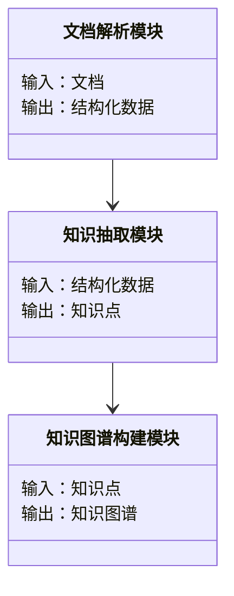
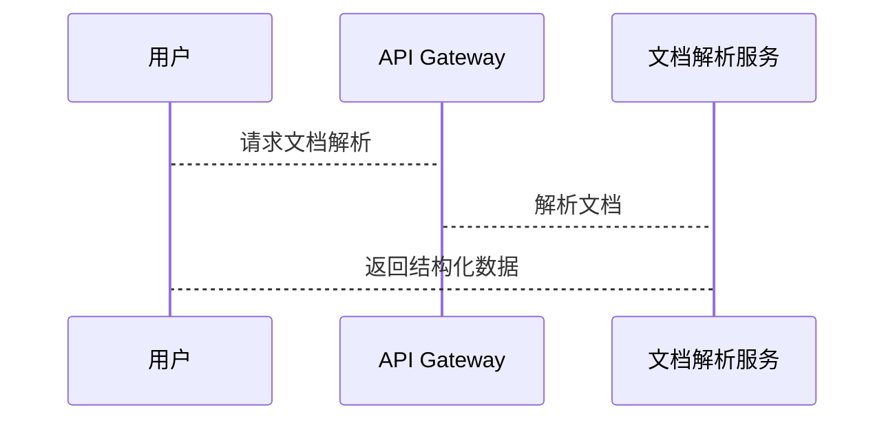

                 


# LLM在AI Agent跨领域知识整合中的应用

---

## 关键词：
LLM（大语言模型）、AI Agent（人工智能代理）、跨领域知识整合、自然语言处理、知识图谱、对话生成、系统架构设计

---

## 摘要：
本文深入探讨了大语言模型（LLM）在AI Agent跨领域知识整合中的应用。首先介绍了LLM和AI Agent的基本概念，分析了它们结合的必要性和优势。接着详细阐述了LLM在知识整合中的具体应用，包括文档解析、知识图谱构建和多领域对话生成。然后，从算法原理、系统架构设计和项目实战三个层面，全面解析了LLM驱动的AI Agent的实现过程。最后，总结了当前的应用现状，并展望了未来的发展方向。

---

# 第1章: LLM与AI Agent概述

## 1.1 LLM的基本概念

### 1.1.1 大语言模型的定义
大语言模型（LLM）是一种基于深度学习的自然语言处理模型，通过大量文本数据的训练，能够理解和生成人类语言。其核心是基于Transformer架构的模型，如GPT、BERT等。

### 1.1.2 LLM的核心特点
- **强大的上下文理解能力**：通过自注意力机制，模型可以捕捉文本中的长距离依赖关系。
- **生成能力强**：能够生成连贯且符合语境的文本。
- **可扩展性**：通过微调或提示工程技术，可以适应多种下游任务。

### 1.1.3 LLM与传统NLP模型的区别
| 特性          | 传统NLP模型                     | LLM                        |
|---------------|---------------------------------|-----------------------------|
| 模型结构      | 基于RNN或CNN                   | 基于Transformer             |
| 训练数据      | 数据量较小，任务特定            | 数据量巨大，通用任务        |
| 应用场景      | 精确任务，如分词、命名实体识别   | 多任务学习，如翻译、问答    |

---

## 1.2 AI Agent的基本概念

### 1.2.1 AI Agent的定义
AI Agent是一种智能体，能够感知环境、自主决策并执行任务。它通常具备以下能力：
- **感知**：通过传感器或API获取环境信息。
- **推理**：基于获取的信息进行分析和推理。
- **决策**：根据推理结果做出最优决策。
- **执行**：通过执行器完成任务。

### 1.2.2 AI Agent的核心特点
- **自主性**：能够在没有外部干预的情况下运行。
- **反应性**：能够实时感知环境并做出响应。
- **目标导向**：具备明确的目标，并围绕目标执行任务。

### 1.2.3 AI Agent与传统程序的区别
| 特性          | 传统程序                      | AI Agent                     |
|---------------|------------------------------|----------------------------|
| 行为方式      | 预设规则，执行固定任务          | 根据环境动态调整行为          |
| 决策机制      | 确定性逻辑                    | 基于概率推理和优化算法        |
| 适应性        | 固定，无法自适应                | 可自适应，根据环境变化调整    |

---

## 1.3 LLM与AI Agent的结合

### 1.3.1 LLM在AI Agent中的作用
- **知识表示**：LLM可以将多种领域的知识表示为文本形式，便于AI Agent理解和使用。
- **跨领域推理**：通过LLM的强大生成能力，AI Agent可以处理跨领域的复杂问题。
- **动态更新**：LLM可以通过持续学习不断更新知识库，保持AI Agent的最新状态。

### 1.3.2 AI Agent如何利用LLM进行知识整合
1. **文档解析与信息提取**：AI Agent通过LLM从多种文档中提取关键信息。
2. **知识图谱构建**：LLM帮助AI Agent将分散的知识点组织成结构化的知识图谱。
3. **多领域对话生成**：AI Agent利用LLM生成跨领域的对话内容，提升用户体验。

### 1.3.3 LLM与AI Agent结合的典型应用场景
- **智能客服**：通过LLM驱动的AI Agent为用户提供跨领域的信息查询服务。
- **智能助手**：帮助用户处理日程管理、信息检索等多种任务。
- **智能分析工具**：结合LLM的文本分析能力，提供跨领域的数据洞察。

---

## 1.4 本章小结
本章主要介绍了LLM和AI Agent的基本概念，并分析了它们结合的必要性和优势。通过对比传统NLP模型和AI Agent的特点，进一步明确了LLM在AI Agent中的独特作用。

---

# 第2章: LLM驱动的跨领域知识整合

## 2.1 跨领域知识整合的背景与挑战

### 2.1.1 跨领域知识整合的必要性
随着技术的发展，跨领域协作的需求日益增长。例如，在医疗领域，AI Agent需要整合医学知识和患者数据；在金融领域，AI Agent需要结合市场动态和用户需求。

### 2.1.2 跨领域知识整合的难点
- **知识异构性**：不同领域的知识表示方式不同，难以统一。
- **信息孤岛**：数据分散在各个领域，缺乏有效的整合机制。
- **动态更新**：知识库需要实时更新，保持最新状态。

### 2.1.3 LLM在跨领域知识整合中的优势
- **统一的表示方式**：LLM将不同领域的知识表示为文本形式，便于统一处理。
- **强大的生成能力**：LLM能够生成跨领域的对话内容和知识图谱。
- **动态适应性**：LLM可以通过持续学习，快速适应新的知识。

---

## 2.2 LLM在知识整合中的具体应用

### 2.2.1 文档解析与信息提取
LLM可以自动解析多种格式的文档，提取关键信息。例如，在医疗领域，AI Agent可以通过LLM解析病历数据，提取患者的诊断信息。

### 2.2.2 知识图谱构建
通过LLM的帮助，AI Agent可以将分散的知识点组织成结构化的知识图谱。例如，在教育领域，AI Agent可以将不同课程的知识点整合成一个知识网络。

### 2.2.3 多领域对话生成
LLM驱动的AI Agent能够生成跨领域的对话内容。例如，在旅游领域，AI Agent可以为用户提供景点推荐和行程规划建议。

---

## 2.3 LLM驱动的AI Agent知识库设计

### 2.3.1 知识库的构建与管理
- **数据采集**：通过网络爬取、API调用等方式获取多领域的知识数据。
- **数据清洗**：去除冗余信息，确保数据的准确性和一致性。
- **知识抽取**：利用LLM从文本中提取关键信息。

### 2.3.2 知识库的动态更新
- **实时监控**：通过RSS feed、API等方式实时获取最新知识。
- **持续学习**：利用在线训练技术，不断更新知识库。

### 2.3.3 知识库的高效检索
- **向量索引**：通过向量索引技术，快速检索相似的知识点。
- **关键词匹配**：基于关键词匹配，快速定位相关知识。

---

## 2.4 本章小结
本章详细介绍了LLM在跨领域知识整合中的具体应用，包括文档解析、知识图谱构建和多领域对话生成。同时，讨论了AI Agent知识库的设计与管理，为后续章节的实现奠定了基础。

---

# 第3章: LLM的算法原理

## 3.1 LLM的训练原理

### 3.1.1 基于Transformer的模型结构
Transformer模型由编码器和解码器组成。编码器负责将输入文本转化为向量表示，解码器根据编码器的输出生成目标文本。

### 3.1.2 自注意力机制的实现
自注意力机制通过计算输入序列中每个位置与其他位置的相关性，生成位置权重。公式如下：
$$
\text{Attention}(Q, K, V) = \text{softmax}\left(\frac{QK^T}{\sqrt{d_k}}\right)V
$$
其中，$Q$、$K$、$V$分别为查询、键、值矩阵，$d_k$为键的维度。

### 3.1.3 梯度下降与参数优化
LLM的训练过程通常采用Adam优化器，通过计算损失函数的梯度，不断优化模型参数。损失函数通常采用交叉熵损失：
$$
\mathcal{L} = -\sum_{i=1}^n y_i \log p(y_i)
$$
其中，$y_i$为真实标签，$p(y_i)$为模型预测的概率。

---

## 3.2 LLM的推理过程

### 3.2.1 解码器的生成策略
解码器在生成文本时，通常采用贪心搜索或Beam Search策略。贪心搜索每次选择概率最大的词，而Beam Search则保留多个候选词，最终选择最优路径。

### 3.2.2 概率生成模型的实现
LLM通过概率生成模型生成文本，具体过程如下：
1. 输入初始序列，生成第一个词的概率分布。
2. 根据概率分布选择下一个词，生成新的序列。
3. 重复上述过程，直到生成完整的文本。

### 3.2.3 前缀树与Beam Search算法
前缀树用于存储生成的候选词，Beam Search算法通过在前缀树中选择最优路径，生成高质量的文本。

---

## 3.3 LLM的数学模型与公式

### 3.3.1 Transformer模型的数学公式
Transformer模型的编码器由多层自注意力机制和前馈网络组成。每一层的自注意力机制可以表示为：
$$
\text{Attention}(Q, K, V) = \text{softmax}\left(\frac{QK^T}{\sqrt{d_k}}\right)V
$$
前馈网络则采用两层全连接层，中间使用ReLU激活函数：
$$
f(x) = \text{ReLU}(Wx + b)
$$

---

## 3.4 本章小结
本章详细介绍了LLM的训练和推理过程，包括模型结构、自注意力机制、损失函数以及生成策略。这些内容为后续章节的系统设计奠定了理论基础。

---

# 第4章: AI Agent的系统架构设计

## 4.1 问题场景介绍
本节将介绍一个基于LLM的AI Agent系统，用于跨领域知识整合。系统的主要功能包括文档解析、知识图谱构建和多领域对话生成。

---

## 4.2 系统功能设计

### 4.2.1 领域模型设计
领域模型包括文档解析模块、知识抽取模块和知识图谱构建模块。通过Mermaid类图展示如下：



---

## 4.3 系统架构设计

### 4.3.1 系统架构图
通过Mermaid架构图展示系统架构：


---

## 4.4 系统接口设计

### 4.4.1 系统接口
系统主要接口包括：
- 文档解析接口：接收文档内容，返回结构化数据。
- 知识抽取接口：接收结构化数据，返回知识点。
- 对话生成接口：接收用户输入，返回生成文本。

### 4.4.2 接口交互流程图
通过Mermaid序列图展示接口交互流程：



---

## 4.5 本章小结
本章详细介绍了基于LLM的AI Agent系统的功能设计、架构设计和接口设计。通过Mermaid图展示了系统的各个部分及其交互流程。

---

# 第5章: 项目实战

## 5.1 环境安装

### 5.1.1 安装Python
```bash
python --version
pip install --upgrade pip
```

### 5.1.2 安装必要的库
```bash
pip install transformers torch
```

---

## 5.2 核心代码实现

### 5.2.1 文档解析模块
```python
from transformers import AutoTokenizer, AutoModelForMaskedLM

class DocumentParser:
    def __init__(self):
        self.tokenizer = AutoTokenizer.from_pretrained('bert-base-cased')
        self.model = AutoModelForMaskedLM.from_pretrained('bert-base-cased')

    def parse_document(self, document):
        # 解析文档并返回结构化数据
        pass
```

### 5.2.2 知识抽取模块
```python
class KnowledgeExtractor:
    def __init__(self):
        pass

    def extract_knowledge(self, structured_data):
        # 从结构化数据中提取知识点
        pass
```

### 5.2.3 知识图谱构建模块
```python
class KnowledgeGraphBuilder:
    def __init__(self):
        pass

    def build_graph(self, knowledge_points):
        # 构建知识图谱
        pass
```

---

## 5.3 代码功能解读与分析

### 5.3.1 文档解析模块
文档解析模块负责将输入的文档内容解析为结构化数据。例如，将PDF文件解析为JSON格式的结构化数据。

### 5.3.2 知识抽取模块
知识抽取模块从结构化数据中提取知识点。例如，从JSON数据中提取关键词和实体。

### 5.3.3 知识图谱构建模块
知识图谱构建模块将提取的知识点组织成结构化的知识图谱。例如，将知识点存储为图数据库中的节点和边。

---

## 5.4 实际案例分析

### 5.4.1 案例背景
假设我们正在开发一个医疗领域的AI Agent，需要整合医学知识和患者数据。

### 5.4.2 案例实现
```python
document = "患者张某，男，30岁，诊断为高血压。"
parser = DocumentParser()
structured_data = parser.parse_document(document)
extractor = KnowledgeExtractor()
knowledge_points = extractor.extract_knowledge(structured_data)
builder = KnowledgeGraphBuilder()
knowledge_graph = builder.build_graph(knowledge_points)
```

---

## 5.5 本章小结
本章通过实际案例分析，详细展示了基于LLM的AI Agent系统的实现过程。从环境安装到核心代码实现，再到案例分析，帮助读者更好地理解理论知识。

---

# 第6章: 总结与展望

## 6.1 核心知识点回顾
- LLM的基本原理和应用场景
- AI Agent的核心概念与功能
- LLM在跨领域知识整合中的具体应用

## 6.2 小结
本文详细探讨了LLM在AI Agent跨领域知识整合中的应用，从理论到实践，全面解析了系统的实现过程。

## 6.3 注意事项
- 数据安全与隐私保护
- 模型的可解释性
- 系统的实时性和响应速度

## 6.4 拓展阅读
- 《Transformer: A Neural Network Model for Unsupervised Learning》
- 《Large Language Models for Question Answering》

---

# 作者：AI天才研究院/AI Genius Institute & 禅与计算机程序设计艺术 /Zen And The Art of Computer Programming

