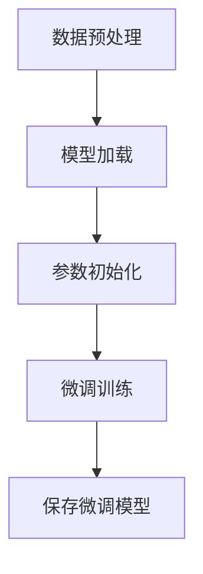
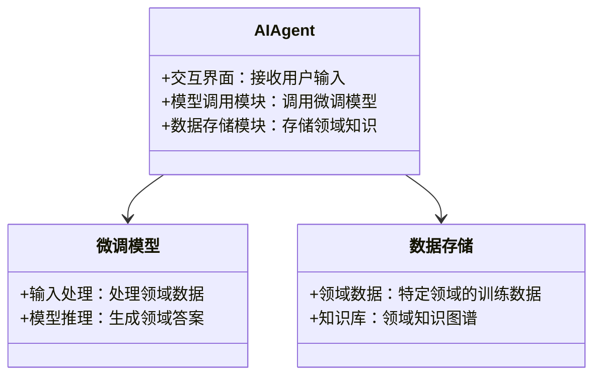

                 


# LLM在特定领域的微调策略：提升AI Agent的专业性

> 关键词：LLM、微调策略、AI Agent、领域适应、机器学习、NLP

> 摘要：本文详细探讨了如何通过微调大语言模型（LLM）来提升AI Agent在特定领域内的专业性。文章首先介绍了LLM和AI Agent的基本概念，然后深入分析了微调策略和领域适应的核心原理，接着通过数学公式和算法流程图详细阐述了微调的实现过程。最后，结合实际案例，展示了如何设计和实现一个基于微调的AI Agent系统，并提出了最佳实践建议。

---

## 第1章: LLM与AI Agent的基本概念

### 1.1 LLM的定义与特点

大语言模型（Large Language Model，LLM）是指经过训练的大型神经网络模型，能够理解和生成人类语言。其特点包括：

1. **大规模训练**：通常基于大量的文本数据进行训练，具有强大的语言理解和生成能力。
2. **上下文理解**：能够捕捉上下文关系，回答复杂问题。
3. **多任务能力**：通过微调，LLM可以适应多种任务，如问答、翻译、对话等。

### 1.2 AI Agent的定义与应用场景

AI Agent（人工智能代理）是一种智能系统，能够感知环境并执行任务以满足用户需求。其应用场景包括：

1. **智能助手**：如Siri、Alexa，提供信息查询、任务执行等服务。
2. **客服机器人**：在电商平台上处理客户咨询和订单处理。
3. **专业咨询**：在医疗、法律等领域提供专业建议。

### 1.3 为什么需要LLM在特定领域的微调

在特定领域中，LLM需要适应领域内的专业术语和特定需求。例如，在医疗领域，LLM需要理解医学术语和诊断流程。通过微调，LLM可以更好地适应这些领域，提升AI Agent的专业性。

---

## 第2章: 微调策略的核心概念

### 2.1 微调（Fine-tuning）的定义与原理

微调是指在预训练好的模型基础上，使用特定领域的小数据进行进一步训练，以适应该领域的需求。其原理是通过调整模型的参数，使得模型在特定领域内表现更好。

### 2.2 领域适应（Domain Adaptation）的概念

领域适应是指将模型从一个领域迁移到另一个领域，通过调整模型参数或特征，使得模型在目标领域内表现更好。微调是领域适应的一种常用方法。

### 2.3 对比分析：微调与领域无关模型的差异

| **方面**         | **微调模型**                | **领域无关模型**            |
|-------------------|-----------------------------|-----------------------------|
| **适应性**       | 高                          | 低                          |
| **领域知识**     | 需要特定领域数据            | 不依赖特定领域数据          |
| **性能**         | 在特定领域表现优异          | 在特定领域可能表现较差      |
| **资源需求**     | 需要特定领域数据和计算资源  | 计算资源需求较低            |

---

## 第3章: 微调策略的算法原理

### 3.1 微调的总体流程



### 3.2 微调的数学模型

微调的目标是优化模型参数$\theta$，使得模型在特定领域内的损失函数$L$最小化。损失函数通常包括交叉熵损失和正则化项：

$$ L = -\frac{1}{N}\sum_{i=1}^{N}\log p(y_i|x_i;\theta) + \lambda \Omega(\theta) $$

其中：
- $N$ 是训练样本数量。
- $\lambda$ 是正则化系数。
- $\Omega(\theta)$ 是正则化项，如L2正则化：$$ \Omega(\theta) = \sum_{i=1}^{d}\theta_i^2 $$

### 3.3 微调的实现步骤

1. **数据预处理**：清洗和标注特定领域的数据。
2. **模型加载**：加载预训练好的LLM模型。
3. **参数初始化**：设置初始学习率和优化器。
4. **微调训练**：使用特定领域的数据训练模型，调整参数。
5. **保存模型**：保存微调后的模型。

---

## 第4章: 系统分析与架构设计

### 4.1 系统架构设计



---

## 第5章: 项目实战

### 5.1 环境安装

```bash
pip install transformers torch
```

### 5.2 代码实现

```python
import torch
from transformers import AutoModelForQuestionAnswering, AutoTokenizer

# 加载微调后的模型
model = AutoModelForQuestionAnswering.from_pretrained('your-model-name')
tokenizer = AutoTokenizer.from_pretrained('your-model-name')

def answer_question(question, context):
    inputs = tokenizer.encode_plus(question=question, context=context, return_tensors='pt')
    with torch.no_grad():
        outputs = model(**inputs)
    answer_start = outputs.start_logits.argmax()
    answer_end = outputs.end_logits.argmax()
    answer = tokenizer.decode(inputs.input_ids[0][answer_start:answer_end+1])
    return answer

# 示例
question = "What is the capital of France?"
context = "Paris is the capital of France."
print(answer_question(question, context))  # 输出：Paris
```

### 5.3 案例分析

以医疗领域为例，假设我们有一个包含医学术语和诊断流程的数据集。通过微调LLM，AI Agent能够理解并回答复杂的医疗问题，如症状诊断和药物建议。

---

## 第6章: 最佳实践与小结

### 6.1 最佳实践

1. **数据质量**：确保微调数据的高质量和代表性。
2. **超参数调整**：合理选择学习率和训练轮数。
3. **模型评估**：使用领域内指标评估模型性能，如准确率和F1分数。

### 6.2 小结

通过微调LLM，AI Agent可以在特定领域内表现出更高的专业性。本文详细介绍了微调的原理、算法和实现过程，并通过案例展示了其实际应用。

### 6.3 注意事项

- 微调需要特定领域的数据，数据不足可能导致性能不佳。
- 微调过程中需要监控模型的过拟合风险。

### 6.4 拓展阅读

- [微调策略的研究现状](#)
- [领域适应的最新进展](#)

---

## 作者：AI天才研究院 & 禅与计算机程序设计艺术

---

通过本文的详细讲解，您可以系统地了解如何通过微调LLM来提升AI Agent的专业性。希望本文对您在实际项目中的应用有所帮助！

