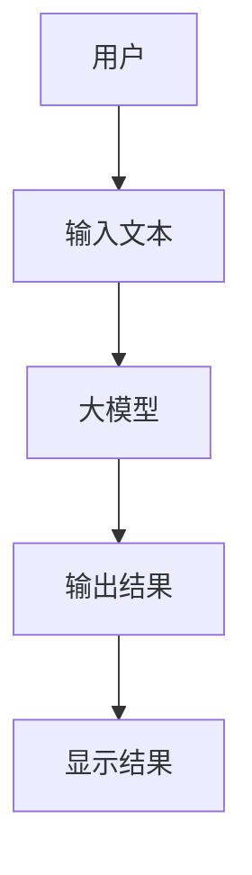
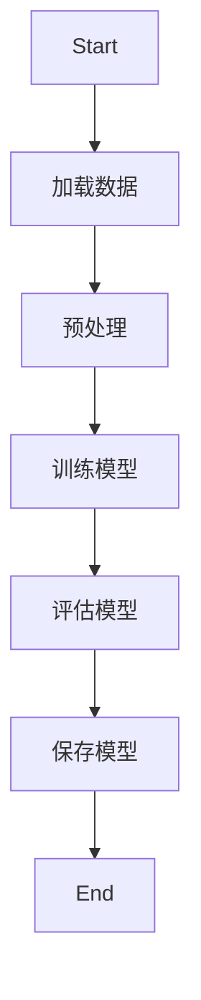
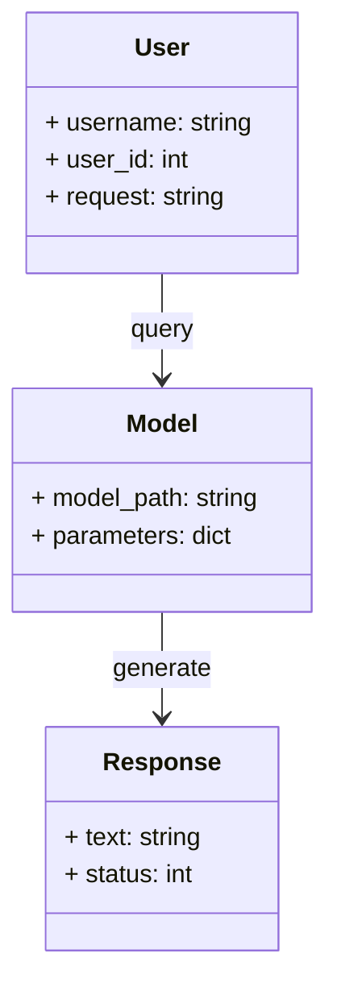
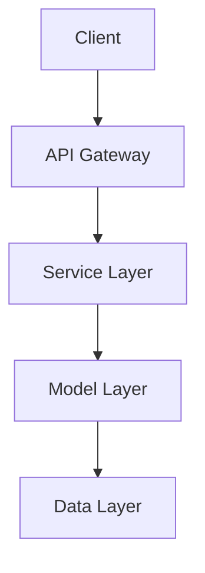

                 


# LLM大模型简介：GPT、BERT及其他主流模型

## 关键词：大语言模型，LLM，GPT，BERT，自然语言处理，人工智能

## 摘要：  
本文将介绍大语言模型（LLM）的核心概念、算法原理、系统架构及实际应用。通过分析GPT、BERT等主流模型的特点，探讨其在自然语言处理领域的突破与挑战。文章结合理论与实践，深入解读LLM的技术细节，旨在为读者提供全面的视角，理解这些模型如何推动人工智能的发展。

---

# 第一部分：LLM大模型的背景与核心概念

## 第1章：LLM大模型的背景与问题背景

### 1.1 问题背景  
- **1.1.1 从传统机器学习到大模型的演进**  
  传统机器学习算法在处理复杂语言任务时表现出明显的局限性，例如无法捕捉长距离依赖关系和上下文信息。  
- **1.1.2 当前AI技术的瓶颈与大模型的突破**  
  大模型通过引入深度学习和并行计算，解决了传统算法在自然语言处理（NLP）中的诸多难题。  
- **1.1.3 大模型对企业级应用的潜在影响**  
  大模型的泛化能力为企业在智能客服、内容生成等领域提供了新的可能性。  

### 1.2 问题描述  
- **1.2.1 自然语言处理的核心挑战**  
  包括语义理解、语法分析、上下文推理等复杂任务。  
- **1.2.2 大模型如何解决传统NLP的局限性**  
  通过预训练和微调，大模型能够更好地理解和生成人类语言。  
- **1.2.3 大模型的泛化能力与实际应用的结合**  
  大模型能够在不同领域和任务中快速适应，减少了人工干预的需求。  

### 1.3 问题解决  
- **1.3.1 大模型的解决方案概述**  
  通过大规模数据训练和深度神经网络架构，提升模型的表达能力。  
- **1.3.2 大模型的核心技术突破**  
  包括Transformer架构的引入、自注意力机制的优化等。  
- **1.3.3 大模型在不同场景中的应用潜力**  
  从文本生成到问答系统，大模型展现出广泛的应用前景。  

### 1.4 边界与外延  
- **1.4.1 大模型的适用范围与局限性**  
  尽管大模型在NLP任务中表现出色，但在处理实时性和资源消耗方面仍有不足。  
- **1.4.2 大模型与其他AI技术的关系**  
  大模型作为NLP领域的核心工具，与其他技术（如计算机视觉）形成互补。  
- **1.4.3 大模型的未来发展趋势**  
  包括模型小型化、多模态融合以及更高效的训练方法。  

### 1.5 概念结构与核心要素  
- **1.5.1 大模型的基本构成要素**  
  包括输入层、编码层、解码层和输出层。  
- **1.5.2 大模型的核心技术特征**  
  包括自注意力机制、位置编码、多头注意力等。  
- **1.5.3 大模型的评价指标与标准**  
  包括准确率、BLEU分数、ROUGE分数等。  

### 1.6 本章小结  
通过本章的介绍，我们了解了大模型的背景、核心概念以及其在NLP领域的地位和潜力。

---

## 第2章：LLM大模型的核心概念与联系  

### 2.1 核心概念原理  
- **2.1.1 大模型的训练原理**  
  通过预训练（Pre-training）和微调（Fine-tuning）两个阶段，模型学习语言的规律和语义信息。  
- **2.1.2 大模型的推理机制**  
  基于自注意力机制，模型能够捕捉到输入文本的全局信息。  
- **2.1.3 大模型的可解释性问题**  
  尽管大模型在实际应用中表现出色，但其决策过程往往难以解释。  

### 2.2 核心概念属性对比  
- **2.2.1 GPT系列模型的特征分析**  
  GPT系列模型以生成式任务为主，采用自回归的解码方式。  
- **2.2.2 BERT系列模型的特征分析**  
  BERT系列模型以理解式任务为主，采用双向编码的架构。  
- **2.2.3 其他主流模型的特征对比**  
  包括GPT、BERT、T5等模型的对比分析，总结其优缺点和适用场景。  

### 2.3 ER实体关系图架构  


### 2.4 本章小结  
通过对比分析和实体关系图，我们更清晰地理解了不同大模型的核心概念和应用场景。

---

## 第3章：LLM大模型的算法原理  

### 3.1 算法原理概述  
- **3.1.1 大模型的训练目标**  
  最小化生成文本与真实文本之间的差异，通常采用交叉熵损失函数。  
- **3.1.2 大模型的损失函数**  
  $$\text{Loss} = -\sum_{i=1}^{n} \log P(y_i | y_{<i})$$  
- **3.1.3 大模型的优化策略**  
  采用Adam优化器，设置适当的学习率和权重衰减。  

### 3.2 算法流程图  


### 3.3 算法实现代码  
```python
def model_train():
    import torch
    # 定义模型
    model = TransformerModel()
    # 定义损失函数
    criterion = nn.CrossEntropyLoss()
    # 定义优化器
    optimizer = torch.optim.Adam(model.parameters(), lr=0.001)
    # 训练循环
    for epoch in range(num_epochs):
        for batch in dataloader:
            inputs, labels = batch
            outputs = model(inputs)
            loss = criterion(outputs, labels)
            loss.backward()
            optimizer.step()
            optimizer.zero_grad()
    return model
```

### 3.4 本章小结  
通过本章的介绍，我们了解了大模型的训练目标、损失函数和优化策略，以及其实现代码的基本结构。

---

## 第4章：LLM大模型的系统分析与架构设计  

### 4.1 系统分析  
- **4.1.1 问题场景介绍**  
  以智能客服系统为例，分析大模型的应用场景和需求。  
- **4.1.2 项目介绍**  
  描述一个基于大模型的智能问答系统的设计目标和功能需求。  

### 4.2 系统功能设计  


### 4.3 系统架构设计  


### 4.4 系统接口设计  
- **4.4.1 接口定义**  
  RESTful API接口，支持POST请求，接收用户输入并返回生成文本。  
- **4.4.2 接口交互流程**  
  用户发送请求 -> API Gateway接收 -> Service Layer处理 -> Model Layer生成 -> 返回结果。  

### 4.5 本章小结  
通过本章的系统分析与架构设计，我们了解了如何将大模型应用于实际场景，并设计了一个完整的系统架构。

---

## 第5章：LLM大模型的项目实战  

### 5.1 环境安装  
- **5.1.1 安装Python和依赖库**  
  使用pip安装PyTorch、Hugging Face Transformers等库。  
- **5.1.2 安装NVIDIA GPU驱动和CUDA工具包**  
  为加速训练，建议安装NVIDIA GPU驱动和CUDA工具包。  

### 5.2 系统核心实现  
```python
from transformers import AutoModelForCausalLM, AutoTokenizer

model_name = "gpt2"
model = AutoModelForCausalLM.from_pretrained(model_name)
tokenizer = AutoTokenizer.from_pretrained(model_name)

def generate_text(prompt, max_length=50):
    inputs = tokenizer.encode(prompt, return_tensors="pt")
    outputs = model.generate(inputs, max_length=max_length, do_sample=True)
    return tokenizer.decode(outputs[0], skip_special_tokens=True)
```

### 5.3 代码应用解读  
- **5.3.1 代码功能分析**  
  上述代码定义了一个生成文本的函数，使用GPT-2模型生成指定长度的文本。  
- **5.3.2 代码优化建议**  
  包括模型加载的优化、生成过程的并行化等。  

### 5.4 实际案例分析  
- **5.4.1 案例1：文本生成**  
  使用GPT-2生成一段新闻标题。  
- **5.4.2 案例2：问答系统**  
  使用BERT模型回答用户的问题。  

### 5.5 本章小结  
通过本章的项目实战，我们掌握了如何在实际场景中使用大模型，并实现了一些基本功能。

---

## 第6章：LLM大模型的最佳实践、小结与注意事项  

### 6.1 最佳实践  
- **6.1.1 模型选择与任务匹配**  
  根据具体任务选择合适的模型，例如生成任务选择GPT系列，理解任务选择BERT系列。  
- **6.1.2 模型调优与优化**  
  包括超参数调整、模型剪枝、知识蒸馏等技术。  
- **6.1.3 模型部署与应用**  
  包括模型服务化、API设计、性能监控等步骤。  

### 6.2 小结  
通过本文的介绍，我们系统地了解了大模型的核心概念、算法原理、系统架构及实际应用。  

### 6.3 注意事项  
- **6.3.1 数据隐私与安全问题**  
  处理敏感数据时，需注意数据隐私和模型安全。  
- **6.3.2 模型的可解释性问题**  
  在实际应用中，需关注模型的可解释性，以便更好地理解和信任模型的决策。  
- **6.3.3 模型的计算资源需求**  
  训练大模型需要大量计算资源，需提前做好资源规划。  

### 6.4 拓展阅读  
推荐读者阅读《Attention Is All You Need》和《BERT: Pre-training of Deep Bidirectional Transformers for NLP》等经典论文，深入了解大模型的技术细节。

---

## 作者：AI天才研究院/AI Genius Institute & 禅与计算机程序设计艺术 /Zen And The Art of Computer Programming

