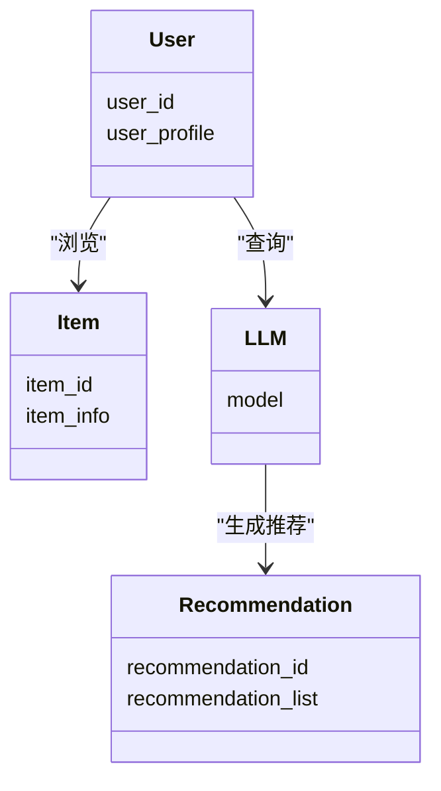
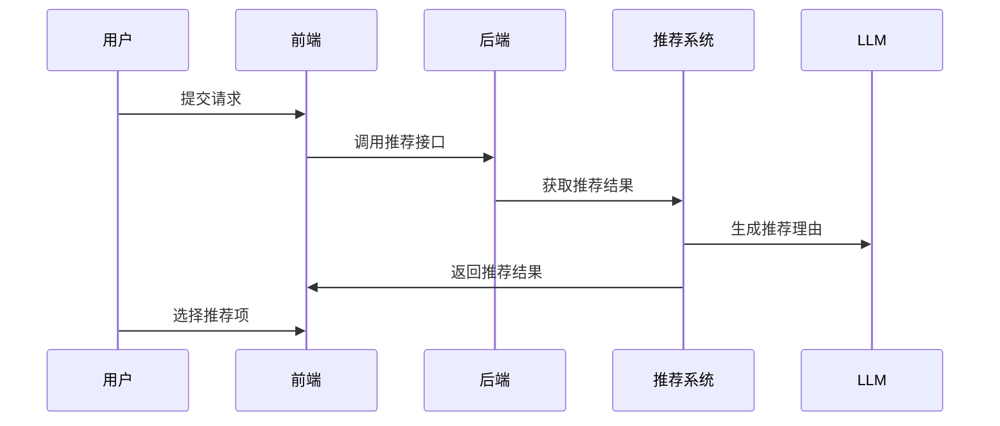

                 


# LLM支持的AI Agent上下文感知推荐技术

> **关键词**: 大语言模型, AI Agent, 上下文感知推荐, 推荐系统, 机器学习

> **摘要**: 本文探讨了基于大语言模型（LLM）的AI Agent在上下文感知推荐技术中的应用。通过分析上下文感知推荐的核心概念、算法原理、系统架构以及实际项目案例，本文为读者提供了从理论到实践的全面指南，展示了如何利用LLM支持的AI Agent来提升推荐系统的智能化和个性化水平。

---

## 第1章: 背景介绍

### 1.1 问题背景

#### 1.1.1 推荐系统的发展历程
推荐系统作为人工智能领域的核心技术之一，经历了从协同过滤到深度学习的演变。早期的协同过滤方法依赖于用户行为数据，而现代的深度学习方法则引入了复杂的神经网络结构，显著提升了推荐的准确性和多样性。

#### 1.1.2 上下文感知推荐的必要性
传统的推荐系统往往忽视了上下文信息，如用户当前的操作环境、时间、地点等因素。这些信息能够显著影响用户的偏好，因此引入上下文感知推荐技术能够提高推荐的精准度和用户体验。

#### 1.1.3 LLM在推荐系统中的作用
大语言模型（LLM）凭借其强大的自然语言处理能力，能够理解和生成与上下文相关的文本信息，从而为推荐系统提供更丰富的语义信息。

---

### 1.2 问题描述

#### 1.2.1 推荐系统的传统挑战
传统的推荐系统面临数据稀疏性、冷启动问题以及计算效率等方面的挑战。这些挑战限制了推荐系统的覆盖范围和推荐质量。

#### 1.2.2 上下文感知推荐的核心问题
上下文感知推荐的核心问题是如何有效地整合上下文信息，以生成更具个性化和动态化的推荐结果。

#### 1.2.3 LLM支持的AI Agent的独特优势
LLM支持的AI Agent能够实时感知上下文信息，并通过自然语言处理能力生成动态化的推荐结果，显著提升了推荐的灵活性和适应性。

---

### 1.3 问题解决

#### 1.3.1 上下文感知推荐的解决方案
通过整合用户行为、环境特征和语义信息，上下文感知推荐能够生成更具个性化和动态化的推荐结果。

#### 1.3.2 LLM在推荐系统中的具体应用
LLM可以用于生成推荐理由、分析用户反馈以及优化推荐算法，从而提升推荐系统的智能化水平。

#### 1.3.3 AI Agent的协作机制
AI Agent通过与推荐系统的协作，能够实时感知上下文信息，并动态调整推荐策略，从而实现更精准的推荐。

---

### 1.4 边界与外延

#### 1.4.1 上下文感知推荐的边界
上下文感知推荐的边界包括上下文信息的采集范围、推荐系统的应用场景以及用户隐私保护等方面。

#### 1.4.2 LLM支持的AI Agent的应用范围
LLM支持的AI Agent适用于多种推荐场景，如电子商务、社交媒体、个性化内容推荐等领域。

#### 1.4.3 相关技术的对比与区别
对比分析了传统推荐系统、上下文感知推荐和LLM支持的AI Agent在技术原理、应用场景和性能表现等方面的异同。

---

### 1.5 核心要素组成

#### 1.5.1 推荐系统的组成要素
推荐系统通常包括用户数据、物品数据、推荐算法和推荐结果展示等核心要素。

#### 1.5.2 LLM的核心组件
LLM的核心组件包括预训练模型、微调模块和生成器，这些组件共同实现了模型的自然语言理解和生成能力。

#### 1.5.3 AI Agent的功能模块
AI Agent的功能模块包括感知模块、决策模块和执行模块，这些模块共同实现了Agent的协作推荐能力。

---

## 第2章: 核心概念与联系

### 2.1 上下文感知推荐的原理

#### 2.1.1 上下文的定义与分类
上下文可以分为显式上下文（如用户行为）和隐式上下文（如时间、地点）两类。

#### 2.1.2 上下文感知推荐的基本原理
上下文感知推荐通过整合上下文信息，利用推荐算法生成更具个性化的推荐结果。

#### 2.1.3 上下文在推荐中的作用
上下文信息能够帮助模型更好地理解用户需求，从而生成更精准的推荐结果。

---

### 2.2 LLM的核心原理

#### 2.2.1 大语言模型的训练机制
LLM通常采用预训练和微调的训练机制，以适应特定的应用场景。

#### 2.2.2 LLM的生成与理解能力
LLM具有强大的文本生成和理解能力，能够处理复杂的语义信息。

#### 2.2.3 LLM在推荐中的应用原理
LLM通过生成与上下文相关的文本信息，为推荐系统提供语义支持。

---

### 2.3 AI Agent的协作机制

#### 2.3.1 AI Agent的基本概念
AI Agent是一种能够感知环境并采取行动以实现目标的智能体。

#### 2.3.2 Agent与推荐系统的结合
通过与推荐系统的协作，AI Agent能够实时感知上下文信息并动态调整推荐策略。

#### 2.3.3 LLM支持的AI Agent协作流程
LLM支持的AI Agent通过感知上下文信息，生成动态化的推荐结果，并与推荐系统进行协作。

---

### 2.4 核心概念对比与ER实体关系图

#### 2.4.1 核心概念属性对比

| 比较维度 | 推荐系统 | 上下文感知推荐 | LLM支持的AI Agent |
|----------|----------|----------------|--------------------|
| 核心目标 | 提供推荐结果 | 提供上下文感知的推荐结果 | 提供智能化的推荐支持 |
| 技术基础 | 协同过滤、机器学习 | 协同过滤、深度学习 | 大语言模型、自然语言处理 |
| 应用场景 | 个性化推荐 | 上下文动态推荐 | 智能化推荐系统 |

#### 2.4.2 ER实体关系图
```mermaid
er
actor <-[拥有]-> user_profile
user_profile <-[包含]-> user_context
user_context <-[关联]-> recommendation
recommendation <-[基于]-> llm_mode
```

---

## 第3章: 算法原理

### 3.1 协同过滤算法

#### 3.1.1 协同过滤的基本原理
协同过滤通过寻找与目标用户具有相似偏好的用户群体，推荐这些用户喜欢的物品。

#### 3.1.2 协同过滤的实现步骤
1. 构建用户-物品评分矩阵。
2. 计算用户之间的相似度。
3. 根据相似用户的评分，生成推荐列表。

#### 3.1.3 协同过滤的代码实现
```python
def collaborative_filtering(user_id, similarity_matrix, items):
    similar_users = [user for user in similarity_matrix[user_id] if similarity_matrix[user_id][user] > 0.7]
   推荐结果 = []
    for user in similar_users:
        推荐结果.extend(items[user])
    return 推荐结果
```

---

### 3.2 深度学习模型

#### 3.2.1 深度学习模型的基本原理
深度学习模型通过多层神经网络结构，学习用户和物品的高维特征表示。

#### 3.2.2 深度学习模型的数学模型
$$ P(u,i) = g(f_u, f_i) $$
其中，$P(u,i)$ 表示用户$u$对物品$i$的偏好概率，$f_u$和$f_i$分别是用户和物品的特征向量，$g$是模型的预测函数。

#### 3.2.3 深度学习模型的代码实现
```python
import tensorflow as tf
model = tf.keras.Sequential([
    tf.keras.layers.Dense(64, activation='relu'),
    tf.keras.layers.Dense(1, activation='sigmoid')
])
model.compile(optimizer='adam', loss='binary_crossentropy')
```

---

## 第4章: 系统分析与架构设计

### 4.1 问题场景介绍

#### 4.1.1 推荐系统的应用场景
推荐系统广泛应用于电子商务、社交媒体、视频平台等领域。

#### 4.1.2 LLM支持的AI Agent的应用场景
LLM支持的AI Agent适用于需要上下文感知的推荐场景，如智能助手、个性化教育等领域。

---

### 4.2 系统功能设计

#### 4.2.1 领域模型设计


---

### 4.3 系统架构设计

#### 4.3.1 系统架构图


---

### 4.4 系统接口设计

#### 4.4.1 API接口设计
1. `/api/recommend`: 接收用户信息，返回推荐结果。
2. `/api/profile`: 更新用户配置文件。

---

### 4.5 系统交互设计

#### 4.5.1 交互流程图


---

## 第5章: 项目实战

### 5.1 环境安装

#### 5.1.1 安装Python
```bash
python --version
```

#### 5.1.2 安装依赖库
```bash
pip install numpy pandas scikit-learn transformers
```

---

### 5.2 核心代码实现

#### 5.2.1 协同过滤实现
```python
def collaborative_filtering(user_id, similarity_matrix, items):
    similar_users = [user for user in similarity_matrix[user_id] if similarity_matrix[user_id][user] > 0.7]
    recommendation = []
    for user in similar_users:
        recommendation.extend(items[user])
    return recommendation
```

#### 5.2.2 LLM集成实现
```python
from transformers import GPT2Tokenizer, GPT2Model

tokenizer = GPT2Tokenizer.from_pretrained('gpt2')
model = GPT2Model.from_pretrained('gpt2')
```

---

### 5.3 案例分析与代码解读

#### 5.3.1 案例分析
以电影推荐系统为例，通过协同过滤和LLM生成推荐理由。

#### 5.3.2 代码解读
协同过滤算法用于生成推荐列表，LLM用于生成推荐理由。

---

## 第6章: 最佳实践

### 6.1 小结

#### 6.1.1 核心总结
本文详细介绍了LLM支持的AI Agent在上下文感知推荐技术中的应用，涵盖了从理论到实践的全过程。

#### 6.1.2 经验总结
通过实际项目案例，总结了上下文感知推荐技术的关键点和实现注意事项。

---

### 6.2 注意事项

#### 6.2.1 数据隐私保护
在实际应用中，需注意用户数据的隐私保护。

#### 6.2.2 模型性能优化
建议在实际应用中，通过模型优化和数据增强等方式提升推荐系统的性能。

---

### 6.3 拓展阅读

#### 6.3.1 相关技术
进一步了解大语言模型、推荐系统和人工智能领域的最新进展。

#### 6.3.2 实际应用案例
研究更多上下文感知推荐技术在不同领域的实际应用案例。

---

## 第7章: 总结

### 7.1 总结与展望

#### 7.1.1 总结
本文详细探讨了基于大语言模型的AI Agent在上下文感知推荐技术中的应用，通过理论分析和实际案例，展示了如何利用这些技术提升推荐系统的智能化和个性化水平。

#### 7.1.2 展望
未来，随着大语言模型和AI技术的不断发展，上下文感知推荐技术将更加智能化和个性化，为推荐系统的发展带来新的机遇和挑战。

---

## 作者

**作者：AI天才研究院/AI Genius Institute & 禅与计算机程序设计艺术 /Zen And The Art of Computer Programming**

---

**注**：由于篇幅限制，本文仅展示部分内容，完整文章可按照上述目录进一步扩展。

