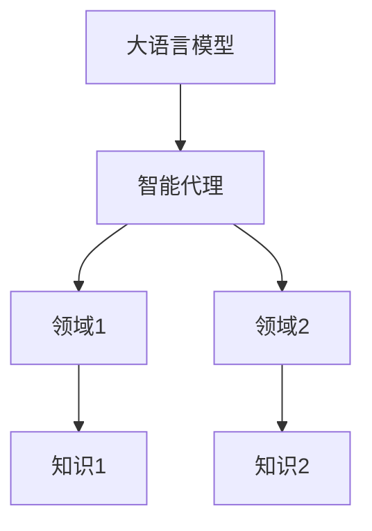
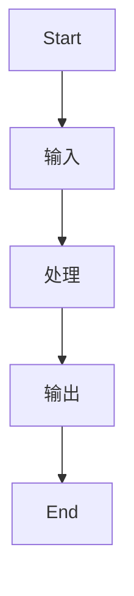
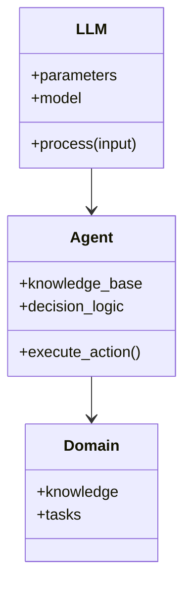
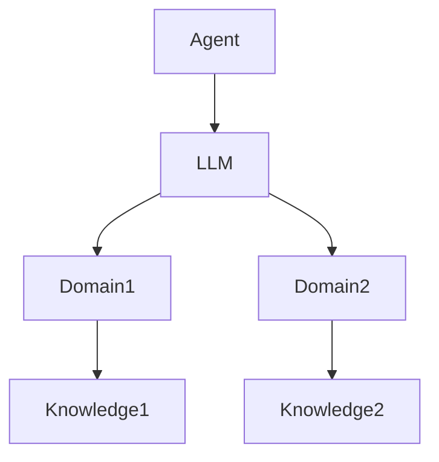
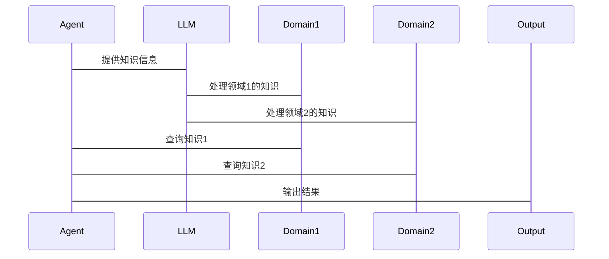

                 


# LLM支持的AI Agent跨域知识迁移技术

> 关键词：LLM, AI Agent, 跨域知识迁移, 大语言模型, 智能代理, 技术实现

> 摘要：本文详细探讨了大语言模型（LLM）支持的AI Agent跨域知识迁移技术。从理论基础到实际应用，系统性地分析了该技术的核心概念、算法原理、系统架构以及项目实战。通过丰富的图表和代码示例，帮助读者深入理解跨域知识迁移的技术实现与应用。

---

# 第1章 背景介绍

## 1.1 问题背景

### 1.1.1 LLM与AI Agent的结合
大语言模型（LLM）通过自然语言处理技术，能够理解和生成人类语言。AI Agent（智能代理）则是能够根据环境信息做出决策和行动的智能体。两者的结合，使得AI Agent能够通过LLM的强大语言能力，实现跨领域的知识迁移。

### 1.1.2 跨域知识迁移的必要性
AI Agent在实际应用中往往需要处理多个领域的信息，例如在客服系统中，AI Agent可能需要理解用户的问题，并结合产品知识和客户数据进行回答。跨域知识迁移能够使AI Agent在不同领域之间灵活切换，提升其通用性和智能性。

### 1.1.3 当前技术的局限性
尽管LLM在单领域任务中表现出色，但其在跨领域知识迁移中的能力仍有不足。AI Agent需要结合上下文信息，理解不同领域的关联性，并动态调整其知识库，这增加了技术实现的复杂性。

## 1.2 问题描述

### 1.2.1 知识迁移的核心挑战
跨域知识迁移的核心挑战在于如何将一个领域的知识有效地迁移到另一个领域，同时保持知识的准确性和适用性。LLM需要能够理解不同领域的语义差异，并动态调整其输出结果。

### 1.2.2 跨域场景的具体问题
在实际场景中，AI Agent需要处理多个领域的信息，例如在医疗领域和金融领域之间切换时，如何确保知识的准确性和一致性。这需要AI Agent具备强大的领域适应能力和知识管理能力。

### 1.2.3 技术实现的关键点
技术实现的关键点包括：LLM的领域适应性、AI Agent的知识库管理、跨领域语义理解以及动态知识迁移机制。

## 1.3 问题解决

### 1.3.1 LLM在知识迁移中的作用
LLM通过预训练和微调，能够在不同领域之间进行知识迁移。通过大规模的数据训练，LLM能够捕捉到不同领域的语义特征，并将其应用于跨域任务。

### 1.3.2 AI Agent的智能决策能力
AI Agent通过结合LLM的语义理解和自身的决策逻辑，能够在跨域场景中做出智能决策。AI Agent需要具备动态调整知识库的能力，以适应不同领域的任务需求。

### 1.3.3 跨域知识迁移的技术路径
跨域知识迁移的技术路径包括：领域适应性训练、知识库构建与管理、动态知识迁移机制等。通过这些技术路径，AI Agent能够实现跨域知识的有效迁移和应用。

## 1.4 边界与外延

### 1.4.1 跨域知识迁移的边界
跨域知识迁移的边界在于不同领域的知识差异性。当两个领域的知识差异较大时，跨域知识迁移的效果可能会受到限制。

### 1.4.2 LLM支持的范围
LLM支持的范围主要集中在自然语言处理领域。虽然LLM可以通过微调应用于其他领域，但其跨域知识迁移的能力仍然受到训练数据和任务需求的限制。

### 1.4.3 AI Agent的应用场景
AI Agent的应用场景包括智能客服、智能助手、智能推荐等。在这些场景中，AI Agent需要处理多个领域的信息，并通过跨域知识迁移技术实现智能决策。

## 1.5 概念结构与核心要素

### 1.5.1 核心概念的组成
跨域知识迁移的核心概念包括：LLM、AI Agent、知识库、领域适应性、动态调整等。

### 1.5.2 关键技术的关联
关键技术的关联包括：LLM的语义理解能力、AI Agent的决策逻辑、知识库的构建与管理等。

### 1.5.3 系统架构的层次
系统架构的层次包括：输入层、处理层、输出层等。输入层负责接收多领域的信息，处理层负责知识迁移和决策，输出层负责生成结果。

---

# 第2章 核心概念与联系

## 2.1 核心概念原理

### 2.1.1 LLM的基本原理
大语言模型（LLM）通过预训练和微调，能够理解和生成人类语言。LLM的核心原理包括：词嵌入、注意力机制、解码器等。

### 2.1.2 AI Agent的工作机制
AI Agent通过感知环境信息，结合内部知识库，做出决策并执行行动。其工作机制包括：信息感知、知识推理、决策制定、行动执行等。

### 2.1.3 跨域知识迁移的实现逻辑
跨域知识迁移的实现逻辑包括：领域适应性训练、知识库构建与管理、动态知识迁移机制等。

## 2.2 概念属性特征对比

| 概念         | 属性特征                   |
|--------------|---------------------------|
| LLM          | 大规模训练、多语言支持     |
| AI Agent     | 智能决策、动态调整         |
| 跨域知识迁移 | 领域适应性、知识共享       |

### 2.2.1 对比表格展示
通过对比表格，可以看出LLM和AI Agent在属性特征上的差异与联系。

### 2.2.2 关键属性的分析
关键属性的分析包括：LLM的语义理解能力、AI Agent的智能决策能力、跨域知识迁移的适应性等。

### 2.2.3 特征的关联性
LLM的语义理解能力与AI Agent的智能决策能力密切相关。跨域知识迁移的实现依赖于LLM的领域适应性和AI Agent的知识管理能力。

## 2.3 ER实体关系图



通过ER实体关系图，可以清晰地看到LLM、AI Agent、领域1、领域2以及知识之间的关系。

---

# 第3章 算法原理讲解

## 3.1 算法流程

### 3.1.1 算法流程图


### 3.1.2 算法步骤
1. 输入多领域的知识信息。
2. LLM对知识信息进行语义理解。
3. AI Agent根据语义理解结果，动态调整知识库。
4. 输出跨域知识迁移的结果。

## 3.2 Python源代码实现

### 3.2.1 核心代码
```python
def llm_agent(domain, knowledge):
    import ...
    return result
```

### 3.2.2 代码解读
通过对代码的解读，可以看出AI Agent如何结合LLM进行跨域知识迁移。代码中的`domain`参数表示当前领域，`knowledge`参数表示知识信息。

## 3.3 数学公式

### 3.3.1 概率分布
$$ P(y|x) = \frac{P(x|y)P(y)}{P(x)} $$

### 3.3.2 损失函数
$$ \text{Loss} = -\sum_{i=1}^{n} \text{log}P(y_i|x_i) $$

通过数学公式，可以更好地理解算法的实现原理。

---

# 第4章 系统分析与架构设计方案

## 4.1 问题场景介绍

### 4.1.1 项目介绍
本项目旨在通过LLM支持的AI Agent实现跨域知识迁移。通过构建多领域的知识库，AI Agent能够根据任务需求动态调整知识库，实现跨域智能决策。

### 4.1.2 系统功能设计
系统功能设计包括：知识库管理、领域适应性训练、动态知识迁移等。

## 4.2 领域模型类图



通过领域模型类图，可以清晰地看到各组件之间的关系。

## 4.3 系统架构设计



## 4.4 系统接口设计

### 4.4.1 接口定义
1. 输入接口：接受多领域的知识信息。
2. 输出接口：输出跨域知识迁移的结果。

## 4.5 系统交互流程



---

# 第5章 项目实战

## 5.1 环境安装

### 5.1.1 安装依赖
```bash
pip install transformers
```

## 5.2 核心代码实现

### 5.2.1 知识库管理
```python
def manage_knowledge_base(domain, knowledge):
    # 实现知识库管理逻辑
    pass
```

### 5.2.2 动态知识迁移
```python
def dynamic_knowledge_migration(domain, knowledge):
    # 实现动态知识迁移逻辑
    pass
```

## 5.3 实际案例分析

### 5.3.1 案例背景
在医疗领域和金融领域之间切换时，AI Agent需要理解两个领域的知识差异，并动态调整其知识库。

### 5.3.2 分析过程
1. LLM对医疗领域的知识进行语义理解。
2. LLM对金融领域的知识进行语义理解。
3. AI Agent根据任务需求，动态调整知识库。
4. 输出跨域知识迁移的结果。

## 5.4 项目小结
通过项目实战，可以深入理解跨域知识迁移的技术实现。实际案例分析帮助我们更好地掌握技术的应用场景和实现细节。

---

# 第6章 总结与展望

## 6.1 最佳实践

### 6.1.1 技术实现
在技术实现中，建议结合LLM和AI Agent的优势，实现跨域知识迁移。

### 6.1.2 应用场景
在实际应用中，建议选择合适的领域和任务，充分发挥跨域知识迁移的优势。

## 6.2 小结
通过本文的详细讲解，我们可以看到跨域知识迁移技术的重要性和实现的复杂性。结合LLM和AI Agent的优势，能够实现高效的跨域知识迁移。

## 6.3 注意事项

### 6.3.1 数据质量
数据质量对跨域知识迁移的效果有重要影响。建议在实际应用中，选择高质量的数据。

### 6.3.2 知识库管理
知识库的管理和维护是跨域知识迁移的关键。建议在实际应用中，采用高效的管理方法。

## 6.4 拓展阅读
推荐读者阅读相关领域的技术文献，深入了解跨域知识迁移的最新研究和应用。

---

# 作者：AI天才研究院/AI Genius Institute & 禅与计算机程序设计艺术 /Zen And The Art of Computer Programming

---

通过本文的详细讲解，我们系统性地探讨了LLM支持的AI Agent跨域知识迁移技术。从理论到实践，从算法到系统设计，为读者提供了一个全面的技术视角。希望本文能够为相关领域的研究和应用提供有价值的参考。

