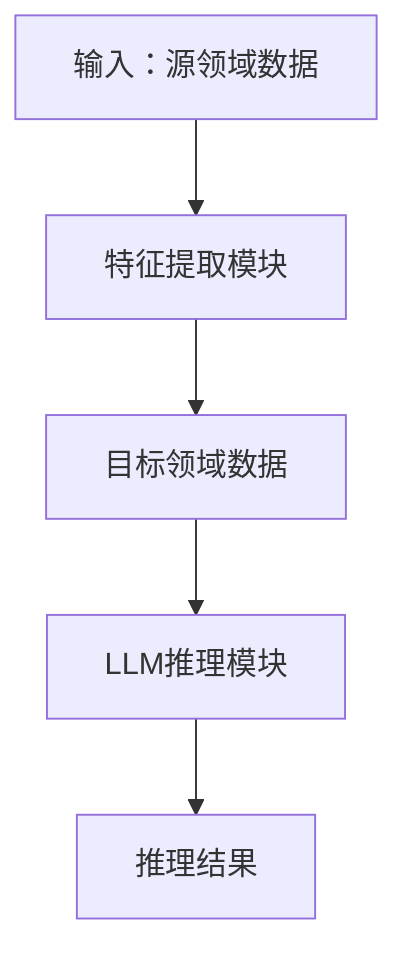

                 


# LLM支持的AI Agent跨域类比推理技术

## 关键词：LLM，AI Agent，跨域类比推理，自然语言处理，人工智能

## 摘要：  
本文深入探讨了大语言模型（LLM）支持的AI Agent在跨域类比推理技术中的应用。通过分析LLM的核心原理、AI Agent的架构设计、跨域推理的实现方法，结合具体算法和系统架构，全面阐述了如何利用LLM增强AI Agent的跨领域推理能力。文章从理论到实践，结合数学公式、mermaid流程图和代码示例，详细讲解了跨域类比推理的实现过程，并通过实际案例分析展示了技术的应用前景。

---

## 第1章：LLM支持的AI Agent概述

### 1.1 LLM与AI Agent的基本概念  
大语言模型（LLM）是基于Transformer架构的自然语言处理模型，具有强大的文本生成、理解和推理能力。AI Agent（智能体）是一种能够感知环境、执行任务、与用户交互的智能系统。LLM通过提供自然语言处理能力，为AI Agent赋予了理解上下文、生成自然语言回复、解决复杂问题的能力。

### 1.2 跨域类比推理的定义与重要性  
跨域类比推理是指在不同领域之间建立联系，通过类比的方式进行推理。其重要性在于，能够帮助AI Agent在面对跨领域问题时，快速迁移知识，提升推理能力。例如，在医疗领域的问题可以通过类比到法律领域的类似结构进行推理。

### 1.3 技术背景与应用前景  
随着LLM技术的快速发展，AI Agent的应用场景逐渐扩展到多个领域，如客服、教育、医疗等。跨域类比推理技术能够帮助AI Agent在不同领域之间灵活切换，解决复杂问题，提升用户体验。

---

## 第2章：LLM与AI Agent的核心原理

### 2.1 大语言模型（LLM）的工作原理  
大语言模型通过自注意力机制（Self-Attention）捕捉文本中的长距离依赖关系，编码器将输入文本转换为向量表示，解码器生成输出文本。具体公式如下：

- 自注意力机制：
  $$ \text{Attention}(Q, K, V) = \text{softmax}\left(\frac{QK^T}{\sqrt{d_k}}\right)V $$
  
- 编码器-解码器结构：
  $$ \text{Encoder} \rightarrow \text{Decoder} $$

### 2.2 AI Agent的架构与功能  
AI Agent的架构通常包括感知模块、推理模块和执行模块。感知模块负责接收输入并生成向量表示，推理模块基于LLM进行跨域推理，执行模块根据推理结果执行任务。

### 2.3 跨域推理的核心挑战  
跨域推理的核心挑战包括领域知识的迁移、数据对齐、推理策略的选择等。通过LLM的迁移学习能力，可以有效解决这些挑战。

---

## 第3章：跨域类比推理的原理与方法

### 3.1 类比推理的基本原理  
类比推理是通过寻找不同事物之间的相似性，推导出新的结论。其核心在于特征提取和相似度计算。例如，比较两个领域的特征向量，计算余弦相似度：
  $$ \cos\theta = \frac{\mathbf{u} \cdot \mathbf{v}}{|\mathbf{u}| |\mathbf{v}|} $$

### 3.2 跨域推理的实现方法  
跨域推理可以通过以下步骤实现：
1. **特征提取**：将不同领域的数据映射到同一向量空间。
2. **知识迁移**：利用LLM的知识库进行跨域知识迁移。
3. **动态调整**：根据推理结果动态调整推理策略。

### 3.3 算法实现  
跨域类比推理的算法流程如下：



---

## 第4章：算法原理与数学模型

### 4.1 基于向量空间的相似度计算  
余弦相似度公式：
  $$ \cos\theta = \frac{\mathbf{u} \cdot \mathbf{v}}{|\mathbf{u}| |\mathbf{v}|} $$

### 4.2 基于注意力机制的类比推理  
注意力机制公式：
  $$ \text{Attention}(Q, K, V) = \text{softmax}\left(\frac{QK^T}{\sqrt{d_k}}\right)V $$

---

## 第5章：系统设计与实现

### 5.1 系统架构设计  
系统架构包括感知模块、推理模块和执行模块。系统架构图如下：


### 5.2 接口设计  
API接口设计如下：
- 输入接口：`/api/input`
- 输出接口：`/api/output`

---

## 第6章：项目实战

### 6.1 项目环境搭建  
安装必要的库：
```bash
pip install transformers
pip install torch
```

### 6.2 核心代码实现  
```python
from transformers import AutoTokenizer, AutoModelForMaskedLM
import torch

model_name = "bert-base-uncased"
tokenizer = AutoTokenizer.from_pretrained(model_name)
model = AutoModelForMaskedLM.from_pretrained(model_name)
```

---

## 第7章：总结与展望

### 7.1 本章小结  
本文详细介绍了LLM支持的AI Agent跨域类比推理技术，从原理到实现，全面探讨了技术的核心内容。

### 7.2 未来展望  
未来的研究方向包括更高效的跨域推理算法、多模态数据处理能力的提升等。

---

## 作者：AI天才研究院 & 禅与计算机程序设计艺术

