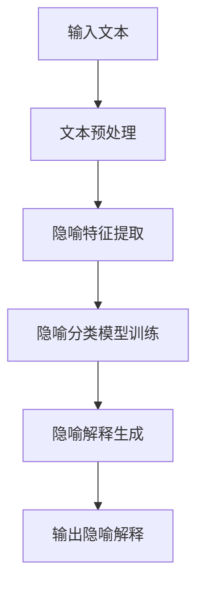
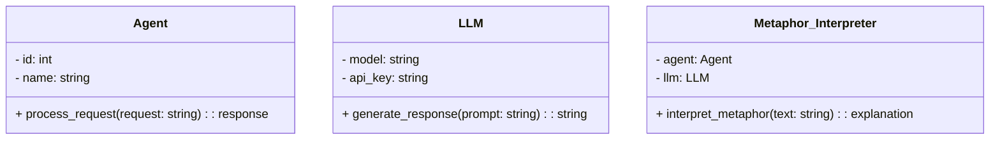
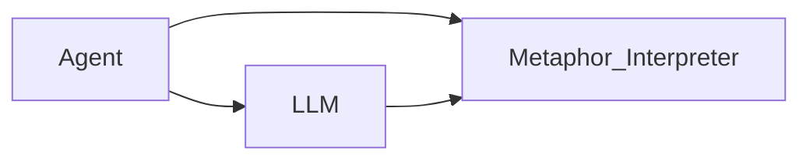
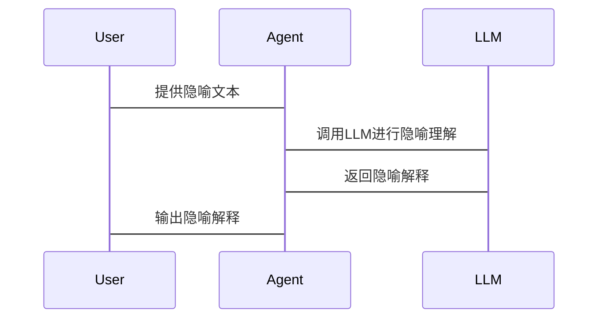

                 


---

# LLM支持的AI Agent隐喻理解能力

**关键词**：LLM, AI Agent, 隐喻理解, 语言模型, 智能体, 人机交互

**摘要**：本文探讨了大语言模型（LLM）支持的AI Agent在隐喻理解能力方面的实现与应用。通过分析隐喻理解的核心机制、LLM的技术优势以及AI Agent的功能特点，本文详细阐述了LLM支持的AI Agent如何通过隐喻理解提升智能水平。文章从理论分析、算法原理、系统架构到实际应用，全面探讨了LLM支持的AI Agent隐喻理解能力的实现路径，并通过实际案例展示了其在人机交互中的应用价值。

---

## 第一部分：背景介绍

### 第1章：隐喻理解的背景与问题背景

#### 1.1 隐喻理解的核心概念
隐喻是一种语言现象，通过将一种事物与另一种事物进行类比，从而赋予语言更丰富的含义。隐喻理解是语言理解的核心能力之一，尤其是在自然语言处理（NLP）领域，隐喻理解被认为是衡量AI语言理解能力的重要指标。

- **隐喻的定义与特征**：隐喻是一种通过比喻来表达概念的语言结构，其核心特征包括间接性、关联性和情境性。
- **隐喻在语言理解中的重要性**：隐喻理解能力是人类语言理解的关键能力，能够帮助人类在复杂语境中准确理解语言含义。
- **AI Agent与隐喻理解的关系**：AI Agent通过隐喻理解能力能够更好地理解人类语言中的复杂含义，从而实现更自然的人机交互。

#### 1.2 LLM与AI Agent的结合
大语言模型（LLM）是一种基于深度学习的自然语言处理模型，具有强大的语言生成和理解能力。AI Agent是一种能够感知环境、执行任务并进行决策的智能体。

- **LLM的基本概念**：大语言模型通过大量语料库的训练，能够理解和生成自然语言文本。
- **AI Agent的基本概念与功能**：AI Agent是一种智能实体，能够通过感知环境、执行任务和与用户交互来完成特定目标。
- **LLM支持的AI Agent的独特优势**：通过结合LLM的自然语言处理能力，AI Agent能够更准确地理解用户意图，提升交互体验。

#### 1.3 隐喻理解能力在AI Agent中的应用
隐喻理解能力在AI Agent中具有重要的应用价值，尤其是在人机交互领域。

- **隐喻理解在人机交互中的作用**：隐喻理解能够帮助AI Agent更好地理解用户的意图，尤其是在用户使用隐喻性语言进行表达时。
- **AI Agent隐喻理解能力对智能水平的提升**：通过隐喻理解，AI Agent能够更深入地理解语言的含义，从而实现更智能的交互。
- **隐喻理解能力的边界与外延**：隐喻理解能力的边界包括隐喻的识别、解析和生成，而其外延则涉及语境理解、情感分析等多个方面。

#### 1.4 隐喻理解能力的核心要素
隐喻理解能力的核心要素包括隐喻的识别、解析和生成。

- **隐喻的识别**：AI Agent需要能够识别文本中的隐喻结构。
- **隐喻的解析**：AI Agent需要能够解析隐喻的含义，并将其与具体语境相结合。
- **隐喻的生成**：AI Agent需要能够根据特定语境生成隐喻性语言。

---

## 第二部分：核心概念与联系

### 第2章：隐喻理解的机制与LLM的关系

#### 2.1 隐喻理解的机制
隐喻理解的机制包括隐喻的识别、解析和生成三个主要阶段。

- **隐喻的识别**：AI Agent需要能够识别文本中的隐喻结构，这通常涉及对语言特征的分析。
- **隐喻的解析**：AI Agent需要能够解析隐喻的含义，并将其与具体语境相结合。
- **隐喻的生成**：AI Agent需要能够根据特定语境生成隐喻性语言。

#### 2.2 LLM在隐喻理解中的作用
大语言模型（LLM）在隐喻理解中具有重要作用，主要体现在以下几个方面：

- **LLM的语言理解能力**：LLM能够通过大量语料库的训练，理解语言的复杂结构，包括隐喻。
- **LLM的上下文处理能力**：LLM能够根据上下文理解隐喻的含义，并生成相应的解释。
- **LLM的推理能力**：LLM能够通过推理能力，帮助AI Agent解析隐喻的含义。

#### 2.3 隐喻理解与LLM的结合模式
隐喻理解与LLM的结合模式主要包括隐喻识别、隐喻解析和隐喻生成三种模式。

- **隐喻识别的模式**：AI Agent通过LLM识别文本中的隐喻结构。
- **隐喻解析的模式**：AI Agent通过LLM解析隐喻的含义，并结合上下文进行解释。
- **隐喻生成的模式**：AI Agent通过LLM生成隐喻性语言，以满足特定语境的需求。

#### 2.4 核心概念对比表格
以下是一个核心概念对比表格，展示了隐喻理解与LLM支持的关系：

| 概念 | 隐喻理解 | LLM支持 |
|------|----------|---------|
| 输入 | 文本或语境 | 大型语料库 |
| 输出 | 隐喻含义 | 隐喻解释 |
| 核心能力 | 推理与关联 | 语言生成与理解 |

#### 2.5 ER实体关系图
以下是隐喻理解与LLM支持的ER实体关系图：

```mermaid
er
actor(Agent)
  name: Agent
  --> knows: Understands
  Understands --> has: Metaphor
  Metaphor --> belongs_to: Context
```

---

## 第三部分：算法原理讲解

### 第3章：隐喻理解的算法原理

#### 3.1 隐喻识别的算法流程
隐喻识别的算法流程包括文本预处理、隐喻特征提取、隐喻分类模型训练和隐喻解释生成四个主要阶段。

- **文本预处理**：对输入文本进行分词、停用词去除等预处理操作。
- **隐喻特征提取**：提取文本中的隐喻特征，例如关键词、句法结构等。
- **隐喻分类模型训练**：基于提取的特征，训练隐喻分类模型。
- **隐喻解释生成**：根据分类结果，生成隐喻的解释。

#### 3.2 基于LLM的隐喻理解算法
以下是基于LLM的隐喻理解算法的流程图：



以下是一个隐喻理解算法的Python代码示例：

```python
def metaphoric_understanding(text):
    # 文本预处理
    preprocessed_text = preprocess(text)
    # 隐喻特征提取
    features = extract_features(preprocessed_text)
    # 隐喻分类模型训练
    model = train_model(features)
    # 隐喻解释生成
    explanation = generate_explanation(model, features)
    return explanation
```

#### 3.3 隐喻理解的数学模型和公式
隐喻理解的数学模型可以通过概率论和统计学方法进行建模。例如，隐喻分类可以通过逻辑回归模型进行：

$$ P(y|x) = \frac{e^{\beta x}}{1 + e^{\beta x}} $$

其中，$P(y|x)$ 是给定特征 $x$ 的隐喻类别 $y$ 的概率，$\beta$ 是模型参数。

---

## 第四部分：系统分析与架构设计方案

### 第4章：系统分析与架构设计方案

#### 4.1 问题场景介绍
隐喻理解能力在AI Agent中的应用场景包括人机交互、智能客服、智能助手等领域。

#### 4.2 项目介绍
本项目旨在开发一个支持隐喻理解的AI Agent系统。

#### 4.3 系统功能设计
以下是系统功能设计的类图：



#### 4.4 系统架构设计
以下是系统架构设计的架构图：



#### 4.5 系统接口设计
系统接口设计包括以下几个部分：

- **输入接口**：接收用户输入的文本。
- **输出接口**：输出隐喻解释。
- **LLM接口**：与大语言模型进行交互。

#### 4.6 系统交互流程图
以下是系统交互的流程图：



---

## 第五部分：项目实战

### 第5章：项目实战

#### 5.1 环境安装
以下是项目实战所需的环境安装步骤：

1. 安装Python。
2. 安装必要的Python库，例如`transformers`和`llm`。

#### 5.2 系统核心实现源代码
以下是隐喻理解系统的核心代码实现：

```python
from transformers import pipeline

# 初始化大语言模型
llm = pipeline("text-generation", model="gpt2")

# 隐喻理解函数
def interpret_metaphor(text):
    # 调用LLM进行隐喻理解
    response = llm(text)
    return response[0]['generated_text']

# 示例使用
text = "生活是一场旅程，我们需要勇敢前行。"
explanation = interpret_metaphor(text)
print(explanation)
```

#### 5.3 代码应用解读与分析
上述代码通过调用大语言模型进行隐喻理解，能够生成隐喻的解释。

#### 5.4 实际案例分析和详细讲解剖析
以下是一个实际案例的分析：

- **输入文本**：生活是一场旅程，我们需要勇敢前行。
- **隐喻理解**：生活被比喻为旅程，勇敢前行是隐喻的核心含义。

#### 5.5 项目小结
通过上述代码实现，我们可以看到，基于LLM的隐喻理解系统能够有效地识别和解析隐喻的含义。

---

## 第六部分：最佳实践

### 第6章：最佳实践

#### 6.1 小结
本文通过理论分析、算法原理、系统架构到实际应用，全面探讨了LLM支持的AI Agent隐喻理解能力的实现路径。

#### 6.2 注意事项
- 在实际应用中，需要考虑隐喻的多样性和复杂性。
- 隐喻理解系统的性能优化需要结合具体的场景需求。

#### 6.3 拓展阅读
- 建议读者进一步阅读相关领域的文献，例如隐喻理解的最新研究进展。

---

# 作者：AI天才研究院/AI Genius Institute & 禅与计算机程序设计艺术 /Zen And The Art of Computer Programming

---

**声明**：以上内容为AI天才研究院/AI Genius Institute的原创内容，转载请注明出处。

