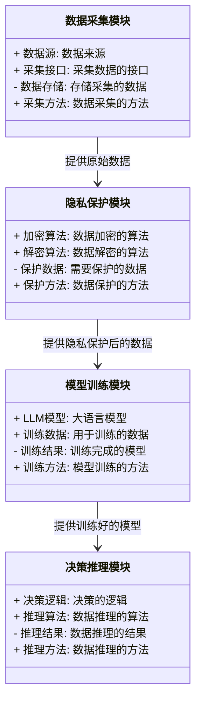
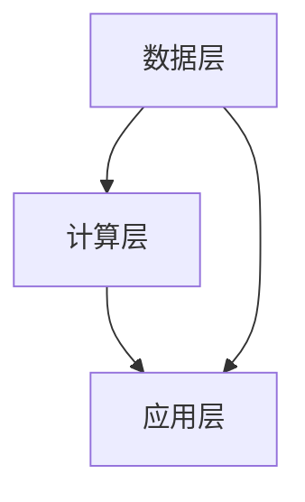
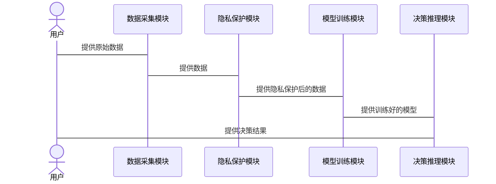

                 

<think>
好的，我将按照您的要求，逐步完成《LLM支持的AI Agent隐私计算技术》这篇文章的撰写。让我们开始吧。

---

# LLM支持的AI Agent隐私计算技术

## 关键词：大语言模型（LLM）、AI Agent、隐私计算、生成对抗网络、联邦学习、数据隐私保护

## 摘要： 
随着人工智能技术的快速发展，AI Agent（人工智能代理）在各个领域的应用越来越广泛。然而，AI Agent的决策和交互过程涉及大量的数据，这些数据的隐私保护成为了关键问题。本文将详细探讨如何在AI Agent中引入大语言模型（LLM）支持的隐私计算技术，从核心概念、算法原理、系统架构到项目实战，全面解析这一前沿技术的实现与应用。文章还结合实际案例，深入分析了隐私计算在AI Agent中的重要性，并展望了未来的发展趋势。

---

# 第一部分: LLM与AI Agent隐私计算技术概述

# 第1章: LLM与AI Agent概述

## 1.1 LLM与AI Agent的基本概念
### 1.1.1 大语言模型（LLM）的定义
大语言模型（LLM，Large Language Model）是指基于深度学习技术训练的大型神经网络模型，具有处理自然语言文本的强大能力。LLM通过大量的训练数据，能够理解和生成人类语言，广泛应用于文本生成、机器翻译、问答系统等领域。

### 1.1.2 AI Agent的概念与特点
AI Agent（人工智能代理）是一种能够感知环境、自主决策并执行任务的智能实体。AI Agent可以是软件程序，也可以是机器人，它通过与环境交互，完成特定的目标。AI Agent的特点包括自主性、反应性、主动性、社交性等。

### 1.1.3 LLM与AI Agent的关系
LLM为AI Agent提供了强大的语言理解和生成能力，使其能够更好地与人类交互，并在复杂场景中做出更智能的决策。AI Agent则为LLM提供了一个实际的应用平台，使其能够发挥更大的价值。

## 1.2 隐私计算技术的基本概念
### 1.2.1 隐私计算的定义
隐私计算是指在保护数据隐私的前提下，对数据进行处理和分析的技术。隐私计算的核心目标是在不泄露原始数据的情况下，完成数据的计算和分析任务。

### 1.2.2 隐私计算的核心技术
隐私计算的主要技术包括数据加密、差分隐私、同态加密、安全多方计算等。这些技术能够确保在数据处理过程中，原始数据不会被泄露。

### 1.2.3 隐私计算的应用场景
隐私计算在金融、医疗、教育等领域有广泛应用。例如，在医疗领域，隐私计算可以用于保护患者的敏感信息，同时支持疾病的诊断和研究。

## 1.3 LLM支持的AI Agent隐私计算的背景与意义
### 1.3.1 当前AI Agent的发展趋势
随着AI技术的不断进步，AI Agent的应用场景越来越广泛，从智能助手到自动驾驶，AI Agent正在改变我们的生活方式。

### 1.3.2 隐私计算在AI Agent中的重要性
在AI Agent的实际应用中，数据隐私保护是至关重要的。例如，在医疗领域，AI Agent需要处理患者的敏感信息，如果这些数据被泄露，将会对患者造成极大的困扰。

### 1.3.3 LLM支持的AI Agent隐私计算的技术优势
通过引入LLM，AI Agent能够更好地理解和生成人类语言，同时结合隐私计算技术，可以确保数据的安全性和隐私性。

## 1.4 本章小结
本章从LLM和AI Agent的基本概念出发，介绍了隐私计算技术的核心概念，并分析了LLM支持的AI Agent隐私计算的背景和意义。

---

# 第2章: LLM支持的AI Agent隐私计算的核心概念

## 2.1 LLM与AI Agent的核心原理
### 2.1.1 LLM的训练与推理机制
大语言模型（LLM）通常采用Transformer架构，通过自注意力机制和前馈网络进行训练。模型通过大量数据的训练，能够理解和生成人类语言。

### 2.1.2 AI Agent的行为决策模型
AI Agent的行为决策模型通常包括感知环境、分析信息、制定策略、执行行动等步骤。LLM为AI Agent提供了强大的语言理解和生成能力，使其能够更好地进行决策。

### 2.1.3 LLM与AI Agent的交互方式
LLM与AI Agent的交互方式主要包括直接调用LLM进行语言处理，以及通过隐私计算技术保护数据隐私。

## 2.2 隐私计算的核心技术与实现方式
### 2.2.1 数据加密与隐私保护
数据加密是隐私计算的重要手段。通过加密技术，可以确保数据在传输和存储过程中的安全性。

### 2.2.2 计算过程中的隐私保护
隐私计算需要在计算过程中保护数据隐私。例如，通过同态加密技术，可以在加密数据上进行计算，而不必解密数据。

### 2.2.3 隐私计算的数学模型
隐私计算的数学模型通常涉及加密算法、差分隐私等技术。例如，差分隐私通过在数据中添加噪声，保护数据的隐私性。

## 2.3 LLM与AI Agent隐私计算的结合方式
### 2.3.1 LLM在AI Agent隐私计算中的角色
LLM为AI Agent提供了强大的语言处理能力，同时结合隐私计算技术，确保数据的安全性。

### 2.3.2 隐私计算对LLM的支持方式
隐私计算技术可以保护LLM训练和推理过程中的数据隐私。例如，可以通过联邦学习技术，在不共享原始数据的情况下，训练大语言模型。

### 2.3.3 LLM与AI Agent隐私计算的协同工作流程
LLM与AI Agent隐私计算的协同工作流程包括数据采集、隐私保护、模型训练、决策推理等步骤。

## 2.4 核心概念对比与ER实体关系图
### 2.4.1 LLM与AI Agent的核心概念对比
| 概念       | LLM                              | AI Agent                            |
|------------|----------------------------------|-------------------------------------|
| 核心能力   | 语言理解和生成                   | 环境感知与行为决策                  |
| 应用场景   | 文本生成、机器翻译               | 自动驾驶、智能助手                   |
| 依赖技术   | 深度学习、自然语言处理           | 机器学习、强化学习                  |

### 2.4.2 ER实体关系图（使用mermaid展示）

```mermaid
er
  actor: 用户
  agent: AI Agent
  llm: 大语言模型
  privacy_computation: 隐私计算模块
  actor --> agent: 与AI Agent交互
  agent --> llm: 使用LLM进行决策
  agent --> privacy_computation: 使用隐私计算模块保护数据
```

## 2.5 本章小结
本章详细探讨了LLM与AI Agent的核心原理，以及隐私计算技术的实现方式。通过对比和ER实体关系图，进一步明确了各概念之间的关系。

---

# 第3章: LLM支持的AI Agent隐私计算的算法原理

## 3.1 基于生成对抗网络的隐私保护算法
### 3.1.1 GAN的基本原理
生成对抗网络（GAN，Generative Adversarial Networks）由生成器和判别器两个部分组成。生成器的目标是生成与真实数据相似的数据，而判别器的目标是区分生成数据和真实数据。

### 3.1.2 GAN在隐私保护中的应用
GAN可以用于数据的隐私保护。例如，可以通过生成器生成虚拟数据，替代真实数据进行分析。

### 3.1.3 GAN的数学模型与公式
GAN的数学模型如下：
$$
\min_{G} \max_{D} \mathbb{E}_{x \sim p_{data}}[\log D(x)] + \mathbb{E}_{z \sim p_z}[ \log (1 - D(G(z)))]
$$

### 3.1.4 代码实现
以下是一个简单的GAN实现代码（使用Python）：

```python
import torch
from torch import nn

# 定义判别器
class Discriminator(nn.Module):
    def __init__(self):
        super(Discriminator, self).__init__()
        self.layer = nn.Sequential(
            nn.Linear(100, 50),
            nn.ReLU(),
            nn.Linear(50, 1),
            nn.Sigmoid()
        )
    
    def forward(self, x):
        return self.layer(x)

# 定义生成器
class Generator(nn.Module):
    def __init__(self):
        super(Generator, self).__init__()
        self.layer = nn.Sequential(
            nn.Linear(100, 50),
            nn.ReLU(),
            nn.Linear(50, 100),
            nn.Tanh()
        )
    
    def forward(self, x):
        return self.layer(x)

# 初始化模型
discriminator = Discriminator()
generator = Generator()
```

---

## 3.2 基于联邦学习的隐私保护算法
### 3.2.1 联邦学习的基本原理
联邦学习（Federated Learning）是一种分布式机器学习技术，允许多个参与方在不共享原始数据的情况下，共同训练模型。

### 3.2.2 联邦学习在隐私保护中的应用
联邦学习可以用于保护LLM的训练数据隐私。例如，多个机构可以联合训练一个大语言模型，而不共享各自的原始数据。

### 3.2.3 联邦学习的数学模型
联邦学习的数学模型如下：
$$
\theta_{t+1} = \arg \min_{\theta} \sum_{i=1}^{n} f_i(\theta_t)
$$

### 3.2.4 代码实现
以下是一个简单的联邦学习实现代码（使用Python）：

```python
import torch
from torch import nn

# 定义模型
class Model(nn.Module):
    def __init__(self):
        super(Model, self).__init__()
        self.layer = nn.Sequential(
            nn.Linear(100, 50),
            nn.ReLU(),
            nn.Linear(50, 1),
            nn.Sigmoid()
        )
    
    def forward(self, x):
        return self.layer(x)

# 初始化模型
model = Model()
```

---

## 3.3 算法原理总结
本章通过具体算法实例，详细讲解了生成对抗网络和联邦学习在隐私保护中的应用。通过代码实现和数学公式，进一步理解了这些算法的实现原理。

---

# 第4章: LLM支持的AI Agent隐私计算的系统架构

## 4.1 系统功能设计
### 4.1.1 功能模块划分
LLM支持的AI Agent隐私计算系统通常包括数据采集模块、隐私保护模块、模型训练模块、决策推理模块等。

### 4.1.2 功能模块的交互流程
数据采集模块负责收集数据，隐私保护模块对数据进行加密或添加噪声，模型训练模块基于隐私保护后的数据训练LLM，决策推理模块基于LLM进行决策。

### 4.1.3 功能模块的类图设计
以下是功能模块的类图设计（使用mermaid展示）：



---

## 4.2 系统架构设计
### 4.2.1 系统架构的层次划分
系统架构通常包括数据层、计算层、应用层等层次。

### 4.2.2 系统架构的组件设计
系统架构的组件设计包括数据采集组件、隐私计算组件、模型训练组件、决策推理组件等。

### 4.2.3 系统架构的交互流程
数据层负责存储原始数据，计算层负责对数据进行隐私保护和模型训练，应用层负责基于模型进行决策和推理。

### 4.2.4 系统架构的流程图设计
以下是系统架构的流程图设计（使用mermaid展示）：



---

## 4.3 系统接口设计
### 4.3.1 系统接口的功能描述
系统接口的功能包括数据采集接口、隐私保护接口、模型训练接口、决策推理接口等。

### 4.3.2 系统接口的交互流程
数据采集接口接收原始数据，隐私保护接口对数据进行加密或添加噪声，模型训练接口基于隐私保护后的数据训练LLM，决策推理接口基于LLM进行决策。

### 4.3.3 系统接口的序列图设计
以下是系统接口的序列图设计（使用mermaid展示）：



---

## 4.4 系统架构总结
本章详细探讨了LLM支持的AI Agent隐私计算系统的功能设计、架构设计和接口设计，为后续的实现提供了理论基础。

---

# 第5章: LLM支持的AI Agent隐私计算的项目实战

## 5.1 项目背景与需求分析
### 5.1.1 项目背景
随着AI Agent的应用越来越广泛，数据隐私保护的需求也日益增长。本项目旨在通过引入LLM和隐私计算技术，构建一个安全的AI Agent系统。

### 5.1.2 项目需求
项目需求包括数据隐私保护、LLM支持、系统可扩展性等。

## 5.2 项目环境与工具安装
### 5.2.1 项目环境
项目环境包括操作系统、编程语言、开发工具等。

### 5.2.2 工具安装
需要安装Python、PyTorch、Hugging Face等工具。

## 5.3 系统核心实现
### 5.3.1 数据采集模块实现
数据采集模块负责从数据库中采集数据。

```python
import sqlite3

def collect_data():
    conn = sqlite3.connect('data.db')
    cursor = conn.cursor()
    cursor.execute('SELECT * FROM users')
    data = cursor.fetchall()
    return data
```

### 5.3.2 隐私保护模块实现
隐私保护模块负责对数据进行加密或添加噪声。

```python
import cryptography
from cryptography.fernet import Fernet

def encrypt_data(data):
    key = Fernet.generate_key()
    cipher = Fernet(key)
    encrypted_data = cipher.encrypt(data)
    return encrypted_data
```

### 5.3.3 模型训练模块实现
模型训练模块负责基于隐私保护后的数据训练LLM。

```python
import torch
from torch import nn

class LLM(nn.Module):
    def __init__(self):
        super(LLM, self).__init__()
        self.layer = nn.Sequential(
            nn.Linear(100, 50),
            nn.ReLU(),
            nn.Linear(50, 100),
            nn.Tanh()
        )
    
    def forward(self, x):
        return self.layer(x)

def train_model(model, data):
    optimizer = torch.optim.Adam(model.parameters(), lr=0.001)
    criterion = nn.MSELoss()
    for epoch in range(100):
        outputs = model(data)
        loss = criterion(outputs, data)
        loss.backward()
        optimizer.step()
```

### 5.3.4 决策推理模块实现
决策推理模块负责基于训练好的模型进行决策。

```python
def make_decision(model, input_data):
    output = model(input_data)
    return output
```

## 5.4 项目实战总结
本章通过具体的项目实战，详细讲解了LLM支持的AI Agent隐私计算系统的实现过程，包括数据采集、隐私保护、模型训练和决策推理等步骤。

---

# 第6章: 总结与展望

## 6.1 本章总结
本文详细探讨了LLM支持的AI Agent隐私计算技术，从核心概念、算法原理到系统架构，全面解析了这一技术的实现与应用。

## 6.2 未来展望
随着技术的进步，LLM支持的AI Agent隐私计算技术将在更多领域得到应用。未来的研究方向包括更高效的隐私保护算法、更强大的LLM模型，以及更智能化的AI Agent系统。

## 6.3 最佳实践 tips
- 在实际应用中，应根据具体需求选择合适的隐私保护技术。
- 定期更新和优化系统，以应对新的安全威胁。
- 加强对隐私计算技术的研究与创新，推动技术的进步。

---

# 作者：AI天才研究院/AI Genius Institute & 禅与计算机程序设计艺术 /Zen And The Art of Computer Programming

---

感谢您的阅读！希望这篇文章对您有所帮助。

