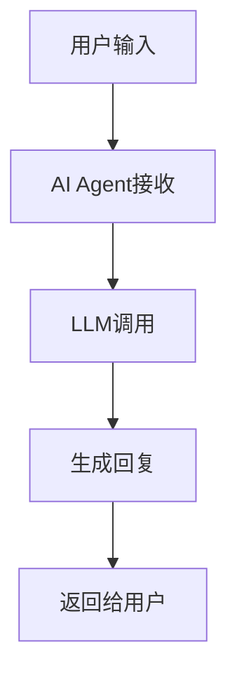
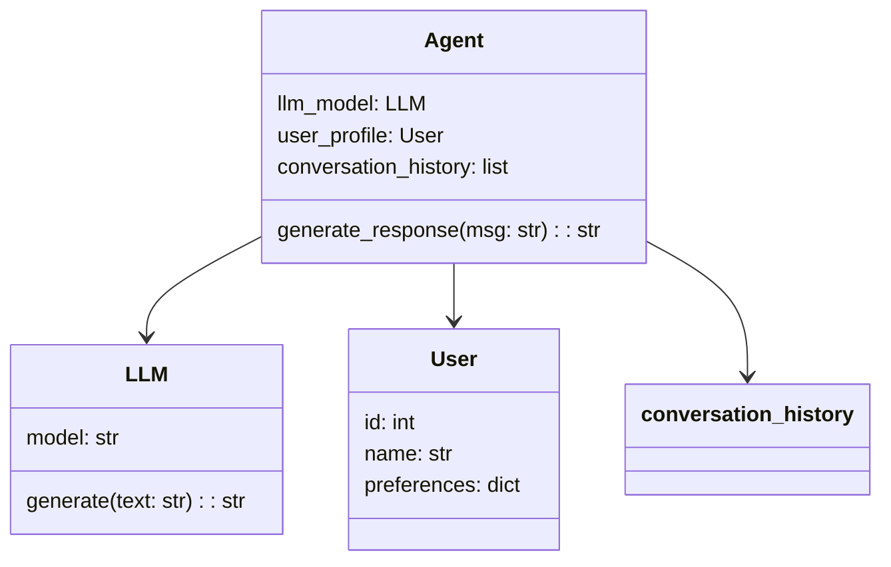
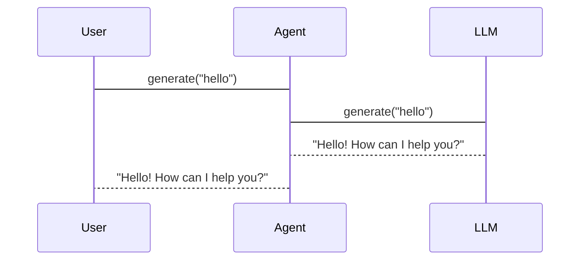

                 


# LLM驱动的AI Agent个性化对话生成

## 关键词：
- 大语言模型（LLM）
- AI Agent
- 对话生成
- 个性化交互
- 人机交互
- 人工智能

## 摘要：
本文深入探讨了大语言模型（LLM）驱动的AI Agent在个性化对话生成中的应用。通过分析背景、核心概念、算法原理、系统架构以及实际项目案例，本文为读者提供了从理论到实践的全面指导，帮助开发者构建高效、智能的个性化对话系统。

---

# 目录

## 第一部分: LLM驱动的AI Agent个性化对话生成背景介绍

## 第1章: 问题背景与核心概念

### 1.1 问题背景

#### 1.1.1 当前人机交互的发展现状
- 从传统的规则引擎到现代的深度学习模型，人机交互技术经历了巨大的变革。
- 大语言模型（LLM）的出现，使得对话生成更加自然和智能。

#### 1.1.2 传统对话生成技术的局限性
- 基于规则的系统灵活性差，难以应对复杂场景。
- 统一的生成模型缺乏个性化，无法满足用户的差异化需求。

#### 1.1.3 LLM驱动的AI Agent的优势
- 强大的上下文理解能力，能够生成连贯的对话。
- 支持多轮对话，提供更自然的交互体验。
- 可通过微调优化，满足特定领域的需求。

### 1.2 问题描述

#### 1.2.1 对话生成的核心问题
- 如何理解用户的意图并生成合适的回复。
- 如何保持对话的连贯性和一致性。

#### 1.2.2 个性化对话的需求分析
- 用户期望得到个性化的回应，而非千篇一律的回答。
- 需要根据用户的背景、偏好和行为调整对话内容。

#### 1.2.3 LLM在对话生成中的应用挑战
- 模型的泛化能力与个性化需求的平衡。
- 对话生成的实时性与计算资源的限制。

### 1.3 问题解决与边界

#### 1.3.1 LLM驱动的解决方案
- 利用LLM的强大生成能力，构建个性化的对话系统。
- 通过用户画像和行为分析，优化对话生成策略。

#### 1.3.2 边界与外延
- 仅关注对话生成部分，不涉及前端交互和后端数据存储。
- 重点解决个性化生成问题，不考虑其他功能模块。

#### 1.3.3 核心要素与组成
- 用户输入解析：理解用户的意图和情感。
- 对话历史记录：维护上下文信息。
- 个性化参数：基于用户画像生成定制化回复。

## 第2章: 核心概念与联系

### 2.1 LLM与AI Agent的关系

#### 2.1.1 LLM的定义与特点
- **定义**：大语言模型是一种基于深度学习的自然语言处理模型，能够理解和生成人类语言。
- **特点**：
  - 强大的文本生成能力。
  - 能够处理长文本上下文。
  - 支持多语言和领域定制。

#### 2.1.2 AI Agent的定义与特点
- **定义**：AI Agent是一种智能体，能够感知环境并采取行动以实现目标。
- **特点**：
  - 自主决策能力。
  - 能够与用户进行自然交互。
  - 具备学习和适应能力。

#### 2.1.3 两者结合的逻辑关系
- LLM为AI Agent提供强大的语言理解和生成能力。
- AI Agent利用LLM的能力，实现更智能的对话生成和交互。

### 2.2 核心概念对比

#### 2.2.1 概念属性特征对比表
| 特性                | LLM                     | AI Agent                |
|---------------------|-------------------------|-------------------------|
| 核心功能            | 生成和理解文本           | 感知环境并采取行动       |
| 输入输出            | 文本                     | 动作和反馈               |
| 学习方式            | 监督学习                 | 强化学习和监督学习        |
| 应用场景            | 自然语言处理            | 智能交互和任务执行       |

#### 2.2.2 ER实体关系图
```mermaid
er
  actor: 用户
  agent: AI Agent
  llm: 大语言模型
  conversation: 对话
  actor -[发起对话]-> agent
  agent -[调用LLM]-> llm
  llm -[返回生成文本]-> agent
  agent -[生成回复]-> conversation
  conversation -[反馈给用户]-> actor
```

---

## 第三部分: 算法原理与数学模型

## 第3章: 算法原理讲解

### 3.1 LLM驱动的对话生成流程

#### 3.1.1 流程图


### 3.2 算法实现代码

#### 3.2.1 调用LLM生成回复
```python
def generate_response(user_input):
    # 初始化LLM模型
    llm = LLMModel()
    # 调用LLM生成回复
    response = llm.generate(user_input)
    return response
```

#### 3.2.2 基于用户画像的个性化生成
```python
def personalized_generate(user_input, user_profile):
    # 分析用户画像
    user_analytics = analyze_profile(user_profile)
    # 调整LLM参数
    llm_params = adjust_params(user_analytics)
    # 生成个性化回复
    response = llm.generate_with_params(user_input, llm_params)
    return response
```

### 3.3 数学模型与公式

#### 3.3.1 概率分布
- 对于给定的输入序列 \( x_1, x_2, ..., x_n \)，模型预测下一个词 \( y \) 的概率为：
  $$ P(y|x_1, x_2, ..., x_n) = \text{softmax}(Wx + b) $$

#### 3.3.2 损失函数
- 使用交叉熵损失函数来衡量预测与真实值之间的差异：
  $$ \text{Loss} = -\sum_{i=1}^{n} \text{log} P(y_i|x_1, x_2, ..., x_{i-1}) $$

---

## 第四部分: 系统分析与架构设计

## 第4章: 系统架构设计

### 4.1 问题场景介绍

#### 4.1.1 项目介绍
- 开发一个基于LLM的AI对话系统，支持个性化对话生成。
- 目标用户：普通用户和开发者。

### 4.2 系统功能设计

#### 4.2.1 领域模型类图


#### 4.2.2 系统架构设计
- **分层架构**：
  - 表现层：用户交互界面。
  - 业务逻辑层：处理用户请求和生成回复。
  - 数据访问层：与LLM模型交互。

#### 4.2.3 系统接口设计

##### 4.2.3.1 接口描述
| 接口名称   | 输入参数           | 输出参数         |
|------------|--------------------|------------------|
| generate   | message: str       | response: str    |
| update_profile | profile: dict    | status: bool     |

##### 4.2.3.2 接口交互流程


---

## 第五部分: 项目实战

## 第5章: 项目实战

### 5.1 环境安装

#### 5.1.1 安装依赖
```bash
pip install transformers torch
```

### 5.2 核心代码实现

#### 5.2.1 LLM调用代码
```python
from transformers import AutoModelForCausalLM, AutoTokenizer

model_name = "gpt2"
tokenizer = AutoTokenizer.from_pretrained(model_name)
model = AutoModelForCausalLM.from_pretrained(model_name)

def generate_response(prompt):
    inputs = tokenizer.encode(prompt, return_tensors="pt")
    outputs = model.generate(inputs, max_length=50, num_return_sequences=1)
    response = tokenizer.decode(outputs[0], skip_special_tokens=True)
    return response
```

#### 5.2.2 个性化生成代码
```python
def personalized_generate(prompt, user_info):
    # 简单的用户信息分析
    if user_info['age'] < 18:
        response = "You are too young to use this service."
    else:
        response = generate_response(prompt)
    return response
```

### 5.3 项目小结

#### 5.3.1 实战总结
- 成功实现了基于LLM的个性化对话生成系统。
- 代码示例展示了如何调用LLM模型并根据用户信息生成定制化回复。

#### 5.3.2 实践技巧
- 确保LLM模型的调用效率，避免超时。
- 定期更新用户画像，保持对话的个性化和准确性。

---

## 第六部分: 最佳实践

## 第6章: 最佳实践

### 6.1 小结
- 本文详细介绍了LLM驱动的AI Agent在个性化对话生成中的应用。
- 通过理论分析和实践案例，展示了如何构建高效、智能的对话系统。

### 6.2 注意事项
- 在实际应用中，需注意模型的泛化能力和计算资源的限制。
- 确保用户数据的安全性和隐私保护。

### 6.3 拓展阅读
- 推荐阅读《Deep Learning》和《Python机器学习》等书籍，深入了解相关技术。
- 关注最新的研究成果，保持对AI领域的持续学习。

---

# 作者：AI天才研究院/AI Genius Institute & 禅与计算机程序设计艺术 /Zen And The Art of Computer Programming

---

感谢您的阅读！希望本文对您理解LLM驱动的AI Agent个性化对话生成有所帮助。如果需要进一步探讨或获取代码示例，请随时联系。

