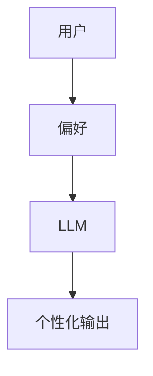
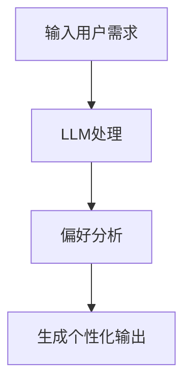
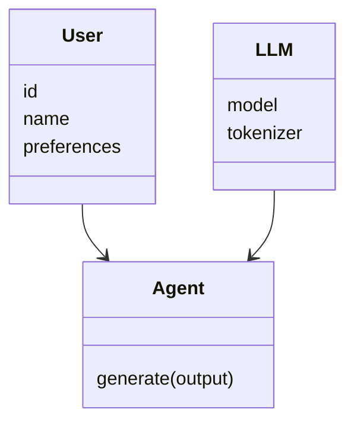
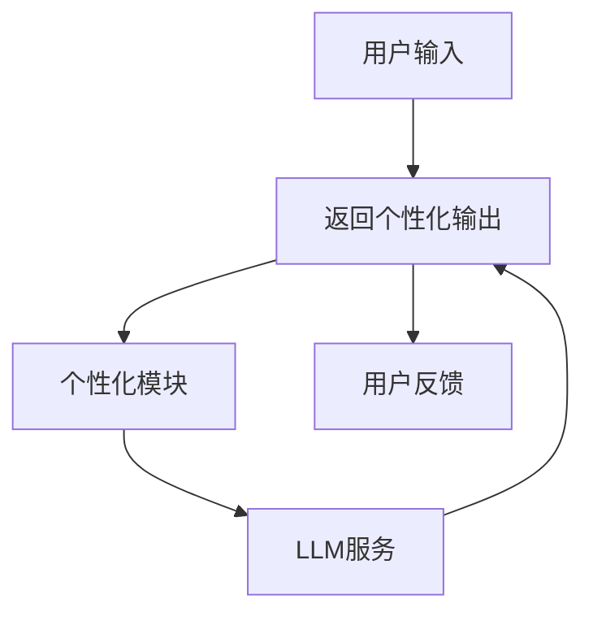
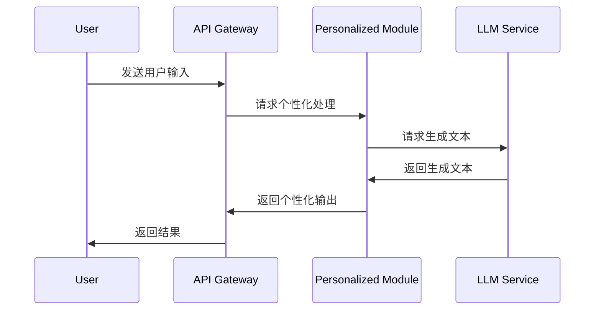

                 


# LLM驱动的AI Agent个性化：适应用户偏好

## 关键词：LLM, AI Agent, 个性化适应, 用户偏好, 自然语言处理

## 摘要：本文探讨了利用大型语言模型（LLM）驱动AI Agent实现个性化适应用户偏好的方法。通过分析LLM与AI Agent的结合，提出了一种基于用户偏好的个性化生成模型，并详细介绍了其实现原理和应用场景。本文还通过实际案例展示了如何通过代码实现这一模型，并提出了最佳实践建议。

---

# 第1章: LLM与AI Agent的基本概念

## 1.1 问题背景与描述

### 1.1.1 传统AI Agent的局限性
传统AI Agent通常基于规则或预定义的逻辑进行决策和行动，这种方式在面对复杂多变的用户需求时显得力不从心。例如，基于规则的聊天机器人在处理非结构化问题时表现不佳，难以满足用户的个性化需求。

### 1.1.2 用户个性化需求的兴起
随着用户对智能化服务的需求不断增加，个性化成为AI Agent发展的关键方向。用户希望AI Agent能够根据自身偏好提供定制化的服务，例如个性化推荐、智能助手等。

### 1.1.3 LLM在AI Agent中的作用
大型语言模型（LLM）通过其强大的自然语言处理能力，能够理解和生成人类语言，为AI Agent提供了强大的生成能力和理解能力。LLM可以用于分析用户偏好并生成个性化输出，从而实现AI Agent的个性化适应。

## 1.2 LLM驱动的AI Agent定义

### 1.2.1 LLM与AI Agent的结合
LLM驱动的AI Agent是一种结合了大型语言模型和人工智能代理的系统。通过LLM的自然语言处理能力，AI Agent能够理解用户需求并生成个性化输出。

### 1.2.2 个性化适应的核心概念
个性化适应是指AI Agent根据用户的偏好和需求，动态调整其行为和输出，以提供最佳用户体验。这包括从用户输入中提取偏好信息，并将其融入生成过程。

### 1.2.3 适应用户偏好的必要性
适应用户偏好是实现个性化服务的关键。通过分析用户的历史行为和实时输入，AI Agent可以更好地理解用户需求，从而提供更精准的服务。

## 1.3 核心概念与边界

### 1.3.1 核心概念的构成要素
- 用户需求：用户的输入和行为数据。
- LLM模型：用于理解和生成文本的大型语言模型。
- 用户偏好：基于用户数据提取的偏好信息。
- 个性化输出：根据用户偏好生成的定制化输出。

### 1.3.2 问题的边界与外延
- 边界：个性化适应主要关注用户的语言偏好和行为模式，不涉及其他领域（如视觉或音频）。
- 外延：个性化适应可以通过与其他技术的结合（如推荐系统）进一步扩展。

### 1.3.3 相关概念的对比分析
| 概念 | 描述 | 区别 |
|------|------|------|
| LLM驱动的AI Agent | 基于LLM的AI代理 | 强调自然语言处理能力 |
| 基于规则的AI Agent | 基于预定义规则的AI代理 | 适用于简单、静态的场景 |
| 个性化推荐系统 | 基于用户数据推荐内容 | 更注重推荐而非生成 |

## 1.4 本章小结
本章介绍了LLM驱动的AI Agent的基本概念，分析了个性化适应的必要性，并通过对比分析明确了其与其他技术的区别。

---

# 第2章: 个性化适应的核心原理

## 2.1 核心概念的原理分析

### 2.1.1 LLM的生成机制
LLM通过神经网络结构理解和生成文本。输入经过编码器处理后，生成器根据上下文生成相关文本。这种机制使得LLM能够动态调整生成内容以适应用户偏好。

### 2.1.2 用户偏好的识别与建模
用户偏好可以通过分析用户的历史行为、输入文本和反馈数据提取。通过将这些数据建模为向量，可以表示用户的兴趣和偏好。

### 2.1.3 个性化适应的实现路径
1. 分析用户输入，提取偏好信息。
2. 根据偏好信息调整LLM的生成参数。
3. 输出个性化内容。

## 2.2 核心概念的属性对比

### 2.2.1 实体关系图（ER图）分析


## 2.3 算法原理与流程

### 2.3.1 个性化适应的算法流程图


## 2.4 数学模型与公式

### 2.4.1 偏好建模的数学表达
$$ P(u) = \sum_{i=1}^{n} w_i x_i $$

其中，$P(u)$表示用户的偏好向量，$w_i$是第i个特征的权重，$x_i$是第i个特征的值。

### 2.4.2 个性化输出的生成模型
$$ O = f(P(u), M) $$

其中，$O$是生成的个性化输出，$f$是生成函数，$M$是LLM模型参数。

## 2.5 本章小结
本章详细分析了个性化适应的核心原理，包括LLM的生成机制、用户偏好的建模方法以及算法实现的流程。

---

# 第3章: 算法原理与实现

## 3.1 算法原理

### 3.1.1 基于LLM的偏好识别
通过分析用户的输入文本和历史行为，提取用户的偏好特征。例如，可以通过词袋模型提取关键词，分析用户的兴趣领域。

### 3.1.2 个性化生成的实现方法
根据用户的偏好调整LLM的生成参数，例如调整温度参数（temperature）以控制生成内容的创意性和准确性。

### 3.1.3 算法的数学模型
$$ y = f(x; \theta) $$

其中，$x$是输入，$y$是输出，$\theta$是模型参数。

## 3.2 算法实现

### 3.2.1 环境安装与配置
```bash
pip install transformers
```

### 3.2.2 核心代码实现
```python
from transformers import AutoModelForSeq2Seq, AutoTokenizer

class PersonalizedAgent:
    def __init__(self, model_name):
        self.tokenizer = AutoTokenizer.from_pretrained(model_name)
        self.model = AutoModelForSeq2Seq.from_pretrained(model_name)
    
    def generate_output(self, user_input):
        inputs = self.tokenizer(user_input, return_tensors="pt")
        outputs = self.model.generate(**inputs, temperature=0.7)
        return self.tokenizer.decode(outputs[0], skip_special_tokens=True)
```

### 3.2.3 代码解读与分析
上述代码定义了一个基于LLM的个性化代理类，初始化加载模型，并定义了生成输出的方法。通过调整温度参数，可以控制生成内容的创意性。

## 3.3 本章小结
本章通过代码实现详细介绍了个性化适应的算法实现过程，包括环境配置和核心代码的编写。

---

# 第4章: 系统架构设计方案

## 4.1 系统功能设计

### 4.1.1 领域模型设计


### 4.1.2 系统架构设计


### 4.1.3 系统接口设计
- 用户输入接口：接收用户的文本输入。
- API Gateway：负责路由和请求处理。
- 个性化模块：根据用户输入生成个性化输出。
- LLM服务：提供文本生成能力。

### 4.1.4 系统交互设计


## 4.2 本章小结
本章设计了一个基于LLM的AI Agent系统架构，包括功能模块、系统架构图和交互流程图。

---

# 第5章: 项目实战

## 5.1 环境安装与配置

### 5.1.1 安装依赖
```bash
pip install transformers requests
```

### 5.1.2 配置API密钥
在环境中配置API密钥，用于访问LLM服务。

## 5.2 核心代码实现

### 5.2.1 个性化代理实现
```python
import requests

class PersonalizedAgent:
    def __init__(self, api_key):
        self.api_key = api_key
        self.url = "https://api.example.com/generate"
    
    def generate_output(self, user_input):
        headers = {"Authorization": f"Bearer {self.api_key}"}
        data = {"input": user_input}
        response = requests.post(self.url, headers=headers, json=data)
        return response.json()['output']
```

### 5.2.2 应用程序实现
```python
from flask import Flask, request

app = Flask(__name__)

@app.route('/generate', methods=['POST'])
def generate():
    user_input = request.json['input']
    api_key = request.json['api_key']
    agent = PersonalizedAgent(api_key)
    output = agent.generate_output(user_input)
    return {"output": output}

if __name__ == "__main__":
    app.run(debug=True)
```

## 5.3 案例分析与详细讲解

### 5.3.1 案例背景
假设我们开发了一个智能客服系统，希望根据用户的问题生成个性化的回复。

### 5.3.2 代码实现
通过上述代码，用户可以通过API调用生成个性化输出。

## 5.4 本章小结
本章通过实际案例详细讲解了如何实现一个基于LLM的个性化代理系统。

---

# 第6章: 最佳实践

## 6.1 小结与总结

### 6.1.1 核心内容总结
- LLM驱动的AI Agent能够实现个性化适应。
- 通过分析用户偏好并调整生成参数，可以生成个性化输出。

### 6.1.2 关键点总结
- 个性化适应的核心是用户的偏好建模。
- LLM的生成能力是实现个性化适应的关键。

## 6.2 注意事项

### 6.2.1 实际应用中的注意事项
- 确保用户数据的隐私和安全。
- 定期更新模型以保持生成质量。

### 6.2.2 技术实现中的注意事项
- 选择合适的LLM模型以满足具体需求。
- 优化生成参数以提升用户体验。

## 6.3 拓展阅读

### 6.3.1 推荐的书籍与资源
- 《生成式人工智能：原理与应用》
- Hugging Face的Transformers库文档

## 6.4 本章小结
本章总结了文章的核心内容，并提出了实际应用中的注意事项和拓展阅读资源。

---

# 作者：AI天才研究院 & 禅与计算机程序设计艺术

