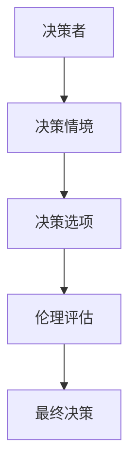
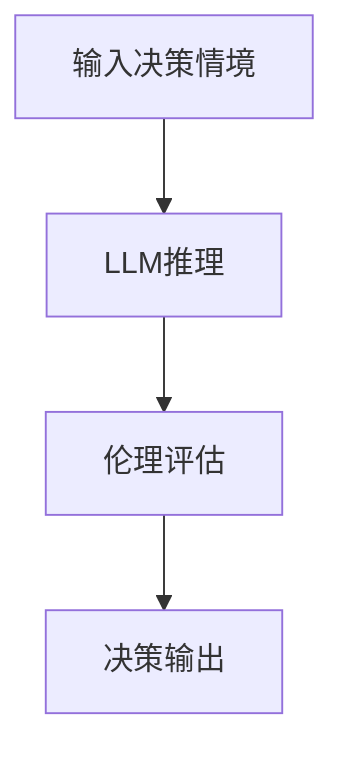
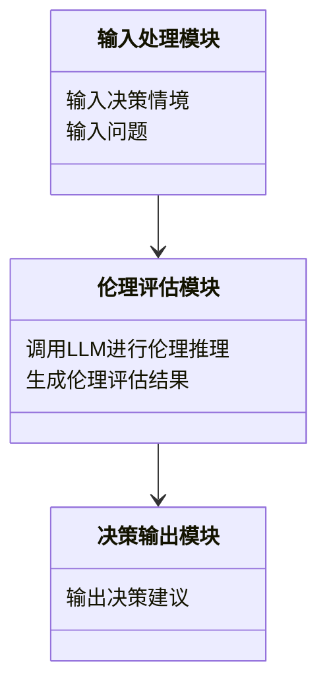
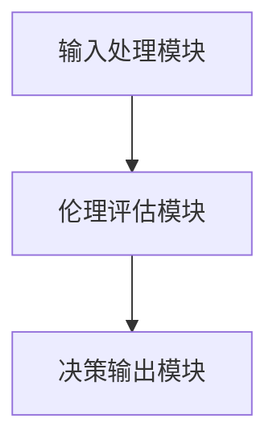

                 


# LLM驱动的AI Agent伦理决策支持系统

> 关键词：LLM, AI Agent, 伦理决策, 支持系统, 人工智能, 伦理框架

> 摘要：本文详细探讨了LLM驱动的AI Agent伦理决策支持系统的构建与实现。从核心概念到算法原理，从系统架构到项目实战，系统性地分析了如何利用大语言模型（LLM）构建一个能够进行伦理决策的AI Agent支持系统。文章首先介绍了系统的背景与核心概念，随后深入分析了伦理决策支持系统的原理与算法，详细阐述了系统的数学模型与架构设计，并通过实际案例展示了系统的实现与应用。最后，总结了系统的优缺点，并给出了相关的注意事项与拓展阅读建议。

---

## 第一部分：背景介绍

### 第1章：LLM驱动的AI Agent概述

#### 1.1 问题背景
AI Agent（人工智能代理）是一种能够感知环境并采取行动以实现目标的智能系统。随着技术的发展，AI Agent的应用范围不断扩大，从自动驾驶、智能助手到医疗诊断、金融投资，几乎无处不在。然而，AI Agent在决策过程中往往缺乏对伦理和道德的考量，这可能导致不可预料的后果。例如，在自动驾驶中，AI Agent需要在紧急情况下做出决策，如是否优先保护车内乘客还是路人。这种情况下，决策的伦理维度变得至关重要。

#### 1.2 问题描述
LLM（大语言模型）作为一种强大的工具，能够理解上下文、生成文本并进行推理。然而，LLM本身并不具备伦理判断的能力，它只是基于训练数据生成输出。因此，如何将LLM与伦理决策结合起来，构建一个能够进行伦理推理的AI Agent，成为一个亟待解决的问题。

#### 1.3 问题解决
本系统的目标是通过LLM驱动的AI Agent，构建一个能够进行伦理决策的支持系统。该系统将从问题分析、伦理框架构建、决策推理到结果输出，提供一整套解决方案。通过将伦理规则和价值观嵌入到系统中，AI Agent能够在决策过程中考虑伦理因素，从而做出更加合理和负责任的选择。

#### 1.4 边界与外延
本系统主要关注AI Agent在决策过程中的伦理支持功能，不涉及具体的应用场景实现。系统的输入为决策情境和相关问题，输出为伦理评估结果和决策建议。与其他AI系统相比，本系统的独特性在于其对伦理维度的深度考量。

#### 1.5 核心概念与结构
系统的逻辑架构包括以下几个核心模块：
1. **输入处理模块**：接收决策情境和相关问题。
2. **伦理评估模块**：基于LLM进行伦理推理和评估。
3. **决策输出模块**：生成最终的决策建议。

---

## 第二部分：核心概念与联系

### 第2章：伦理决策支持系统的核心原理

#### 2.1 伦理框架与决策过程
伦理框架是伦理决策支持系统的核心，它定义了决策过程中需要考虑的伦理原则和价值观。决策过程包括以下几个步骤：
1. **问题分析**：理解决策情境和目标。
2. **伦理推理**：基于伦理框架进行推理和评估。
3. **决策优化**：权衡不同选项的伦理后果，选择最优解。

#### 2.2 概念属性对比
下表对比了不同决策支持系统的特性：

| 决策支持系统 | 基于数据 | 基于规则 | 基于伦理 |
|--------------|----------|----------|----------|
| 数据驱动型   | √        |          |          |
| 规则驱动型   |          | √        |          |
| 伦理驱动型   |          |          | √        |

#### 2.3 ER实体关系图


---

## 第三部分：算法原理讲解

### 第3章：LLM驱动的伦理决策算法

#### 3.1 算法流程


#### 3.2 算法实现
以下是LLM调用的Python代码示例：
```python
def load_llm():
    # 加载LLM模型
    model = AutoModelForCausalLM.from_pretrained("gpt2")
    tokenizer = AutoTokenizer.from_pretrained("gpt2")
    return model, tokenizer

def ethical_decision-making(context, model, tokenizer):
    # 构建输入
    input_ids = tokenizer(context, return_tensors="np").input_ids
    # 生成伦理评估
    outputs = model.generate(input_ids, max_length=100, num_return_sequences=1)
    # 解析输出
    ethical_assessment = tokenizer.decode(outputs[0], skip_special_tokens=True)
    return ethical_assessment
```

---

## 第四部分：数学模型

### 第4章：LLM的数学模型

#### 4.1 概率分布
LLM基于概率分布生成文本。概率分布定义了每个词的出现概率：
$$ P(\text{word}_i) $$

#### 4.2 损失函数
交叉熵损失函数用于衡量预测与真实值的差异：
$$ \text{Loss} = -\sum_{i=1}^{n} y_i \log(p_i) $$

#### 4.3 生成过程
生成过程基于最大似然估计，通过不断优化参数使生成的文本概率最大化：
$$ \theta = \arg\max \text{P}(x|y) $$

---

## 第五部分：系统分析与架构设计

### 第5章：系统架构

#### 5.1 问题场景
以自动驾驶为例，AI Agent需要在紧急情况下做出决策。

#### 5.2 系统功能设计


#### 5.3 系统架构设计


---

## 第六部分：项目实战

### 第6章：环境安装与核心代码实现

#### 6.1 环境安装
```bash
pip install transformers
```

#### 6.2 核心代码实现
```python
from transformers import AutoModelForCausalLM, AutoTokenizer

def main():
    model, tokenizer = load_llm()
    context = "自动驾驶中遇到紧急情况，应该如何决策？"
    ethical_assessment = ethical_decision-making(context, model, tokenizer)
    print(ethical_assessment)

if __name__ == "__main__":
    main()
```

#### 6.3 案例分析
以自动驾驶为例，系统会根据伦理框架生成决策建议，如“优先保护车内乘客”。

---

## 第七部分：最佳实践

### 第7章：总结与建议

#### 7.1 系统小结
LLM驱动的AI Agent伦理决策支持系统通过将伦理框架嵌入到决策过程中，能够帮助AI Agent做出更负责任的决策。

#### 7.2 注意事项
- 确保伦理框架的合理性和全面性。
- 定期更新和优化系统，以应对新的伦理挑战。

#### 7.3 拓展阅读
- 《道德机器》（Moral Machines）
- 《人工智能伦理》（Ethics of Artificial Intelligence）

---

## 作者：AI天才研究院/AI Genius Institute & 禅与计算机程序设计艺术 /Zen And The Art of Computer Programming

---

通过以上内容，我们系统性地分析了LLM驱动的AI Agent伦理决策支持系统的构建与实现，从理论到实践，从算法到架构，为读者提供了一个全面的视角。

