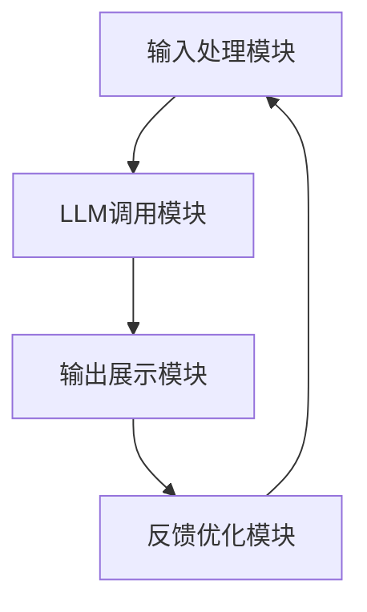
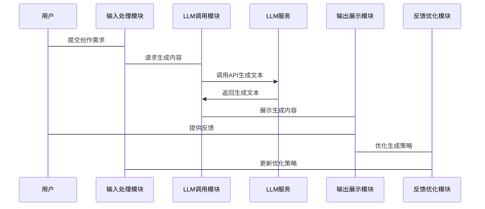

                 


# LLM驱动的AI Agent创意写作助手

> 关键词：LLM, AI Agent, 创意写作, 大语言模型, 人工智能, 自然语言处理

> 摘要：本文探讨了如何利用大语言模型（LLM）驱动的AI Agent作为创意写作助手，通过详细分析其背景、理论基础、技术实现、系统架构及项目实战，为读者提供从基础到高级的全面解读。文章结合实际案例，深入剖析了LLM在创意写作中的应用，并提供了系统设计与实现的最佳实践。

---

# 第一部分: 引言

## 第1章: 背景与概念

### 1.1 问题背景

在数字时代，创意写作的需求日益增长，但传统的写作工具往往局限于语法检查或简单的灵感提示。随着人工智能的快速发展，尤其是大语言模型（LLM）的崛起，为创意写作带来了新的可能性。然而，如何将LLM与AI Agent结合，构建一个高效、智能的创意写作助手，仍是一个待探索的领域。

#### 核心问题
- **创作灵感不足**：写作者常常面临灵感枯竭，需要外部刺激。
- **效率低下**：传统工具无法理解上下文，难以提供连贯的建议。
- **个性化需求**：不同写作者有不同的风格和需求，需要定制化的助手。

### 1.2 核心概念

#### 大语言模型（LLM）
- **定义**：基于Transformer架构的大型神经网络模型，如GPT系列。
- **特点**：具备理解上下文、生成自然语言文本的能力。
- **应用场景**：文本生成、对话系统、内容创作等。

#### AI Agent
- **定义**：智能体，能够感知环境并执行任务的实体。
- **特点**：具备自主性、反应性、目标导向性。
- **与LLM的结合**：利用LLM的生成能力，赋予AI Agent理解和生成文本的能力。

#### 创意写作助手
- **定义**：一个结合LLM和AI Agent的系统，帮助写作者生成灵感、校对文本、优化结构。
- **目标**：提升写作效率，激发创作灵感，提供个性化的写作支持。

### 1.3 应用场景

- **文学创作**：协助小说家构建情节、塑造角色。
- **学术写作**：帮助研究人员组织论文结构、优化语言。
- **创意头脑风暴**：激发写作者的创新思维。

---

# 第二部分: 理论基础

## 第2章: LLM的基本原理

### 2.1 大语言模型的训练方法

#### 监督学习与无监督学习
- **监督学习**：基于标记数据的训练，如文本分类任务。
- **无监督学习**：利用未标记数据进行自适应学习，如文本生成。

#### 预训练与微调
- **预训练**：在大规模通用数据上进行无监督学习，如BERT、GPT。
- **微调**：在特定任务数据上进行有监督训练，提升任务性能。

#### 模型参数与性能
- **参数量**：模型参数越多，能力越强，但训练资源需求也越高。
- **性能表现**：参数量与模型在不同任务上的表现呈正相关。

### 2.2 LLM的模型结构

#### Transformer架构
- **优点**：
  - 并行计算能力强。
  - 能够捕捉长距离依赖关系。
- **缺点**：
  - 训练资源消耗大。
  - �易受数据偏差影响。

#### 注意力机制
- **工作原理**：通过计算输入序列中每个词与其他词的相关性，决定每个词的权重。
- **公式推导**：
  - 查询（Q）、键（K）、值（V）的计算：
    $$
    Q = W_q x, \quad K = W_k x, \quad V = W_v x
    $$
  - 注意力权重（α）的计算：
    $$
    \alpha = \text{softmax}\left(\frac{QK^T}{\sqrt{d_k}}\right)
    $$
  - 最终输出：
    $$
    \text{Output} = \alpha V
    $$

### 2.3 LLM的数学模型

#### 生成模型
- **解码器架构**：用于生成序列的模型，如GPT。
- **损失函数**：
  $$
  \mathcal{L} = -\sum_{i=1}^{n} \log p(y_i|x_i)
  $$
  其中，$y_i$是目标输出，$x_i$是输入序列。

---

## 第3章: AI Agent的核心原理

### 3.1 AI Agent的体系结构

#### 体系结构
- **感知层**：接收输入，理解用户需求。
- **决策层**：基于理解生成响应。
- **执行层**：输出结果，与用户交互。

#### LLM在AI Agent中的作用
- **感知层**：通过LLM理解用户输入的意图。
- **决策层**：利用LLM生成响应。
- **执行层**：通过LLM优化输出。

### 3.2 AI Agent的工作流程

#### 信息获取与解析
- **输入解析**：将用户输入转换为内部表示。
- **意图识别**：理解用户的深层需求。

#### 决策制定与执行
- **生成响应**：基于LLM生成回复。
- **反馈机制**：根据用户反馈优化输出。

#### 多轮对话中的状态管理
- **对话历史**：记录上下文，保持对话连贯性。
- **状态更新**：根据用户输入和模型输出，动态更新对话状态。

### 3.3 LLM与AI Agent的结合

#### 知识库与推理引擎
- **知识库**：存储结构化数据，辅助生成。
- **推理引擎**：基于知识库进行逻辑推理。

#### 意图识别与生成
- **意图识别**：通过LLM分析用户输入，提取意图。
- **生成**：根据意图生成个性化回复。

#### 多模态交互
- **文本与语音交互**：支持多模态输入输出。
- **视觉辅助**：通过视觉元素辅助创作。

---

# 第三部分: 技术实现

## 第4章: 模型调优与优化

### 4.1 参数调优

#### 超参数优化
- **学习率**：调整模型训练的速度。
- **批次大小**：影响训练效率和模型性能。
- **Dropout率**：防止过拟合。

#### 提升生成质量
- **温度参数（Temperature）**：控制生成的随机性。
- **Top-k采样**：限制生成选项的数量。
- **核对机制（Beam Search）**：优化生成结果的质量。

### 4.2 Prompt工程

#### Prompt设计原则
- **明确性**：确保提示清晰，避免歧义。
- **上下文相关性**：结合上下文，提升生成质量。
- **风格一致性**：保持生成文本的风格一致。

#### 示例
- **原始Prompt**：写一个科幻小说的开头。
- **优化Prompt**：以未来科技为主题的科幻小说，主角是一位科学家，情节围绕时间旅行展开。

### 4.3 性能评估

#### 评估指标
- **BLEU**：基于n-gram的相似度评分。
- **ROUGE**：基于摘要的相似度评分。
- **人类评分**：通过人工评估生成文本的质量。

---

## 第5章: 人机交互设计

### 5.1 对话流程设计

#### 初始对话流程
1. 用户输入创作需求。
2. AI Agent解析需求。
3. AI Agent生成响应。
4. 用户反馈，循环优化。

#### 示例流程
1. 用户输入：写一篇悬疑小说的开头。
2. AI Agent解析：用户需要悬疑风格，可能希望营造紧张氛围。
3. AI Agent生成：深夜，风雨交加，一座废弃的 mansion在雷声中显得格外阴森。
4. 用户反馈：增加一些悬念，比如提到一个神秘的声音。
5. AI Agent优化：深夜，风雨交加，一座废弃的 mansion在雷声中显得格外阴森。突然，一阵低沉的声音从二楼传来。

### 5.2 交互优化

#### 动态反馈机制
- **实时调整**：根据用户反馈动态优化生成内容。
- **历史记录**：记录对话历史，保持连贯性。

#### 多轮对话管理
- **状态跟踪**：记录当前对话状态。
- **上下文记忆**：保持上下文连贯。

---

## 第6章: 系统架构与实现

### 6.1 功能模块划分

#### 模块划分
- **输入处理模块**：接收用户输入，解析需求。
- **LLM调用模块**：调用大语言模型生成文本。
- **输出展示模块**：将生成内容展示给用户。
- **反馈优化模块**：根据用户反馈优化生成结果。

#### 功能模块图


### 6.2 系统架构设计

#### 系统架构图


#### 系统接口设计
- **输入接口**：接收用户输入的文本或语音。
- **输出接口**：展示生成内容，支持文本、语音等多种形式。
- **反馈接口**：接收用户反馈，优化生成结果。

#### 系统交互流程


---

## 第7章: 项目实战

### 7.1 环境搭建

#### 工具安装
- **Python**：3.8+
- ** transformers库**：用于调用LLM。
- **fastapi**：用于构建API。

#### 安装命令
```bash
pip install transformers fastapi uvicorn
```

### 7.2 核心代码实现

#### 输入处理模块
```python
from transformers import GPT2LMHeadModel, GPT2Tokenizer

tokenizer = GPT2Tokenizer.from_pretrained('gpt2')
model = GPT2LMHeadModel.from_pretrained('gpt2')
```

#### LLM调用模块
```python
def generate_text(prompt, max_length=50):
    inputs = tokenizer.encode(prompt, return_tensors='pt')
    outputs = model.generate(inputs, max_length=max_length, do_sample=True)
    return tokenizer.decode(outputs[0], skip_special_tokens=True)
```

#### 交互流程
```python
def main():
    while True:
        prompt = input("请输入创作需求：")
        result = generate_text(prompt)
        print("AI生成内容：", result)
        feedback = input("请评价生成内容（输入'优化'进行优化）：")
        if feedback == '优化':
            # TODO: 实现优化逻辑
            pass
```

---

## 第8章: 高级应用与未来发展

### 8.1 多模态写作助手

#### 文本与视觉结合
- **图像生成**：根据文本生成相关图片。
- **视觉辅助**：通过视觉元素辅助创作。

#### 多语言支持
- **跨语言创作**：支持多种语言的创作与翻译。

### 8.2 个性化助手

#### 用户画像
- **行为分析**：分析用户的创作习惯和偏好。
- **个性化推荐**：基于用户画像推荐创作方向。

#### 动态调整
- **实时优化**：根据用户实时反馈动态调整生成策略。
- **自适应学习**：模型根据用户行为自适应优化。

### 8.3 未来发展

#### 技术趋势
- **更强大的LLM**：参数量更大、性能更强的模型。
- **更智能的Agent**：具备更强自主学习和决策能力的AI Agent。

#### 挑战与机遇
- **计算资源限制**：如何在有限资源下优化性能。
- **用户体验优化**：如何设计更自然、更高效的交互方式。

---

# 结语

LLM驱动的AI Agent创意写作助手是一个充满潜力的领域，随着技术的不断进步，其应用将越来越广泛。通过本文的详细解读，读者可以深入了解其背后的技术原理，并通过实际案例掌握其开发与应用的方法。未来，随着AI技术的进一步发展，创意写作助手将变得更加智能化、个性化，为写作者提供更强大的支持。

---

# 作者

作者：AI天才研究院/AI Genius Institute & 禅与计算机程序设计艺术/Zen And The Art of Computer Programming

