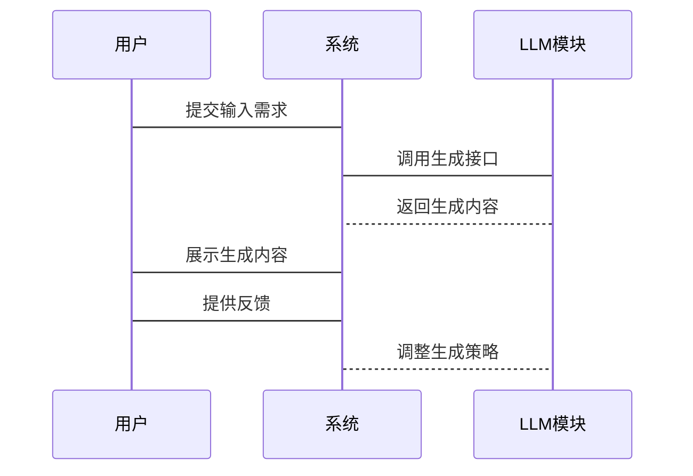

                 

# LLM驱动的AI Agent创意生成系统

> 关键词：LLM，AI Agent，创意生成，大语言模型，人工智能，创意生成系统

> 摘要：本文详细探讨了基于大语言模型（LLM）的AI Agent创意生成系统的构建与实现。通过分析LLM的核心原理，结合AI Agent的系统架构设计，提出了一种创新的创意生成方法。本文从背景介绍、算法原理、系统架构到项目实战，全面阐述了LLM驱动的AI Agent创意生成系统的实现过程，并通过具体案例展示了系统的实际应用效果。

---

# 第一部分: 背景与核心概念

## 第1章: LLM驱动的AI Agent创意生成系统概述

### 1.1 什么是LLM驱动的AI Agent？

#### 1.1.1 大语言模型（LLM）的基本概念
- 大语言模型（Large Language Model, LLM）是一种基于深度学习的自然语言处理模型，具有强大的文本生成和理解能力。
- LLM的核心思想是通过大量数据的预训练，学习语言的语法、语义和上下文关系。

#### 1.1.2 AI Agent的定义与特点
- AI Agent（人工智能代理）是指能够感知环境并采取行动以实现目标的智能实体。
- AI Agent的特点包括自主性、反应性、目标导向性和社交能力。

#### 1.1.3 LLM驱动AI Agent的核心思想
- 通过将LLM作为AI Agent的核心模块，利用其强大的语言处理能力，实现智能代理的自然语言交互和创意生成。

### 1.2 创意生成的背景与需求

#### 1.2.1 创意生成的定义与分类
- 创意生成是指通过技术手段，生成具有创新性、独特性和实用性的内容。
- 创意生成可以分为文本生成、图像生成、音乐生成等多种形式。

#### 1.2.2 当前创意生成的主要挑战
- 创意生成的质量难以量化。
- 创意生成的多样性与实用性之间的平衡问题。
- 如何结合上下文生成符合需求的创意内容。

#### 1.2.3 LLM在创意生成中的优势
- LLM具有强大的语言理解和生成能力。
- LLM可以通过微调和提示工程技术，生成符合特定需求的创意内容。
- LLM可以结合外部知识库，生成更具深度和广度的创意。

### 1.3 LLM驱动AI Agent的系统架构

#### 1.3.1 系统整体架构
- **输入模块**：接收用户的输入需求。
- **LLM模块**：负责创意内容的生成。
- **输出模块**：将生成的内容呈现给用户。
- **反馈模块**：收集用户的反馈并优化生成过程。

#### 1.3.2 各模块的功能描述
- **输入模块**：解析用户的输入需求，提取关键词和上下文信息。
- **LLM模块**：基于输入需求，生成创意内容。
- **输出模块**：将生成的内容以文本、图像或其他形式展示。
- **反馈模块**：收集用户对生成内容的反馈，并调整生成策略。

#### 1.3.3 系统边界与外延
- 系统的核心功能是创意生成，但可以与外部知识库、用户偏好数据等结合，提升生成效果。

## 第2章: LLM的核心原理

### 2.1 LLM的模型结构与训练方法

#### 2.1.1 基于Transformer的模型结构
- Transformer模型由编码器和解码器两部分组成。
- 编码器负责将输入文本转化为向量表示，解码器负责根据编码器的输出生成目标文本。

#### 2.1.2 大规模预训练的目标函数
- LLM的训练目标是最大化生成文本的概率。
- 数学表达式：
  $$ \text{Loss} = -\sum_{i=1}^{n} \log p(x_i | x_{<i}) $$

#### 2.1.3 从监督学习到自监督学习的转变
- 自监督学习通过预测下一个词来学习语言模型。
- 监督学习需要人工标注的训练数据，而自监督学习利用数据本身的结构进行学习。

### 2.2 LLM的注意力机制详解

#### 2.2.1 注意力机制的数学模型
- 注意力机制公式：
  $$ \text{Attention}(Q, K, V) = \text{softmax}\left(\frac{QK^T}{\sqrt{d_k}}\right)V $$
- Q、K、V分别表示查询、键和值。

#### 2.2.2 多头注意力的实现原理
- 多头注意力通过并行计算多个注意力头，提升模型的表达能力。
- 每个注意力头关注不同的位置信息。

#### 2.2.3 注意力机制在创意生成中的应用
- 注意力机制可以帮助模型关注生成文本的关键部分，提升生成内容的质量。

### 2.3 LLM的生成策略

#### 2.3.1 基于贪心算法的生成策略
- 贪心算法每次选择概率最高的词进行生成。
- 优点是生成速度快，缺点是可能忽略上下文的整体最优解。

#### 2.3.2 采样生成策略（如Top-k采样）
- Top-k采样在概率最高的k个词中随机选择一个词进行生成。
- 优点是可以生成更多样化的文本，缺点是生成速度较慢。

#### 2.3.3 基于温度参数的生成控制
- 温度参数控制生成的多样性。
- 温度越高，生成内容越多样化；温度越低，生成内容越确定。

## 第3章: 创意生成的算法原理

### 3.1 基于LLM的生成模型

#### 3.1.1 基于解码器的生成模型
- 解码器负责将输入的向量表示生成目标文本。
- 自回归生成过程：逐步生成每个词，并将其作为后续生成的输入。

#### 3.1.2 解码器中的位置编码机制
- 位置编码用于表示每个词的位置信息。
- 常见的位置编码方法包括固定位置编码和可学习的位置编码。

#### 3.1.3 解码器的自回归生成过程
- 自回归生成过程确保生成的文本与上下文保持一致。

### 3.2 基于LLM的检索模型

#### 3.2.1 检索模型的基本原理
- 检索模型通过匹配输入查询和预存内容，生成最相关的文本。

#### 3.2.2 基于向量空间的检索方法
- 将输入查询和候选文本转化为向量表示，计算向量之间的相似度。
- 常见的相似度计算方法包括余弦相似度和欧氏距离。

#### 3.2.3 检索模型的优化策略
- 增加训练数据的多样性。
- 调整检索算法的参数，提升检索的准确性。

### 3.3 创意生成的评价指标

#### 3.3.1 基于人类评分的指标
- 人类评分是最常用的评价指标，但需要大量的人力和时间。

#### 3.3.2 基于自动评分的指标
- 常见的自动评分指标包括困惑度（Perplexity）和 BLEU（Bilingual Evaluation Understudy）。

---

# 第四部分: 系统架构设计与实现

## 第4章: 系统架构设计

### 4.1 问题场景介绍
- 在实际应用中，LLM驱动的AI Agent创意生成系统需要具备高效性、可靠性和可扩展性。

### 4.2 项目介绍
- 本项目旨在构建一个基于LLM的AI Agent创意生成系统，实现文本生成、图像生成等多种创意生成功能。

### 4.3 系统功能设计

#### 4.3.1 领域模型设计
- **用户输入模块**：负责接收用户的输入需求。
- **LLM生成模块**：负责根据输入需求生成创意内容。
- **输出展示模块**：将生成的内容以用户友好的形式展示。
- **反馈优化模块**：收集用户反馈，优化生成策略。

#### 4.3.2 系统架构设计
- 使用微服务架构，将系统划分为多个独立的服务模块。
- 每个服务模块负责特定的功能，如用户输入处理、LLM调用、结果展示等。

### 4.4 系统交互设计

#### 4.4.1 系统交互流程
- 用户输入需求。
- 系统解析输入需求，调用LLM生成创意内容。
- 系统将生成的内容展示给用户。
- 用户反馈生成结果，系统优化生成策略。

#### 4.4.2 系统交互的Mermaid序列图

---

# 作者

作者：AI天才研究院 & 禅与计算机程序设计艺术

---

通过以上思考过程，我们可以清晰地看到，构建一个基于LLM的AI Agent创意生成系统需要从背景分析、算法原理、系统架构到项目实战等多个方面进行详细设计和实现。希望这篇文章能够为相关领域的研究和实践提供有价值的参考和指导。

