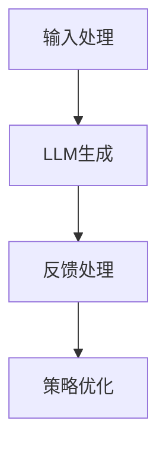

                 


# LLM驱动的AI Agent创意生成：突破思维局限

> **关键词**: 大语言模型，AI Agent，创意生成，思维突破，LLM，强化学习

> **摘要**: 本文深入探讨了如何利用大语言模型（LLM）驱动的AI Agent实现创意生成，并突破传统思维局限。通过分析LLM与AI Agent的结合，提出了一种创新的创意生成算法，并详细介绍了系统架构和实现方案。文章结合理论与实践，为读者提供了从理解到实现的全面指导。

---

## 第一章: LLM与AI Agent概述

### 1.1 问题背景

#### 1.1.1 创意生成的痛点与挑战
创意生成是许多领域（如写作、设计、编程）的核心需求，但传统方法依赖于人工经验，效率低下且难以突破思维定式。随着AI技术的发展，如何利用AI技术提升创意生成效率成为一个重要课题。

#### 1.1.2 LLM在创意生成中的独特优势
大语言模型（LLM）具有强大的语言理解和生成能力，能够处理复杂上下文，并生成多样化的创意内容。LLM的优势在于其强大的语义理解和生成能力，可以为创意生成提供丰富的语料支持。

#### 1.1.3 AI Agent的核心价值
AI Agent是一种智能体，能够根据目标和环境信息自主决策并执行任务。通过将LLM与AI Agent结合，可以实现智能化的创意生成，突破传统方法的局限。

### 1.2 核心概念与联系

#### 1.2.1 LLM与AI Agent的关系
LLM作为AI Agent的核心模块，负责生成创意内容。AI Agent通过理解目标和环境信息，调用LLM生成创意内容，并根据反馈优化生成策略。

#### 1.2.2 创意生成的边界与外延
创意生成的边界包括生成内容的类型、质量和相关性。外延则包括从简单文本生成到复杂任务生成的扩展。

#### 1.2.3 核心要素组成与概念结构
- **目标**: 创意生成的目标（如生成故事、设计产品）。
- **输入**: 初始条件和用户需求。
- **输出**: 创意内容和生成策略。
- **反馈**: 用户反馈和环境反馈。

---

## 第二章: LLM驱动AI Agent的理论基础

### 2.1 LLM的基本原理

#### 2.1.1 大语言模型的训练机制
LLM通过大量语料库训练，学习语言的分布规律。训练目标是最大化生成概率，从而生成与上下文相关的文本。

#### 2.1.2 概率生成模型的核心思想
生成模型基于概率分布生成文本。通过最大化条件概率$P(y|x)$，模型生成与输入$x$相关的文本$y$。

#### 2.1.3 注意力机制的作用
注意力机制帮助模型关注输入中的重要部分，提升生成文本的质量和相关性。

### 2.2 AI Agent的行为模型

#### 2.2.1 目标驱动的决策机制
AI Agent根据目标和环境信息，选择最优动作以实现目标。

#### 2.2.2 状态空间与动作空间的定义
- **状态空间**: 系统当前的状态（如输入文本）。
- **动作空间**: 可能的生成动作（如生成文本片段）。

#### 2.2.3 多轮对话中的上下文管理
AI Agent需要管理对话上下文，确保生成内容连贯。

### 2.3 创意生成的数学模型与公式

#### 2.3.1 LLM的概率生成模型
$$ P(y|x) = \frac{P(x,y)}{P(x)} $$
$$ P(x,y) = P(x|y)P(y) $$

#### 2.3.2 基于RL的优化模型
$$ R(y) = r_1 + r_2 + ... + r_n $$
$$ V(y) = \sum_{i=1}^{n} r_i \cdot w_i $$

---

## 第三章: 创意生成的系统架构与实现

### 3.1 系统架构设计

#### 3.1.1 问题场景介绍
系统需要在给定输入条件下生成创意文本，并根据用户反馈优化生成策略。

#### 3.1.2 系统功能设计
- **输入处理**: 接收用户输入并解析需求。
- **生成内容**: 调用LLM生成创意文本。
- **反馈处理**: 根据用户反馈优化生成策略。

#### 3.1.3 系统架构图



#### 3.1.4 系统接口设计
- **输入接口**: 文本输入和参数设置。
- **输出接口**: 生成文本和反馈信息。

### 3.2 算法实现

#### 3.2.1 基于PG的优化算法
$$ \nabla \theta = \sum_{t=1}^{T} \nabla \log \pi_\theta(a_t|s_t) Q(s_t,a_t) $$

#### 3.2.2 基于Q-Learning的优化
$$ Q(s,a) = r + \gamma \max_{a'} Q(s',a') $$

---

## 第四章: 项目实战

### 4.1 环境安装

```bash
pip install transformers gym
```

### 4.2 核心代码实现

```python
from transformers import GPT2LMHeadModel, GPT2Tokenizer

model = GPT2LMHeadModel.from_pretrained('gpt2')
tokenizer = GPT2Tokenizer.from_pretrained('gpt2')

def generate_text(prompt):
    inputs = tokenizer.encode(prompt, return_tensors='pt')
    outputs = model.generate(inputs, max_length=50)
    return tokenizer.decode(outputs[0])
```

### 4.3 案例分析

#### 4.3.1 案例1: 故事生成
输入: "一个年轻的冒险家踏上寻找传说中的宝物之旅..."
输出: 自动生成一个完整的故事片段。

#### 4.3.2 案例2: 产品设计
输入: "设计一款智能手表的功能..."
输出: 自动生成详细的产品功能描述。

---

## 第五章: 最佳实践与总结

### 5.1 最佳实践

- **环境准备**: 确保硬件和软件环境满足要求。
- **模型选择**: 根据需求选择合适的LLM模型。
- **反馈优化**: 定期收集用户反馈，优化生成策略。

### 5.2 小结

本文详细介绍了LLM驱动的AI Agent创意生成方法，从理论到实践，为读者提供了全面的指导。

### 5.3 注意事项

- **性能优化**: 注意模型训练和推理的性能问题。
- **用户体验**: 确保生成内容的可读性和相关性。

### 5.4 拓展阅读

推荐阅读相关领域的最新论文和技术博客，深入理解LLM和AI Agent的结合应用。

---

**作者**: AI天才研究院 & 禅与计算机程序设计艺术

