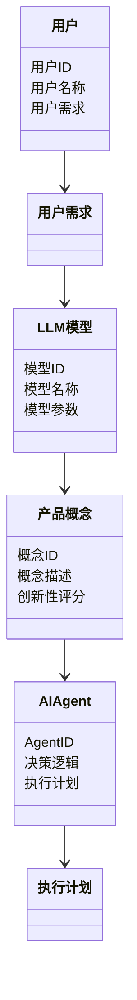

                 


# LLM驱动的AI Agent创新产品概念生成器

> 关键词：LLM, AI Agent, 创新产品, 概念生成, 大语言模型

> 摘要：本文深入探讨了如何利用大语言模型（LLM）驱动AI Agent来生成创新产品概念。文章从背景介绍、核心概念、算法原理、系统架构到项目实战，全面分析了LLM在AI Agent中的应用，以及如何通过系统设计和实际案例实现创新产品概念的生成。最后，本文总结了最佳实践和未来发展方向，为读者提供了完整的解决方案。

---

## 第一部分: LLM驱动的AI Agent创新产品概念生成器背景介绍

### 第1章: 问题背景与描述

#### 1.1 问题背景
当前，人工智能技术的快速发展为各行业带来了前所未有的机遇。大语言模型（LLM）作为AI领域的重要技术，已经在自然语言处理、文本生成等领域取得了显著成果。然而，如何将这些技术应用于更复杂的场景，如创新产品概念生成，仍然是一个巨大的挑战。AI Agent作为一种能够自主决策和执行任务的智能体，结合LLM的强大生成能力，可以为创新产品概念生成提供新的解决方案。

#### 1.2 问题描述
创新产品概念生成是一个复杂的过程，需要结合市场趋势、用户需求和技术可行性等多种因素。传统的生成方法往往依赖于固定的规则或模板，难以应对复杂的实际场景。而LLM驱动的AI Agent可以通过动态学习和生成，提供更灵活和多样化的解决方案。本文将探讨如何通过LLM驱动的AI Agent来实现创新产品概念的自动生成。

#### 1.3 问题解决
通过结合LLM的生成能力和AI Agent的自主决策能力，我们可以构建一个创新产品概念生成器，该生成器能够根据输入的市场需求、用户反馈和技术限制等因素，自动生成符合要求的产品概念。这种方法不仅可以提高生成效率，还能降低开发成本。

#### 1.4 边界与外延
创新产品概念生成器的应用范围包括但不限于科技、金融、医疗等领域。其边界在于生成的产品概念必须具备创新性和可行性，而外延则包括对生成概念的进一步优化和实施。

### 第2章: 核心概念组成

#### 2.1 核心概念组成
LLM驱动的AI Agent创新产品概念生成器由以下三个核心部分组成：
1. **LLM模型**：负责生成文本和概念。
2. **AI Agent框架**：负责决策和执行任务。
3. **创新产品概念生成器**：负责整合输入和输出，生成最终的产品概念。

#### 2.2 核心要素分析
- **LLM模型的输入输出机制**：LLM模型需要接收输入的市场需求、用户反馈等信息，并生成相应的文本输出。
- **AI Agent的决策逻辑**：AI Agent需要根据生成的文本输出，制定决策和执行计划。
- **创新产品概念生成的评价标准**：生成的产品概念需要符合创新性和可行性的要求。

---

## 第二部分: 核心概念与联系

### 第3章: 核心概念原理

#### 3.1 LLM驱动的AI Agent原理
LLM驱动的AI Agent创新产品概念生成器的工作原理可以分为以下几个步骤：
1. **输入需求**：用户输入市场需求、用户反馈等信息。
2. **文本生成**：LLM模型根据输入生成相关的产品概念。
3. **决策优化**：AI Agent对生成的概念进行优化和调整。
4. **输出结果**：生成最终的产品概念。

#### 3.2 核心概念属性对比

| 属性                | LLM模型                     | AI Agent                   | 创新产品概念生成器         |
|---------------------|----------------------------|-----------------------------|---------------------------|
| 输入               | 市场需求、用户反馈等       | 产品概念生成结果           | 用户需求、市场趋势等      |
| 输出               | 文本、概念                  | 优化后的产品概念           | 创新产品概念              |
| 核心功能           | 文本生成                   | 决策优化                   | 整合与生成                |
| 依赖条件           | 大语言模型训练数据         | AI Agent算法               | 用户输入和模型输出         |
| 优势               | 强大的文本生成能力         | 自主决策和优化能力         | 综合生成与优化             |

#### 3.3 ER实体关系图架构
以下是一个简单的ER实体关系图：

```mermaid
erDiagram
    customer[用户] {
        <属性>
        用户ID : int
        用户名称 : string
        用户需求 : string
    }
    llm_model[LLM模型] {
        <属性>
        模型ID : int
        模型名称 : string
        模型参数 : string
    }
    ai_agent[AI Agent] {
        <属性>
        AgentID : int
        决策逻辑 : string
        执行计划 : string
    }
    product_concept[产品概念] {
        <属性>
        概念ID : int
        概念描述 : string
        创新性评分 : float
    }
    user_request[用户请求] {
        <属性>
        请求ID : int
        请求内容 : string
        请求时间 : datetime
    }
    relation1: 用户 --> 用户请求
    relation2: 用户请求 --> LLM模型
    relation3: LLM模型 --> 产品概念
    relation4: 产品概念 --> AI Agent
    relation5: AI Agent --> 执行计划
```

---

## 第三部分: 算法原理讲解

### 第4章: 算法原理

#### 4.1 监督微调
监督微调是一种常见的LLM训练方法，通过使用标注数据对模型进行微调，使其适应特定任务。公式如下：

$$ L_{\text{loss}} = -\sum_{i=1}^{n} y_i \log p(y_i|x_i) $$

其中，$y_i$ 是标签，$x_i$ 是输入，$p(y_i|x_i)$ 是模型预测的概率。

#### 4.2 强化学习
强化学习通过奖励机制对模型的生成结果进行优化。公式如下：

$$ R = \sum_{t=1}^{T} r_t $$

其中，$r_t$ 是时间步$t$的奖励，$T$ 是总时间步。

---

## 第四部分: 系统分析与架构设计

### 第5章: 系统架构设计

#### 5.1 系统功能设计
以下是系统的领域模型类图：



---

## 第五部分: 项目实战

### 第6章: 项目实战

#### 6.1 环境安装
安装所需的环境包括Python、LLM框架（如Hugging Face）和AI Agent框架（如LangChain）。

#### 6.2 核心实现

```python
# 环境安装
pip install transformers langchain

# 核心实现
from transformers import pipeline
from langchain.agents import Agent

# 初始化LLM模型
llm = pipeline("text-generation", model="gpt2")

# 初始化AI Agent
agent = Agent(llm)

# 生成产品概念
input_request = "开发一款智能健康监测手环"
response = agent.run(input_request)
print(response)
```

---

## 第六部分: 总结与展望

### 第7章: 总结

#### 7.1 小结
本文详细介绍了LLM驱动的AI Agent创新产品概念生成器的设计与实现，涵盖了背景介绍、核心概念、算法原理、系统架构和项目实战等多个方面。通过实际案例的分析，我们展示了如何利用这些技术生成创新的产品概念。

#### 7.2 注意事项
在实际应用中，需要注意模型的训练数据质量和生成结果的可解释性。同时，还需要考虑模型的计算资源消耗和实际应用场景的限制。

#### 7.3 拓展阅读
读者可以进一步研究大语言模型的优化方法和AI Agent的决策算法，以提升生成器的性能和生成结果的质量。

---

## 作者

作者：AI天才研究院 & 禅与计算机程序设计艺术

---

通过以上结构，您可以逐步撰写出一篇内容丰富、逻辑清晰的技术博客文章。

