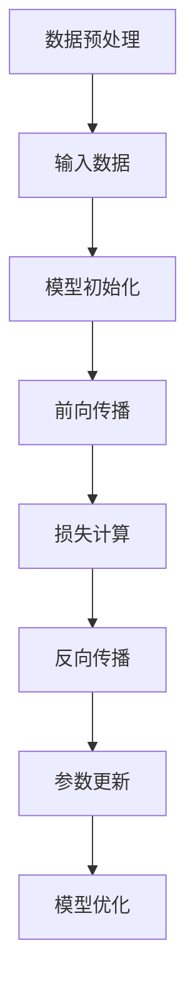
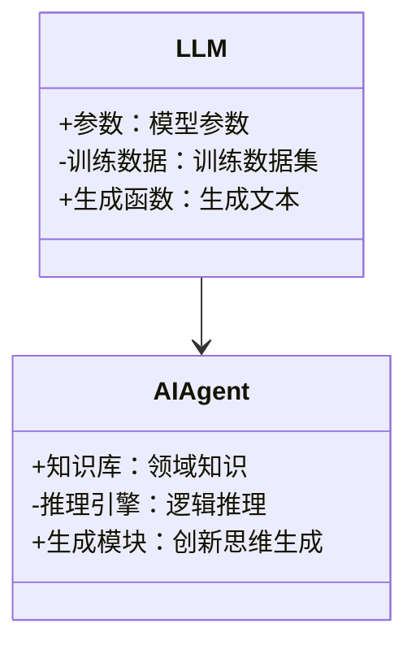
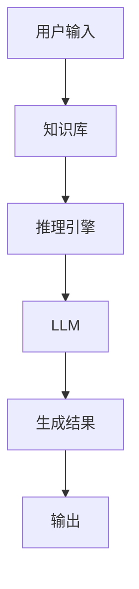
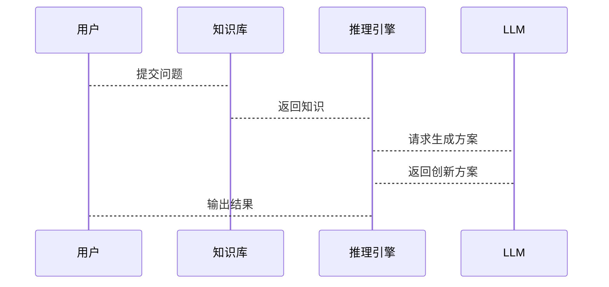

                 


---

# LLM驱动的AI Agent创新思维发散技术

> 关键词：大语言模型, AI Agent, 创新思维, 发散思维, 生成式AI, 知识图谱

> 摘要：本文深入探讨了如何利用大语言模型（LLM）驱动AI Agent的创新思维和发散性思考能力。通过分析LLM的内部机制、创新思维模型的构建、LLM与AI Agent的结合、系统架构设计、项目实战以及未来展望，本文为读者提供了从理论到实践的全面指导，帮助开发者和技术爱好者更好地理解和应用这一前沿技术。

---

# 第一部分: LLM驱动的AI Agent创新思维发散技术概述

# 第1章: LLM与AI Agent概述

## 1.1 LLM的定义与特点

### 1.1.1 大语言模型的定义

大语言模型（LLM, Large Language Model）是指基于大量数据训练的深度学习模型，能够理解和生成人类语言。LLM的核心目标是通过海量数据的学习，掌握语言的结构和语义，从而实现自然语言处理任务，如文本生成、翻译、问答等。

### 1.1.2 LLM的核心特点

- **大规模训练数据**：LLM通常使用数百万甚至数十亿的文本数据进行训练，以捕获语言的多样性和复杂性。
- **深度神经网络结构**：大多数LLM基于Transformer架构，通过自注意力机制（Self-Attention）处理长文本。
- **生成式能力**：LLM能够根据输入生成连贯且合理的文本输出。
- **多任务能力**：通过微调（Fine-tuning）或提示工程（Prompt Engineering），LLM可以适应多种NLP任务。

### 1.1.3 LLM与传统NLP模型的区别

与传统NLP模型相比，LLM具有以下优势：
- **通用性**：LLM能够处理多种NLP任务，而传统模型通常专注于单一任务。
- **上下文理解**：LLM通过自注意力机制能够更好地捕捉上下文信息，生成更合理的文本。
- **可解释性**：尽管LLM在某些方面仍然存在可解释性问题，但其生成能力远超传统模型。

## 1.2 AI Agent的基本概念

### 1.2.1 AI Agent的定义

AI Agent（人工智能代理）是指能够感知环境、自主决策并执行任务的智能体。AI Agent的目标是通过与环境交互，完成特定任务，如信息检索、决策优化、自动化操作等。

### 1.2.2 AI Agent的核心功能

- **感知环境**：通过传感器或数据输入，获取环境信息。
- **决策与推理**：基于感知的信息，进行分析和推理，制定决策。
- **执行操作**：根据决策结果，执行具体的操作或任务。

### 1.2.3 AI Agent的分类与应用场景

AI Agent可以根据功能、智能水平和应用场景进行分类：
- **基于规则的AI Agent**：通过预定义的规则进行决策，适用于简单任务。
- **基于知识的AI Agent**：利用知识库进行推理，适用于复杂任务。
- **基于学习的AI Agent**：通过机器学习模型进行决策，适用于数据驱动的任务。

## 1.3 LLM驱动的AI Agent创新思维

### 1.3.1 创新思维的定义与特征

创新思维是指通过打破常规、突破传统思维模式，提出新的想法、解决方案或方法。创新思维的核心在于“发散性思考”和“创造性解决问题”。

### 1.3.2 LLM如何驱动创新思维

LLM通过以下方式驱动AI Agent的创新思维：
- **生成多样性**：LLM能够生成多种不同的文本输出，为AI Agent提供多个创新思路。
- **上下文理解**：LLM能够理解上下文关系，帮助AI Agent更好地分析问题。
- **知识整合**：LLM可以通过知识图谱或其他外部知识库，整合多领域知识，提出创新解决方案。

### 1.3.3 AI Agent在创新思维中的角色

AI Agent在创新思维中的角色可以是：
- **辅助者**：帮助人类提出创新想法。
- **独立思考者**：在没有人类干预的情况下，自主生成创新方案。
- **协作者**：与人类或其他AI Agent协作，共同完成创新任务。

## 1.4 本章小结

本章介绍了LLM和AI Agent的基本概念，并重点探讨了LLM如何驱动AI Agent的创新思维。通过理解LLM和AI Agent的核心特点，我们可以更好地利用这一技术组合来实现创新性任务。

---

# 第二部分: LLM的内部机制与创新思维模型

# 第2章: LLM的内部机制

## 2.1 LLM的训练方法

### 2.1.1 监督学习与无监督学习

- **监督学习**：基于标记的训练数据，学习模型的参数。
- **无监督学习**：基于未标记数据，通过自监督学习目标（如预测下一个词）来训练模型。

### 2.1.2 增强学习与强化学习

- **增强学习**：通过奖励机制，优化模型的决策过程。
- **强化学习**：通过与环境交互，学习最优策略。

### 2.1.3 LLM的训练流程

训练LLM的流程如下：
1. **数据预处理**：清洗、分词、格式化。
2. **模型初始化**：定义模型架构，初始化参数。
3. **前向传播**：生成预测输出。
4. **损失计算**：计算预测与真实之间的差异。
5. **反向传播**：通过梯度下降优化模型参数。



### 2.1.4 LLM的优化策略

- **学习率调整**：如Adam优化器。
- **正则化**：防止过拟合。
- **分布式训练**：提高训练效率。

## 2.2 LLM的模型结构

### 2.2.1 Transformer模型的基本结构

Transformer模型由编码器和解码器组成，编码器负责将输入序列编码为语义向量，解码器负责根据编码结果生成输出序列。

### 2.2.2 注意力机制的数学模型

注意力机制的数学公式如下：

$$
\text{Attention}(Q, K, V) = \text{softmax}(\frac{QK^T}{\sqrt{d_k}})V
$$

其中：
- $Q$、$K$、$V$分别为查询、键、值向量。
- $d_k$为键的维度。

### 2.2.3 段落级别的创新思维建模

在段落级别，创新思维建模需要考虑多个句子之间的关系，通过全局注意力机制来捕捉上下文信息。

## 2.3 LLM的推理过程

### 2.3.1 解码过程中的创新思维生成

解码过程通过生成式方法，逐步生成创新性的文本输出。生成过程可以采用贪心算法或随机采样方法。

### 2.3.2 创新思维的评估指标

创新思维的评估可以从以下方面考虑：
- **多样性**：生成结果的多样性。
- **合理性**：生成结果的逻辑性。
- **创造性**：生成结果的新颖性。

## 2.4 本章小结

本章详细介绍了LLM的训练方法和模型结构，并探讨了创新思维建模的数学模型。通过理解这些内容，我们可以更好地设计和优化LLM驱动的AI Agent。

---

# 第三部分: AI Agent的创新思维模型

# 第3章: 创新思维模型的构建

## 3.1 创新思维模型的结构

### 3.1.1 模型的输入与输出

- **输入**：问题描述、背景知识。
- **输出**：创新性的解决方案。

### 3.1.2 创新思维的中间过程

- **问题分析**：理解问题的关键点。
- **发散性思考**：生成多个可能的解决方案。
- **优化与选择**：评估并选择最优方案。

### 3.1.3 模型的训练与优化

- **训练数据**：包含多种创新案例的数据集。
- **优化目标**：最大化生成结果的创新性。

## 3.2 AI Agent的创新思维模型

### 3.2.1 创新思维模型的核心要素

- **知识库**：存储领域知识。
- **推理引擎**：基于知识进行推理。
- **生成模块**：生成创新性的文本输出。

### 3.2.2 创新思维模型的实现步骤

1. **知识整合**：将多领域的知识整合到知识图谱中。
2. **问题分析**：通过自然语言处理技术，理解用户的问题。
3. **发散性思考**：生成多个可能的解决方案。
4. **优化选择**：评估生成的方案，选择最优解。

## 3.3 本章小结

本章重点介绍了创新思维模型的构建过程，包括模型结构、核心要素和实现步骤。通过这一模型，AI Agent能够更好地实现创新性任务。

---

# 第四部分: LLM与AI Agent的结合

# 第4章: LLM与AI Agent的结合

## 4.1 LLM驱动AI Agent的创新思维

### 4.1.1 LLM作为知识库

LLM可以作为AI Agent的知识库，存储丰富的语言知识和领域知识。

### 4.1.2 LLM作为推理引擎

通过LLM的生成能力，AI Agent可以进行逻辑推理和创造性思考。

### 4.1.3 LLM作为决策支持

AI Agent可以通过LLM生成的多种方案，进行决策优化。

## 4.2 LLM驱动AI Agent的创新应用

### 4.2.1 创意生成

- **案例分析**：通过LLM生成广告文案、文学创作等。
- **技术实现**：结合任务场景，设计生成策略。

### 4.2.2 问题解决

- **案例分析**：通过LLM辅助诊断、故障排除。
- **技术实现**：结合领域知识图谱，优化生成结果。

## 4.3 本章小结

本章探讨了LLM如何驱动AI Agent的创新思维，并通过具体案例展示了其应用价值。

---

# 第五部分: 系统架构设计

# 第5章: 系统架构设计

## 5.1 问题场景介绍

### 5.1.1 任务描述

本系统旨在设计一个基于LLM的AI Agent，实现创新性任务的自动执行。

### 5.1.2 项目介绍

本项目包括以下几个模块：
- **知识库模块**：存储领域知识。
- **推理引擎模块**：基于知识进行推理。
- **生成模块**：生成创新性的文本输出。

## 5.2 系统功能设计

### 5.2.1 领域模型



### 5.2.2 系统架构



### 5.2.3 系统接口设计

- **输入接口**：接收用户输入的问题。
- **输出接口**：输出创新性的解决方案。
- **知识库接口**：与知识库进行交互。

### 5.2.4 系统交互流程



## 5.3 本章小结

本章通过系统架构设计，详细描述了基于LLM的AI Agent的实现方案，包括系统模块、架构设计和交互流程。

---

# 第六部分: 项目实战

# 第6章: 项目实战

## 6.1 环境安装

### 6.1.1 安装Python

```bash
python --version
```

### 6.1.2 安装依赖库

```bash
pip install torch transformers
```

## 6.2 系统核心实现

### 6.2.1 知识库模块

```python
class KnowledgeBase:
    def __init__(self, knowledge):
        self.knowledge = knowledge
```

### 6.2.2 推理引擎模块

```python
class ReasoningEngine:
    def __init__(self, knowledge_base):
        self.knowledge_base = knowledge_base
```

### 6.2.3 LLM模块

```python
class LLM:
    def __init__(self, model_name):
        self.model = AutoModelForCausalLM.from_pretrained(model_name)
```

## 6.3 代码实现与解读

### 6.3.1 知识库的构建

```python
knowledge = {
    "question": "如何提高创新能力？",
    "answer": "多阅读、多思考、多实践"
}
knowledge_base = KnowledgeBase(knowledge)
```

### 6.3.2 推理引擎的实现

```python
reasoning_engine = ReasoningEngine(knowledge_base)
result = reasoning_engine.reasoning("如何提高创新能力？")
```

### 6.3.3 LLM的调用

```python
llm = LLM("gpt2")
response = llm.generate("如何提高创新能力？")
print(response)
```

## 6.4 案例分析与详细讲解

### 6.4.1 任务管理场景

```python
# 示例代码
def generate_ideas(task):
    knowledge_base = KnowledgeBase(knowledge)
    reasoning_engine = ReasoningEngine(knowledge_base)
    llm = LLM("gpt2")
    response = llm.generate(task)
    return response
```

### 6.4.2 创意生成场景

```python
# 示例代码
def creative_writing(prompt):
    llm = LLM("gpt2")
    response = llm.generate(prompt)
    return response
```

## 6.5 项目小结

本章通过具体的项目实战，展示了如何基于LLM实现AI Agent的创新思维功能，包括环境安装、模块实现和案例分析。

---

# 第七部分: 总结与展望

# 第7章: 总结与展望

## 7.1 本章总结

本文系统地探讨了LLM驱动的AI Agent创新思维发散技术，从理论到实践，详细介绍了LLM的内部机制、创新思维模型的构建、系统架构设计以及项目实战。

## 7.2 未来展望

未来的研究方向包括：
- **更复杂的模型结构**：如多模态模型。
- **更高效的训练方法**：如分布式训练优化。
- **更智能的推理引擎**：如动态知识图谱。

## 7.3 最佳实践Tips

- **选择合适的模型**：根据任务需求选择合适的LLM。
- **优化训练数据**：通过数据增强技术提高模型性能。
- **结合领域知识**：通过知识图谱提升模型的推理能力。

## 7.4 小结

通过本文的学习，读者可以全面掌握LLM驱动的AI Agent创新思维发散技术，并将其应用于实际项目中。

---

# 作者：AI天才研究院/AI Genius Institute & 禅与计算机程序设计艺术 /Zen And The Art of Computer Programming

---

**感谢您的耐心阅读！**

