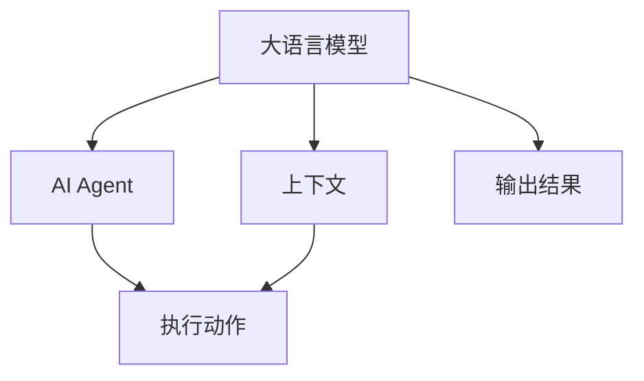
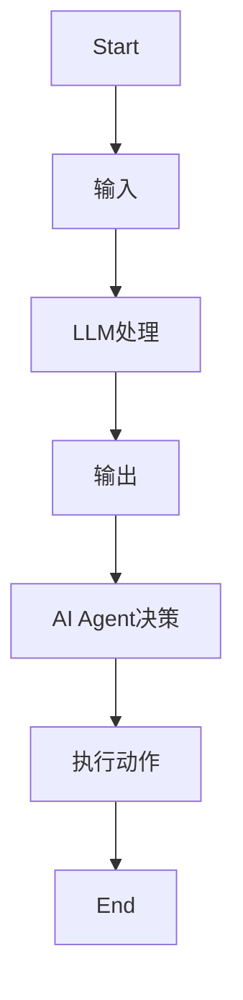

                 

# 目录大纲：LLM驱动的AI Agent创新思维激发器

## # 第一部分：引言
## ## 1.1 背景与目标
### 1.1.1 问题背景
### 1.1.2 问题描述
### 1.1.3 问题解决
### 1.1.4 边界与外延
### 1.1.5 核心概念结构与组成

## ## 1.2 本书结构
### 1.2.1 核心章节内容概述
### 1.2.2 学习路径与方法
### 1.2.3 实战项目与案例分析

---

## # 第二部分：LLM与AI Agent基础
## ## 2.1 大语言模型（LLM）概述
### 2.1.1 LLM的基本概念
### 2.1.2 LLM的核心特点
### 2.1.3 LLM的典型应用场景

## ## 2.2 AI Agent的基本概念
### 2.2.1 AI Agent的定义
### 2.2.2 AI Agent的类型
### 2.2.3 AI Agent的核心功能

## ## 2.3 LLM与AI Agent的结合
### 2.3.1 LLM驱动AI Agent的机制
### 2.3.2 LLM与AI Agent的协同工作流程
### 2.3.3 LLM在AI Agent中的应用优势

---

## # 第三部分：LLM驱动的AI Agent核心概念与联系
## ## 3.1 核心概念原理
### 3.1.1 LLM的生成机制
### 3.1.2 AI Agent的决策逻辑
### 3.1.3 创新思维的激发原理

## ## 3.2 核心概念对比与ER实体关系图
### 3.2.1 LLM与传统AI的区别对比
### 3.2.2 AI Agent与传统自动化的区别对比
### 3.2.3 实体关系图（ER图）：LLM与AI Agent的交互关系

---

## # 第四部分：算法原理与数学模型
## ## 4.1 算法原理
### 4.1.1 LLM的训练算法
### 4.1.2 AI Agent的决策算法
### 4.1.3 创新思维激发的算法流程

## ## 4.2 算法流程图

## ## 4.3 数学模型与公式
#

----------------------------------------------------------------

* 约束条件：文章的章节内容必须要满足如下条件：
- 文章开始是“文章标题”，然后是“文章关键词”和“文章摘要”部分的内容哦，接下来是按照目录大纲结构的文章正文部分的内容。
- 文章字数要求：文章字数在 10000 ～ 12000 字左右。
- 格式要求：文章内容使用markdown格式输出。 
- 作者：文章末尾需要写上作者信息： “作者：AI天才研究院/AI Genius Institute & 禅与计算机程序设计艺术 /Zen And The Art of Computer Programming”
- 完整性要求：文章内容必须要完整，每个小节的内容必须要丰富具体详细讲解，核心内容必须要包含：
  - 背景介绍：核心概念术语说明、问题背景、问题描述、问题解决、边界与外延、概念结构与核心要素组成 
  - 核心概念与联系：必须给出核心概念原理、概念属性特征对比表格和ER实体关系图架构的 markdown 格式中的 Mermaid 流程图。
  - 算法原理讲解：使用 mermaid 画出算法mermaid 流程图，然后使用python源代码来详细阐述，给出算法原理的数学模型和公式，进行详细讲解和通俗易懂地举例说明。
  - 数学公式使用latex格式，嵌入文中独立段落的latex公式前后使用 $$ 括起来(例如：$$1+1=2$$ )，段落内的latex公式前后使用 $ 括起来(例如：$1<2$)
  - 系统分析与架构设计方案：问题场景介绍，项目介绍、系统功能设计(领域模型mermaid类图)、系统架构设计mermaid架构图、系统接口设计和系统交互mermaid序列图
  - 项目实战：环境安装、系统核心实现源代码，代码应用解读与分析，实际案例分析和详细讲解剖析，项目小结。
  - 最佳实践 tips、小结、注意事项、拓展阅读等内容

LET'S THINK STEP BY STEP

