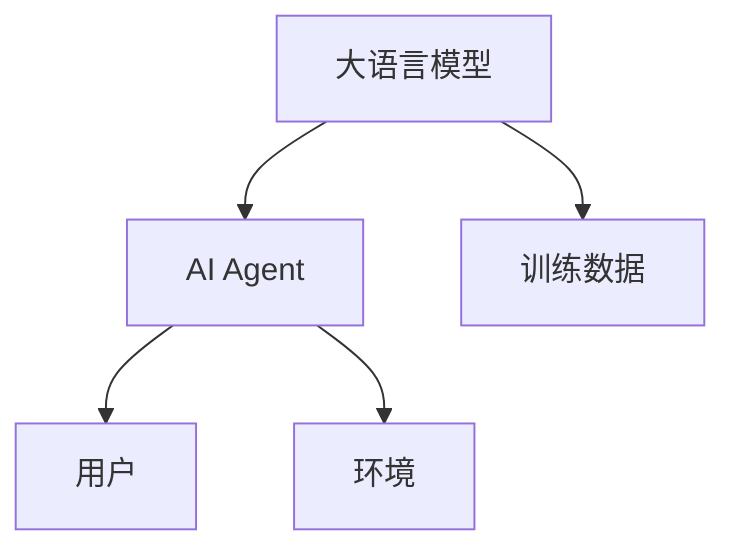
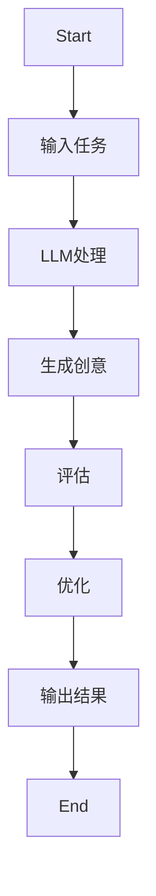

                 


# LLM驱动的AI Agent创新思维训练方法

> 关键词：大语言模型、AI Agent、创新思维、训练方法、人工智能

> 摘要：本文深入探讨了如何利用大语言模型（LLM）驱动AI Agent进行创新思维训练的方法。通过分析LLM与AI Agent的结合，揭示其在创新思维训练中的独特优势，并详细讲解了算法原理、系统架构设计、项目实战等内容，为读者提供全面的理论与实践指导。

---

# 第一部分: LLM驱动的AI Agent创新思维训练背景与基础

## 第1章: LLM与AI Agent概述

### 1.1 LLM驱动的AI Agent概念

#### 1.1.1 大语言模型（LLM）的基本概念

大语言模型（Large Language Model, LLM）是指基于深度学习技术构建的大型神经网络模型，能够理解和生成人类语言。LLM的核心目标是通过大量训练数据，学习语言的统计规律，从而实现自然语言处理（NLP）任务，如文本生成、问答系统、机器翻译等。

LLM的优势在于其规模和通用性。通过训练海量文本数据，LLM能够捕捉语言的复杂模式，并生成与人类语言高度相似的文本输出。目前，主流的LLM包括GPT系列（如GPT-3、GPT-4）、BERT、PaLM等。

#### 1.1.2 AI Agent的核心定义与特征

AI Agent（人工智能代理）是指能够感知环境并采取行动以实现目标的智能体。AI Agent可以是软件程序、机器人或其他智能系统，其核心特征包括：

1. **自主性**：能够在没有外部干预的情况下独立运行。
2. **反应性**：能够实时感知环境并做出反应。
3. **目标导向**：具有明确的目标，并采取行动以实现这些目标。
4. **学习能力**：能够通过经验改进自己的行为。

#### 1.1.3 LLM驱动AI Agent的独特优势

LLM驱动的AI Agent结合了大语言模型的强大语言理解和生成能力，以及AI Agent的自主性和目标导向性。这种结合使得AI Agent能够：

1. **理解复杂语言**：通过LLM，AI Agent能够理解和处理复杂的自然语言输入。
2. **生成创造性输出**：LLM的生成能力使AI Agent能够提出创新性的解决方案。
3. **动态适应**：AI Agent可以通过LLM不断优化其行为，适应新的任务和环境。

### 1.2 创新思维训练的必要性

#### 1.2.1 创新思维的定义与重要性

创新思维是指打破常规思维模式，提出新颖、独特的解决方案的能力。在当今快速变化的技术和社会环境中，创新思维是推动进步的核心动力。

创新思维的重要性体现在以下几个方面：

1. **解决问题**：创新思维能够帮助人们突破传统思维的限制，找到更优的解决方案。
2. **推动技术进步**：创新是技术发展的源泉，创新思维是技术进步的核心动力。
3. **应对复杂挑战**：在复杂问题面前，创新思维能够提供新的视角和方法。

#### 1.2.2 LLM如何赋能创新思维

LLM通过其强大的语言生成和理解能力，为创新思维提供了新的工具和方法。例如：

1. **启发式思考**：LLM可以生成多个可能的解决方案，启发人类思考。
2. **快速验证**：通过LLM快速生成和验证创意，缩短创新周期。
3. **跨领域结合**：LLM可以将不同领域的知识结合起来，产生新的创新点。

#### 1.2.3 AI Agent在创新思维训练中的角色

AI Agent作为创新思维训练的工具，其角色可以是：

1. **辅助者**：帮助人类生成创意、验证想法。
2. **协作者**：与人类共同完成复杂的创新任务。
3. **评估者**：对创新方案进行评估和优化。

### 1.3 本章小结

本章介绍了LLM和AI Agent的基本概念，探讨了它们结合后在创新思维训练中的独特优势。通过理解LLM和AI Agent的核心特征，我们为后续的创新思维训练方法奠定了基础。

---

## 第2章: LLM驱动AI Agent的核心概念与联系

### 2.1 LLM驱动AI Agent的核心原理

#### 2.1.1 LLM的训练机制

大语言模型的训练基于监督学习和无监督学习的结合。模型通过大量无标签文本数据进行预训练，学习语言的分布规律。在预训练阶段，模型通常采用自监督学习任务，如预测下一个词（Next Sentence Prediction, NSP）或掩码词任务（Masked Language Model, MLM）。

#### 2.1.2 AI Agent的推理机制

AI Agent的推理机制基于LLM生成的语言模型，结合任务目标，通过上下文理解和目标导向的推理，生成相应的行动方案。

#### 2.1.3 LLM与AI Agent的结合方式

LLM与AI Agent的结合可以通过以下方式实现：

1. **直接调用**：AI Agent直接使用LLM作为其语言生成模块。
2. **反馈优化**：AI Agent通过LLM生成的反馈不断优化其行为。
3. **知识增强**：AI Agent利用LLM的知识库增强其推理能力。

### 2.2 核心概念对比分析

#### 2.2.1 LLM与传统NLP模型的对比

| 特性               | LLM                          | 传统NLP模型               |
|--------------------|----------------------------|---------------------------|
| 模型规模           | 极大（如GPT-3有175B参数）   | 较小（如BERT-base有110M参数） |
| 任务通用性         | 高度通用，适用于多种任务     | 通常针对特定任务设计       |
| 预训练数据量       | 巨大，涵盖广泛领域            | 较小，可能仅针对特定领域    |
| 训练方式           | 自监督学习为主                | 监督学习为主                |

#### 2.2.2 AI Agent与传统自动化的对比

| 特性               | AI Agent                     | 传统自动化                |
|--------------------|----------------------------|---------------------------|
| 自主性             | 高，能够自主决策             | 低，依赖预设规则           |
| 反应性             | 高，能够实时感知环境         | 低，通常基于固定输入       |
| 学习能力           | 强，能够通过经验优化行为      | 无或弱，通常不学习         |

#### 2.2.3 创新思维训练的差异性与共性

创新思维训练的共性包括：目标性、创造性、动态性。差异性体现在不同领域、不同任务中的具体方法和侧重点。

### 2.3 实体关系图与流程图

#### 2.3.1 LLM驱动AI Agent的实体关系图



#### 2.3.2 创新思维训练的流程图



### 2.4 本章小结

本章通过对比分析，详细阐述了LLM驱动AI Agent的核心原理及其与传统技术的区别。实体关系图和流程图帮助读者更好地理解各部分之间的关系。

---

## 第3章: LLM驱动AI Agent的算法原理

### 3.1 LLM的训练算法

#### 3.1.1 基于概率的语言模型

语言模型的目标是计算给定文本的概率分布。对于一个给定的序列$w_1, w_2, ..., w_n$，其概率可以表示为：

$$ P(w_1, w_2, ..., w_n) = \prod_{i=1}^{n} P(w_i | w_1, ..., w_{i-1}) $$

其中，$P(w_i | w_1, ..., w_{i-1})$是条件概率，表示在前面的词已经生成的情况下，生成第$i$个词的概率。

#### 3.1.2 最大似然估计

最大似然估计（Maximum Likelihood Estimation, MLE）是训练语言模型的核心方法。其目标是找到能够使训练数据概率最大的模型参数$\theta$：

$$ \theta = \arg\max_{\theta} \prod_{i=1}^{N} P_{\theta}(x_i) $$

其中，$x_i$是训练数据中的一个样本。

#### 3.1.3 优化目标函数

在实际训练中，通常采用对数似然函数来简化计算：

$$ \mathcal{L}(\theta) = \log P_{\theta}(x) = \sum_{i=1}^{N} \log P_{\theta}(x_i) $$

为了进一步优化，通常使用交叉熵损失函数：

$$ \text{损失函数} = -\frac{1}{N} \sum_{i=1}^{N} \log P_{\theta}(x_i) $$

### 3.2 AI Agent的推理算法

#### 3.2.1 基于LLM的生成式推理

AI Agent通过LLM生成创意的过程可以看作是一种生成式推理。模型根据输入的上下文，生成符合任务目标的文本输出。例如，假设输入的任务是“设计一个新的智能家居系统”，模型会生成相关的解决方案。

#### 3.2.2 基于强化学习的优化

为了进一步优化AI Agent的推理能力，可以采用强化学习（Reinforcement Learning, RL）方法。通过定义合适的奖励函数，模型能够学习到更优的策略。例如，奖励函数可以基于创意的新颖性和可行性来设计。

#### 3.2.3 基于反馈的迭代优化

AI Agent可以通过与用户的互动，不断优化其生成的创意。用户的反馈被用来调整模型的生成策略，从而提高创新思维训练的效果。

### 3.3 本章小结

本章详细介绍了LLM驱动AI Agent的算法原理，包括训练算法和推理算法。通过数学公式和算法流程图，帮助读者更好地理解模型的工作机制。

---

## 第4章: LLM驱动AI Agent的系统架构设计

### 4.1 项目介绍

本项目旨在开发一个基于LLM的AI Agent系统，用于创新思维训练。系统的核心目标是通过LLM生成创意，并通过AI Agent进行优化和实施。

### 4.2 系统功能设计

系统主要包括以下几个功能模块：

1. **输入模块**：接收用户的任务输入。
2. **LLM生成模块**：利用LLM生成创意。
3. **评估模块**：对生成的创意进行评估。
4. **优化模块**：根据评估结果优化创意。
5. **输出模块**：输出最终的创意方案。

### 4.3 系统架构设计

系统架构采用分层设计，包括数据层、算法层和应用层。

#### 4.3.1 数据层

数据层负责存储和管理训练数据、用户输入数据以及生成的创意数据。

#### 4.3.2 算法层

算法层包括LLM模型和AI Agent的推理算法。

#### 4.3.3 应用层

应用层提供用户接口，实现与用户的交互。

### 4.4 本章小结

本章通过系统架构设计，明确了各模块的功能和相互关系，为后续的实现奠定了基础。

---

## 第5章: 项目实战

### 5.1 环境安装

项目实战需要以下环境：

1. Python 3.8+
2. PyTorch或TensorFlow
3. Hugging Face Transformers库

安装命令：

```bash
pip install torch transformers
```

### 5.2 核心代码实现

#### 5.2.1 LLM模型加载

```python
from transformers import GPT2LMHeadModel, GPT2Tokenizer

model_name = "gpt2"
tokenizer = GPT2Tokenizer.from_pretrained(model_name)
model = GPT2LMHeadModel.from_pretrained(model_name)
```

#### 5.2.2 AI Agent推理

```python
def generate创意(prompt):
    inputs = tokenizer.encode(prompt, return_tensors='pt')
    outputs = model.generate(inputs, max_length=50, temperature=0.7, top_p=0.9)
    return tokenizer.decode(outputs[0], skip_special_tokens=True)
```

### 5.3 案例分析

以“设计一个新的智能家居系统”为例，AI Agent通过LLM生成创意，并优化生成的方案。

---

## 第6章: 总结与展望

### 6.1 本章小结

本文详细探讨了LLM驱动AI Agent的创新思维训练方法，从理论到实践，为读者提供了全面的指导。

### 6.2 未来展望

未来，随着LLM和AI Agent技术的不断发展，创新思维训练将更加智能化和高效。可能的发展方向包括：

1. **更强大的LLM模型**：如GPT-5等更大规模的模型。
2. **多模态AI Agent**：结合视觉、听觉等多种模态信息，提升创新能力。
3. **人机协作优化**：进一步优化人机协作流程，提升创新效率。

---

# 附录

## 附录A: 常用工具与库

1. Hugging Face Transformers：https://huggingface.co/transformers/
2. OpenAI API：https://openai.com/

## 附录B: 参考文献

1. Brown, T., et al. "Language models have exponentially growing knowledge through time." arXiv preprint arXiv:1906.08369 (2019).
2. Vaswani, A., et al. "Attention is all you need." Advances in neural information processing systems. 2017.

---

# 作者

作者：AI天才研究院/AI Genius Institute & 禅与计算机程序设计艺术 /Zen And The Art of Computer Programming

