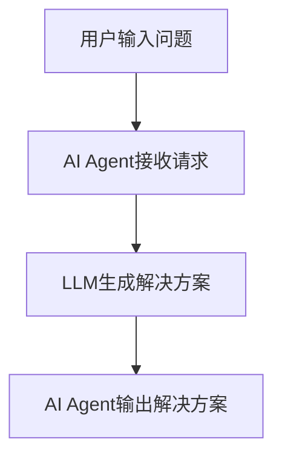
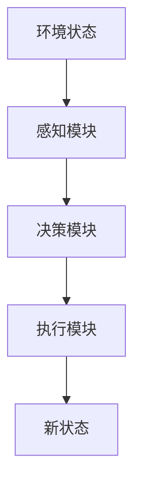
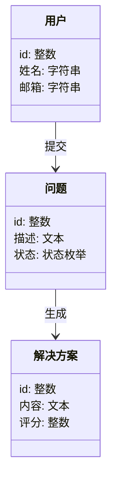
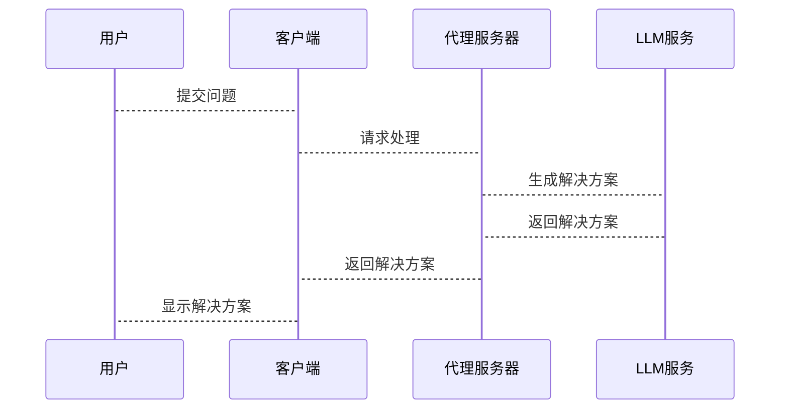

                 


# LLM驱动的AI Agent创新问题解决技术

> **关键词**：LLM，AI Agent，生成式AI，问题解决，人工智能，创新技术

> **摘要**：本文探讨了利用大语言模型（LLM）驱动的AI Agent在创新性问题解决中的技术原理和应用。通过详细分析核心概念、算法原理、系统架构和项目实战，本文为读者提供了全面的技术视角，展示了如何通过LLM驱动的AI Agent实现高效、创新的问题解决方案。

---

## 第1章 LLM与AI Agent概述

### 1.1 问题背景与问题描述

在传统的人工智能领域，AI系统通常依赖于预定义的规则和数据进行推理和决策。然而，面对复杂多变的创新性问题时，这些系统往往显得力不从心。大语言模型（LLM）的出现，为AI技术带来了革命性的变化。LLM不仅能够处理大量文本数据，还能通过生成式的方法提供创造性解决方案。结合AI Agent的自主决策能力，LLM驱动的AI Agent能够在复杂的环境中动态解决问题，展现了强大的创新潜力。

### 1.2 LLM与AI Agent的核心概念

#### 1.2.1 LLM的定义与技术特点

大语言模型（LLM）是指经过大量文本数据训练的深度学习模型，如GPT-3、GPT-4等。LLM的核心特点包括：

- **生成式能力**：能够生成自然语言文本，模拟人类对话和创作。
- **上下文理解**：通过上下文理解问题，提供相关回答。
- **可扩展性**：适用于多种任务，如翻译、问答、代码生成等。

#### 1.2.2 AI Agent的定义与功能模块

AI Agent（智能代理）是一种能够感知环境、自主决策并执行任务的智能系统。其主要功能模块包括：

- **感知模块**：通过传感器或API获取环境信息。
- **决策模块**：基于感知信息做出决策。
- **执行模块**：通过执行器完成任务。

#### 1.2.3 LLM与AI Agent的协同工作原理

LLM作为AI Agent的核心驱动力，通过提供生成式解决方案，增强AI Agent的决策能力。两者结合，使AI Agent能够动态适应复杂环境，提供创新性解决方案。

### 1.3 本章小结

本章介绍了LLM和AI Agent的核心概念及其协同工作原理，为后续章节奠定了基础。

---

## 第2章 LLM与AI Agent的核心概念与联系

### 2.1 核心概念原理

#### 2.1.1 LLM的生成式AI原理

生成式AI通过概率模型生成文本，模型通过优化损失函数（如交叉熵损失）来预测下一个字符的概率分布。

$$ \text{损失函数} = -\sum_{i=1}^{n} \log P(w_i | w_{<i}) $$

其中，\( w_i \) 表示第i个词，\( P(w_i | w_{<i}) \) 是在前面词的条件下生成当前词的概率。

#### 2.1.2 AI Agent的自主决策机制

AI Agent通过状态、动作和奖励的循环不断优化决策策略。强化学习（RL）是其核心算法之一：

$$ R = \sum_{t=0}^{T} r_t(s_t, a_t) $$

其中，\( R \) 是总奖励，\( r_t \) 是第t步的奖励，\( s_t \) 是状态，\( a_t \) 是动作。

---

### 2.2 核心概念属性特征对比

| 属性        | LLM                     | AI Agent                |
|-------------|-------------------------|--------------------------|
| 输入        | 文本数据                | 环境状态和用户请求        |
| 输出        | 文本生成                | 动作或解决方案            |
| 学习方式    | 监督学习                | 强化学习或模仿学习        |
| 应用场景    | 生成内容、问答          | 自主决策、执行任务        |

---

### 2.3 ER实体关系图

```mermaid
er
  actor: 用户
  agent: AI Agent
  llm: 大语言模型
  problem: 创新问题
  solution: 解决方案
  actor --> agent: 请求解决问题
  agent --> llm: 调用LLM生成解决方案
  llm --> solution: 输出解决方案
  agent --> problem: 分析问题
```

### 2.4 本章小结

本章通过对比分析和实体关系图，展示了LLM与AI Agent之间的协同关系及其在创新问题解决中的潜在应用。

---

## 第3章 LLM驱动的AI Agent算法原理

### 3.1 LLM与AI Agent的算法流程

#### 3.1.1 LLM的生成式算法流程



---

#### 3.1.2 AI Agent的决策算法流程



---

### 3.2 LLM驱动AI Agent的数学模型与公式

#### 3.2.1 LLM的损失函数

$$ \text{损失函数} = -\sum_{i=1}^{n} \log P(w_i | w_{<i}) $$

#### 3.2.2 AI Agent的强化学习目标函数

$$ R = \sum_{t=0}^{T} r_t(s_t, a_t) $$

---

### 3.3 LLM与AI Agent的协同算法

结合生成式AI和强化学习，LLM驱动的AI Agent通过以下步骤解决问题：

1. **感知环境**：AI Agent通过传感器或API获取环境信息。
2. **生成解决方案**：调用LLM生成初步解决方案。
3. **优化决策**：通过强化学习优化解决方案，获得最大奖励。
4. **执行任务**：AI Agent根据优化后的解决方案执行任务。

---

### 3.4 本章小结

本章详细讲解了LLM驱动AI Agent的算法流程和数学模型，展示了其在创新问题解决中的技术优势。

---

## 第4章 系统分析与架构设计方案

### 4.1 问题场景介绍

假设我们正在开发一个智能客服系统，用户通过文字描述问题，AI Agent调用LLM生成解决方案。

---

### 4.2 系统功能设计

#### 4.2.1 领域模型设计



---

#### 4.2.2 系统架构设计


---

#### 4.2.3 接口设计

- **输入接口**：用户请求（文本）
- **输出接口**：解决方案（文本）

---

#### 4.2.4 交互流程



---

### 4.3 本章小结

本章通过系统设计展示了LLM驱动AI Agent在实际应用中的架构和交互流程，为后续实现奠定了基础。

---

## 第5章 项目实战

### 5.1 环境安装与配置

安装Python和必要的库：

```bash
pip install python-gpt-3.5
pip install requests
pip install beautifulsoup4
```

---

### 5.2 核心代码实现

#### 5.2.1 LLM调用代码

```python
import requests

def call_llm(prompt):
    url = "https://api.example.com/gpt"
    headers = {"Authorization": "Bearer API_KEY"}
    data = {"prompt": prompt}
    response = requests.post(url, headers=headers, json=data)
    return response.json()['response']
```

---

#### 5.2.2 AI Agent实现代码

```python
class AIAssistant:
    def __init__(self, llm_api_key):
        self.llm_api_key = llm_api_key

    def solve_problem(self, problem):
        prompt = f"请帮我解决这个问题：{problem}"
        response = call_llm(prompt)
        return response
```

---

### 5.3 代码解读与分析

- **LLM调用代码**：通过API调用LLM生成解决方案。
- **AI Agent实现代码**：封装了与LLM交互的逻辑，简化了API调用过程。

---

### 5.4 案例分析与解读

假设用户提出问题：“如何优化公司的客服流程？” AI Agent调用LLM生成解决方案：

```python
problem = "如何优化公司的客服流程？"
assistant = AIAssistant("your_api_key")
solution = assistant.solve_problem(problem)
print(solution)
```

输出示例：

```
建议引入AI客服系统，优化流程如下：
1. 实时响应用户请求。
2. 自动生成常见问题解答。
3. 提供多语言支持。
4. 整合CRM系统。
```

---

### 5.5 本章小结

本章通过实际项目展示了如何利用LLM驱动的AI Agent解决问题，帮助读者理解理论在实践中的应用。

---

## 第6章 最佳实践与注意事项

### 6.1 最佳实践

- **模型选择**：根据任务需求选择合适的LLM模型。
- **数据质量**：确保输入数据的准确性和相关性。
- **异常处理**：设计完善的错误处理机制。

---

### 6.2 小结

总结本章内容，强调在实际应用中需要注意的关键点。

---

### 6.3 注意事项

- **性能优化**：减少不必要的API调用。
- **隐私保护**：确保数据安全和隐私合规。
- **用户体验**：优化交互流程，提升用户满意度。

---

### 6.4 拓展阅读

推荐阅读以下资源：

- GPT系列论文
- 《生成式人工智能：原理与应用》
- 开源AI框架文档

---

## 第7章 未来展望

### 7.1 技术发展趋势

- **多模态模型**：结合视觉、听觉等多模态信息，提升问题解决能力。
- **实时推理**：优化模型推理速度，提升响应效率。
- **自适应学习**：增强模型的自适应能力，应对更多复杂场景。

---

### 7.2 应用场景扩展

- **企业智能化**：优化企业运营流程。
- **教育智能化**：个性化教学方案。
- **医疗智能化**：辅助诊断与治疗方案。

---

## 作者

**作者：AI天才研究院/AI Genius Institute & 禅与计算机程序设计艺术 /Zen And The Art of Computer Programming**

---

**感谢您的阅读！希望本文对您理解LLM驱动的AI Agent创新问题解决技术有所帮助。**

