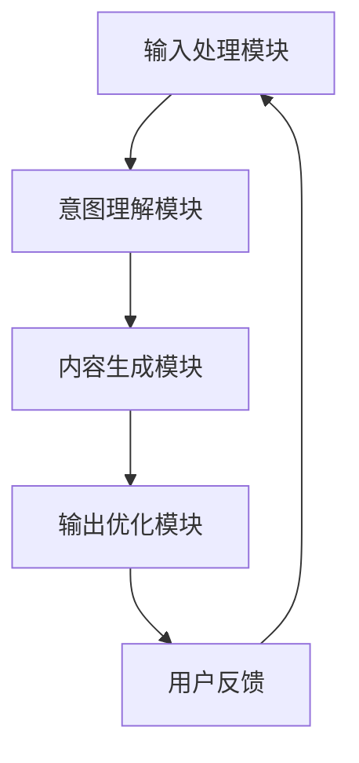

                 


# LLM驱动的AI Agent创造性写作能力

> 关键词：LLM，AI Agent，创造性写作，大语言模型，生成式AI，人工智能技术

> 摘要：本文探讨了如何利用大语言模型（LLM）驱动的AI Agent实现创造性写作，深入分析了其技术原理、系统架构和实际应用。文章从背景、原理、系统设计、项目实战等多方面展开，旨在为读者提供全面的技术解读。

---

## 目录

1. [背景介绍](#背景介绍)
   1.1 LLM与AI Agent的基本概念
   1.2 创造性写作能力的定义与分类
   1.3 问题背景与研究意义

2. [核心概念与原理](#核心概念与原理)
   2.1 LLM的训练与模型架构
   2.2 AI Agent的生成机制
   2.3 创造性写作的核心要素

3. [系统架构与设计](#系统架构与设计)
   3.1 AI Agent的系统组成
   3.2 系统功能模块设计
   3.3 系统架构图

4. [算法原理与实现](#算法原理与实现)
   4.1 LLM的训练过程
   4.2 注意力机制的数学模型
   4.3 生成式AI的实现步骤

5. [项目实战](#项目实战)
   5.1 环境配置与安装
   5.2 代码实现与功能解读
   5.3 实际案例分析

6. [总结与展望](#总结与展望)

---

## 1. 背景介绍

### 1.1 LLM与AI Agent的基本概念

#### 1.1.1 大语言模型（LLM）的定义
大语言模型（Large Language Model, LLM）是指基于深度学习技术构建的大型神经网络模型，能够理解和生成人类语言。这些模型通常基于Transformer架构，通过大量的文本数据进行训练，具备强大的文本生成和理解能力。

#### 1.1.2 AI Agent的核心特点
AI Agent（人工智能代理）是指能够感知环境、理解用户需求并执行任务的智能体。它通过与用户的交互，能够主动思考、决策并采取行动，以满足用户的需求。

#### 1.1.3 LLM与AI Agent的结合方式
LLM作为AI Agent的核心驱动力，能够通过生成式AI技术为Agent提供强大的自然语言处理能力，使其具备创造性写作的能力。LLM通过理解用户需求，生成符合要求的文本内容，从而实现创造性写作。

### 1.2 创造性写作能力的定义与分类

#### 1.2.1 创造性写作的定义
创造性写作是指通过创新思维和独特表达方式，生成具有创造性的文本内容。它不仅包括文学创作，还涉及广告文案、技术文档等多种形式的文本生成。

#### 1.2.2 创造性写作的分类
创造性写作可以分为文学创作、广告文案生成、技术文档编写等多种类型。每种类型都有其独特的特点和要求，需要AI Agent具备相应的理解和生成能力。

#### 1.2.3 LLM驱动的创造性写作的优势
通过LLM驱动的AI Agent进行创造性写作，可以显著提高文本生成的效率和质量。LLM具备强大的上下文理解和生成能力，能够生成连贯、合理的文本内容，并根据用户需求进行灵活调整。

### 1.3 问题背景与研究意义

#### 1.3.1 问题背景
随着人工智能技术的快速发展，生成式AI在多个领域得到了广泛应用。然而，现有的生成式AI模型在创造性写作方面仍存在一定的局限性，需要进一步优化和提升。

#### 1.3.2 研究意义
研究LLM驱动的AI Agent创造性写作能力，不仅有助于提升生成式AI的性能，还能为多个领域（如教育、广告、文学等）提供更高效、更智能的文本生成解决方案。

---

## 2. 核心概念与原理

### 2.1 LLM的训练与模型架构

#### 2.1.1 LLM的训练过程
LLM的训练过程通常包括数据预处理、模型初始化、正向传播、损失计算和反向传播等步骤。通过大量的文本数据训练，模型能够学习到语言的规律和语义信息。

#### 2.1.2 Transformer架构的核心原理
Transformer是一种基于注意力机制的深度学习模型，由编码器和解码器组成。编码器负责将输入文本转换为语义向量，解码器则根据编码器的输出生成目标文本。

#### 2.1.3 注意力机制的数学模型
注意力机制通过计算输入序列中每个词的注意力权重，确定每个词对当前输出的重要性。其数学公式如下：

$$
\text{Attention}(Q, K, V) = \text{softmax}\left(\frac{QK^T}{\sqrt{d_k}}\right)V
$$

其中，$Q$、$K$、$V$分别为查询、键和值矩阵，$d_k$为键的维度。

### 2.2 AI Agent的生成机制

#### 2.2.1 解码过程
解码过程是生成式AI的核心步骤，模型通过逐步生成文本内容，最终形成完整的输出结果。

#### 2.2.2 概率生成模型
概率生成模型通过计算每个可能的输出字符的概率分布，选择概率最高的字符作为输出。

#### 2.2.3 贝叶斯推断在LLM中的应用
贝叶斯推断通过计算条件概率，帮助模型在生成文本时考虑上下文信息，提高生成内容的连贯性和合理性。

### 2.3 创造性写作的核心要素

#### 2.3.1 创意生成
创意生成是创造性写作的核心，要求模型能够生成独特的想法和表达方式。

#### 2.3.2 文本优化
文本优化是对生成内容的进一步调整，包括语法校正、语言风格优化等。

#### 2.3.3 内容评估
内容评估是对生成文本的质量进行评估，确保内容符合用户需求和预期。

---

## 3. 系统架构与设计

### 3.1 AI Agent的系统组成

#### 3.1.1 输入处理模块
输入处理模块负责接收用户的输入，并将其转化为模型可处理的形式。

#### 3.1.2 意图理解模块
意图理解模块通过自然语言处理技术，分析用户的输入内容，确定用户的意图和需求。

#### 3.1.3 内容生成模块
内容生成模块基于LLM生成符合用户需求的文本内容。

#### 3.1.4 输出优化模块
输出优化模块对生成的内容进行优化，确保文本的质量和流畅性。

### 3.2 系统功能模块设计

#### 3.2.1 用户输入分析
用户输入分析模块通过自然语言处理技术，分析用户的输入内容，提取关键信息。

#### 3.2.2 意图识别与任务分解
意图识别模块通过分析用户意图，将任务分解为多个子任务，确保生成内容的准确性和完整性。

#### 3.2.3 内容生成与输出
内容生成模块基于LLM生成文本内容，并通过输出优化模块进行优化，最终输出生成结果。

#### 3.2.4 反馈机制与迭代优化
反馈机制通过用户反馈不断优化模型性能，确保生成内容的质量和用户满意度。

### 3.3 系统架构图



---

## 4. 算法原理与实现

### 4.1 LLM的训练过程

#### 4.1.1 数据预处理
数据预处理包括文本清洗、分词、去停用词等步骤，确保输入数据的质量和一致性。

#### 4.1.2 模型初始化
模型初始化包括参数初始化和模型架构搭建，为后续训练做好准备。

#### 4.1.3 正向传播与损失计算
正向传播将输入数据输入模型，计算输出结果和损失值。

#### 4.1.4 反向传播与参数更新
反向传播通过计算梯度，更新模型参数，优化模型性能。

### 4.2 注意力机制的数学模型

$$
\text{Attention}(Q, K, V) = \text{softmax}\left(\frac{QK^T}{\sqrt{d_k}}\right)V
$$

### 4.3 生成式AI的实现步骤

#### 4.3.1 模型加载
加载预训练好的LLM模型，确保模型处于可用状态。

#### 4.3.2 用户输入处理
接收用户的输入，进行必要的预处理和解析。

#### 4.3.3 意图识别
通过自然语言处理技术，识别用户的意图和需求。

#### 4.3.4 内容生成
基于LLM生成文本内容，确保内容符合用户需求。

#### 4.3.5 输出优化
对生成的内容进行优化，提高文本质量和可读性。

#### 4.3.6 用户反馈
收集用户反馈，不断优化模型性能。

---

## 5. 项目实战

### 5.1 环境配置与安装

#### 5.1.1 安装Python
安装Python 3.8或更高版本，确保环境兼容性。

#### 5.1.2 安装依赖库
安装必要的依赖库，如TensorFlow、Keras、PyTorch等。

#### 5.1.3 下载LLM模型
下载预训练好的LLM模型，如GPT-2、GPT-3等。

### 5.2 代码实现与功能解读

#### 5.2.1 加载模型
```python
# 加载预训练好的LLM模型
model = load_model('llm_model.pth')
```

#### 5.2.2 用户输入处理
```python
# 接收用户输入
user_input = input("请输入您的需求：")
```

#### 5.2.3 意图识别
```python
# 通过自然语言处理技术识别用户意图
intent = get_intent(user_input)
```

#### 5.2.4 内容生成
```python
# 基于LLM生成文本内容
generated_text = generate_text(model, intent)
```

#### 5.2.5 输出优化
```python
# 对生成的内容进行优化
optimized_text = optimize_text(generated_text)
```

### 5.3 实际案例分析

#### 5.3.1 案例一：文学创作
用户输入：生成一篇科幻小说的开头。
生成内容：在一个遥远的星球上，人类发现了外星文明...

#### 5.3.2 案例二：广告文案生成
用户输入：生成一则汽车广告。
生成内容：驾驭未来，尽在掌握...

---

## 6. 总结与展望

### 6.1 本章小结
本文详细探讨了LLM驱动的AI Agent创造性写作能力，从背景、原理、系统设计到项目实战，全面分析了其技术实现和应用。

### 6.2 未来展望
未来，随着生成式AI技术的不断发展，LLM驱动的AI Agent在创造性写作方面将具备更大的潜力，能够实现更复杂、更多样化的文本生成任务。

---

## 作者：AI天才研究院/AI Genius Institute & 禅与计算机程序设计艺术 /Zen And The Art of Computer Programming

