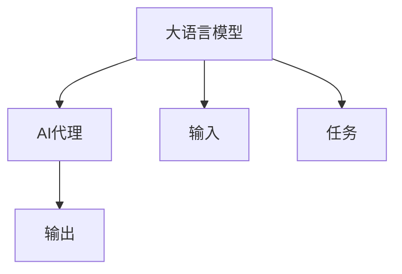

                 

# LLM驱动的AI Agent创造性问题重构

## 关键词：LLM, AI Agent, 创造性问题重构, 算法原理, 系统设计

## 摘要：  
本文探讨了大语言模型（LLM）如何驱动AI代理（AI Agent）进行创造性问题重构。通过从基础概念到算法原理，再到系统架构和项目实战的全面分析，本文揭示了LLM与AI Agent结合的独特优势，并展示了如何通过创造性问题重构提升AI代理的智能性和问题解决能力。  

---

## 正文

### 第1章: LLM与AI Agent概述

#### 1.1 LLM的基本概念  
大语言模型（LLM）是一种基于深度学习的自然语言处理模型，能够理解和生成人类语言。其核心特点包括：  
1. **强大的语言理解能力**：LLM能够通过大量数据训练，捕捉语言的上下文关系。  
2. **生成能力**：LLM可以生成连贯且符合语境的文本。  
3. **可微调性**：通过监督微调，LLM可以适应特定任务或领域的需求。  

#### 1.2 AI Agent的基本概念  
AI代理（AI Agent）是一种智能系统，能够感知环境、理解问题并采取行动以实现目标。其核心功能包括：  
1. **感知环境**：通过传感器或接口获取信息。  
2. **决策与规划**：基于信息进行推理和决策。  
3. **执行行动**：通过执行器或API与外部系统交互。  

#### 1.3 LLM与AI Agent的结合  
LLM为AI代理提供了强大的语言理解和生成能力，使其能够更好地理解用户需求并生成自然的响应。这种结合使得AI代理能够从简单的任务执行扩展到复杂的创造性问题解决。

---

### 第2章: 创造性问题重构的背景  

#### 2.1 问题背景  
传统的问题解决方法往往依赖固定的规则和预定义的步骤，难以应对复杂多变的场景。创造性问题重构通过动态调整问题描述，为AI代理提供了更大的灵活性和创新空间。

#### 2.2 问题描述  
创造性问题重构是指将原始问题重新表述为一个更易于解决或更高效的形式。其特点包括：  
1. **动态性**：问题重构的过程是动态且迭代的。  
2. **创造性**：重构后的问题可能具有新的视角或解决方案。  
3. **适应性**：能够根据环境变化调整问题描述。  

#### 2.3 问题解决  
通过LLM驱动的AI代理进行创造性问题重构，可以显著提高问题解决的效率和效果。LLM不仅能够生成多种可能的解决方案，还能帮助AI代理理解问题的深层含义，从而制定更合理的决策。

---

### 第3章: LLM驱动的AI Agent核心概念  

#### 3.1 核心概念原理  
LLM驱动的AI代理通过以下步骤实现创造性问题重构：  
1. **问题理解**：LLM解析原始问题并提取关键信息。  
2. **问题重构**：基于LLM生成新的问题描述。  
3. **解决方案生成**：LLM根据重构后的问题生成可能的解决方案。  

#### 3.2 核心概念属性对比  
下表对比了LLM与AI Agent的核心属性：  

| 属性       | LLM                         | AI Agent                     |  
|------------|------------------------------|------------------------------|  
| 核心能力   | 语言生成与理解               | 环境感知与决策               |  
| 优势       | 强大的语言处理能力           | 多样化的交互方式             |  
| 适用场景   | 文本生成、问答系统           | 任务执行、问题解决         |  

#### 3.3 ER实体关系图  
以下是LLM与AI Agent的实体关系图：  

---

### 总结  

本文从基础概念出发，详细探讨了大语言模型（LLM）如何驱动AI代理（AI Agent）进行创造性问题重构。通过分析问题背景、核心概念和系统架构，我们展示了LLM与AI Agent结合的独特优势。未来的工作将重点研究如何进一步优化LLM的生成能力，以提升AI代理的创造性问题解决能力。

---

**作者：AI天才研究院（AI Genius Institute） & 禅与计算机程序设计艺术（Zen And The Art of Computer Programming）**

