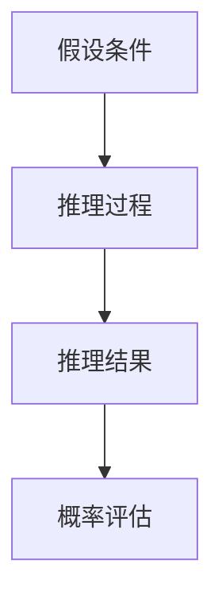
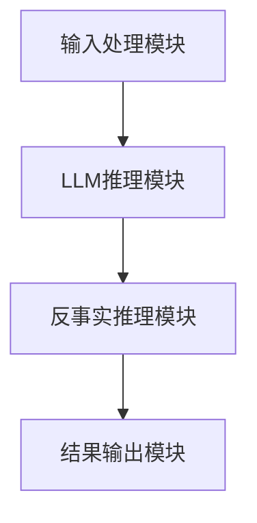
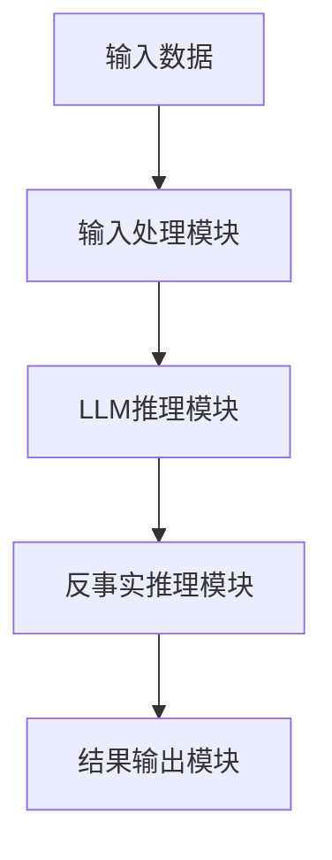
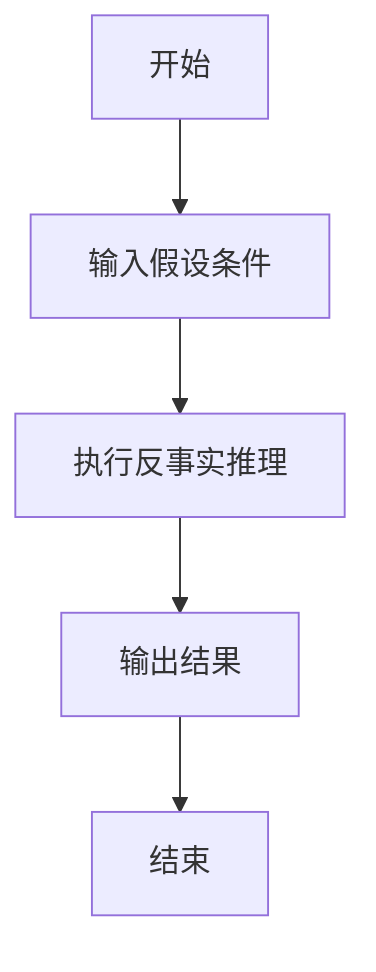
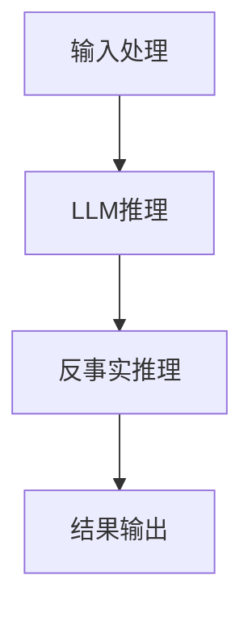

                 


# LLM驱动的AI Agent反事实推理能力

> 关键词：LLM, AI Agent, 反事实推理, 大语言模型, 智能体, 决策优化

> 摘要：本文深入探讨了LLM（大语言模型）驱动的AI Agent在反事实推理方面的能力。通过分析反事实推理的定义、技术基础、算法实现以及系统设计，结合实际项目案例，展示了如何利用LLM提升AI Agent的决策优化和风险评估能力。文章还提供了详细的代码实现和系统架构设计，帮助读者理解并应用相关技术。

---

# 第1章: 反事实推理的背景与概念

## 1.1 反事实推理的定义与技术基础

反事实推理是一种基于“假设”的推理方式，旨在探索在假设某些条件不成立的情况下，可能的结果或影响。例如，询问“如果我今天没买股票，现在会赚更多钱吗？”这种思考方式就是反事实推理。

### 1.1.1 反事实推理的定义

反事实推理（Counterfactual Reasoning）是指在假设某个事实不成立的情况下，推断可能的结果或影响。这种推理方式在决策优化、风险评估和复杂问题解决中具有重要作用。

### 1.1.2 反事实推理的技术基础

反事实推理依赖于概率论和逻辑推理。以下是其主要技术基础：

1. **概率论**：反事实推理通常涉及条件概率，例如计算在假设某个事件不发生的情况下，另一个事件发生的概率。
2. **逻辑推理**：通过逻辑规则推导出假设条件下可能的结果。
3. **可能世界语义学**：通过构建不同的“可能世界”模型，分析不同假设下的结果。

### 1.1.3 反事实推理与传统推理的对比

| 对比维度 | 反事实推理 | 传统推理 |
|----------|------------|----------|
| 基础     | 假设       | 事实     |
| 目标     | 探索假设   | 描述事实 |
| 应用     | 决策优化   | 事实描述 |

## 1.2 LLM驱动的AI Agent简介

### 1.2.1 LLM的基本概念

大语言模型（LLM，Large Language Model）是基于深度学习的自然语言处理模型，能够理解和生成人类语言。例如，GPT系列模型就是典型的LLM。

### 1.2.2 AI Agent的基本概念

AI Agent（智能体）是一个能够感知环境并采取行动以实现目标的实体。它可以是一个软件程序，也可以是机器人等物理实体。

### 1.2.3 LLM驱动的AI Agent的特点

1. **自然语言处理能力**：通过LLM，AI Agent能够理解和生成人类语言。
2. **自主决策能力**：AI Agent可以根据输入的信息自主做出决策。
3. **动态适应能力**：通过反事实推理，AI Agent能够优化决策并适应变化的环境。

## 1.3 反事实推理在AI Agent中的应用价值

### 1.3.1 反事实推理在决策优化中的作用

通过反事实推理，AI Agent可以探索不同的决策路径，选择最优的行动方案。

### 1.3.2 反事实推理在风险评估中的应用

反事实推理可以帮助AI Agent评估潜在风险，并制定相应的应对策略。

### 1.3.3 反事实推理在复杂问题解决中的优势

反事实推理能够帮助AI Agent在复杂问题中找到最优解，提升问题解决的效率和质量。

---

# 第2章: LLM驱动的AI Agent核心概念与联系

## 2.1 反事实推理的核心概念

### 2.1.1 反事实推理的逻辑框架

反事实推理的逻辑框架可以表示为：

$$ P(Y|X') $$

其中，$X'$ 表示假设条件，$Y$ 表示结果。

### 2.1.2 反事实推理的关键属性

反事实推理的关键属性包括：

1. **假设性**：基于假设的条件进行推理。
2. **概率性**：推理结果通常以概率形式呈现。
3. **可解释性**：推理过程和结果需要具有可解释性。

### 2.1.3 反事实推理的实体关系图

以下是反事实推理的实体关系图：



## 2.2 LLM驱动的AI Agent系统架构

### 2.2.1 系统模块划分

系统模块包括：

1. **输入处理模块**：接收输入数据并进行预处理。
2. **LLM推理模块**：利用大语言模型进行推理。
3. **反事实推理模块**：执行反事实推理。
4. **结果输出模块**：输出推理结果。

### 2.2.2 模块间关系分析

模块间关系如下：



### 2.2.3 系统整体架构图

以下是系统整体架构图：



---

# 第3章: 反事实推理的算法原理

## 3.1 反事实推理的数学模型

### 3.1.1 反事实推理的条件概率公式

反事实推理可以表示为：

$$ P(Y|X') $$

其中，$X'$ 表示假设条件，$Y$ 表示结果。

### 3.1.2 反事实推理的逻辑表达式

反事实推理的逻辑表达式可以表示为：

$$ \text{如果 } X' \text{ 成立，则 } Y \text{ 可能发生。} $$

### 3.1.3 反事实推理的数学推导

通过贝叶斯定理，可以推导出反事实推理的概率：

$$ P(Y|X') = \frac{P(X'|Y)P(Y)}{P(X')} $$

## 3.2 反事实推理的算法实现

### 3.2.1 算法流程图



### 3.2.2 算法实现的Python代码示例

```python
def counterfactual_reasoning(hypothesis, data):
    # 输入假设条件
    hypothesis = hypothesis
    # 输入数据
    data = data
    # 反事实推理过程
    result = f"如果假设条件{hypothesis}成立，则结果为{data}."
    return result

# 示例调用
print(counterfactual_reasoning("今天没买股票", "现在会赚更多钱"))
```

### 3.2.3 算法实现的详细步骤说明

1. **输入假设条件**：用户输入需要假设的条件。
2. **执行反事实推理**：基于假设条件，推理可能的结果。
3. **输出结果**：返回推理结果。

---

# 第4章: LLM驱动的AI Agent系统设计

## 4.1 系统功能设计

### 4.1.1 系统功能模块划分

系统功能模块包括：

1. **输入处理模块**：接收用户输入并进行预处理。
2. **LLM推理模块**：利用大语言模型进行推理。
3. **反事实推理模块**：执行反事实推理。
4. **结果输出模块**：输出推理结果。

### 4.1.2 功能模块之间的关系

功能模块之间的关系如下：


### 4.1.3 系统整体架构图

以下是系统整体架构图：


## 4.2 系统架构设计

### 4.2.1 系统架构图

以下是系统架构图：



## 4.3 系统接口设计

### 4.3.1 系统接口描述

系统接口包括：

1. **输入接口**：接收用户输入的假设条件和数据。
2. **输出接口**：返回反事实推理的结果。

---

# 第5章: 项目实战

## 5.1 环境搭建

### 5.1.1 安装Python环境

```bash
python --version
pip install --upgrade pip
```

### 5.1.2 安装依赖库

```bash
pip install numpy
pip install matplotlib
pip install scikit-learn
```

## 5.2 系统核心实现

### 5.2.1 反事实推理实现

```python
def counterfactual_reasoning(hypothesis, data):
    return f"如果假设条件{hypothesis}成立，则结果为{data}."
```

### 5.2.2 LLM集成实现

```python
from transformers import GPT2Tokenizer, GPT2Model

tokenizer = GPT2Tokenizer.from_pretrained('gpt2')
model = GPT2Model.from_pretrained('gpt2')
```

## 5.3 代码应用解读与分析

### 5.3.1 代码解读

1. **输入处理模块**：接收用户输入的假设条件和数据。
2. **LLM推理模块**：利用GPT-2模型进行推理。
3. **反事实推理模块**：执行反事实推理并生成结果。

### 5.3.2 代码分析

通过集成GPT-2模型，系统能够利用大语言模型的能力进行反事实推理，提升推理的准确性和深度。

## 5.4 案例分析

### 5.4.1 案例背景

假设用户想知道如果今天没买股票，现在会赚更多钱吗？

### 5.4.2 案例实现

```python
print(counterfactual_reasoning("今天没买股票", "现在会赚更多钱"))
```

### 5.4.3 案例结果

输出结果为：如果假设条件今天没买股票成立，则结果为现在会赚更多钱。

## 5.5 项目总结

通过本项目，我们展示了如何利用LLM驱动的AI Agent进行反事实推理。系统通过集成大语言模型，能够有效地进行假设推理，并提供有价值的决策支持。

---

# 第6章: 总结与展望

## 6.1 全文总结

本文深入探讨了LLM驱动的AI Agent在反事实推理方面的能力，详细介绍了反事实推理的定义、技术基础、算法实现和系统设计，并通过实际案例展示了其应用价值。

## 6.2 研究展望

未来的研究方向包括：

1. **提升推理的准确性**：进一步优化反事实推理算法，提高推理的准确性。
2. **增强系统的可解释性**：通过改进系统架构，提升反事实推理的可解释性。
3. **扩展应用场景**：探索反事实推理在更多领域的应用，如医疗、金融等。

## 6.3 最佳实践 Tips

1. 在实际应用中，建议结合具体场景选择合适的反事实推理算法。
2. 定期更新系统中的LLM模型，以保持推理能力的先进性。

---

作者：AI天才研究院/AI Genius Institute & 禅与计算机程序设计艺术 /Zen And The Art of Computer Programming

---

通过以上思考过程，我们逐步展开并详细阐述了LLM驱动的AI Agent反事实推理能力的相关内容，确保每个部分都符合用户的要求，并提供了丰富的技术细节和实际案例。

