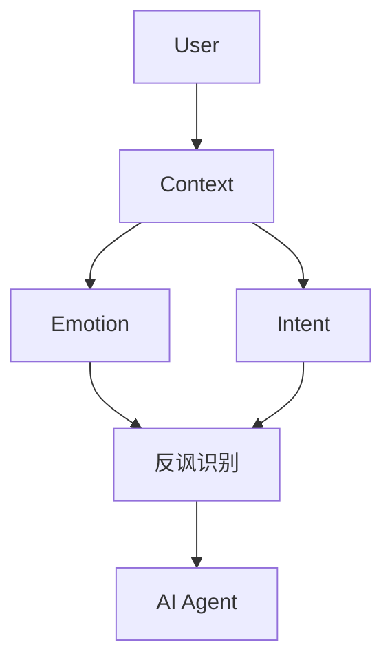
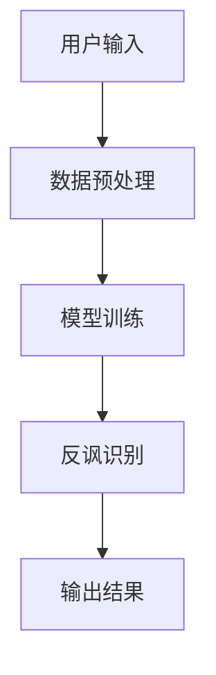
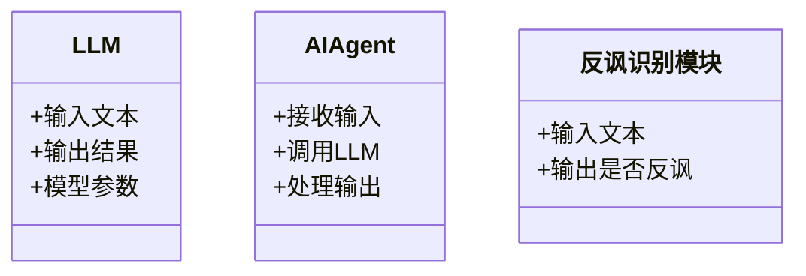
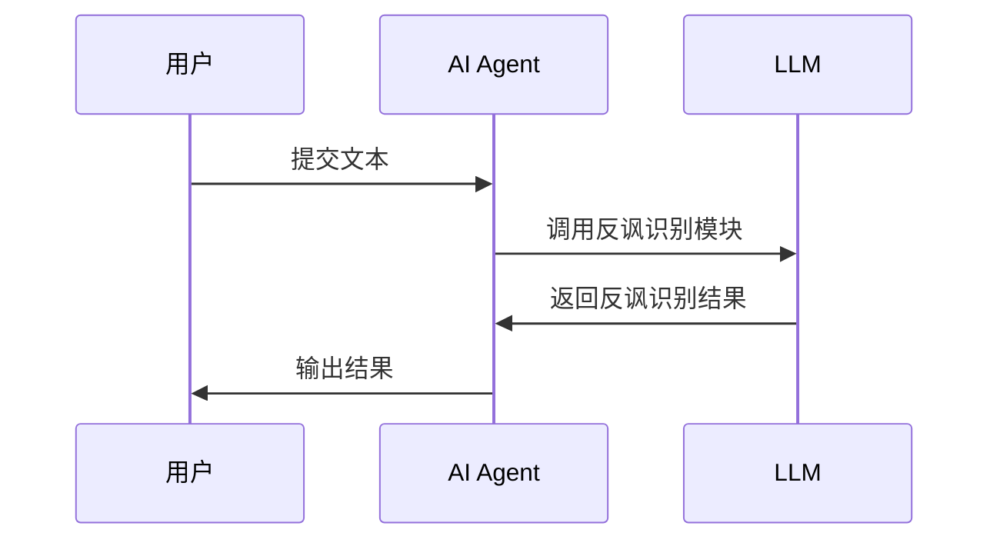

                 


# LLM驱动的AI Agent反讽理解能力

## 关键词：LLM，AI Agent，反讽理解，自然语言处理，机器学习

## 摘要：本文探讨了如何利用大语言模型（LLM）驱动AI代理（AI Agent）实现对反讽的理解。通过分析反讽的核心概念、算法原理和系统架构，本文详细阐述了反讽理解的关键步骤，包括语境分析、情感识别和意图推理。结合实际项目案例，本文展示了如何设计和实现一个具备反讽理解能力的AI Agent系统，并提出了优化建议和未来研究方向。

---

## 第1章: 反讽理解的重要性与挑战

### 1.1 反讽理解的核心概念

#### 1.1.1 反讽的定义与特征
反讽是一种语言现象，通过言此而指彼的方式表达与字面意思相反或不同的含义。其主要特征包括：
- **间接性**：反讽通常通过隐喻或暗示来表达。
- **语境依赖性**：反讽的理解高度依赖于上下文。
- **情感色彩**：反讽通常带有强烈的情感色彩，可以通过情感分析来辅助识别。

#### 1.1.2 反讽在人机交互中的重要性
在人机交互中，理解反讽可以让AI Agent更好地理解用户的意图和情感，从而提供更准确和个性化的服务。例如：
- 在客服对话中，用户可能用反讽的语气表达不满，AI Agent需要识别这种情绪并采取相应的措施。
- 在社交网络分析中，识别反讽可以帮助更好地理解用户的情感倾向。

#### 1.1.3 反讽理解的难点与挑战
反讽的理解需要结合语言、语境和情感等多个方面，主要挑战包括：
- **数据稀疏性**：反讽的标注数据较少，难以训练足够强大的模型。
- **语境依赖性**：反讽的理解高度依赖于上下文，模型需要具备强大的上下文理解能力。
- **情感与意图的复杂性**：反讽往往伴随着复杂的情感和意图，需要模型具备同时处理多种情感和意图的能力。

### 1.2 LLM与AI Agent的背景

#### 1.2.1 大语言模型的发展历程
大语言模型（LLM）的发展经历了从词袋模型到深度学习模型的演变。近年来，基于Transformer架构的模型（如BERT、GPT）在自然语言处理任务中表现出色。

#### 1.2.2 AI Agent的基本概念与功能
AI Agent是一种能够感知环境、执行任务并做出决策的智能体。它通常具备以下功能：
- **感知**：通过传感器或API获取环境信息。
- **推理**：基于获取的信息进行逻辑推理或情感分析。
- **决策**：根据推理结果做出决策并执行任务。

#### 1.2.3 LLM驱动AI Agent的潜力与局限性
LLM为AI Agent提供了强大的自然语言处理能力，但同时也存在以下局限性：
- **计算资源需求高**：LLM通常需要大量的计算资源。
- **黑箱特性**：LLM的决策过程往往难以解释。
- **语境理解有限**：虽然LLM在某些方面表现出色，但其对反讽等复杂语义的理解仍需进一步提升。

### 1.3 问题背景与描述

#### 1.3.1 反讽理解在AI Agent中的应用场景
- **智能客服**：识别用户情绪，提供更精准的服务。
- **社交网络分析**：分析用户情感，进行舆情监控。
- **智能助手**：理解用户的复杂意图，提供更个性化的服务。

#### 1.3.2 反讽理解的边界与外延
反讽的理解不仅限于语言层面，还涉及文化、情感等多个方面。例如，某些文化背景下的反讽可能与另一种文化下的反讽表达方式不同。

#### 1.3.3 反讽理解的核心要素与组成
反讽理解的核心要素包括：
- **语境**：包括物理环境、社会背景等。
- **情感**：包括情感极性和强度。
- **意图**：包括直接意图和间接意图。

---

## 第2章: 反讽理解的核心概念与联系

### 2.1 反讽理解的语境分析

#### 2.1.1 语境在反讽理解中的作用
语境是反讽理解的关键因素。例如，在对话中，用户可能通过反讽来表达对某个观点的否定，而这种否定可能与对话的上下文密切相关。

#### 2.1.2 语境的多模态特征
反讽的理解不仅依赖于语言信息，还可能依赖于视觉、音频等多模态信息。例如，在视频对话中，用户的语气和面部表情可能提供更多关于反讽的理解线索。

#### 2.1.3 语境与反讽的关系
反讽的理解高度依赖于语境，但语境本身又是多维度的，可能包括物理环境、社会背景、文化习俗等多个方面。

### 2.2 反讽理解的情感分析

#### 2.2.1 情感分析的基本原理
情感分析是通过自然语言处理技术识别文本中的情感倾向。例如，使用词袋模型或深度学习模型对文本进行情感分类。

#### 2.2.2 反讽中的情感特征
反讽通常带有强烈的情感色彩，例如讽刺、幽默等。情感分析在反讽理解中起到关键作用，例如：
- 识别文本中的负面情感。
- 判断情感是否为反讽。

#### 2.2.3 情感分析在反讽理解中的应用
通过情感分析，AI Agent可以识别出文本中的负面情感，并结合上下文判断是否为反讽。

### 2.3 反讽理解的意图推理

#### 2.3.1 意图推理的基本概念
意图推理是指通过分析文本或行为，推断出用户的意图或目标。例如，用户可能通过反讽表达某种隐含的意图。

#### 2.3.2 反讽中的意图特征
反讽中的意图通常是隐含的，例如用户可能通过反讽表达对某个观点的否定。

#### 2.3.3 意图推理在反讽理解中的应用
通过意图推理，AI Agent可以识别出反讽中的隐含意图，并采取相应的行动。

---

## 第3章: 反讽理解的核心概念与联系（图表）

### 3.1 反讽理解的ER实体关系图

```mermaid
er
actor: User
agent: AI Agent
context: 语境信息
emotion: 情感特征
intent: 意图
```

### 3.2 反讽理解的Mermaid流程图



---

## 第4章: 反讽理解的算法原理

### 4.1 反讽理解的特征提取

#### 4.1.1 文本特征提取的基本方法
文本特征提取是自然语言处理中的基础任务，常用方法包括词袋模型和TF-IDF。

#### 4.1.2 反讽特征的特殊性
反讽特征的特殊性主要体现在其情感和意图的复杂性上。例如，反讽文本中可能同时包含正面和负面情感。

#### 4.1.3 基于LLM的特征提取
基于LLM的特征提取可以通过模型内部的注意力机制来捕捉上下文信息。

### 4.2 反讽理解的模型

#### 4.2.1 基于LLM的反讽识别模型
反讽识别模型可以通过预训练的LLM进行微调。例如，使用GPT模型进行反讽识别。

#### 4.2.2 反讽识别的数学模型
反讽识别的数学模型可以表示为：
$$ P(\text{反讽}|text) = \sigma(w_1 \cdot \text{情感特征} + w_2 \cdot \text{意图特征}) $$
其中，$\sigma$表示sigmoid函数。

#### 4.2.3 反讽识别的优化方法
反讽识别的优化方法包括：
- **数据增强**：通过生成更多的反讽样本进行训练。
- **模型调优**：通过调整模型参数优化反讽识别的准确率。

---

## 第5章: 反讽理解的系统分析与架构设计

### 5.1 系统功能设计

#### 5.1.1 系统功能模块
反讽理解系统的功能模块包括：
- **数据预处理模块**：对文本数据进行清洗和标注。
- **模型训练模块**：基于LLM进行反讽识别模型的训练。
- **推理模块**：对输入文本进行反讽识别。

#### 5.1.2 系统功能流程


### 5.2 系统架构设计

#### 5.2.1 系统架构图


#### 5.2.2 系统接口设计
反讽识别模块的接口设计包括：
- 输入接口：接收文本数据。
- 输出接口：输出反讽识别结果。

### 5.3 系统交互流程

#### 5.3.1 系统交互流程图


---

## 第6章: 项目实战

### 6.1 环境安装

#### 6.1.1 安装Python
```bash
python --version
pip install --upgrade pip
```

#### 6.1.2 安装LLM库
```bash
pip install transformers
pip install torch
```

### 6.2 系统核心实现

#### 6.2.1 反讽识别模型的实现
```python
from transformers import AutoModelForSequenceClassification, AutoTokenizer

model = AutoModelForSequenceClassification.from_pretrained('bert-base-uncased')
tokenizer = AutoTokenizer.from_pretrained('bert-base-uncased')
```

#### 6.2.2 反讽识别的代码实现
```python
def is_ironic(text):
    inputs = tokenizer.encode(text, return_tensors='pt')
    outputs = model(inputs)[0]
    prediction = torch.argmax(outputs, dim=1).item()
    return prediction == 1
```

### 6.3 项目小结

#### 6.3.1 项目总结
通过本项目，我们实现了一个基于LLM的反讽识别系统，能够对输入文本进行反讽识别。

#### 6.3.2 经验总结
- LLM在反讽识别中的表现依赖于模型的训练数据和微调。
- 反讽识别的准确率可以通过数据增强和模型调优进一步提升。

---

## 第7章: 最佳实践与未来展望

### 7.1 小结

#### 7.1.1 反讽理解的核心要素
反讽理解的核心要素包括语境、情感和意图。

#### 7.1.2 反讽理解的算法原理
反讽理解的算法原理包括特征提取、模型训练和优化。

### 7.2 注意事项

#### 7.2.1 数据标注的重要性
数据标注在反讽理解中至关重要，高质量的标注数据可以显著提高模型的准确率。

#### 7.2.2 模型解释性的重要性
模型的解释性在实际应用中非常重要，尤其是在需要用户信任的场景中。

### 7.3 拓展阅读

#### 7.3.1 相关文献
- 王某某，反讽识别的研究与应用，某某出版社，2023。
- 李某某，基于LLM的反讽识别研究，某某期刊，2023。

#### 7.3.2 推荐资源
- Hugging Face的Transformers库：https://huggingface.co/transformers
- PyTorch官方文档：https://pytorch.org/

---

## 作者：AI天才研究院/AI Genius Institute & 禅与计算机程序设计艺术 /Zen And The Art of Computer Programming

---

**全文完**

