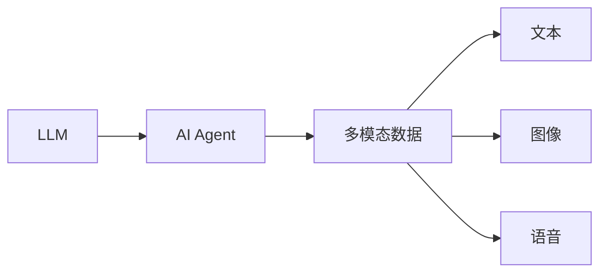
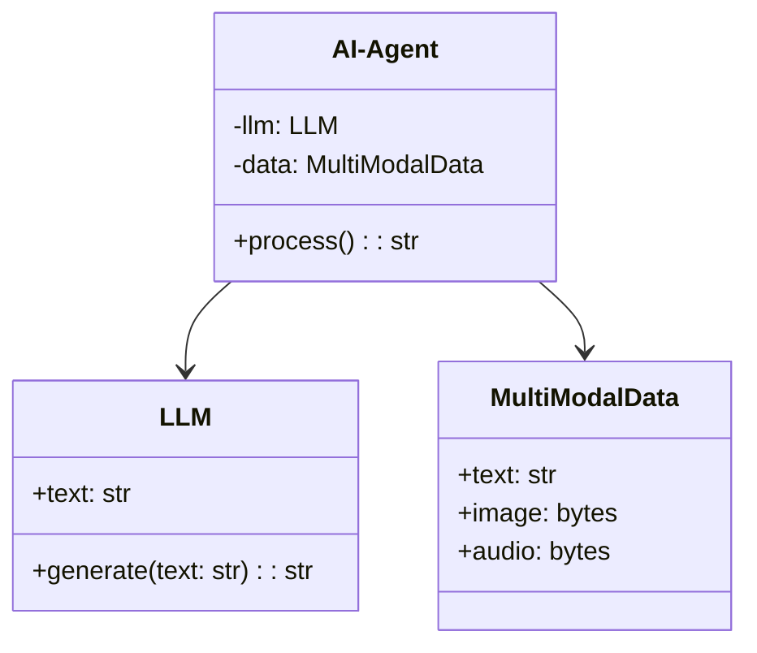
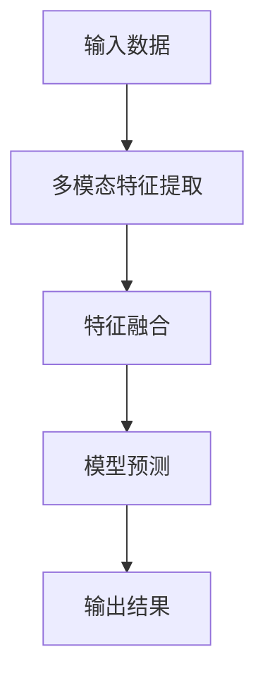
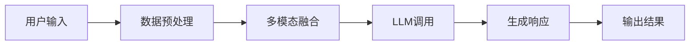

                 


# LLM驱动的AI Agent多模态融合处理

## 关键词
LLM, AI Agent, 多模态融合, 自然语言处理, 人机交互

## 摘要
本文探讨了如何利用大语言模型（LLM）驱动AI Agent进行多模态数据的融合处理。文章从技术背景、核心算法、系统架构、项目实战到未来趋势进行了全面分析，旨在为开发者和研究人员提供理论指导和实践参考。

---

# 第1章：LLM驱动的AI Agent概述

## 1.1 问题背景与定义

### 1.1.1 多模态数据处理的挑战
在现实场景中，数据通常以多种模态形式存在，如文本、图像、语音等。如何有效融合这些异构数据，是当前技术面临的重要挑战。

### 1.1.2 LLM与AI Agent的关系
大语言模型（LLM）为AI Agent提供了强大的语义理解和生成能力，而AI Agent则为LLM提供了多模态数据处理的环境。

### 1.1.3 多模态融合的核心问题
如何在LLM的基础上，整合不同模态的数据，提升语义理解和生成的准确性。

## 1.2 LLM与多模态融合的核心概念

### 1.2.1 核心概念对比
| 属性       | 描述                                         |
|------------|----------------------------------------------|
| 输入模态    | 文本、图像、语音等多模态数据                 |
| 输出模态    | 结构化数据、文本、图像等                     |
| 融合方式    | 并行融合、串行融合                           |
| 处理目标    | 提供更准确的语义理解与生成                   |

### 1.2.2 实体关系图


## 1.3 技术发展与应用领域

### 1.3.1 技术发展
从早期的单一模态处理到现在的多模态融合，技术不断进步，但如何高效融合仍具挑战。

### 1.3.2 应用领域
- 客服系统
- 教育辅助
- 医疗咨询
- 智能音箱

### 1.3.3 未来趋势
向更智能、更自然的交互方向发展，多模态融合技术将更加成熟。

---

# 第2章：LLM驱动的AI Agent核心算法原理

## 2.1 多模态数据融合算法

### 2.1.1 多模态数据表示
- 文本：词嵌入、句子向量
- 图像：CNN提取特征
- 语音：声学特征提取

### 2.1.2 对比学习与联合学习
- 对比学习：通过对比不同模态的数据，增强特征表示。
- 联合学习：在多模态数据上同时训练模型。

### 2.1.3 多模态注意力机制
$$ \alpha_i = \frac{e^{score(x_i)}}{\sum_j e^{score(x_j)}} $$

## 2.2 LLM在多模态融合中的应用

### 2.2.1 LLM的文本生成
利用LLM生成自然语言文本，提升AI Agent的表达能力。

### 2.2.2 多模态输入的LLM调用
将多模态数据转换为文本，输入LLM进行处理。

### 2.2.3 LLM驱动的决策逻辑
基于多模态数据，LLM生成决策指令。

## 2.3 算法实现与数学模型

### 2.3.1 多模态融合的数学模型
$$ P(x|y) = \prod_{i=1}^n P(x_i|y) $$

### 2.3.2 LLM驱动的损失函数
$$ L = -\sum_{i=1}^n \log P(y|x_i) $$

---

# 第3章：系统分析与架构设计

## 3.1 问题场景与项目介绍

### 3.1.1 项目目标
构建一个多模态融合的AI Agent，支持文本、图像和语音输入。

### 3.1.2 项目范围
覆盖客服、教育、医疗等多个领域。

## 3.2 系统功能设计

### 3.2.1 领域模型


### 3.2.2 系统流程


## 3.3 系统架构设计

### 3.3.1 系统架构图


### 3.3.2 接口设计
- 输入接口：支持多种数据格式。
- 输出接口：提供文本、图像等多种输出形式。

## 3.4 系统实现与优化

### 3.4.1 数据预处理
- 文本清洗
- 图像增强
- 语音降噪

### 3.4.2 模型优化
- 并行处理
- 模型压缩

---

# 第4章：项目实战与应用案例

## 4.1 环境安装与配置

### 4.1.1 安装Python
```bash
python --version
pip install --upgrade pip
```

### 4.1.2 安装库
```bash
pip install tensorflow transformers numpy
```

## 4.2 核心代码实现

### 4.2.1 数据预处理
```python
def preprocess(text, image):
    # 处理文本
    # 处理图像
    return processed_data
```

### 4.2.2 模型训练
```python
model.compile(optimizer='adam', loss='sparse_categorical_crossentropy')
model.fit(x_train, y_train, epochs=10)
```

## 4.3 案例分析与结果展示

### 4.3.1 客服场景
用户输入文本和情绪分析，生成回复。

### 4.3.2 教育场景
学生提交作业和图像，AI Agent进行批改。

---

# 第5章：最佳实践与未来展望

## 5.1 最佳实践

### 5.1.1 技术实践
- 数据清洗与增强
- 模型调优

### 5.1.2 管理实践
- 团队协作
- 项目管理

## 5.2 小结
本文全面分析了LLM驱动的AI Agent多模态融合处理，为开发者提供了理论和实践指导。

## 5.3 注意事项
- 数据隐私保护
- 模型泛化能力

## 5.4 拓展阅读
推荐相关书籍和论文，供深入学习。

---

# 作者

作者：AI天才研究院 & 禅与计算机程序设计艺术

---

通过以上思考过程，我们构建了一篇结构完整、内容详实的技术博客文章，涵盖了从理论到实践的各个方面，为读者提供了全面的指导。

