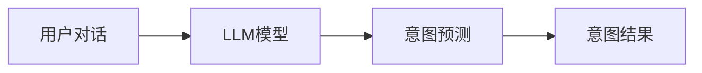
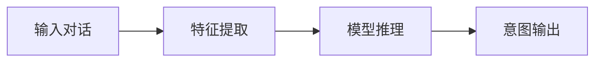
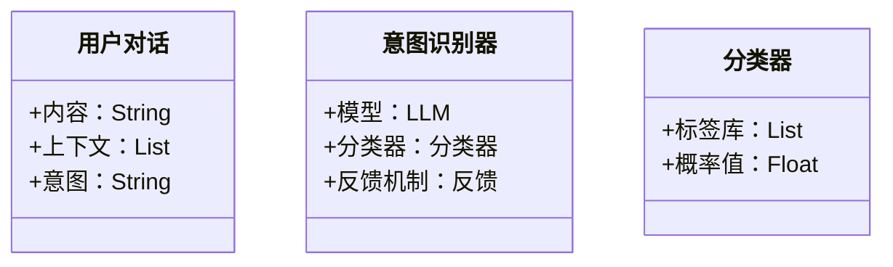
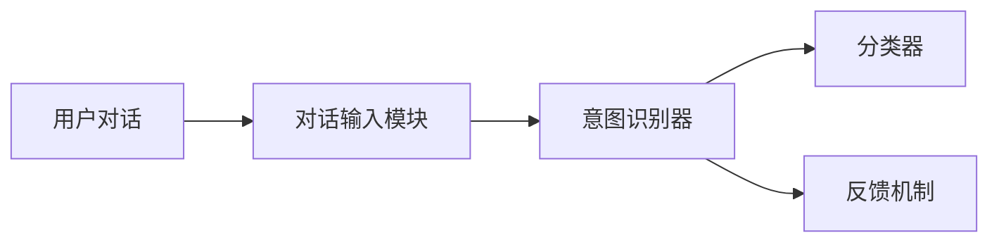
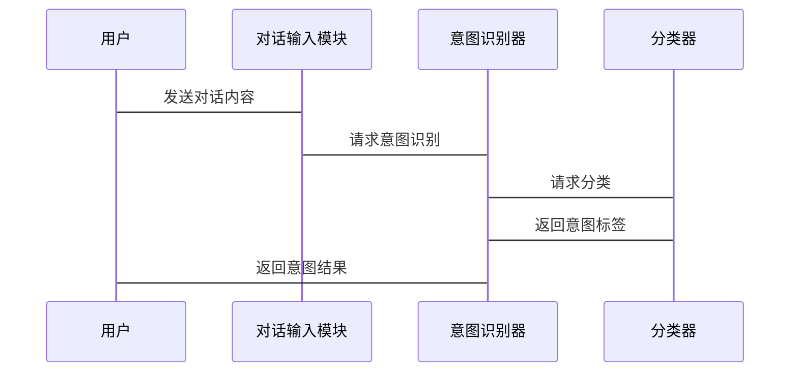

                 


# LLM驱动的AI Agent对话意图识别

## 关键词
- 大语言模型（LLM）
- AI Agent
- 对话意图识别
- 自然语言处理（NLP）
- 人机交互

## 摘要
本文详细探讨了LLM（大语言模型）驱动的AI Agent在对话意图识别中的应用。从基础概念到算法原理，从系统设计到实战案例，全面解析对话意图识别的关键技术。文章首先介绍了对话意图识别的背景与核心概念，随后深入分析了LLM驱动的算法原理与数学模型，再结合实际项目，详细阐述了系统架构设计与实现方案。最后，通过具体案例展示了LLM驱动的对话意图识别在实际应用中的优势与挑战。

---

# 第1章: 对话意图识别与LLM概述

## 1.1 对话意图识别的背景与问题背景
### 1.1.1 对话意图识别的定义与核心问题
对话意图识别（Dialog Intent Recognition）是自然语言处理（NLP）中的一个重要任务，旨在通过分析对话内容，推断用户的意图或目标。意图识别是人机交互系统中的关键环节，决定了AI Agent如何理解和回应用户的需求。

核心问题包括：
1. 如何准确理解用户的意图？
2. 如何处理上下文信息？
3. 如何提高意图识别的准确性和鲁棒性？

### 1.1.2 从传统NLP到LLM驱动的演进
传统的意图识别方法依赖于关键词匹配和规则引擎，这种方法在处理复杂对话时存在诸多限制。随着大语言模型（LLM）的兴起，意图识别进入了一个新的阶段。LLM通过其强大的语言理解和生成能力，能够更自然地处理对话，实现更精准的意图识别。

### 1.1.3 当前对话意图识别的边界与外延
对话意图识别的边界包括：
- **输入范围**：用户对话内容、上下文信息。
- **输出范围**：意图标签或意图描述。
- **场景限制**：特定领域（如客服、电商）的应用。

外延则包括：
- 多轮对话中的上下文理解。
- 多意图混合场景的识别。
- 跨语言对话意图识别。

## 1.2 LLM驱动的AI Agent概念与特点
### 1.2.1 LLM的定义与核心原理
大语言模型（LLM）是一种基于深度学习的生成模型，通过大量数据训练，能够理解和生成人类语言。其核心原理包括：
1. **Transformer架构**：通过自注意力机制捕捉语言中的长距离依赖关系。
2. **预训练与微调**：通过大规模数据预训练，针对特定任务进行微调优化。

### 1.2.2 AI Agent的基本概念与功能
AI Agent是一种智能体，能够感知环境、理解用户需求并执行任务。其主要功能包括：
1. **意图识别**：理解用户输入的意图。
2. **对话管理**：根据意图生成合适的回应。
3. **任务执行**：根据意图执行相关操作。

### 1.2.3 LLM驱动AI Agent的独特优势
- **强大的语言理解能力**：LLM能够理解复杂的对话内容。
- **自适应能力**：能够根据对话上下文动态调整响应。
- **灵活性**：适用于多种场景和领域。

## 1.3 对话意图识别的核心要素与概念结构
### 1.3.1 对话意图识别的核心要素
1. **输入数据**：用户对话内容。
2. **意图标签**：预定义的意图分类。
3. **上下文信息**：对话历史、用户状态。

### 1.3.2 LLM在对话意图识别中的角色
- **特征提取**：LLM提取对话中的关键信息。
- **意图预测**：基于LLM的输出进行意图分类。
- **反馈机制**：根据意图识别结果优化模型。

### 1.3.3 对话意图识别的流程与逻辑
1. **输入处理**：将用户对话内容输入模型。
2. **意图预测**：模型输出意图标签。
3. **结果解释**：将意图标签转换为可执行的指令。

## 1.4 本章小结
本章介绍了对话意图识别的基本概念和核心问题，探讨了LLM驱动AI Agent的独特优势，并详细阐述了对话意图识别的核心要素与概念结构。

---

# 第2章: 对话意图识别的核心概念原理

## 2.1 对话意图识别的原理与流程
### 2.1.1 对话数据的预处理与特征提取
- **分词**：将对话内容分割为单词或短语。
- **向量化**：将文本转换为向量表示（如词嵌入）。

### 2.1.2 模型训练与参数优化
- **监督学习**：基于标注数据训练模型。
- **参数优化**：通过反向传播优化模型参数。

### 2.1.3 意图预测与结果解释
- **分类器**：基于模型输出概率值，选择概率最高的意图。
- **结果解释**：将意图标签映射为具体任务。

## 2.2 LLM驱动对话意图识别的原理
### 2.2.1 LLM的内部机制与语言理解
- **自注意力机制**：捕捉对话中的长距离依赖关系。
- **解码器**：生成符合意图的响应。

### 2.2.2 对话上下文的处理与关联
- **上下文理解**：模型理解对话历史。
- **关联意图**：根据上下文调整意图预测。

### 2.2.3 意图识别的输出与反馈机制
- **意图输出**：模型生成意图标签。
- **反馈优化**：根据用户反馈调整模型。

## 2.3 对话意图识别与LLM的实体关系图


## 2.4 本章小结
本章详细阐述了对话意图识别的原理与流程，探讨了LLM在对话意图识别中的核心作用，并通过实体关系图展示了各部分之间的关联。

---

# 第3章: 对话意图识别的算法原理

## 3.1 基于LLM的意图识别算法
### 3.1.1 基于LLM的意图分类算法
- **输入处理**：将用户对话输入模型。
- **分类器**：模型输出意图标签。

### 3.1.2 基于LLM的意图生成算法
- **解码器**：生成符合意图的响应。
- **生成式模型**：根据意图生成自然语言回应。

### 3.1.3 算法的优缺点分析
- **优点**：高准确率、强语言理解能力。
- **缺点**：计算资源消耗大、模型训练成本高。

## 3.2 对话意图识别的数学模型
### 3.2.1 概率模型与条件概率公式
$$P(y|x) = \frac{P(x|y)P(y)}{P(x)}$$

### 3.2.2 基于LLM的生成模型
$$P(y|x) = \prod_{i=1}^{n} P(y_i|x, y_{<i})$$

### 3.2.3 混合模型与优化策略
- **混合模型**：结合分类和生成模型的优势。
- **优化策略**：通过反馈机制优化模型性能。

## 3.3 算法流程图


## 3.4 本章小结
本章详细介绍了基于LLM的意图识别算法，分析了其数学模型，并通过流程图展示了算法的整体流程。

---

# 第4章: 系统分析与架构设计

## 4.1 项目场景介绍
- **项目背景**：开发一个基于LLM的AI Agent，用于客服对话中的意图识别。
- **目标用户**：企业客服、在线教育平台用户。

## 4.2 系统功能设计
- **功能模块**：
  1. 对话输入模块。
  2. 意图识别模块。
  3. 意图分类模块。
  4. 反馈优化模块。

### 4.2.1 领域模型类图


## 4.3 系统架构设计
### 4.3.1 系统架构图


### 4.3.2 系统接口设计
- **输入接口**：接收用户对话内容。
- **输出接口**：返回意图标签。
- **反馈接口**：接收用户反馈优化模型。

## 4.4 系统交互序列图


## 4.5 本章小结
本章详细分析了系统的应用场景，设计了系统的功能模块和架构，并通过类图和序列图展示了系统的交互流程。

---

# 第5章: 项目实战

## 5.1 环境安装
- **Python版本**：3.8+
- **库依赖**：transformers、numpy、scikit-learn。

## 5.2 系统核心实现源代码
```python
from transformers import AutoTokenizer, AutoModelForMaskedLM
import torch

class IntentRecognizer:
    def __init__(self, model_name):
        self.tokenizer = AutoTokenizer.from_pretrained(model_name)
        self.model = AutoModelForMaskedLM.from_pretrained(model_name)
    
    def recognize_intent(self, text):
        inputs = self.tokenizer.encode_plus(text, return_tensors="pt", padding=True, truncation=True)
        with torch.no_grad():
            outputs = self.model(**inputs)
        # 获取intent标签
        return self._get_intent(outputs)
    
    def _get_intent(self, outputs):
        # 假设intent标签在输出中以概率最高的形式返回
        intent_logits = outputs.logits[0]
        top_logits, top_indices = torch.topk(intent_logits, k=1)
        return self.tokenizer.decode(top_indices[0])
```

## 5.3 代码应用解读与分析
- **类定义**：`IntentRecognizer`类封装了模型加载和意图识别功能。
- **模型加载**：使用预训练的LLM模型进行初始化。
- **意图识别**：通过模型推理获取意图标签。

## 5.4 实际案例分析
- **案例1**：用户输入“我需要取消订单”，模型识别意图为“取消订单”。
- **案例2**：用户输入“请推荐电子产品”，模型识别意图为“推荐产品”。

## 5.5 项目小结
本章通过实际案例展示了如何使用Python代码实现意图识别，并分析了代码的实现细节和实际应用效果。

---

# 第6章: 总结与展望

## 6.1 本章总结
- **核心内容**：LLM驱动的AI Agent在对话意图识别中的应用。
- **关键点**：模型原理、系统架构、实际实现。

## 6.2 最佳实践 tips
- **数据质量**：确保训练数据的多样性和代表性。
- **模型优化**：通过微调和反馈机制优化模型性能。
- **场景适配**：根据具体场景调整模型参数。

## 6.3 注意事项
- **数据隐私**：注意用户数据的隐私保护。
- **计算资源**：合理配置计算资源，确保模型运行效率。

## 6.4 拓展阅读
- 《Deep Learning》：深入理解深度学习的数学原理。
- 《Transformers: A Tutorial》：详细讲解Transformer模型的实现与应用。

## 6.5 本章小结
本章总结了文章的核心内容，并提供了实际应用中的最佳实践建议。

---

# 作者：AI天才研究院 & 禅与计算机程序设计艺术

---

以上是《LLM驱动的AI Agent对话意图识别》的完整目录大纲和详细内容。

