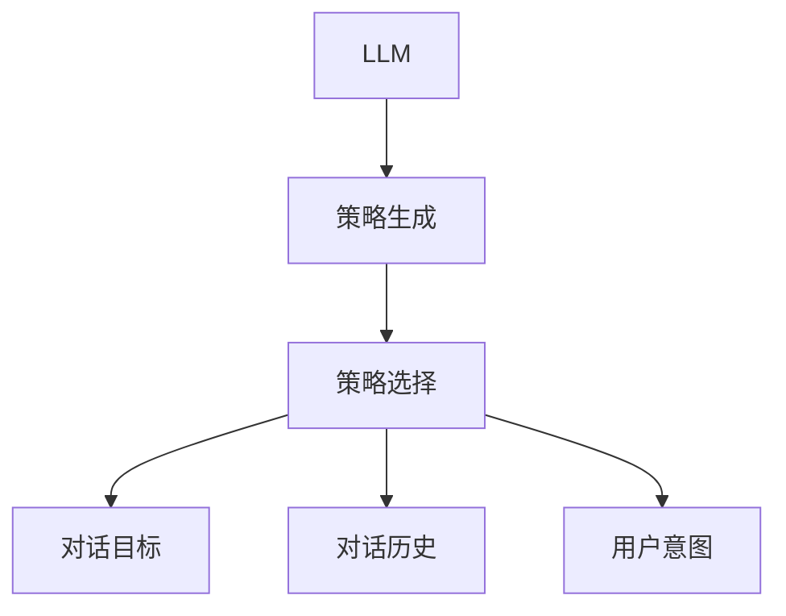
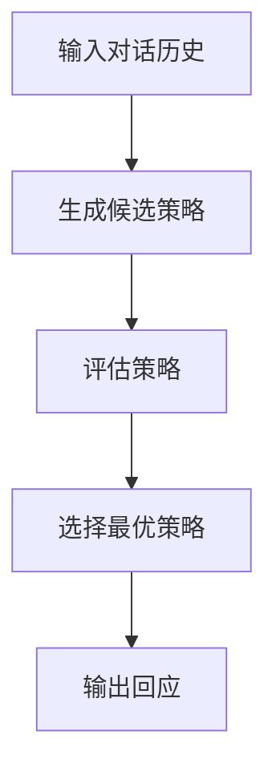
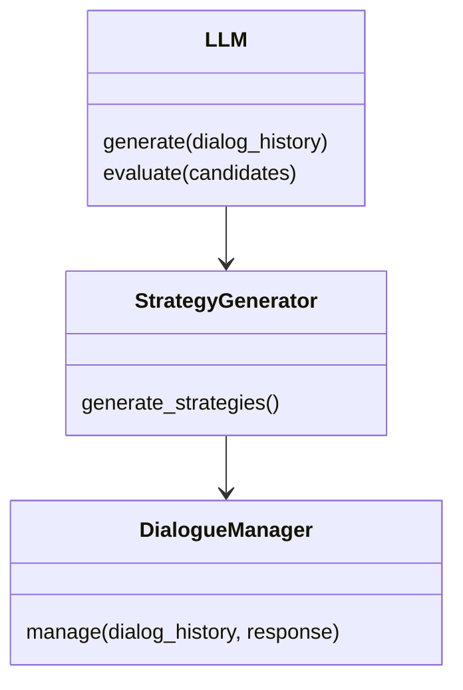
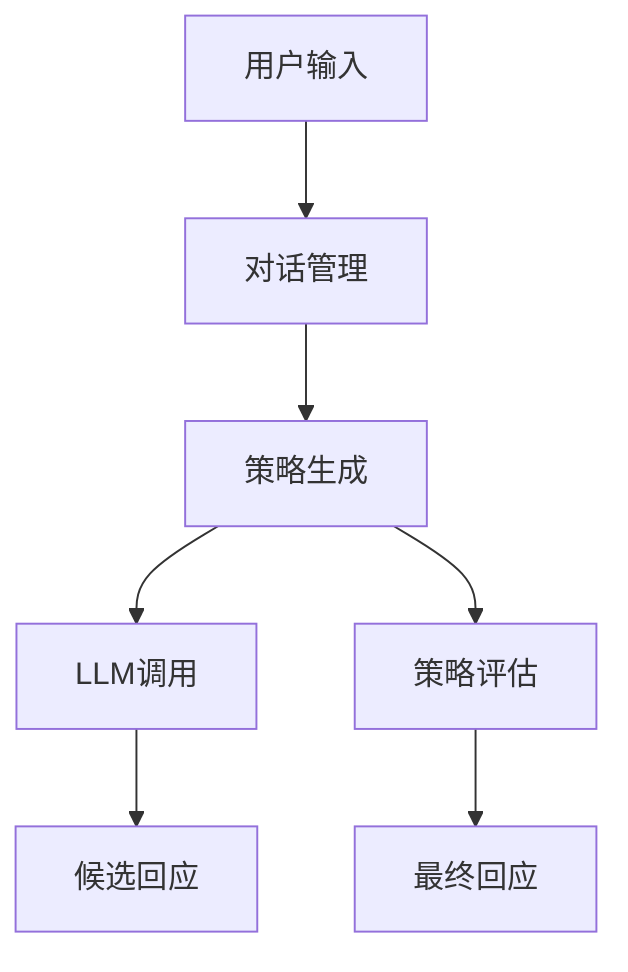
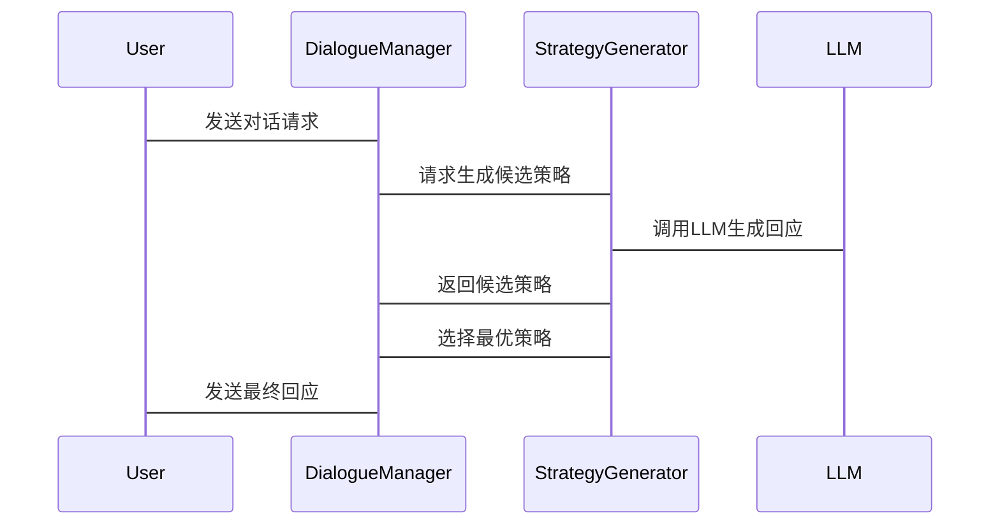

                 


# LLM驱动的AI Agent对话策略学习

> 关键词：LLM，AI Agent，对话策略，自然语言处理，强化学习，系统架构

> 摘要：本文探讨了如何利用大语言模型（LLM）驱动AI Agent的对话策略学习。通过分析LLM与AI Agent的结合，对话策略学习的核心概念与算法原理，以及系统的架构设计，结合实际项目案例，深入剖析了LLM驱动对话策略学习的实现方法和应用价值。

---

# 第一部分: LLM与AI Agent对话策略学习基础

## 第1章: LLM与AI Agent概述

### 1.1 LLM驱动的AI Agent概念

#### 1.1.1 大语言模型（LLM）的基本概念
大语言模型（Large Language Model, LLM）是基于深度学习的自然语言处理模型，具有海量的训练数据和强大的生成能力。LLM能够理解和生成人类语言，已在文本生成、机器翻译、问答系统等领域展现出卓越性能。

#### 1.1.2 AI Agent的核心定义
AI Agent（智能体）是指在特定环境中能够感知并自主行动以实现目标的智能系统。AI Agent可以通过传感器获取信息，通过执行器与环境交互，并基于决策逻辑做出行为选择。

#### 1.1.3 对话策略学习的背景与意义
对话策略学习是AI Agent在与人类或其它智能体交互过程中，通过学习对话历史和上下文，生成符合目标的回应。其目的是使AI Agent能够更加自然、智能地与用户互动。

### 1.2 LLM与AI Agent的结合

#### 1.2.1 LLM在AI Agent中的作用
LLM为AI Agent提供了强大的自然语言理解和生成能力，使得AI Agent能够处理复杂的对话场景，并生成连贯且符合语境的回应。

#### 1.2.2 对话策略学习的核心目标
对话策略学习的目标是通过LLM生成候选回应，并结合上下文、用户意图和对话目标，选择最合适的回应策略。

#### 1.2.3 LLM驱动对话策略的实现路径
- 使用LLM生成多种候选回应
- 基于对话历史和目标对候选回应进行排序
- 通过强化学习或监督学习优化策略

### 1.3 本章小结
本章介绍了LLM和AI Agent的基本概念，并探讨了LLM在对话策略学习中的应用，为后续内容奠定了基础。

---

## 第2章: LLM驱动对话策略学习的背景与应用

### 2.1 对话策略学习的背景

#### 2.1.1 自然语言处理的发展历程
从传统的基于规则的NLP到深度学习驱动的模型，自然语言处理技术取得了长足进步，为对话系统的发展提供了坚实基础。

#### 2.1.2 大语言模型在对话系统中的应用
LLM的出现使得对话系统能够处理更复杂的任务，如上下文理解、情感分析和意图识别。

#### 2.1.3 对话策略学习的必要性
对话策略学习是连接自然语言理解和生成的桥梁，能够使AI Agent更好地适应动态对话场景。

### 2.2 LLM驱动对话策略学习的应用场景

#### 2.2.1 智能客服
通过LLM驱动的对话策略学习，智能客服能够更高效地处理用户咨询，提供个性化服务。

#### 2.2.2 虚拟助手
虚拟助手如智能音箱、手机助手等，通过LLM驱动对话策略学习，能够更自然地与用户互动。

#### 2.2.3 教育领域的智能对话系统
教育对话系统通过LLM驱动的对话策略学习，能够为学生提供个性化的学习指导。

### 2.3 本章小结
本章探讨了对话策略学习的背景及其在智能客服、虚拟助手和教育领域的应用，展示了LLM驱动对话策略学习的重要性和广泛前景。

---

## 第3章: 对话策略学习的核心概念与联系

### 3.1 对话策略学习的核心概念

#### 3.1.1 对话策略的定义
对话策略是指在特定对话场景下，AI Agent选择合适的回应策略以实现对话目标的过程。

#### 3.1.2 LLM在策略生成中的作用
LLM通过生成多种候选回应，为对话策略的选择提供了丰富的可能性。

#### 3.1.3 策略优化的目标与方法
策略优化的目标是最大化对话的成功率和用户满意度，常用方法包括强化学习、监督学习和迁移学习。

### 3.2 LLM与对话策略的关系

#### 3.2.1 LLM生成策略的优缺点
- **优点**：生成能力强、可定制化、适应性高。
- **缺点**：生成内容可能偏离对话目标、需要大量数据支持。

#### 3.2.2 策略学习的反馈机制
通过用户反馈或预设规则，对生成的策略进行评估和优化。

#### 3.2.3 LLM驱动策略学习的系统架构
- 输入：对话历史、用户意图、对话目标
- 输出：生成候选策略并选择最优策略

### 3.3 对话策略学习的核心要素对比

#### 3.3.1 对比分析表格

| 对比维度 | LLM驱动策略 | 基于规则的策略 |
|----------|--------------|----------------|
| 生成能力 | 强大灵活     | 刚性固定       |
| 数据需求 | 高           | 低             |
| 可扩展性 | 高           | 低             |

#### 3.3.2 ER实体关系图


### 3.4 本章小结
本章通过对比分析和图示，详细阐述了对话策略学习的核心概念及其与LLM的关系。

---

## 第4章: LLM驱动对话策略学习的算法原理

### 4.1 算法原理概述

#### 4.1.1 基于强化学习的策略优化
通过定义奖励函数，对策略进行优化。奖励函数反映了策略的成功程度，常用策略梯度方法进行优化。

#### 4.1.2 基于监督学习的策略生成
通过大量标注数据，训练模型生成符合目标的回应策略。

#### 4.1.3 混合学习策略的实现
结合强化学习和监督学习，通过在线学习和离线训练交替进行，提升策略的多样性和适应性。

### 4.2 算法流程图



### 4.3 算法实现代码

#### 4.3.1 Python源代码示例
```python
def generate_response(dialog_history, model):
    # 生成候选策略
    candidates = model.generate(dialog_history)
    # 评估候选策略
    scores = evaluate(candidates, dialog_history)
    # 选择最优策略
    best_candidate = max(candidates, key=lambda x: scores[x])
    return best_candidate
```

#### 4.3.2 代码功能解读
1. `generate_response`函数接收对话历史和模型对象。
2. 调用模型生成候选回应。
3. 使用`evaluate`函数评估候选策略的得分。
4. 选择得分最高的策略作为最终回应。

### 4.4 数学模型与公式

#### 4.4.1 策略梯度公式
策略梯度方法的优化目标为：
$$
\theta \leftarrow \theta + \alpha \nabla_\theta J(\theta)
$$
其中，$J(\theta)$是策略的目标函数，$\alpha$是学习率。

#### 4.4.2 损失函数计算
损失函数定义为：
$$
L = -\sum_{i} y_i \log(p_i) + (1 - y_i) \log(1 - p_i)
$$
其中，$y_i$是真实标签，$p_i$是模型预测概率。

#### 4.4.3 示例说明
假设对话历史为用户询问天气，模型生成多个候选回应，通过计算每个回应的概率，选择概率最高的回应作为最终输出。

### 4.5 本章小结
本章详细介绍了LLM驱动对话策略学习的算法原理，并通过代码和公式进行了具体说明。

---

## 第5章: 系统分析与架构设计方案

### 5.1 系统分析

#### 5.1.1 问题场景介绍
系统需要处理用户与AI Agent之间的对话，确保回应符合用户意图和对话目标。

#### 5.1.2 项目目标与范围
项目目标是设计一个基于LLM的对话策略学习系统，范围包括对话历史处理、候选生成和策略优化。

### 5.2 系统功能设计

#### 5.2.1 领域模型Mermaid类图


#### 5.2.2 功能模块划分
1. LLM生成模块：负责生成候选回应。
2. 策略评估模块：对生成的策略进行评估。
3. 对话管理模块：管理对话流程和状态。

### 5.3 系统架构设计

#### 5.3.1 分层架构图


#### 5.3.2 接口设计说明
- 输入接口：对话历史、用户意图
- 输出接口：生成回应、对话状态

### 5.4 系统交互设计

#### 5.4.1 序列图展示


### 5.5 本章小结
本章通过系统分析和架构设计，明确了各模块的功能和交互流程，为后续的实现奠定了基础。

---

## 第6章: 项目实战

### 6.1 环境安装

#### 6.1.1 安装Python
```bash
python --version
pip install --upgrade pip
```

#### 6.1.2 安装依赖库
```bash
pip install transformers
pip install torch
```

### 6.2 系统核心实现

#### 6.2.1 对话管理模块
```python
class DialogueManager:
    def __init__(self):
        self.dialog_history = []
        self.current_response = ""
    
    def add_to_history(self, message):
        self.dialog_history.append(message)
    
    def generate_response(self):
        # 调用策略生成模块
        pass
```

#### 6.2.2 策略生成模块
```python
class StrategyGenerator:
    def __init__(self, model):
        self.model = model
    
    def generate_strategies(self, dialog_history):
        return self.model.generate(dialog_history)
```

### 6.3 代码功能解读

#### 6.3.1 对话管理模块
- `add_to_history`方法用于记录对话历史。
- `generate_response`方法调用策略生成模块生成候选回应。

#### 6.3.2 策略生成模块
- `generate_strategies`方法调用LLM生成候选策略。

### 6.4 实际案例分析

#### 6.4.1 案例背景
用户询问天气情况，系统需要生成符合用户意图的回应。

#### 6.4.2 对话流程
1. 用户输入：今天天气怎么样？
2. 对话管理模块记录对话历史。
3. 调用策略生成模块生成候选回应。
4. 策略评估模块选择最优回应。
5. 对话管理模块发送最终回应。

### 6.5 项目小结
通过实际案例分析，展示了系统在对话管理、策略生成和评估过程中的具体实现。

---

## 第7章: 最佳实践与未来研究方向

### 7.1 本章小结

#### 7.1.1 小结
本文详细探讨了LLM驱动的AI Agent对话策略学习的实现方法，包括算法原理、系统架构和项目实战。

#### 7.1.2 注意事项
- 数据质量对策略生成影响重大
- 策略评估需要结合具体场景
- 系统设计需考虑可扩展性和可维护性

### 7.2 未来研究方向

#### 7.2.1 研究方向
- 更高效地结合LLM与强化学习
- 探索多模态对话策略学习
- 提升策略的实时性和响应速度

#### 7.2.2 拓展阅读
推荐阅读相关领域的最新论文和技术报告，以获取更深入的理论支持和实践指导。

---

# 作者：AI天才研究院 & 禅与计算机程序设计艺术

---

以上是《LLM驱动的AI Agent对话策略学习》的技术博客文章的完整大纲和内容。如果需要进一步扩展或调整，请随时告知！

