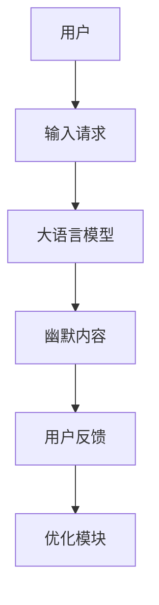
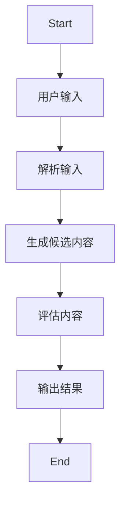
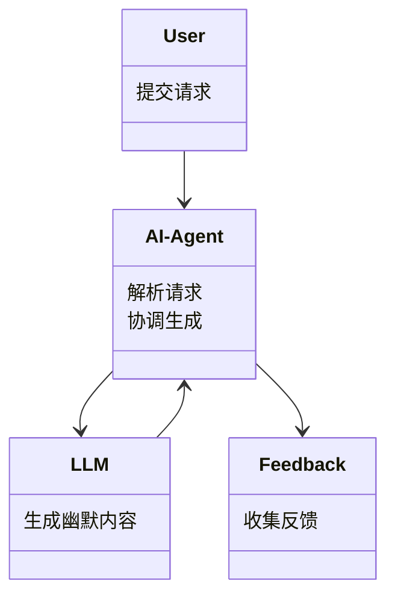

                 


# LLM驱动的AI Agent幽默感生成

> 关键词：LLM, AI Agent, 幽默感生成, 自然语言处理, 人工智能

> 摘要：本文探讨了如何利用大语言模型（LLM）驱动的AI Agent生成幽默感内容。通过分析幽默的类型、生成机制以及算法原理，结合数学模型和实际案例，详细阐述了如何实现幽默生成，并提供了系统的架构设计和项目实战指导。

---

## 第1章：背景介绍

### 1.1 幽默感的定义与重要性

幽默是一种复杂的语言现象，涉及情感、认知和文化因素。它通过语言的巧妙运用、情境的反转或意外的组合引发笑声。幽默在人机交互中尤为重要，能够提升用户体验，使AI更贴近人类情感，增强互动的趣味性。

### 1.2 幽默感生成的挑战

生成幽默需要理解语言的多义性和文化差异，同时具备创造性思维。算法必须在有限的语料库中找到合适的表达，这增加了生成过程的复杂性。此外，幽默的主观性使得不同用户可能对同一内容的反应各异。

### 1.3 LLM与AI Agent的作用

大语言模型（如GPT）具备强大的语言理解和生成能力，能够处理复杂的语义信息。AI Agent作为中间桥梁，负责解析用户需求，协调模型生成幽默内容，确保输出符合特定情境和用户期望。

---

## 第2章：幽默感生成的核心概念与联系

### 2.1 幽默的类型与特征

- **反转式幽默**：通过出人意料的结局引发笑点，常见于笑话和相声。
- **搭讪式幽默**：利用轻松的话题拉近距离，常用于社交场合。
- **无厘头幽默**：以荒诞的情节取胜，适合喜剧表演。

### 2.2 幽默生成的属性对比

| 幽默类型 | 目标用户 | 生成难度 | 适用场景 |
|----------|----------|----------|----------|
| 反转式   | 广泛用户 | 中等     | 对话、笑话 |
| 搭讪式   | 特定用户 | 较低     | 社交互动 |
| 无厘头式 | 娱乐用户 | 较高     | 喜剧表演 |

### 2.3 ER实体关系图



---

## 第3章：幽默感生成的算法原理

### 3.1 基于LLM的幽默生成算法

流程如下：
1. **输入处理**：解析用户输入，提取关键信息。
2. **生成候选内容**：模型生成多个候选幽默内容。
3. **评估模块**：基于预设指标筛选最佳内容。
4. **输出结果**：返回生成的幽默内容。

### 3.2 幽默生成的Mermaid流程图



---

## 第4章：幽默感生成的数学模型与算法实现

### 4.1 基于概率的幽默生成模型

公式：$$ P(\text{幽默内容}|输入) = \frac{P(\text{输入}|\text{幽默内容}) \cdot P(\text{幽默内容})}{P(\text{输入})} $$

### 4.2 概率计算示例

假设输入为“为什么程序员喜欢黑暗模式？”，模型计算生成“因为他们喜欢在夜间工作而不被看到”的概率为0.8，最终输出该内容。

---

## 第5章：系统分析与架构设计

### 5.1 系统功能设计

- **输入处理模块**：接收用户输入，解析关键信息。
- **生成模块**：利用LLM生成幽默内容。
- **反馈模块**：收集用户反馈，优化生成过程。

### 5.2 系统架构图



---

## 第6章：项目实战

### 6.1 环境安装

安装Python和必要的库：
```bash
pip install transformers
pip install torch
```

### 6.2 核心代码实现

```python
from transformers import GPT2LMHeadModel, GPT2Tokenizer

model_name = "gpt2"
tokenizer = GPT2Tokenizer.from_pretrained(model_name)
model = GPT2LMHeadModel.from_pretrained(model_name)

def generate_humor(prompt):
    inputs = tokenizer.encode(prompt, return_tensors="pt")
    outputs = model.generate(inputs, max_length=50, do_sample=True)
    return tokenizer.decode(outputs[0], skip_special_tokens=True)

# 示例输入
prompt = "为什么程序猿喜欢喝咖啡？"
result = generate_humor(prompt)
print(result)
```

---

## 第7章：最佳实践与小结

### 7.1 经验总结

- 数据选择：优先使用多样化的幽默语料，覆盖不同文化和情境。
- 模型优化：根据反馈不断微调模型，提升生成质量。
- 用户反馈：实时收集用户反馈，调整生成策略。

### 7.2 小结

本文详细探讨了LLM驱动的AI Agent在幽默生成中的应用，从理论到实践，为实现智能、有趣的对话系统提供了参考。

---

## 作者信息

作者：AI天才研究院  
联系邮箱：contact@aitianji.com  
GitHub链接：https://github.com/ai天才研究院

