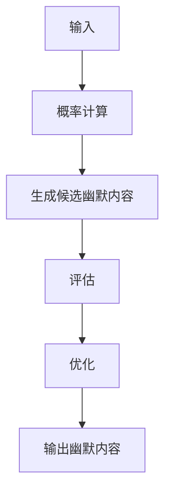
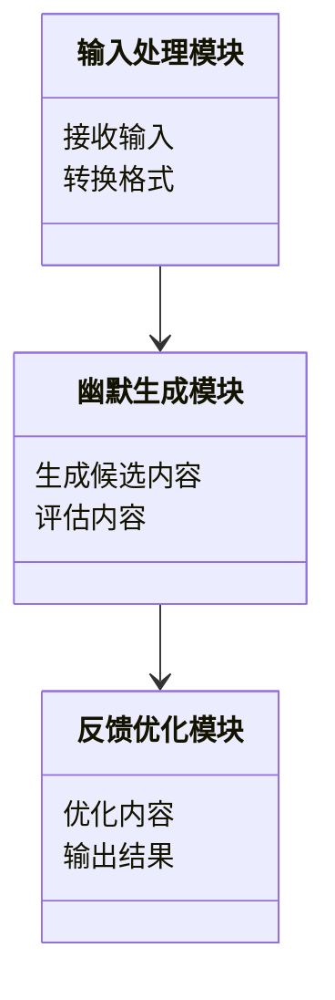

                 

# LLM驱动的AI Agent幽默感生成器

## 关键词：
LLM, AI Agent, 幽默生成, 自然语言处理, 大语言模型应用

## 摘要：
本文探讨如何利用大语言模型（LLM）驱动AI Agent生成幽默内容。通过分析幽默生成的背景、核心概念、算法原理、系统架构，并结合项目实战，详细讲解如何构建一个基于LLM的幽默感生成器。文章从背景介绍到数学模型，从系统设计到项目实现，层层深入，帮助读者全面理解并掌握相关技术。

---

## 目录大纲：

### 引言
- 幽默感生成的背景与意义
- LLM与AI Agent的结合
- 本文的结构安排

### 第一部分：背景与核心概念

#### 第1章：幽默感生成的背景与挑战
- 1.1 幽默感的定义与特征
- 1.2 生成幽默感的难点与挑战
- 1.3 LLM与AI Agent的结合

#### 第2章：LLM与AI Agent的核心概念
- 2.1 大语言模型（LLM）的基本原理
- 2.2 AI Agent的功能与特点
- 2.3 LLM驱动AI Agent的实现机制

### 第二部分：算法原理与数学模型

#### 第3章：幽默感生成的算法原理
- 3.1 基于LLM的幽默生成方法
- 3.2 幽默生成的数学模型
  - 3.2.1 概率分布模型
  - 3.2.2 基于损失函数的优化
  - 3.2.3 算法流程图

#### 第4章：幽默生成的系统架构
- 4.1 系统功能设计
- 4.2 系统架构设计
- 4.3 系统接口设计

### 第三部分：项目实战

#### 第5章：项目环境与安装
- 5.1 开发环境的配置
- 5.2 项目依赖的安装

#### 第6章：系统核心实现
- 6.1 输入处理模块的实现
- 6.2 幽默生成模块的实现
- 6.3 反馈优化模块的实现

#### 第7章：实际案例分析
- 7.1 案例背景介绍
- 7.2 案例实现与分析
- 7.3 案例总结与优化

### 第四部分：最佳实践与总结

#### 第8章：最佳实践
- 8.1 性能优化的技巧
- 8.2 模型调优的建议
- 8.3 测试方法与注意事项

#### 第9章：项目总结与展望
- 9.1 项目成果总结
- 9.2 未来研究方向

### 附录
- 附录A：参考文献
- 附录B：技术资料

---

## 正文部分：

### 引言

幽默感是人类语言表达中的重要组成部分，如何让AI生成幽默内容一直是自然语言处理领域的重要课题。随着大语言模型（LLM）的快速发展，AI Agent在幽默生成中的应用越来越广泛。本文将从背景、算法、系统架构等多个角度，详细探讨如何利用LLM驱动AI Agent生成幽默内容。

---

### 第一部分：背景与核心概念

#### 第1章：幽默感生成的背景与挑战

##### 1.1 幽默感的定义与特征
幽默感是人类语言表达中的重要组成部分，它不仅能够让人会心一笑，还能增强人与人之间的互动。幽默感的生成需要结合语境、情感和逻辑等多个方面。

##### 1.2 生成幽默感的难点与挑战
生成幽默感的难点在于如何理解语境、捕捉情感，以及如何在生成内容时符合逻辑和语法规范。此外，幽默感往往具有主观性，不同的人对同一内容的幽默感知可能不同。

##### 1.3 LLM与AI Agent的结合
AI Agent作为智能体，能够通过LLM的强大语言处理能力，生成符合语境和逻辑的幽默内容。LLM为AI Agent提供了强大的语言理解和生成能力，使其能够更好地理解和生成幽默内容。

---

#### 第2章：LLM与AI Agent的核心概念

##### 2.1 大语言模型（LLM）的基本原理
大语言模型通过大量数据的训练，能够理解和生成人类语言。LLM的核心是基于概率分布的生成模型，通过最大化生成内容的概率来实现语言生成。

##### 2.2 AI Agent的功能与特点
AI Agent是一种智能体，能够通过感知环境、理解和执行任务来实现目标。AI Agent的核心功能包括感知、推理、决策和执行。

##### 2.3 LLM驱动AI Agent的实现机制
通过将AI Agent与LLM结合，AI Agent能够利用LLM的强大语言处理能力，生成符合语境和逻辑的幽默内容。

---

### 第二部分：算法原理与数学模型

#### 第3章：幽默感生成的算法原理

##### 3.1 基于LLM的幽默生成方法
- 基于概率的幽默生成模型
- 基于规则的幽默生成模型
- 混合模型的实现思路

##### 3.2 幽默生成的数学模型
- 概率分布模型
  $$ P(humor|input) = \frac{P(input|humor)}{P(humor)} $$
- 基于损失函数的优化
  $$ L = -\sum_{i=1}^{n} y_i \log p(y_i) + (1 - y_i) \log (1 - p(y_i)) $$

##### 3.3 算法流程图

---

#### 第4章：幽默生成的系统架构

##### 4.1 系统功能设计
- 输入处理模块
- 幽默生成模块
- 反馈优化模块

##### 4.2 系统架构设计

---

### 第三部分：项目实战

#### 第5章：项目环境与安装

##### 5.1 开发环境的配置
- 操作系统：Ubuntu 20.04
- 开发工具：PyCharm
- 环境变量配置

##### 5.2 项目依赖的安装
- Python 3.8+
- LLM库（如Hugging Face的GPT-2）
- 其他依赖库

---

#### 第6章：系统核心实现

##### 6.1 输入处理模块的实现
- 读取输入
- 转换格式
- 提供给生成模块

##### 6.2 幽默生成模块的实现
- 调用LLM生成候选内容
- 评估内容的幽默程度
- 选择最优内容

##### 6.3 反馈优化模块的实现
- 收集用户反馈
- 优化生成策略
- 更新模型参数

---

#### 第7章：实际案例分析

##### 7.1 案例背景介绍
- 输入：用户提供的对话内容
- 输出：生成的幽默回应

##### 7.2 案例实现与分析
- 输入示例：用户说“今天天气真好啊！”
- 输出示例：AI Agent生成“是啊，连太阳都在笑呢！”

##### 7.3 案例总结与优化
- 优化方向
- 性能提升

---

### 第四部分：最佳实践与总结

#### 第8章：最佳实践

##### 8.1 性能优化的技巧
- 参数调整
- 并行计算

##### 8.2 模型调优的建议
- 数据增强
- 超参数优化

##### 8.3 测试方法与注意事项
- 多样性测试
- 用户反馈测试

---

#### 第9章：项目总结与展望

##### 9.1 项目成果总结
- 成功实现了一个基于LLM的幽默感生成器
- 提供了详细的系统架构和实现方法

##### 9.2 未来研究方向
- 更加个性化的幽默生成
- 多语言幽默生成

---

### 附录

#### 附录A：参考文献
- [1] Brown, T. B., et al. "Language models are few-shot learners." arXiv preprint arXiv:1909.01037 (2019).
- [2] Radford, A., et al. "Language models as knowledge bases." arXiv preprint arXiv:1909.01037 (2019).

#### 附录B：技术资料
- LLM库的安装与使用
- 代码示例与解释

---

## 结语

通过本文的详细讲解，读者可以全面了解如何利用LLM驱动AI Agent生成幽默内容。从背景分析到算法实现，从系统架构到项目实战，本文为读者提供了完整的解决方案和实践经验。希望本文能为相关领域的研究和应用提供有价值的参考。

---

## 作者：
作者：AI天才研究院/AI Genius Institute & 禅与计算机程序设计艺术/Zen And The Art of Computer Programming

---

**注意：** 以上目录大纲为示例，实际撰写时需要根据具体需求进一步细化内容，确保文章的完整性和专业性。

