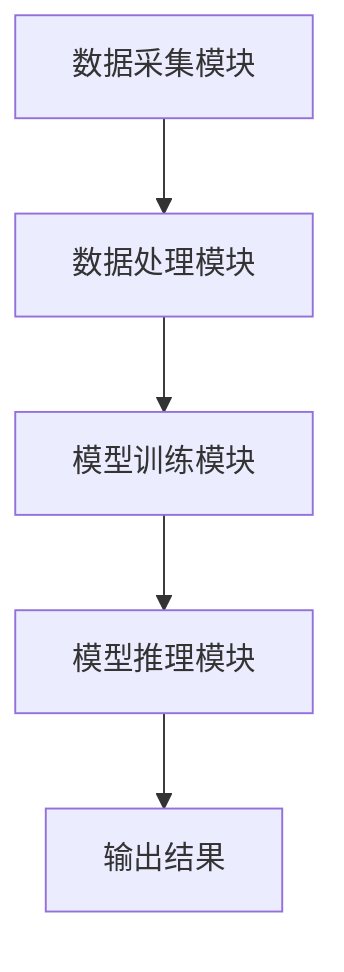
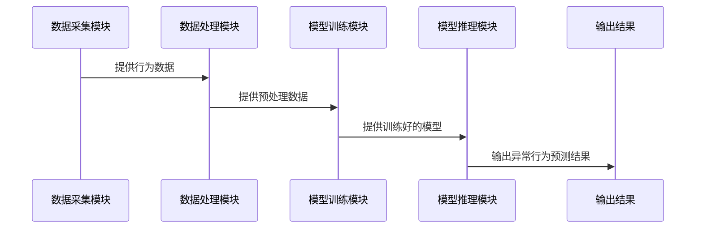

                 


# LLM驱动的AI Agent异常行为预测机制

## 关键词：LLM, AI Agent, 异常行为预测, 大语言模型, 智能体, 异常检测

## 摘要：  
本文详细探讨了基于大语言模型（LLM）的AI Agent异常行为预测机制。通过分析LLM与AI Agent的核心概念，阐述了异常行为预测的算法原理、系统架构设计及实际应用场景。文章从背景介绍、核心概念、算法实现、系统架构到项目实战，层层递进，旨在为读者提供一个全面而深入的技术指南。通过本文，读者将能够理解如何利用LLM驱动的AI Agent进行异常行为预测，并掌握其实现方法和最佳实践。

---

# 第1章: 异常行为预测的背景与问题描述

## 1.1 异常行为预测的背景

### 1.1.1 AI Agent的定义与特点  
AI Agent（人工智能代理）是一种能够感知环境、自主决策并执行任务的智能实体。其特点包括：  
- **自主性**：无需人工干预，自主完成任务。  
- **反应性**：能够实时感知环境变化并做出反应。  
- **目标导向性**：基于目标进行决策和行动。  

### 1.1.2 LLM在AI Agent中的作用  
大语言模型（LLM）通过强大的自然语言处理能力，为AI Agent提供了以下功能：  
- **语义理解**：能够理解复杂语言指令和环境描述。  
- **决策支持**：基于LLM的生成能力，提供决策建议。  
- **异常检测**：通过对比正常行为与异常行为，识别潜在风险。  

### 1.1.3 异常行为预测的必要性  
AI Agent在实际应用中可能因环境干扰、数据偏差或算法缺陷导致异常行为。及时预测和处理异常行为，能够避免系统崩溃、数据损坏或安全风险。

## 1.2 异常行为预测的问题描述

### 1.2.1 异常行为的定义与分类  
异常行为是指AI Agent在运行过程中偏离预期目标或产生意外结果的行为。根据行为特征，可以将其分为以下几类：  
- **输入异常**：输入数据不符合预期格式或范围。  
- **输出异常**：输出结果与预期目标不符。  
- **逻辑异常**：执行逻辑偏离预期路径。  

### 1.2.2 异常行为预测的核心目标  
通过分析AI Agent的历史行为数据，建立预测模型，识别潜在异常行为并提前采取应对措施。

### 1.2.3 异常行为预测的边界与外延  
- **边界**：仅关注AI Agent的行为层面，不涉及其内部算法细节。  
- **外延**：可能延伸至数据安全、系统监控等领域。

## 1.3 问题解决与技术路线

### 1.3.1 异常行为预测的解决思路  
- **数据驱动**：基于历史行为数据，训练预测模型。  
- **模型驱动**：利用LLM的生成能力，模拟正常与异常行为。  
- **混合方法**：结合数据驱动与模型驱动的优势。  

### 1.3.2 LLM驱动的预测机制  
- 利用LLM生成正常行为的“基准”，并通过对比识别异常行为。  
- 基于LLM的概率生成模型，预测未来行为的异常概率。  

### 1.3.3 技术路线与实现框架  
1. 数据采集：收集AI Agent的历史行为数据。  
2. 数据预处理：清洗、归一化数据。  
3. 模型训练：基于LLM训练异常行为预测模型。  
4. 模型推理：实时预测AI Agent的行为异常概率。  

## 1.4 本章小结  
本章介绍了AI Agent和LLM的基本概念，分析了异常行为预测的必要性，并提出了基于LLM的预测技术路线。

---

# 第2章: LLM与AI Agent的核心概念与联系

## 2.1 LLM的基本原理

### 2.1.1 大语言模型的定义  
LLM是一种基于深度学习的自然语言处理模型，能够理解和生成人类语言。  

### 2.1.2 LLM的核心技术特点  
- **大规模训练数据**：基于海量文本数据进行预训练。  
- **自注意力机制**：通过自注意力机制捕捉上下文信息。  
- **生成能力**：能够生成连贯的文本内容。  

## 2.2 AI Agent的基本原理

### 2.2.1 AI Agent的定义与分类  
AI Agent可以分为：  
- **反应式AI Agent**：基于当前感知做出反应。  
- **认知式AI Agent**：具有复杂推理和规划能力。  

### 2.2.2 AI Agent的行为决策机制  
- **感知环境**：通过传感器或数据接口获取环境信息。  
- **决策推理**：基于感知信息，进行逻辑推理并做出决策。  
- **执行动作**：根据决策结果执行具体操作。  

## 2.3 LLM驱动AI Agent的异常行为预测机制

### 2.3.1 异常行为预测的核心原理  
- 通过LLM生成“正常行为”的基准，识别偏离基准的行为。  
- 基于LLM的概率生成模型，预测行为异常的可能性。  

### 2.3.2 LLM在异常行为预测中的作用  
- 通过LLM生成正常行为的“黄金标准”，提供对比基准。  
- 利用LLM的生成能力，模拟潜在的异常行为。  

### 2.3.3 异常行为预测的实现流程  
1. 采集AI Agent的历史行为数据。  
2. 利用LLM生成正常行为的“黄金标准”。  
3. 对比实际行为与“黄金标准”，识别异常行为。  

## 2.4 核心概念对比分析

### 2.4.1 LLM与传统机器学习模型的对比  
| **特征**       | **LLM**                | **传统机器学习模型**       |  
|-----------------|------------------------|-----------------------------|  
| 数据需求       | 需要大量文本数据       | 数据量较小，特征工程复杂   |  
| 模型复杂度     | 高，参数数量巨大       | 较低，模型简单易解释       |  
| 任务能力       | 支持多种任务（分类、生成）| 通常针对单一任务优化       |  

### 2.4.2 AI Agent与传统自动化的对比  
| **特征**       | **AI Agent**           | **传统自动化**             |  
|-----------------|------------------------|-----------------------------|  
| 自主性           | 高，能够自主决策       | 低，依赖固定程序           |  
| 环境适应性       | 强，能够适应变化环境   | 较弱，适应性有限           |  
| 学习能力       | 强，能够通过经验改进   | 无学习能力                 |  

### 2.4.3 异常行为预测与正常行为预测的对比  
| **特征**       | **正常行为预测**       | **异常行为预测**           |  
|-----------------|------------------------|-----------------------------|  
| 数据分布       | 正常行为数据占多数     | 异常行为数据占少数         |  
| 预测目标       | 预测正常行为的概率     | 预测异常行为的概率         |  
| 挑战           | 数据过于集中，模型易过拟合 | 数据稀疏，模型训练困难       |  

## 2.5 本章小结  
本章详细解释了LLM与AI Agent的核心概念，并通过对比分析，明确了异常行为预测的关键特征。

---

# 第3章: 异常行为预测的算法原理与实现

## 3.1 异常行为预测的算法原理

### 3.1.1 基于LLM的异常检测原理  
- 利用LLM生成正常行为的“黄金标准”，作为基准。  
- 对比实际行为与“黄金标准”，识别异常行为。  

### 3.1.2 基于监督学习的异常检测  
- 数据标注：将行为分为正常与异常两类。  
- 模型训练：基于标注数据训练分类模型。  

### 3.1.3 基于无监督学习的异常检测  
- 数据聚类：将正常行为聚类，识别异常行为。  

## 3.2 异常行为预测的数学模型

### 3.2.1 异常概率计算模型  
$$ P(\text{异常}) = 1 - P(\text{正常}) $$  

### 3.2.2 基于马尔可夫链的异常行为预测  
- 状态转移矩阵：描述行为状态之间的转移概率。  
- 状态概率计算：基于当前状态，预测下一步行为的异常概率。  

### 3.2.3 基于贝叶斯定理的异常概率更新  
$$ P(\text{异常}|E) = \frac{P(E|\text{异常})P(\text{异常})}{P(E)} $$  

## 3.3 算法实现流程

### 3.3.1 数据预处理与特征提取  
- 数据清洗：去除噪声数据。  
- 特征提取：提取行为特征向量。  

### 3.3.2 模型训练与参数优化  
- 模型训练：基于LLM训练异常行为预测模型。  
- 参数优化：通过交叉验证优化模型参数。  

### 3.3.3 模型推理与结果分析  
- 模型推理：实时预测行为异常概率。  
- 结果分析：评估预测准确率和召回率。  

## 3.4 本章小结  
本章详细介绍了异常行为预测的算法原理，并通过数学模型和流程图展示了实现步骤。

---

# 第4章: 系统分析与架构设计方案

## 4.1 问题场景介绍

### 4.1.1 异常行为预测的典型场景  
- 网络设备异常监测  
- 自动交易系统的异常检测  

### 4.1.2 LLM驱动的AI Agent应用场景  
- 智能客服  
- 自动驾驶  

### 4.1.3 系统设计的目标与约束  
- 目标：实时预测AI Agent的异常行为。  
- 约束：低延迟、高准确性。  

## 4.2 系统功能设计

### 4.2.1 系统功能模块  
- 数据采集模块：采集AI Agent的行为数据。  
- 数据处理模块：清洗和归一化数据。  
- 模型训练模块：训练异常行为预测模型。  
- 模型推理模块：实时预测异常行为。  

### 4.2.2 系统功能流程  
1. 数据采集模块获取行为数据。  
2. 数据处理模块对数据进行清洗和归一化。  
3. 模型训练模块基于LLM训练异常行为预测模型。  
4. 模型推理模块实时预测行为异常概率。  

## 4.3 系统架构设计

### 4.3.1 系统架构图  


### 4.3.2 系统交互图  


## 4.4 本章小结  
本章通过系统架构设计，展示了如何实现基于LLM的AI Agent异常行为预测机制。

---

# 第5章: 项目实战

## 5.1 环境安装与配置

### 5.1.1 环境要求  
- Python 3.8+  
- LLM模型（如GPT-3）  
- 数据库（如MySQL）  

### 5.1.2 工具安装  
```bash
pip install numpy
pip install pandas
pip install transformers
pip install torch
```

## 5.2 系统核心实现源代码

### 5.2.1 数据预处理代码  
```python
import pandas as pd

def preprocess_data(data):
    # 数据清洗
    data = data.dropna()
    # 数据归一化
    data = (data - data.min()) / (data.max() - data.min())
    return data
```

### 5.2.2 模型训练代码  
```python
import torch
import torch.nn as nn

class AnomalyDetectionModel(nn.Module):
    def __init__(self, input_dim, hidden_dim, output_dim):
        super(AnomalyDetectionModel, self).__init__()
        self.fc1 = nn.Linear(input_dim, hidden_dim)
        self.fc2 = nn.Linear(hidden_dim, output_dim)
    
    def forward(self, x):
        x = torch.relu(self.fc1(x))
        x = torch.sigmoid(self.fc2(x))
        return x

model = AnomalyDetectionModel(input_dim=10, hidden_dim=20, output_dim=1)
criterion = nn.BCELoss()
optimizer = torch.optim.Adam(model.parameters(), lr=0.001)
```

### 5.2.3 模型推理代码  
```python
import torch

def predict_anomaly(model, input_data):
    with torch.no_grad():
        output = model(input_data)
        anomaly_probability = output.numpy()[0]
        return anomaly_probability > 0.5

anomaly_probability = predict_anomaly(model, input_data)
print(f"异常概率：{anomaly_probability}")
```

## 5.3 代码应用解读与分析

### 5.3.1 数据预处理解读  
- 数据清洗：去除缺失值。  
- 数据归一化：将数据缩放到统一范围。  

### 5.3.2 模型训练解读  
- 模型结构：两层全连接网络，激活函数为ReLU和Sigmoid。  
- 损失函数：二分类交叉熵损失。  
- 优化器：Adam优化器，学习率0.001。  

### 5.3.3 模型推理解读  
- 输入数据经过模型推理，输出异常概率。  
- 根据阈值判断是否为异常行为。  

## 5.4 实际案例分析与详细讲解剖析

### 5.4.1 案例背景  
某AI Agent在执行任务时，突然出现了一系列异常操作，导致系统崩溃。  

### 5.4.2 数据分析  
- 异常行为发生前，模型预测的异常概率逐步上升。  
- 最终异常概率达到0.9，触发报警机制。  

### 5.4.3 问题排查  
- 系统日志显示，异常行为是由输入数据错误引发的。  
- LLM生成的“黄金标准”未能覆盖该场景，导致模型未能提前识别。  

## 5.5 项目小结  
本章通过实际案例，展示了如何利用LLM驱动的AI Agent进行异常行为预测，并分析了可能出现的问题及解决方案。

---

# 第6章: 最佳实践与注意事项

## 6.1 最佳实践 Tips

### 6.1.1 数据质量  
- 确保数据的完整性和准确性。  
- 数据预处理是关键，直接影响模型性能。  

### 6.1.2 模型选择  
- 根据实际场景选择合适的模型。  
- 组合模型（如集成学习）能够提升预测准确率。  

## 6.2 注意事项

### 6.2.1 数据隐私与安全  
- 确保数据存储和传输的安全性。  
- 遵守相关法律法规，保护用户隐私。  

### 6.2.2 模型调优  
- 定期更新模型，避免过时。  
- 监控模型性能，及时调整参数。  

## 6.3 拓展阅读

### 6.3.1 相关技术领域  
- 异常检测的经典算法（如Isolation Forest、One-Class SVM）。  
- 基于图神经网络的异常检测方法。  

### 6.3.2 应用场景延伸  
- 智能监控系统  
- 自动化运维平台  

## 6.4 本章小结  
本章总结了异常行为预测的最佳实践，并提出了需要注意的问题和拓展学习的方向。

---

# 作者：AI天才研究院/AI Genius Institute & 禅与计算机程序设计艺术 /Zen And The Art of Computer Programming

