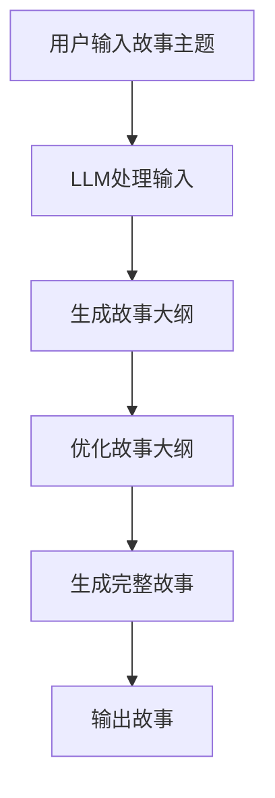
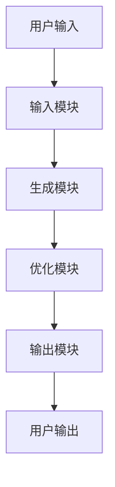

                 


# LLM驱动的AI Agent故事生成与叙事能力

> 关键词：LLM, AI Agent, 故事生成, 叙事能力, 大语言模型, 人工智能, 故事创作

> 摘要：本文深入探讨了LLM（大语言模型）驱动的AI Agent在故事生成与叙事能力方面的能力。通过分析故事生成的原理、算法优化、系统架构以及实际应用案例，本文揭示了LLM驱动的AI Agent如何在叙事能力方面取得突破，并为未来的智能化创作提供了方向。文章结合理论与实践，详细阐述了从基础概念到实际应用的全过程。

---

# 第一部分: LLM驱动的AI Agent概述

## 第1章: LLM与AI Agent的基本概念

### 1.1 LLM的定义与特点

#### 1.1.1 大语言模型的定义
大语言模型（Large Language Model, LLM）是指基于大量文本数据训练的深度学习模型，如GPT系列、BERT系列等。这些模型通过学习海量数据，能够理解和生成人类语言。

**特点：**
- **规模大**：模型参数通常在百万到百亿级别。
- **通用性**：能够处理多种语言任务，如翻译、问答、文本生成等。
- **上下文理解**：能够通过上下文理解语义，生成连贯的文本。

#### 1.1.2 LLM的核心特点
- **大规模预训练**：通过预训练技术，模型能够学习语言的规律和语义。
- **生成能力**：能够生成高质量的文本，包括文章、对话、故事等。
- **可微调**：可以根据具体任务进行微调，适应不同的应用场景。

#### 1.1.3 LLM与传统NLP模型的区别
- **数据量**：LLM使用了更大的数据集和更多的参数。
- **任务通用性**：传统NLP模型通常针对特定任务设计，而LLM可以处理多种任务。
- **生成能力**：LLM在生成任务上表现更优。

### 1.2 AI Agent的定义与特点

#### 1.2.1 AI Agent的定义
AI Agent（人工智能代理）是指能够感知环境并采取行动以实现目标的智能体。AI Agent可以是软件程序，也可以是机器人，能够与用户交互，完成特定任务。

**特点：**
- **自主性**：能够在没有外部干预的情况下自主决策。
- **反应性**：能够根据环境变化实时调整行为。
- **目标导向**：所有行为都围绕实现特定目标展开。

#### 1.2.2 AI Agent的核心特点
- **感知能力**：能够通过传感器或数据接口感知环境。
- **推理能力**：能够基于感知的信息进行推理和决策。
- **行动能力**：能够根据决策结果采取行动。

#### 1.2.3 AI Agent与传统AI的区别
- **自主性**：AI Agent更强调自主性，而传统AI通常依赖于外部指令。
- **适应性**：AI Agent能够根据环境变化调整行为，传统AI则较少具备这种能力。
- **目标导向**：AI Agent的行为始终围绕目标展开，而传统AI可能仅完成特定任务。

### 1.3 LLM驱动的AI Agent的结合

#### 1.3.1 LLM与AI Agent的结合方式
- **直接集成**：将LLM作为AI Agent的核心模块，用于处理语言任务。
- **协同工作**：AI Agent通过调用LLM API，利用其生成能力完成任务。

#### 1.3.2 LLM驱动AI Agent的优势
- **语言处理能力**：LLM提供了强大的语言理解与生成能力。
- **灵活性**：AI Agent可以根据需求灵活调整行为，结合LLM的能力，能够处理多种任务。
- **高效性**：通过LLM的快速生成能力，AI Agent可以更高效地完成任务。

#### 1.3.3 LLM驱动AI Agent的应用场景
- **智能助手**：如Siri、Alexa等，能够通过自然语言处理与用户交互。
- **内容生成**：如自动化生成新闻稿、营销文案等。
- **教育辅助**：如智能辅导系统，通过LLM生成教学内容。

---

## 第2章: LLM驱动的AI Agent技术背景

### 2.1 大语言模型的发展历程

#### 2.1.1 从规则驱动到数据驱动的转变
- **规则驱动**：早期的NLP系统依赖于专家制定的规则，如基于专家知识的分词、句法分析等。
- **数据驱动**：随着深度学习的发展，NLP模型开始依赖于大量数据进行训练，而非手动规则。

#### 2.1.2 大语言模型的崛起
- **技术突破**：深度学习模型如RNN、Transformer的出现，使得大语言模型的训练成为可能。
- **计算能力提升**：GPU的出现和云计算的发展，使得训练大规模模型成为可能。

#### 2.1.3 LLM在AI Agent中的应用
- **自然语言理解**：通过LLM理解用户的意图。
- **对话生成**：通过LLM生成自然的对话回应。
- **内容创作**：通过LLM生成文章、故事等。

### 2.2 AI Agent的演进

#### 2.2.1 从简单脚本到复杂系统的转变
- **早期AI Agent**：基于简单的规则和脚本，能够处理简单的任务。
- **现代AI Agent**：结合机器学习、深度学习等技术，具备更强的自主性和适应性。

#### 2.2.2 AI Agent的智能化提升
- **学习能力**：通过机器学习，AI Agent能够从经验中学习，提升任务处理能力。
- **推理能力**：通过逻辑推理，AI Agent能够处理更复杂的任务。

#### 2.2.3 LLM对AI Agent能力的增强
- **语言处理**：通过LLM，AI Agent能够更自然地与人类交互。
- **内容生成**：通过LLM，AI Agent能够生成高质量的内容。

### 2.3 当前技术背景与挑战

#### 2.3.1 技术背景
- **技术进步**：深度学习、大语言模型的快速发展，为AI Agent提供了强大的技术支持。
- **应用场景**：AI Agent已经在智能助手、教育、医疗等领域得到了广泛应用。

#### 2.3.2 当前挑战
- **计算资源**：训练和运行大语言模型需要大量的计算资源。
- **模型泛化能力**：大语言模型在特定领域的泛化能力有限。
- **安全与伦理**：AI Agent的使用涉及到数据隐私、安全等问题。

#### 2.3.3 未来发展方向
- **模型优化**：优化模型结构，降低计算成本。
- **多模态结合**：将LLM与其他模态（如视觉、音频）结合，提升AI Agent的综合能力。
- **人机协作**：研究人机协作的新模式，提升AI Agent的用户体验。

---

# 第二部分: LLM驱动的AI Agent故事生成原理

## 第3章: 故事生成的基本原理

### 3.1 故事生成的流程

#### 3.1.1 输入处理
- **主题输入**：用户输入故事的主题，如“科幻冒险”、“爱情故事”等。
- **参数设置**：设置生成的长度、风格、角色等参数。

#### 3.1.2 生成策略
- **基于LLM的生成**：通过LLM生成故事的初稿。
- **迭代优化**：根据反馈，对生成的故事进行优化。

#### 3.1.3 输出优化
- **语言优化**：对生成的文本进行润色，提升可读性。
- **逻辑优化**：检查故事的逻辑是否连贯，调整不合理的情节。

### 3.2 LLM在故事生成中的角色

#### 3.2.1 LLM作为内容生成器
- **初稿生成**：通过LLM快速生成故事的初稿。
- **情节扩展**：利用LLM扩展故事的情节，丰富故事内容。

#### 3.2.2 LLM作为编辑助手
- **语言优化**：通过LLM对生成的故事进行语言优化。
- **情节建议**：根据生成的故事，提供建设性的修改建议。

#### 3.2.3 LLM作为创作指导
- **创作灵感**：通过LLM激发创作灵感，生成故事的主题、情节等。
- **风格匹配**：根据用户指定的风格，生成符合要求的故事内容。

### 3.3 故事生成的算法流程



---

## 第4章: LLM驱动的AI Agent故事生成的算法优化

### 4.1 基于LLM的故事生成算法

#### 4.1.1 基本算法流程
1. **输入处理**：接收用户的输入，如故事主题、风格等。
2. **生成初稿**：通过LLM生成故事的初稿。
3. **优化**：根据反馈，对生成的故事进行优化，包括语言优化、情节调整等。

#### 4.1.2 算法优化策略
- **温度参数**：调整生成过程中的温度参数，控制生成内容的创意性和稳定性。
- **重复惩罚**：通过惩罚重复的词语或短语，避免生成冗余的内容。

### 4.2 基于强化学习的优化

#### 4.2.1 强化学习的基本原理
- **奖励机制**：通过奖励机制，训练模型生成更符合用户期望的内容。
- **策略优化**：通过策略优化，提升生成内容的质量。

#### 4.2.2 在故事生成中的应用
- **基于反馈的优化**：通过用户的反馈，调整生成策略，提升故事质量。
- **基于模型的优化**：通过模型内部的优化算法，提升生成内容的质量。

---

## 第5章: LLM驱动的AI Agent叙事能力

### 5.1 叙事能力的核心要素

#### 5.1.1 情节构建
- **情节连贯性**：生成的故事需要情节连贯，逻辑合理。
- **情节丰富性**：生成的故事需要情节丰富，吸引读者。

#### 5.1.2 角色塑造
- **角色一致性**：生成的角色需要保持一致性，避免角色性格突变。
- **角色深度**：生成的角色需要有深度，能够引发读者共鸣。

#### 5.1.3 场景描写
- **场景真实感**：生成的场景需要具有真实感，能够让读者身临其境。
- **场景多样性**：生成的场景需要多样化，避免单调。

### 5.2 基于LLM的叙事优化

#### 5.2.1 情节优化
- **情节连贯性优化**：通过LLM优化情节的连贯性，确保故事逻辑合理。
- **情节丰富性优化**：通过LLM扩展情节，丰富故事内容。

#### 5.2.2 角色优化
- **角色一致性优化**：通过LLM确保角色的一致性，避免性格突变。
- **角色深度优化**：通过LLM增加角色的深度，使角色更加立体。

#### 5.2.3 场景优化
- **场景真实感优化**：通过LLM优化场景的描写，增强真实感。
- **场景多样性优化**：通过LLM扩展场景的多样性，避免单调。

---

## 第6章: 系统架构与实现

### 6.1 系统架构设计

#### 6.1.1 功能模块设计
- **输入模块**：接收用户的输入，如故事主题、风格等。
- **生成模块**：通过LLM生成故事内容。
- **优化模块**：对生成的故事进行优化，包括语言优化、情节调整等。
- **输出模块**：将优化后的故事输出给用户。

#### 6.1.2 系统架构图



### 6.2 系统实现细节

#### 6.2.1 输入模块实现
- **输入接口**：提供API接口，接收用户的输入。
- **输入处理**：对用户的输入进行预处理，提取关键信息。

#### 6.2.2 生成模块实现
- **LLM调用**：调用大语言模型API，生成故事内容。
- **生成策略**：根据用户的输入，选择合适的生成策略。

#### 6.2.3 优化模块实现
- **语言优化**：对生成的故事进行语言优化，提升可读性。
- **情节优化**：对生成的故事进行情节优化，确保逻辑合理。

#### 6.2.4 输出模块实现
- **输出格式**：将优化后的故事输出为文本格式。
- **输出接口**：提供API接口，将生成的故事输出给用户。

### 6.3 系统优化与扩展

#### 6.3.1 系统优化
- **性能优化**：优化系统的运行效率，提升生成速度。
- **资源优化**：优化系统的资源消耗，降低运行成本。

#### 6.3.2 功能扩展
- **多语言支持**：支持多种语言的故事生成。
- **多风格支持**：支持多种风格的故事生成，如科幻、爱情、悬疑等。

---

## 第7章: 项目实战

### 7.1 项目背景

#### 7.1.1 项目目标
- **目标**：开发一个基于LLM的AI Agent，能够生成高质量的故事。
- **范围**：故事生成系统，支持多种主题和风格。

#### 7.1.2 项目需求
- **功能需求**：用户可以通过系统输入故事主题，系统生成对应的故事。
- **性能需求**：生成速度要快，故事质量要高。

### 7.2 环境安装

#### 7.2.1 系统要求
- **操作系统**：Windows、Linux、macOS。
- **硬件要求**：推荐使用高性能计算机，确保生成速度。
- **软件要求**：安装Python、相关库（如OpenAI API、Hugging Face库）。

#### 7.2.2 安装步骤
1. **安装Python**：下载并安装Python 3.x。
2. **安装依赖库**：
   ```bash
   pip install openai transformers
   ```
3. **获取API密钥**：注册OpenAI开发者账号，获取API密钥。

### 7.3 系统核心实现

#### 7.3.1 输入模块实现

```python
import openai

def get_input():
    theme = input("请输入故事主题：")
    style = input("请输入故事风格：")
    return theme, style
```

#### 7.3.2 生成模块实现

```python
def generate_story(theme, style):
    # 初始化OpenAI客户端
    client = openai.Client(openai_api_key)
    # 构建请求参数
    prompt = f"生成一个{style}风格的故事，主题是{theme}。"
    response = client.chat.completions.create(
        model="gpt-3.5-turbo",
        messages=[{"role": "user", "content": prompt}]
    )
    return response.choices[0].message.content
```

#### 7.3.3 优化模块实现

```python
def optimize_story(story):
    # 简单的语言优化示例
    optimized_story = story.replace("。", "。 ")
    optimized_story = optimized_story.replace("，", "， ")
    return optimized_story.strip()
```

#### 7.3.4 输出模块实现

```python
def output_story(story):
    print("生成的故事：")
    print(story)
```

### 7.4 项目运行与测试

#### 7.4.1 运行步骤
1. **运行系统**：
   ```bash
   python main.py
   ```
2. **输入测试**：
   - 输入主题：科幻冒险
   - 输入风格：紧张刺激

#### 7.4.2 测试结果
系统生成一个科幻冒险风格的故事，如：

“在一个遥远的星球上，一艘宇宙飞船正面临着外星人的攻击。船员们必须齐心协力，才能 survive...”

---

## 第8章: 高级主题与未来展望

### 8.1 高级主题

#### 8.1.1 多模态故事生成
- **视觉化故事生成**：结合图像生成技术，生成与故事内容相关的图像。
- **音频化故事生成**：结合语音生成技术，生成有声故事。

#### 8.1.2 可解释性生成
- **生成过程可解释**：用户可以理解生成故事的逻辑。
- **生成结果可追溯**：用户可以追溯生成故事的来源。

### 8.2 未来展望

#### 8.2.1 技术进步
- **模型优化**：优化大语言模型的结构，提升生成质量。
- **算法创新**：研究新的算法，提升生成效率。

#### 8.2.2 应用场景扩展
- **教育领域**：开发教育版的故事生成系统，辅助学生写作。
- **娱乐领域**：开发游戏化的故事生成系统，提升用户体验。

#### 8.2.3 安全与伦理
- **数据隐私**：加强数据隐私保护，确保用户数据安全。
- **内容审核**：建立内容审核机制，避免生成有害内容。

---

## 第9章: 总结与展望

### 9.1 总结
本文详细探讨了LLM驱动的AI Agent在故事生成与叙事能力方面的能力。通过分析故事生成的原理、算法优化、系统架构以及实际应用案例，本文揭示了LLM驱动的AI Agent如何在叙事能力方面取得突破，并为未来的智能化创作提供了方向。

### 9.2 展望
未来，随着技术的不断进步，LLM驱动的AI Agent在故事生成与叙事能力方面将会有更多的突破。我们期待看到更多创新的应用场景，为人类创造更加丰富和精彩的故事。

---

## 作者信息

作者：AI天才研究院/AI Genius Institute & 禅与计算机程序设计艺术 /Zen And The Art of Computer Programming

---

感谢您的阅读，希望本文对您在LLM驱动的AI Agent故事生成与叙事能力方面的研究有所帮助！

