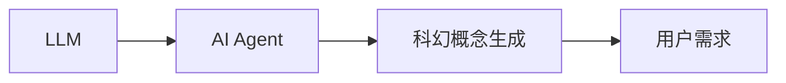
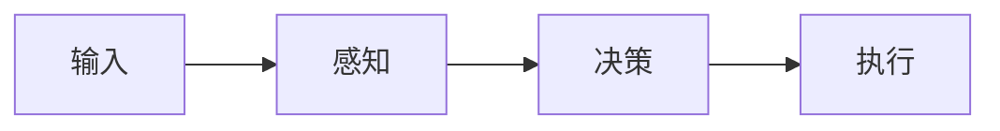
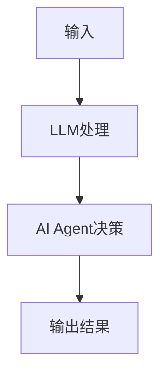
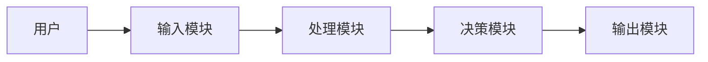

                 


# LLM驱动的AI Agent科幻概念生成器

> 关键词：大语言模型，AI Agent，科幻概念生成器，LLM驱动，AI代理，人工智能

> 摘要：本文探讨了如何利用大语言模型（LLM）驱动AI Agent来生成科幻概念。通过详细分析LLM与AI Agent的核心概念、算法原理、系统架构以及项目实战，本文为读者提供了从理论到实践的全面指导，帮助理解如何构建一个基于LLM的AI Agent科幻概念生成器。

---

# 第1章: LLM与AI Agent背景介绍

## 1.1 大语言模型（LLM）的定义与特点

### 1.1.1 大语言模型的定义

大语言模型（Large Language Model, LLM）是指经过大量文本数据训练的深度学习模型，能够理解和生成人类语言。LLM的核心是基于Transformer架构的变体，如GPT、BERT等。

### 1.1.2 LLM的特点

1. **大规模训练数据**：LLM通常使用海量文本数据进行训练，使其能够理解多种语言和语境。
2. **生成能力**：LLM可以生成连贯且有意义的文本，适用于多种任务，如文本生成、对话、翻译等。
3. **上下文理解**：通过自注意力机制，LLM能够理解文本中的上下文关系。

## 1.2 AI Agent的基本概念与功能

### 1.2.1 AI Agent的定义

AI Agent（人工智能代理）是指能够感知环境、自主决策并执行任务的智能体。AI Agent可以是软件或硬件形式，用于完成特定任务。

### 1.2.2 AI Agent的功能

1. **感知环境**：通过传感器或其他输入方式获取环境信息。
2. **决策与规划**：基于感知信息，生成行动策略。
3. **执行任务**：根据决策结果执行具体操作。

## 1.3 LLM与AI Agent结合的创新点

### 1.3.1 LLM为AI Agent提供强大的语言处理能力

LLM能够为AI Agent提供自然语言理解与生成能力，使其能够与人类进行更自然的交互。

### 1.3.2 AI Agent为LLM提供任务导向性

AI Agent可以根据具体任务需求，指导LLM生成符合目标的文本内容。

---

# 第2章: LLM驱动的AI Agent核心概念

## 2.1 LLM与AI Agent的关系分析

### 2.1.1 LLM作为AI Agent的核心驱动力

LLM为AI Agent提供了强大的语言理解和生成能力，使其能够完成复杂的语言任务。

### 2.1.2 AI Agent作为LLM的扩展应用

AI Agent将LLM的能力扩展到实际应用场景中，使其能够处理更多元的任务。

### 2.1.3 两者结合的协同效应

通过结合LLM的语言能力与AI Agent的任务执行能力，可以实现更加智能化和个性化的服务。

## 2.2 核心概念对比分析

### 2.2.1 LLM与传统NLP模型的对比

| 特性       | LLM                     | 传统NLP模型               |
|------------|--------------------------|--------------------------|
| 数据规模   | 大规模（百万级别）       | 较小规模                   |
| 模型复杂度 | 极高复杂度               | 较低复杂度                 |
| 任务能力   | 多任务通用               | 专注于特定任务             |

### 2.2.2 LLM与AI Agent的关系图



---

# 第3章: LLM驱动的AI Agent算法原理

## 3.1 LLM的算法流程

### 3.1.1 LLM的基本流程

1. **输入处理**：将输入文本转换为模型可处理的形式。
2. **自注意力机制**：计算每个词与其他词的相关性。
3. **解码过程**：基于自注意力结果生成输出文本。

### 3.1.2 AI Agent的决策流程



## 3.2 LLM驱动的AI Agent数学模型

### 3.2.1 LLM的数学公式

$$ P(w_i | w_{<i}) = \text{softmax}(QK^T/V) $$

### 3.2.2 AI Agent的决策树

```mermaid
decision
    title 决策树
    decision(判断条件)
        yes → 执行操作
        no → 另一个操作
```

---

# 第4章: LLM驱动的AI Agent系统架构设计

## 4.1 系统功能设计

### 4.1.1 功能模块划分

1. **输入模块**：接收用户输入。
2. **处理模块**：利用LLM生成文本。
3. **决策模块**：AI Agent根据生成文本做出决策。
4. **输出模块**：展示结果。

### 4.1.2 功能流程图



## 4.2 系统架构设计

### 4.2.1 系统架构图



---

# 第5章: LLM驱动的AI Agent项目实战

## 5.1 环境安装

### 5.1.1 安装Python环境

```bash
python --version
pip install --upgrade pip
```

### 5.1.2 安装LLM库

```bash
pip install transformers
```

## 5.2 核心代码实现

### 5.2.1 LLM驱动代码

```python
from transformers import GPT2LMHeadModel, GPT2Tokenizer

model_name = "gpt2"
tokenizer = GPT2Tokenizer.from_pretrained(model_name)
model = GPT2LMHeadModel.from_pretrained(model_name)
```

### 5.2.2 AI Agent代码

```python
def generate_response(prompt):
    inputs = tokenizer.encode(prompt, return_tensors="pt")
    outputs = model.generate(inputs, max_length=50)
    return tokenizer.decode(outputs[0])
```

## 5.3 案例分析与实现

### 5.3.1 科幻概念生成案例

```python
prompt = "描述一个未来社会的场景，其中..."
response = generate_response(prompt)
print(response)
```

---

# 第6章: LLM驱动的AI Agent最佳实践

## 6.1 小结

本文详细介绍了LLM驱动的AI Agent科幻概念生成器的实现过程，从理论到实践，为读者提供了全面的指导。

## 6.2 注意事项

1. **数据隐私**：注意保护用户数据隐私。
2. **模型优化**：根据实际需求优化模型性能。
3. **用户体验**：注重用户体验设计。

---

作者：AI天才研究院/AI Genius Institute & 禅与计算机程序设计艺术 /Zen And The Art of Computer Programming

