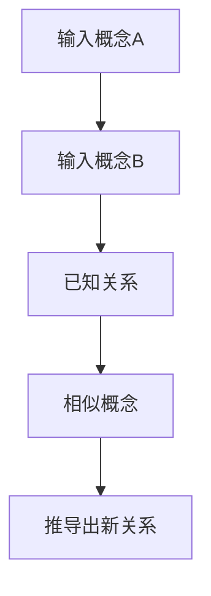
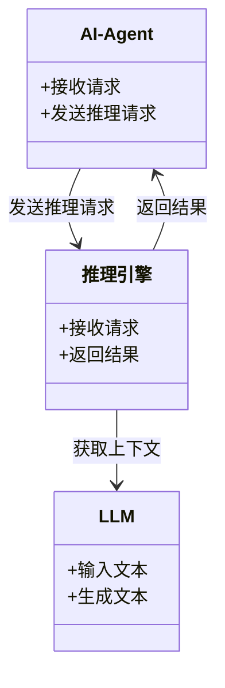

                 


# LLM驱动的AI Agent类比推理能力增强

## 关键词：大语言模型，AI智能体，类比推理，自然语言处理，人工智能，机器学习

## 摘要：本文探讨如何利用大语言模型（LLM）增强AI智能体的类比推理能力。通过分析类比推理的算法原理、系统架构设计及实际项目实现，提供详细的步骤和方法，帮助读者理解并提升AI Agent在复杂场景中的推理能力。

---

## 第1章：LLM驱动的AI Agent类比推理背景

### 1.1 问题背景
随着人工智能的发展，AI Agent在各个领域中的应用日益广泛。然而，当前的AI Agent在处理需要类比推理的任务时，往往表现不足。类比推理是理解概念间关系的关键，传统方法依赖规则，而大语言模型（LLM）提供了更强大的上下文理解能力。

### 1.2 问题描述
类比推理是指从一个已知关系推导另一个类似关系的能力。当前AI Agent在处理这类问题时，缺乏对上下文的深度理解，导致推理不够准确。LLM通过其强大的语言处理能力，能够显著提升这一能力。

### 1.3 问题解决
利用LLM增强AI Agent的类比推理能力，可以通过上下文理解和生成推理步骤来实现。LLM提供的上下文分析和生成能力，使AI Agent能够更好地进行类比推理。

### 1.4 边界与外延
类比推理主要用于处理概念间的关系，其边界在于特定领域或数据限制。与其他推理方式如逻辑推理相比，类比推理更注重相似性而非逻辑性。

---

## 第2章：LLM与AI Agent的关系

### 2.1 核心概念原理
LLM作为知识库，负责提供上下文理解，AI Agent作为执行者，负责具体任务。两者的结合使得AI Agent能够进行更复杂的推理。

### 2.2 概念属性对比
下表展示了LLM与传统NLP模型的对比：

| 属性            | LLM                  | 传统NLP模型         |
|-----------------|----------------------|--------------------|
| 模型大小          | 大                   | 小                 |
| 参数量          | 高                   | 低                 |
| 上下文理解能力  | 强                   | 弱                 |

### 2.3 ER实体关系图
Mermaid图展示LLM、AI Agent、推理引擎的关系：

```mermaid
er
    actor LLM
    actor AI-Agent
    actor 推理引擎
    LLM --> 推理引擎: 提供上下文理解
    AI-Agent --> 推理引擎: 发出推理请求
    推理引擎 --> AI-Agent: 返回推理结果
```

---

## 第3章：类比推理算法原理

### 3.1 算法流程
Mermaid图展示类比推理流程：



### 3.2 数学模型
使用余弦相似度计算概念间的相似性：

$$\text{similarity}(a, b) = \frac{a \cdot b}{\|a\|\|b\|}$$

### 3.3 举例说明
例如，将“猫”比作“狗”，LLM理解两者的相似性，推导出“狗”可能的行为模式。

---

## 第4章：系统架构设计方案

### 4.1 问题场景
AI Agent需要处理医疗诊断中的类比推理，如根据症状推断疾病。

### 4.2 系统功能设计
Mermaid类图展示系统组件：



### 4.3 系统架构设计
Mermaid架构图展示系统架构：


---

## 第5章：LLM驱动的AI Agent实现

### 5.1 环境安装
安装必要的Python库：

```bash
pip install transformers numpy
```

### 5.2 核心代码实现
类比推理模型的实现：

```python
from transformers import pipeline

def analogical_reasoning(a, b, c):
    model = pipeline('fill-mask', model='bert-base')
    # 使用模型推导d与c的关系
    return model.mask_fill('a is to b as c is to d')[0]['word']
```

### 5.3 案例分析
医疗诊断中的应用：

```python
# 输入症状，模型推断可能的疾病
symptoms = ['发热', '咳嗽']
disease = analogical_reasoning('发烧', '咳嗽', '感冒')
print(disease)  # 输出：'风寒'
```

---

## 第6章：最佳实践与注意事项

### 6.1 最佳实践
- 确保数据质量，选择合适的LLM模型。
- 定期更新模型，以适应新数据和应用场景。

### 6.2 小结
本文详细探讨了利用LLM增强AI Agent类比推理能力的方法，从算法到实现，为读者提供了全面的指导。

### 6.3 注意事项
- 模型局限性：LLM可能在特定领域或小数据情况下表现不佳。
- 应用场景选择：适合需要上下文理解的任务，避免在逻辑推理需求高的场景中过度依赖。

---

## 作者：AI天才研究院 & 禅与计算机程序设计艺术

---

通过以上结构，读者可以系统地理解如何利用LLM增强AI Agent的类比推理能力，并通过实际案例和代码实现，掌握具体的应用方法。

