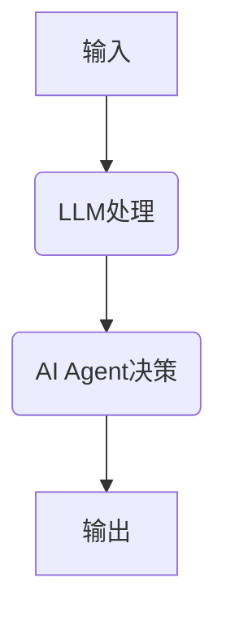

                 


# LLM驱动的AI Agent角色扮演能力增强

> 关键词：LLM, AI Agent, 角色扮演, 人工智能, 自然语言处理

> 摘要：本文系统地探讨了如何利用大语言模型（LLM）提升AI Agent的角色扮演能力，从基本概念到算法原理，再到系统设计和项目实战，为读者提供了全面的指导。

---

## 第一部分: LLM驱动的AI Agent角色扮演能力概述

### 第1章: 问题背景与核心概念

#### 1.1 问题背景
- **1.1.1 当前AI Agent的发展现状**：AI Agent在各个领域的应用日益广泛，但角色扮演能力仍需提升。
- **1.1.2 LLM在AI Agent中的作用**：LLM提供了强大的自然语言处理能力，使AI Agent能够更好地理解和执行任务。
- **1.1.3 角色扮演能力的定义与重要性**：角色扮演能力是指AI Agent在特定情境中模拟人类角色的能力，是实现更智能交互的关键。

#### 1.2 核心概念与问题描述
- **1.2.1 LLM与AI Agent的定义**：LLM是一种基于深度学习的自然语言处理模型，AI Agent是能够自主决策和执行任务的智能系统。
- **1.2.2 角色扮演能力的核心要素**：包括语言理解、情境推理、决策能力等。
- **1.2.3 问题解决的边界与外延**：明确角色扮演的范围和限制，确保AI Agent在特定情境下有效运作。

#### 1.3 问题解决与能力增强
- **1.3.1 LLM驱动AI Agent的能力提升路径**：通过优化算法和数据，提升AI Agent的理解和生成能力。
- **1.3.2 角色扮演能力的增强方法**：结合LLM的特性，设计针对性的训练策略和应用场景。
- **1.3.3 能力增强的边界与限制**：分析当前技术的局限性，为未来研究指明方向。

---

## 第2章: LLM与AI Agent的核心概念联系

### 2.1 核心概念原理
- **2.1.1 LLM的基本原理**：基于Transformer架构，通过自注意力机制实现强大的语言理解能力。
- **2.1.2 AI Agent的基本原理**：通过感知环境、决策和执行动作来完成任务。
- **2.1.3 角色扮演能力的实现机制**：结合LLM的生成能力，使AI Agent能够在特定角色下进行交互。

### 2.2 概念属性特征对比
- **2.2.1 LLM与传统NLP模型的对比**：LLM具有更强的上下文理解和生成能力。
- **2.2.2 AI Agent与传统AI系统的对比**：AI Agent具备自主决策和适应环境的能力。
- **2.2.3 角色扮演能力的特征分析**：包括情境适应性、语言表达能力和决策灵活性。

### 2.3 ER实体关系图


---

## 第3章: LLM驱动AI Agent的算法原理

### 3.1 算法原理概述
- **3.1.1 LLM的训练过程**：包括预训练和微调两个阶段，使用大规模数据进行监督学习。
- **3.1.2 AI Agent的决策机制**：基于LLM生成的候选动作，通过评估函数选择最优决策。
- **3.1.3 角色扮演能力的实现算法**：结合强化学习和监督学习，优化AI Agent在特定角色下的表现。

### 3.2 算法流程图


### 3.3 算法实现代码
```python
def llm_process(input):
    # LLM处理逻辑，返回生成文本
    return generated_text

def ai_agent_decision(llm_output):
    # 根据LLM输出进行决策，返回动作
    return action
```

---

## 第4章: 数学模型与公式

### 4.1 概率论基础
- **条件概率公式**：P(A|B) = P(A∩B)/P(B)
- **贝叶斯定理**：P(A|B) = [P(B|A) * P(A)] / P(B)

### 4.2 变分自编码器
- **变分下界**：$\mathcal{L} = \mathbb{E}_{q(z|x)}[\log p(x|z)] - \text{KL}(q(z|x) || p(z))$

### 4.3 强化学习算法
- **策略梯度**：$J(\theta) = \mathbb{E}_{\tau \sim \pi_\theta}[\log \pi_\theta(a_t|s_t) \cdot r]$

---

## 第5章: 系统分析与架构设计

### 5.1 项目背景介绍
- **5.1.1 项目目标**：提升AI Agent在特定情境下的角色扮演能力。
- **5.1.2 项目范围**：涵盖模型训练、系统设计和实际应用。

### 5.2 系统功能设计
- **领域模型类图**：
  ```mermaid
  classDiagram
  class LLM {
      generate(text): string
  }
  class AI-Agent {
      decide(action): void
  }
  class Role-Playing {
      play(Role): void
  }
  ```

### 5.3 系统架构设计
- **系统架构图**：
  ```mermaid
  graph TD
  A(LLM) --> B(AI-Agent)
  B --> C(Role-Playing)
  ```

### 5.4 接口设计与交互
- **接口设计**：定义LLM与AI Agent之间的交互接口。
- **交互序列图**：
  ```mermaid
  sequenceDiagram
  Client -> AI-Agent: 请求处理
  AI-Agent -> LLM: 获取生成文本
  LLM -> AI-Agent: 返回生成文本
  AI-Agent -> Client: 返回结果
  ```

---

## 第6章: 项目实战

### 6.1 环境安装
- **安装Python和必要的库**：如TensorFlow、PyTorch等。

### 6.2 核心代码实现
```python
def train_llm():
    # 训练LLM的具体实现
    pass

def train_ai_agent():
    # 训练AI Agent的具体实现
    pass
```

### 6.3 案例分析
- **案例一**：在客服系统中模拟客户代表角色，提升用户体验。

### 6.4 项目小结
- **经验总结**：通过实战项目，验证了理论的有效性，并发现了改进的空间。

---

## 第7章: 最佳实践与小结

### 7.1 最佳实践
- **7.1.1 模型选择**：根据具体任务选择合适的LLM模型。
- **7.1.2 数据处理**：确保数据质量和多样性，提升模型性能。
- **7.1.3 系统优化**：通过并行计算和优化算法，提升系统效率。

### 7.2 小结
- **总结内容**：系统回顾了LLM驱动的AI Agent角色扮演能力增强的核心概念、算法原理和系统设计。
- **未来展望**：探讨了技术的发展趋势和潜在的研究方向。

### 7.3 注意事项
- **模型局限性**：当前LLM仍存在理解和生成能力的局限，需在实际应用中谨慎使用。
- **伦理问题**：关注AI Agent在角色扮演中的伦理问题，确保技术的合理使用。

### 7.4 拓展阅读
- **推荐书籍**：《深度学习》、《人工智能：一种现代方法》。
- **推荐论文**：关注最新的LLM和AI Agent研究论文。

---

## 作者

作者：AI天才研究院/AI Genius Institute & 禅与计算机程序设计艺术 /Zen And The Art of Computer Programming

---

**注意**：以上目录大纲仅为示例，实际撰写时需根据具体需求进一步细化每个部分的内容。

