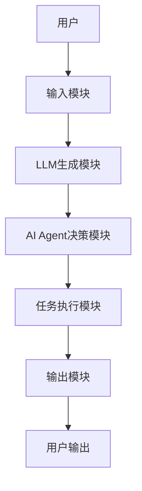

                 


# LLM驱动的AI Agent诗歌创作与鉴赏

> 关键词：大语言模型（LLM），人工智能代理（AI Agent），诗歌创作，诗歌鉴赏，自然语言处理（NLP），生成式AI

> 摘要：本文将探讨如何利用大语言模型（LLM）驱动的人工智能代理（AI Agent）来进行诗歌创作与鉴赏。通过深入分析LLM与AI Agent的核心原理、系统架构设计，以及实际项目实现，本文旨在揭示如何将先进的自然语言处理技术应用于诗歌艺术，探索人工智能在文学创作中的潜力与挑战。

---

## 第一章: LLM与AI Agent的背景与概述

### 1.1 问题背景
- **大语言模型（LLM）的崛起**：近年来，基于深度学习的大语言模型（如GPT系列、PaLM等）在自然语言处理领域取得了突破性进展，具备了强大的文本生成能力。
- **人工智能代理（AI Agent）的概念**：AI Agent是一种能够感知环境、执行任务并做出决策的智能实体，广泛应用于自动化系统、推荐系统等领域。

### 1.2 问题描述
- **诗歌创作的挑战**：诗歌创作需要深厚的语言理解和艺术修养，传统AI技术难以实现高质量的诗歌生成。
- **诗歌鉴赏的复杂性**：诗歌鉴赏依赖于对语言、情感和文化的深刻理解，传统方法效率低下且主观性强。

### 1.3 解决方案
- **LLM驱动的AI Agent**：通过结合大语言模型的生成能力与AI Agent的任务执行能力，构建一个能够创作和鉴赏诗歌的智能系统。

### 1.4 边界与外延
- **技术边界**：基于LLM的生成能力和AI Agent的交互能力，目前主要专注于诗歌创作与鉴赏的核心任务。
- **外延扩展**：未来可以扩展至音乐、绘画等其他艺术形式，构建多模态的AI Agent。

### 1.5 核心要素
- **LLM**：提供强大的文本生成能力。
- **AI Agent**：负责任务分解、环境交互和决策制定。
- **诗歌创作与鉴赏**：构建一个完整的创作-鉴赏闭环系统。

---

## 第二章: LLM与AI Agent的核心概念与联系

### 2.1 LLM的核心原理
- **大语言模型的训练机制**：基于海量文本数据的预训练，通过自监督学习掌握语言的规律和语义信息。
- **生成式模型的特点**：通过解码器结构生成连贯且有意义的文本，支持条件生成和无条件生成。
- **LLM的优势与局限性**
  - **优势**：强大的文本生成能力，支持多种语言和风格。
  - **局限性**：生成结果可能缺乏创意，难以完全理解人类情感。

### 2.2 AI Agent的系统架构
- **实体关系图（ER图）**：展示AI Agent与外部环境、用户以及任务之间的交互关系。
- **功能模块划分**：
  - **感知模块**：负责接收输入（如用户指令、环境数据）。
  - **决策模块**：基于输入数据做出任务分解和行动选择。
  - **执行模块**：调用LLM等工具完成具体任务。
  - **反馈模块**：收集反馈信息，优化系统性能。

### 2.3 LLM与AI Agent的协同工作流程
- **协同机制**：AI Agent通过调用LLM的生成能力，完成复杂的任务。
- **对比分析**：
  | 特性 | LLM | AI Agent |
  |------|------|-----------|
  | 核心功能 | 文本生成 | 任务执行与决策 |
  | 优势 | 生成能力强 | 系统化任务处理能力 |
  | 局限性 | 需依赖外部数据 | 依赖LLM生成能力 |

---

## 第三章: 诗歌创作的生成过程与模型原理

### 3.1 诗歌创作的生成模型原理
- **生成式模型的数学基础**：基于Transformer架构的文本生成模型，通过自注意力机制捕捉上下文信息。
- **生成过程的步骤分解**：
  1. **输入处理**：接收创作主题或用户指令。
  2. **上下文理解**：通过自注意力机制分析输入内容。
  3. **生成策略**：选择合适的词汇和句式进行诗歌创作。
  4. **生成优化**：通过采样或解码策略优化生成结果。

### 3.2 诗歌创作的生成流程
- **创作主题的输入与解析**：
  - 用户输入创作主题（如“秋日的思念”）。
  - AI Agent解析主题，生成创作大纲。
- **创作思路的生成与优化**：
  - 基于LLM生成多个创作思路，AI Agent进行评估和优化。
- **诗歌文本的生成与润色**：
  - 通过生成模型完成诗歌文本的创作。
  - AI Agent对生成结果进行润色和优化。

---

## 第四章: 诗歌鉴赏的算法原理与实现

### 4.1 诗歌鉴赏的传统方法与挑战
- **传统鉴赏方法**：基于文学理论和专家经验的主观性鉴赏。
- **挑战**：缺乏客观标准，效率低下。

### 4.2 基于LLM的诗歌鉴赏模型
- **模型输入**：诗歌文本和鉴赏任务指令。
- **模型输出**：生成鉴赏分析报告，包括主题分析、意象解析、情感评价等。

### 4.3 鉴赏流程与优化策略
- **流程优化**：
  1. **输入预处理**：对诗歌文本进行分词和语义分析。
  2. **任务分解**：将鉴赏任务分解为多个子任务。
  3. **结果整合**：整合子任务结果，生成最终鉴赏报告。

---

## 第五章: 系统架构设计与实现

### 5.1 系统架构图


### 5.2 系统功能设计
- **输入模块**：接收用户指令和创作主题。
- **LLM生成模块**：负责诗歌创作和鉴赏任务的生成。
- **AI Agent决策模块**：对生成结果进行评估和优化。
- **任务执行模块**：完成最终的输出和反馈。

### 5.3 接口设计与交互流程
- **接口设计**：
  ```mermaid
  sequenceDiagram
      participant 用户
      participant 输入模块
      participant LLM生成模块
      participant AI Agent决策模块
      用户->输入模块: 提交创作主题
      输入模块->LLM生成模块: 发起生成请求
      LLM生成模块->AI Agent决策模块: 返回生成结果
      AI Agent决策模块->输入模块: 反馈优化建议
      输入模块->用户: 展示最终结果
  ```

---

## 第六章: 项目实战与代码实现

### 6.1 环境配置
- **Python版本**：3.8+
- **依赖库安装**：
  ```bash
  pip install transformers torch mermaid
  ```

### 6.2 核心代码实现
- **生成模块实现**：
  ```python
  from transformers import AutoModelForCausalLM, AutoTokenizer

  model_name = "gpt2"
  tokenizer = AutoTokenizer.from_pretrained(model_name)
  model = AutoModelForCausalLM.from_pretrained(model_name)

  def generate_poetry(theme):
      inputs = tokenizer.encode(f"创作主题：{theme}", return_tensors="pt")
      outputs = model.generate(inputs, max_length=100, temperature=0.7)
      return tokenizer.decode(outputs[0], skip_special_tokens=True)
  ```

- **AI Agent决策模块实现**：
  ```python
  class AI_Agent:
      def __init__(self):
          self.llm_model = # 初始化LLM模型
      def evaluate_poetry(self, poem):
          # 评估诗歌质量，返回优化建议
          pass
  ```

### 6.3 实际案例分析
- **案例1**：创作主题“秋日的思念”。
- **生成结果**：一首七言绝句。
- **优化建议**：AI Agent给出押韵和意境的优化建议。

---

## 第七章: 系统优化与未来展望

### 7.1 模型调优策略
- **微调策略**：针对诗歌创作任务，对LLM进行微调。
- **多模态优化**：结合图像、音乐等多模态信息，提升诗歌创作的丰富性。

### 7.2 评估指标
- **创作质量评估**：基于语义理解和艺术性进行评分。
- **鉴赏准确性评估**：基于专家评分和用户反馈进行评估。

### 7.3 未来展望
- **多语言支持**：支持更多语言的诗歌创作与鉴赏。
- **人机协作模式**：探索人机协作的诗歌创作新形式。

---

## 第八章: 总结与小结

通过本文的详细探讨，我们揭示了如何利用LLM驱动的AI Agent进行诗歌创作与鉴赏。从技术背景到系统实现，再到实际应用，我们展示了这一创新技术的潜力与挑战。未来，随着技术的不断发展，AI Agent在文学创作中的应用将更加广泛和深入。

---

## 作者：AI天才研究院/AI Genius Institute & 禅与计算机程序设计艺术 /Zen And The Art of Computer Programming

