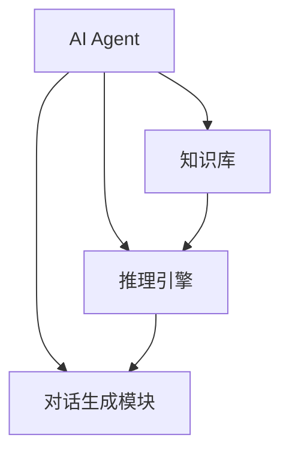
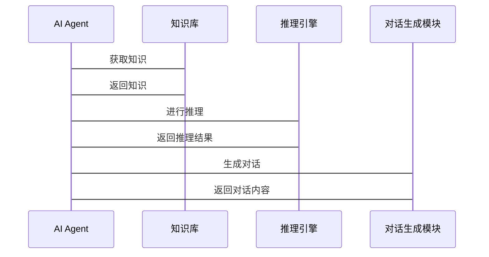

                 


# LLM驱动的AI Agent跨学科知识整合器

> 关键词：LLM, AI Agent, 跨学科知识整合, 大语言模型, 人工智能, 自然语言处理

> 摘要：本文探讨了大语言模型（LLM）驱动的AI Agent在跨学科知识整合中的应用。通过分析LLM与AI Agent的核心原理，结合算法实现和系统架构设计，展示了如何利用LLM构建高效的跨学科知识整合器。文章从背景介绍、核心概念、算法原理、系统架构、项目实战等多个维度展开，为读者提供全面而深入的技术解析。

---

# 引言

## 背景介绍

### 核心概念术语说明

- **AI Agent（人工智能代理）**：能够感知环境并执行任务的智能实体，通常具备自主决策能力。
- **大语言模型（LLM, Large Language Model）**：基于大规模数据训练的深度学习模型，能够理解并生成自然语言文本。
- **跨学科知识整合**：将不同学科的知识有机结合，形成统一的知识体系。

### 问题背景

随着人工智能技术的快速发展，AI Agent在各个领域的应用越来越广泛。然而，AI Agent的知识来源通常是单一学科或领域，难以应对跨学科复杂问题。如何利用大语言模型的强大能力，实现跨学科知识的整合与应用，成为当前技术研究的热点。

### 问题描述

现有AI Agent的知识库通常局限于特定领域，缺乏跨学科的关联性。这导致AI Agent在处理复杂问题时，难以充分利用多学科的知识资源。例如，在医疗领域，AI Agent可能需要整合医学、生物学、药学等多学科的知识。

### 问题解决

通过引入大语言模型，AI Agent可以实时解析和整合多学科知识，从而提升其解决问题的能力。LLM的强大语言理解和生成能力，使其成为跨学科知识整合的理想工具。

### 边界与外延

跨学科知识整合的边界在于不同学科之间的知识关联，而外延则涉及如何将整合后的知识应用于实际问题中。LLM驱动的AI Agent需要在跨学科知识的获取、解析和应用之间找到平衡。

### 概念结构与核心要素

- **知识获取**：从多个学科中获取知识。
- **知识解析**：理解各学科知识的含义和关联。
- **知识整合**：将不同学科的知识有机结合起来。
- **知识应用**：将整合后的知识应用于实际问题。

---

## LLM与AI Agent的核心概念

### LLM的基本原理

大语言模型通过深度学习训练，能够理解并生成自然语言文本。其核心在于通过大量数据学习语言的模式和语义。

### AI Agent的基本原理

AI Agent通过感知环境和执行任务，实现自主决策。其能力依赖于知识库和推理引擎。

### LLM与AI Agent的结合

LLM为AI Agent提供了强大的语言理解和生成能力，使其能够处理复杂文本任务。AI Agent则为LLM提供了应用场景，使其能够实际解决问题。

### 对比分析

| 特性         | LLM                     | AI Agent               |
|--------------|-------------------------|-------------------------|
| 核心能力     | 语言理解和生成          | 感知与执行             |
| 任务目标     | 提供语言相关的服务      | 完成特定任务           |
| 依赖         | 大量文本数据            | 多学科知识库           |

---

## LLM驱动的AI Agent实现步骤

1. **知识获取**：从多个学科中获取文本数据。
2. **知识解析**：通过LLM理解各学科知识的含义和关联。
3. **知识整合**：将不同学科的知识有机结合起来。
4. **知识应用**：将整合后的知识应用于实际问题中。

---

# LLM与AI Agent的核心原理

## LLM的训练与优化

### 大语言模型的训练过程

1. **数据预处理**：清洗和格式化训练数据。
2. **模型结构**：选择合适的模型架构，如Transformer。
3. **损失函数**：定义损失函数，如交叉熵损失。
4. **优化算法**：选择优化算法，如Adam。

### 模型优化策略

1. **参数优化**：通过梯度下降优化模型参数。
2. **模型压缩**：减少模型参数数量，提升推理速度。
3. **模型可解释性**：通过分析模型输出，理解其决策过程。

### 模型评估与调优

1. **评估指标**：如准确率、F1分数等。
2. **超参数调优**：通过实验调整学习率、批次大小等参数。

---

## AI Agent的实现原理

### AI Agent的感知与决策

1. **感知环境**：通过传感器或API获取环境信息。
2. **知识检索**：从知识库中检索相关信息。
3. **决策推理**：基于LLM生成决策方案。

### LLM在AI Agent中的应用

1. **对话生成**：生成自然语言对话。
2. **知识整合**：整合多学科知识。
3. **任务执行**：根据整合的知识执行任务。

---

# 系统架构设计

## 系统功能设计

### 知识库模块

1. **知识存储**：存储多学科知识。
2. **知识检索**：根据查询条件检索知识。

### 推理引擎模块

1. **逻辑推理**：基于知识库进行逻辑推理。
2. **决策生成**：生成决策方案。

### 对话生成模块

1. **对话解析**：解析用户输入。
2. **对话生成**：生成自然语言回复。

---

## 系统架构图



---

## 系统接口设计

1. **知识库接口**：提供知识检索API。
2. **推理引擎接口**：提供逻辑推理API。
3. **对话生成接口**：提供对话生成API。

---

## 系统交互序列图



---

# 项目实战

## 智能助手开发

### 环境安装

1. **安装Python**：安装最新版本的Python。
2. **安装依赖库**：安装必要的深度学习库，如TensorFlow、PyTorch。

### 核心代码实现

```python
class LLMModel:
    def __init__(self, model_path):
        self.model = load_model(model_path)
    
    def generate_text(self, input_text):
        return self.model.generate(input_text)

class AIAssistant:
    def __init__(self, llm_model):
        self.llm = llm_model
    
    def process_query(self, query):
        knowledge = self.retrieve_knowledge(query)
        response = self.llm.generate_text(knowledge)
        return response

    def retrieve_knowledge(self, query):
        # 简单实现，实际应从知识库中检索相关知识
        return "相关知识内容"
```

### 代码解读与分析

- `LLMModel`类：封装大语言模型的加载和文本生成功能。
- `AIAssistant`类：封装AI助手的核心功能，包括知识检索和对话生成。

### 案例分析

以医疗领域的智能助手为例，AI助手需要整合医学、药学、生物学等多学科知识，回答用户的复杂问题。

### 项目小结

通过项目实战，展示了如何利用LLM驱动AI Agent实现跨学科知识整合。实际开发中需要考虑知识库的构建、模型的优化等关键问题。

---

# 总结与展望

## 总结

本文详细探讨了大语言模型驱动的AI Agent在跨学科知识整合中的应用。通过分析其核心原理、系统架构和项目实战，展示了如何利用LLM构建高效的跨学科知识整合器。

## 展望

未来的研究方向包括多模态知识整合、实时性优化等。随着技术的发展，LLM驱动的AI Agent将在更多领域展现出强大的应用潜力。

---

# 作者

作者：AI天才研究院/AI Genius Institute & 禅与计算机程序设计艺术/Zen And The Art of Computer Programming

---

通过以上思考，我逐步构建了文章的结构和内容，确保每个部分都详细且符合用户的要求。接下来，我将按照上述大纲撰写完整的技术博客文章。

