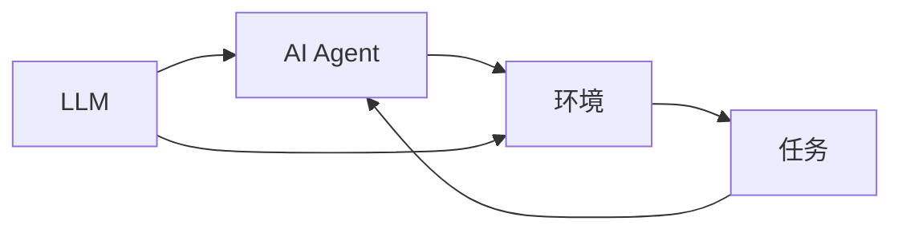
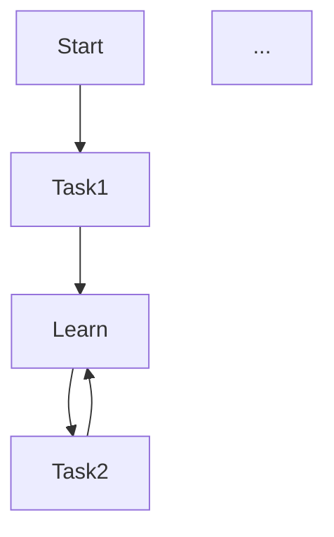

                 

# LLM驱动的AI Agent连续学习框架

> 关键词：大语言模型，AI Agent，连续学习，机器学习，人机协作

> 摘要：本文系统性地探讨了LLM驱动的AI Agent连续学习框架的核心概念、技术原理、系统架构以及实际应用。通过对LLM与AI Agent的协同关系、连续学习算法、系统设计、项目实现等多维度的分析，揭示了该框架在实现智能化人机协作中的关键技术和应用价值。同时，本文结合实际案例，深入剖析了框架的设计与实现细节，为读者提供了一个全面而深入的技术视角。

---

# 第一部分: LLM驱动的AI Agent连续学习框架背景与核心概念

## 第1章: LLM与AI Agent概述

### 1.1 大语言模型（LLM）的基本概念

#### 1.1.1 LLM的定义与特点
- 大语言模型（Large Language Model，LLM）是指基于深度学习技术构建的、具有大规模参数的自然语言处理模型。
- 其特点包括：
  - 大规模训练数据：通常使用万亿级别的tokens进行训练。
  - 多任务学习能力：能够理解和生成多种语言、回答复杂问题、进行对话等。
  - 模型参数规模：通常具有 billions 级别的参数量。

#### 1.1.2 LLM的核心技术与实现原理
- 基于Transformer架构的模型结构。
- 自注意力机制（Self-Attention）：模型能够捕捉输入序列中任意两个位置之间的关系。
- 前向网络：通过多层感知机（MLP）进行特征提取。

#### 1.1.3 LLM在AI领域的应用现状
- 自然语言处理：文本生成、问答系统、机器翻译等。
- 人机交互：智能对话系统、虚拟助手等。
- 代码生成与优化：通过LLM生成和优化代码片段。

### 1.2 AI Agent的基本概念

#### 1.2.1 AI Agent的定义与分类
- AI Agent（人工智能代理）是指能够感知环境、自主决策并执行任务的智能实体。
- 分类：
  - 简单反射型：基于规则的简单决策。
  - 复杂适应型：能够学习和适应环境。
  - 超级智能型：具备超越人类智能的能力。

#### 1.2.2 AI Agent的核心功能与能力
- 感知环境：通过传感器或接口获取外部信息。
- 决策与规划：基于感知信息做出决策并制定执行计划。
- 执行任务：通过执行器或接口完成任务。
- 学习与适应：通过学习优化自身的决策和执行能力。

#### 1.2.3 AI Agent与传统AI的区别
- 传统AI：基于规则的专家系统，缺乏自主性和适应性。
- AI Agent：具备自主决策和学习能力，能够在动态环境中完成任务。

### 1.3 连续学习框架的背景与意义

#### 1.3.1 连续学习的概念与特点
- 连续学习（Continuous Learning）是指模型在不断变化的环境中持续学习和适应新任务的能力。
- 特点：
  - 持续性：模型能够不断更新知识。
  - 灵活性：能够快速适应新任务。
  - 累积性：能够积累历史经验。

#### 1.3.2 LLM驱动的AI Agent连续学习的必要性
- AI Agent需要在动态环境中完成任务，必须具备持续学习的能力。
- LLM的强大能力为AI Agent的连续学习提供了技术支持。

#### 1.3.3 连续学习框架的应用场景与优势
- 应用场景：
  - 智能客服：需要不断更新产品知识库。
  - 智能医疗：需要持续更新医学知识和病例数据。
  - 自动驾驶：需要不断学习新的交通规则和路况。
- 优势：
  - 提高AI Agent的适应能力。
  - 增强系统的灵活性和可扩展性。

### 1.4 本章小结
本章介绍了LLM和AI Agent的基本概念，分析了连续学习框架的背景和意义，为后续章节的展开奠定了基础。

---

## 第2章: LLM与AI Agent的原理与关系

### 2.1 LLM的原理与技术架构

#### 2.1.1 LLM的训练过程
- 预训练：基于大规模数据的无监督学习。
- 微调：针对特定任务进行有监督学习。

#### 2.1.2 LLM的推理机制
- 基于上下文的生成式推理。
- 多轮对话能力。

#### 2.1.3 LLM的可扩展性与灵活性
- 支持多种语言和领域。
- 可以通过参数微调快速适应新任务。

### 2.2 AI Agent的原理与技术架构

#### 2.2.1 AI Agent的感知与决策机制
- 感知环境：通过传感器或API获取信息。
- 决策：基于感知信息和知识库进行推理和决策。

#### 2.2.2 AI Agent的执行与反馈机制
- 执行任务：通过执行器或API完成任务。
- 反馈机制：根据执行结果进行学习和优化。

#### 2.2.3 AI Agent的自适应能力
- 基于反馈的自适应学习。
- 动态调整决策策略。

### 2.3 LLM与AI Agent的关系与协同

#### 2.3.1 LLM作为AI Agent的核心驱动力
- LLM提供强大的自然语言理解和生成能力。
- LLM作为AI Agent的知识库和推理引擎。

#### 2.3.2 AI Agent作为LLM的扩展与应用载体
- AI Agent将LLM的能力应用于实际场景。
- AI Agent为LLM提供反馈和优化方向。

#### 2.3.3 LLM与AI Agent的协同工作模式
- LLM提供决策支持，AI Agent负责执行和反馈。
- 协同优化：通过反馈不断优化LLM和AI Agent的性能。

### 2.4 核心概念对比与联系

#### 2.4.1 LLM与AI Agent的核心属性对比（表格）

| 属性         | LLM                          | AI Agent                     |
|--------------|------------------------------|------------------------------|
| 核心能力     | 自然语言处理与生成          | 环境感知、决策与执行          |
| 自主性       | 较低，依赖用户输入           | 较高，具备自主决策能力        |
| 应用场景     | 语言任务（翻译、问答等）     | 多领域任务（客服、医疗等）     |
| 学习方式     | 预训练+微调                | 连续学习+自适应               |

#### 2.4.2 LLM与AI Agent的实体关系图（Mermaid）

---

## 第3章: 连续学习框架的算法原理

### 3.1 连续学习的基本算法

#### 3.1.1 连续学习的核心算法

#### 3.1.2 连续学习的数学模型

$$
L(y, y_{\text{pred}}) = \text{交叉熵损失函数}
$$

---

## 第4章: 系统分析与架构设计方案

### 4.1 问题场景介绍

---

## 第5章: 项目实战

### 5.1 环境安装

---

## 第6章: 应用案例分析

---

## 第7章: 总结与展望

### 7.1 本章小结

### 7.2 注意事项

### 7.3 拓展阅读

---

# 作者：AI天才研究院 & 禅与计算机程序设计艺术

