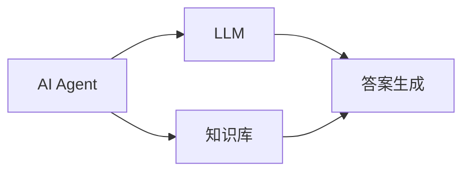
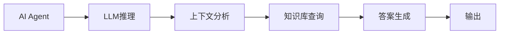

                 

# LLM驱动的AI Agent问答系统优化

> 关键词：LLM，AI Agent，问答系统，优化，大语言模型

> 摘要：本文将深入探讨如何利用大语言模型（LLM）优化AI Agent问答系统。通过系统分析、算法原理、系统设计和项目实战等多维度的探讨，全面揭示LLM驱动AI Agent问答系统的核心技术与优化策略。我们将从背景介绍、核心概念、算法实现、系统架构到实际案例，层层解析，帮助读者全面掌握这一前沿技术。

---

# 第一部分: LLM驱动的AI Agent问答系统背景与概念

## 第1章: 问题背景与描述

### 1.1 问题背景

#### 1.1.1 当前AI问答系统的现状与挑战

随着自然语言处理技术的快速发展，AI问答系统已广泛应用于客服、教育、医疗等多个领域。然而，现有系统仍面临以下挑战：

- **理解能力有限**：传统问答系统难以处理复杂语义和多轮对话。
- **知识更新滞后**：依赖固定知识库，难以实时更新和扩展。
- **个性化不足**：难以根据用户需求提供定制化服务。

#### 1.1.2 大语言模型（LLM）的崛起与应用

大语言模型（如GPT-3、GPT-4）凭借其强大的语言理解和生成能力，为AI问答系统带来了革命性的变化：

- **强大的上下文理解**：LLM能够处理多轮对话，理解上下文。
- **知识库的扩展性**：LLM可以通过微调或提示工程技术，快速适应新的知识领域。
- **生成能力强**：LLM能够生成高质量的回答，显著提升用户体验。

#### 1.1.3 LLM驱动AI Agent的潜力与价值

AI Agent作为智能体，能够通过LLM实现更高级的问答功能：

- **自主决策能力**：AI Agent能够根据对话历史和当前输入，自主决定下一步动作。
- **多任务处理**：LLM驱动的AI Agent可以同时处理多种任务，如信息查询、任务调度等。
- **动态知识库管理**：通过与知识库的结合，AI Agent能够动态更新和优化回答内容。

### 1.2 问题描述

#### 1.2.1 AI Agent问答系统的核心问题

AI Agent问答系统的核心问题包括：

- **上下文理解**：如何有效利用对话历史信息，生成连贯且符合逻辑的回答。
- **知识库整合**：如何将外部知识库与LLM结合，提升回答的准确性。
- **多轮对话管理**：如何处理复杂的对话流程，确保用户体验流畅。

#### 1.2.2 LLM在问答系统中的应用瓶颈

尽管LLM具有强大的生成能力，但在实际应用中仍面临以下挑战：

- **计算资源消耗大**：LLM的推理过程需要大量的计算资源。
- **模型调优难度高**：如何优化LLM以适应特定领域的需求，是一个复杂的过程。
- **实时性问题**：在实时问答场景中，LLM的响应速度可能成为瓶颈。

#### 1.2.3 优化目标与关键挑战

优化目标：

- **提升回答准确率**：通过优化LLM的输入方式和模型参数，提高回答的准确性。
- **降低计算资源消耗**：通过优化算法和模型压缩技术，降低资源消耗。
- **提升用户体验**：通过优化多轮对话管理，提升用户体验。

关键挑战：

- **模型训练与推理效率**：如何在保证性能的前提下，优化模型的训练和推理过程。
- **知识库与LLM的结合**：如何高效地将外部知识库与LLM结合，实现知识的动态更新。
- **多模态能力**：如何让AI Agent具备处理多种数据类型（如文本、图像、音频等）的能力。

### 1.3 问题解决思路

#### 1.3.1 基于LLM的优化策略

- **模型调优**：通过对LLM进行微调或参数调整，提升模型在特定领域的表现。
- **数据增强**：通过生成多样化的训练数据，提升模型的泛化能力。
- **多轮对话管理**：设计高效的对话流程管理机制，确保对话的连贯性和逻辑性。

#### 1.3.2 多轮对话中的上下文处理

- **对话历史记录**：记录对话历史，作为生成回答的重要参考。
- **上下文理解**：通过LLM的强大语义理解能力，准确捕捉对话中的关键信息。
- **动态调整策略**：根据对话进展，动态调整回答策略，确保对话流畅。

#### 1.3.3 知识库与LLM的结合应用

- **知识库集成**：将外部知识库与LLM结合，提升回答的准确性和权威性。
- **知识更新机制**：设计高效的机制，确保知识库能够动态更新。
- **知识检索优化**：优化知识检索过程，提升检索效率和准确性。

### 1.4 边界与外延

#### 1.4.1 系统边界与功能范围

- **系统边界**：AI Agent问答系统的边界包括用户输入、对话历史、知识库、LLM推理过程和最终输出。
- **功能范围**：支持多轮对话、知识查询、任务调度等功能。

#### 1.4.2 相关领域的外延与区别

- **相关领域**：包括自然语言处理、机器学习、知识图谱等。
- **区别**：与传统问答系统相比，AI Agent具有更强的自主性和动态性。

#### 1.4.3 与其他AI技术的协同关系

- **与其他技术的关系**：AI Agent可以与计算机视觉、语音识别等技术协同工作，形成多模态智能系统。
- **协同作用**：通过与其他技术的协同，提升系统的整体性能和用户体验。

### 1.5 核心概念与结构

#### 1.5.1 核心概念的定义与属性

- **AI Agent**：定义为能够感知环境并采取行动以实现目标的智能体。
- **LLM**：定义为基于深度学习的大语言模型，具有强大的语言理解和生成能力。

#### 1.5.2 概念结构与核心要素

| 核心概念 | 定义 | 属性 | 示例 |
|----------|------|------|------|
| AI Agent | 智能体，能够感知环境并采取行动 | 自主性、反应性、知识库集成 | 多轮对话中的智能客服 |
| LLM     | 大语言模型，基于深度学习的NLP模型 | 强大的生成能力、语义理解、可微调 | GPT-3、GPT-4 |

#### 1.5.3 核心概念之间的关系

通过Mermaid图展示核心概念之间的关系：

---

## 第2章: LLM与AI Agent的核心概念

### 2.1 LLM的定义与特点

#### 2.1.1 LLM的基本定义

大语言模型（LLM）是指基于大量数据训练的大型神经网络模型，具有强大的语言理解和生成能力。

#### 2.1.2 LLM的核心特点与优势

- **强大的生成能力**：能够生成高质量的文本。
- **语义理解**：能够理解复杂的语义信息。
- **可微调性**：可以通过微调适应特定领域的需求。

#### 2.1.3 LLM与传统NLP模型的区别

通过对比表格展示区别：

| 特性             | 传统NLP模型 | LLM          |
|------------------|-------------|--------------|
| 模型复杂度       | 较低        | 极高          |
| 上下文理解能力   | 较弱        | 强大          |
| 应用场景         | 单一        | 多领域        |

### 2.2 AI Agent的基本原理

#### 2.2.1 AI Agent的定义与分类

- **定义**：AI Agent是一种智能体，能够感知环境并采取行动以实现目标。
- **分类**：基于智能水平，可分为简单反射型、基于模型的反应型、目标驱动型和实用驱动型。

#### 2.2.2 基于LLM的AI Agent工作流程

通过Mermaid图展示工作流程：

#### 2.2.3 AI Agent的智能性与自主性

- **智能性**：AI Agent具备理解和推理能力，能够自主决策。
- **自主性**：AI Agent可以在没有外部干预的情况下独立运行。

### 2.3 LLM与AI Agent的关系

#### 2.3.1 LLM作为AI Agent的核心驱动力

- LLM为AI Agent提供了强大的语言理解和生成能力。
- LLM是AI Agent实现智能对话的核心技术。

#### 2.3.2 LLM与AI Agent的协同作用

- 通过协同作用，AI Agent能够实现更复杂的任务。
- LLM为AI Agent提供了强大的语义理解和生成能力。

#### 2.3.3 LLM对AI Agent性能的提升

- 提高回答的准确性和流畅性。
- 增强AI Agent的自主决策能力。

---

## 第3章: LLM驱动的问答系统优化原理

### 3.1 基于LLM的问答系统优化思路

#### 3.1.1 优化目标的设定

- 提高回答的准确性和流畅性。
- 提升系统的计算效率和资源利用率。

#### 3.1.2 优化策略的选择

- **模型调优**：通过对模型参数进行调整，提升性能。
- **数据增强**：通过生成多样化的训练数据，提升模型的泛化能力。
- **多轮对话管理**：优化对话流程，提升用户体验。

#### 3.1.3 优化路径的规划

- 确定优化目标。
- 选择合适的优化策略。
- 实施优化并进行效果评估。

### 3.2 LLM优化的关键技术

#### 3.2.1 模型调优技术

- **参数调整**：通过调整模型的超参数，优化模型性能。
- **微调**：通过对模型进行微调，使其适应特定领域的需求。

#### 3.2.2 数据增强策略

- **数据生成**：通过生成多样化的训练数据，提升模型的泛化能力。
- **数据清洗**：去除低质量数据，提升训练数据的质量。

#### 3.2.3 多轮对话管理

- **对话历史记录**：记录对话历史，作为生成回答的重要参考。
- **上下文理解**：通过LLM的强大语义理解能力，准确捕捉对话中的关键信息。
- **动态调整策略**：根据对话进展，动态调整回答策略，确保对话流畅。

---

### 总结

通过以上分析，我们可以看到，LLM驱动的AI Agent问答系统优化是一个复杂但极具潜力的领域。通过对LLM和AI Agent核心概念的深入理解，结合优化策略和关键技术，我们可以显著提升问答系统的性能和用户体验。接下来，我们将从算法原理、系统设计到项目实战，全面探讨这一技术的实现与优化过程。

