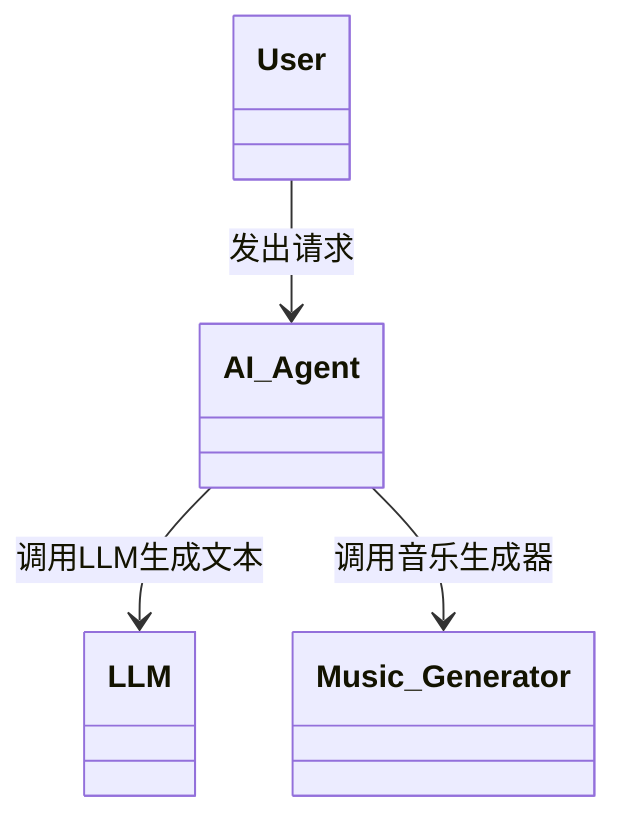
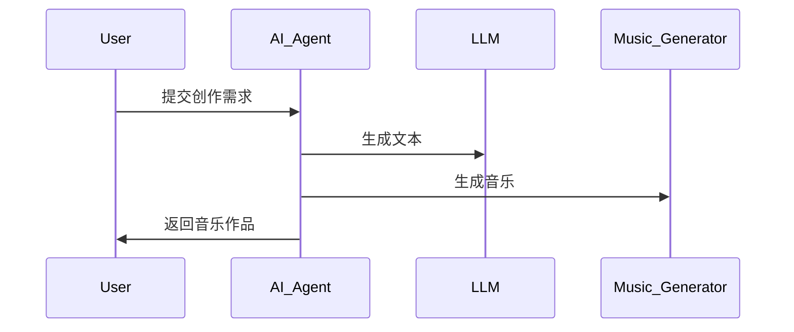

                 


# LLM驱动的AI Agent音乐创作与分析

**关键词**：LLM, AI Agent, 音乐创作, 音乐分析, 大语言模型, AI音乐生成

**摘要**：本文详细探讨了如何利用大语言模型（LLM）驱动AI代理（AI Agent）进行音乐创作与分析的技术实现。文章从背景介绍、核心概念、算法原理、系统设计、项目实战到未来展望，全面剖析了LLM与AI Agent在音乐领域的应用。通过丰富的案例分析和详细的代码实现，展示了如何将先进的AI技术应用于音乐创作与分析的各个环节。

---

## 第1章: 背景介绍与问题背景

### 1.1 问题背景

#### 1.1.1 音乐创作与分析的现状与挑战
音乐创作和分析是人类文化的重要组成部分，传统音乐创作依赖于作曲家的创造力和技巧，而音乐分析则需要专业的音乐知识和技能。然而，随着人工智能技术的快速发展，如何利用AI技术提升音乐创作和分析的效率与质量成为了一个重要的研究方向。

#### 1.1.2 LLM与AI Agent在音乐领域的潜力
大语言模型（LLM）具有强大的自然语言处理能力，可以理解人类语言并生成文本。AI代理（AI Agent）则可以通过与用户的交互，动态调整其行为以满足用户的需求。将LLM与AI Agent结合，可以为音乐创作和分析提供智能化的解决方案。

#### 1.1.3 当前技术与音乐创作的结合趋势
近年来，生成式AI技术在音乐领域的应用逐渐增多，例如通过GPT模型生成歌词，通过深度学习模型生成音乐旋律等。然而，如何将这些技术整合到一个统一的系统中，形成完整的音乐创作与分析流程，仍然是一个挑战。

### 1.2 问题描述

#### 1.2.1 LLM驱动AI Agent音乐创作的核心问题
- 如何将LLM与AI Agent结合，实现音乐创作的智能化。
- 如何设计高效的交互流程，使用户能够通过自然语言与AI代理进行音乐创作。

#### 1.2.2 音乐创作与分析中的关键任务
- 生成音乐旋律和歌词。
- 分析音乐作品的情感和结构。
- 提供创作建议和灵感。

#### 1.2.3 LLM与AI Agent在音乐中的协同作用
- LLM负责理解和生成文本，AI Agent负责协调创作过程。
- AI Agent可以根据用户的需求，调用不同的模型或工具来完成任务。

### 1.3 问题解决

#### 1.3.1 LLM驱动AI Agent音乐创作的解决方案
- 设计一个基于LLM的AI代理，能够理解用户的创作需求。
- 通过LLM生成音乐相关的文本内容，如歌词、创作灵感等。
- 结合音乐生成模型，将LLM生成的文本转化为音乐作品。

#### 1.3.2 AI Agent在音乐创作中的角色定位
- 用户与音乐创作工具之间的桥梁。
- 根据用户需求调用不同的AI模型或工具。
- 提供创作建议和实时反馈。

#### 1.3.3 技术实现的关键步骤
1. 设计AI Agent的交互界面。
2. 集成LLM模型，用于生成音乐相关的文本。
3. 结合音乐生成模型，将文本转化为音乐作品。
4. 设计反馈机制，优化创作流程。

### 1.4 边界与外延

#### 1.4.1 LLM驱动AI Agent音乐创作的边界
- 专注于音乐创作与分析，不涉及音乐表演或录音制作。
- 仅提供创作建议和生成工具，不替代人类的创造力。

#### 1.4.2 相关领域的外延
- 音乐教育：通过AI Agent辅助音乐学习。
- 音乐治疗：利用AI生成的音乐进行心理治疗。
- 音乐产业：优化音乐制作流程，提升效率。

#### 1.4.3 技术实现的限制与扩展
- 当前主要支持文本创作，未来可以扩展到图像和视频创作。
- 支持多语言创作，满足不同用户的需求。

### 1.5 概念结构与核心要素

#### 1.5.1 核心概念组成
- **用户**：音乐创作的发起者。
- **AI Agent**：执行创作任务的智能体。
- **LLM**：生成音乐文本的核心模型。
- **音乐创作工具**：将文本转化为音乐的工具。

#### 1.5.2 关键技术要素
- **LLM模型**：如GPT系列，用于生成音乐相关的文本。
- **音乐生成模型**：如MuseNet，用于将文本转化为音乐。
- **交互界面**：用户与AI Agent的沟通桥梁。

#### 1.5.3 相关领域的影响
- 音乐教育：AI Agent可以辅助学生学习音乐理论。
- 音乐分析：通过LLM分析音乐作品的情感和结构。
- 音乐产业：优化音乐制作流程，提升创作效率。

### 1.6 本章小结

---

## 第2章: 核心概念与联系

### 2.1 核心概念原理

#### 2.1.1 LLM的基本原理
- 大语言模型通过大量的文本数据进行训练，能够理解上下文并生成相关文本。
- LLM的输出结果依赖于输入的上下文和模型的训练数据。

#### 2.1.2 AI Agent的基本原理
- AI Agent通过感知环境和用户需求，采取相应的行动来实现目标。
- AI Agent可以调用多种工具或模型来完成任务。

#### 2.1.3 LLM与AI Agent的结合原理
- AI Agent通过自然语言理解用户的需求，调用LLM生成相关文本。
- LLM生成的文本可以作为音乐生成模型的输入，生成音乐作品。

### 2.2 核心概念属性特征对比

| **属性**       | **LLM**                     | **AI Agent**                 |
|----------------|-----------------------------|-------------------------------|
| **核心功能**    | 生成文本                   | 执行任务                     |
| **输入输出**    | 文本                        | 行为（如调用模型、工具）      |
| **目标**        | 生成高质量文本             | 完成用户指定的任务           |
| **依赖**        | 大量文本数据               | 用户需求和可用工具           |
| **局限性**       | 生成内容依赖训练数据       | 受限于可用工具和模型         |

### 2.3 ER实体关系图架构

```mermaid
er
actor: 用户
agent: AI Agent
llm: 大语言模型
music_piece: 音乐作品
interaction: 交互记录
```

---

## 第3章: 算法原理讲解

### 3.1 LLM驱动AI Agent音乐创作的算法流程

#### 3.1.1 算法整体流程
1. 用户通过交互界面提出创作需求。
2. AI Agent理解需求，调用LLM生成相关文本。
3. LLM生成文本后，AI Agent将其输入音乐生成模型，生成音乐作品。
4. 生成的音乐作品通过反馈机制进行优化。

#### 3.1.2 输入处理与模型调用
- **输入处理**：用户输入创作需求，如“写一首悲伤的诗”。
- **模型调用**：AI Agent调用LLM生成歌词。
- **输出处理**：将生成的歌词传递给音乐生成模型。

#### 3.1.3 输出结果的处理与反馈
- 对生成的音乐作品进行评估，如评估情感是否符合需求。
- 根据反馈调整生成参数，优化创作结果。

### 3.2 算法实现的数学模型

#### 3.2.1 LLM的数学模型
- 基于Transformer的架构，包括编码器和解码器。
- 通过自注意力机制理解上下文。

#### 3.2.2 AI Agent的数学模型
- 基于强化学习的策略网络，用于选择最优动作。
- 状态表示和动作空间的设计。

#### 3.2.3 结合模型的数学表达
- LLM生成文本的概率分布：$P(y|x) = \text{softmax}(Wx + b)$
- AI Agent选择动作的策略：$P(a|s) = \text{softmax}(U s + c)$

### 3.3 算法实现的Python源代码

```python
import torch
from transformers import AutoTokenizer, AutoModelForCausalLM

class LLM:
    def __init__(self, model_name):
        self.tokenizer = AutoTokenizer.from_pretrained(model_name)
        self.model = AutoModelForCausalLM.from_pretrained(model_name)
    
    def generate_text(self, input_text, max_length=50):
        inputs = self.tokenizer(input_text, return_tensors="pt")
        outputs = self.model.generate(inputs.input_ids, max_length=max_length)
        return self.tokenizer.decode(outputs[0], skip_special_tokens=True)

class AI_Agent:
    def __init__(self, llm):
        self.llm = llm
    
    def create_music(self, user_input):
        text = self.llm.generate_text(user_input)
        return text
```

---

## 第4章: 系统分析与架构设计方案

### 4.1 问题场景介绍

#### 4.1.1 项目介绍
- 开发一个基于LLM的AI代理，用于音乐创作与分析。
- 通过用户输入生成音乐作品，帮助用户提升创作效率。

### 4.2 系统功能设计

#### 4.2.1 领域模型


#### 4.2.2 系统架构设计
```mermaid
graph TD
    User --> AI_Agent
    AI_Agent --> LLM
    AI_Agent --> Music_Generator
    Music_Generator --> Disk: 保存作品
```

### 4.3 系统接口设计

#### 4.3.1 API接口定义
- `/create_music`：用户输入创作需求，生成音乐作品。
- `/analyze_music`：分析现有音乐作品的情感和结构。

### 4.4 系统交互流程



---

## 第5章: 项目实战

### 5.1 环境安装

```bash
pip install transformers torch
```

### 5.2 核心代码实现

```python
import torch
from transformers import AutoTokenizer, AutoModelForCausalLM

class Music_Generator:
    def __init__(self, model_name):
        self.tokenizer = AutoTokenizer.from_pretrained(model_name)
        self.model = AutoModelForCausalLM.from_pretrained(model_name)
    
    def generate_music(self, input_text, max_length=100):
        inputs = self.tokenizer(input_text, return_tensors="pt")
        outputs = self.model.generate(inputs.input_ids, max_length=max_length)
        return self.tokenizer.decode(outputs[0], skip_special_tokens=True)
```

### 5.3 案例分析与解读

#### 5.3.1 案例分析
- **案例1**：用户输入“写一首悲伤的诗”，生成歌词。
- **案例2**：用户输入“生成一首快节奏的流行歌曲”，生成旋律。

### 5.4 项目总结

---

## 第6章: 最佳实践与未来展望

### 6.1 最佳实践

#### 6.1.1 开发建议
- 确保LLM模型的训练数据多样化，提升生成内容的质量。
- 设计友好的用户交互界面，降低用户使用门槛。

#### 6.1.2 技术 tips
- 使用缓存机制，减少重复计算。
- 定期更新模型，提升生成效果。

### 6.2 未来展望

#### 6.2.1 技术发展
- 更强大的LLM模型，生成更高质量的音乐文本。
- 多模态生成技术，结合图像和音乐生成。

#### 6.2.2 应用场景扩展
- 音乐教育：辅助音乐学习者创作和分析音乐。
- 音乐治疗：通过生成音乐帮助患者放松心情。

---

## 作者：AI天才研究院/AI Genius Institute & 禅与计算机程序设计艺术 /Zen And The Art of Computer Programming

---

**注**：由于篇幅限制，上述内容为简化版目录大纲，完整文章将详细展开每一部分的内容。

