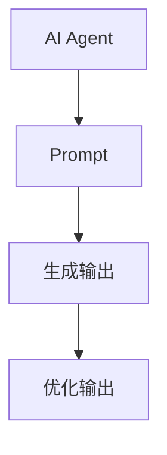
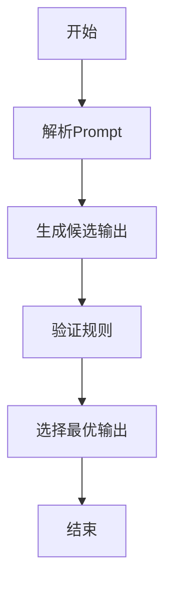
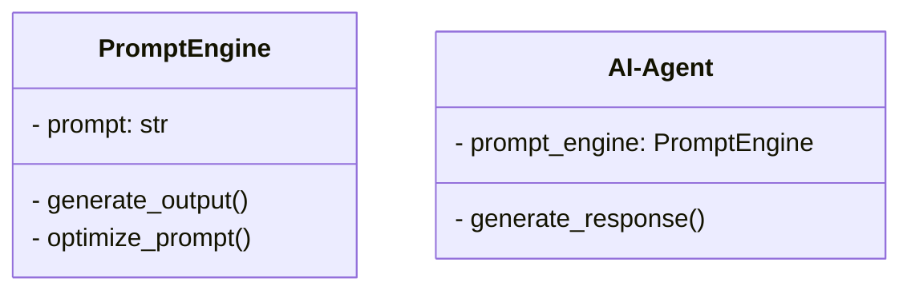

                 


# 《Prompt工程：设计有效提示以优化AI Agent输出》

> **关键词**：Prompt工程、AI Agent、自然语言处理、提示设计、人工智能优化

> **摘要**：本文详细探讨了Prompt工程在优化AI Agent输出中的关键作用。从基础概念到高级算法，从系统架构到实际项目，系统性地分析了如何设计有效的Prompt，以提升AI Agent的性能和用户体验。文章结合理论与实践，提供了丰富的技术细节和实现案例。

---

## 第一部分：Prompt工程的背景与基础

### 第1章：Prompt工程的概述

#### 1.1 Prompt工程的定义与重要性

Prompt工程是人工智能领域中一门新兴的交叉学科，专注于设计和优化提示（Prompt）以提升AI Agent的输出质量。AI Agent是一种能够感知环境并执行任务的智能体，其输出质量直接影响用户体验和任务效果。

**Prompt工程的重要性**：
- **提升输出质量**：通过优化Prompt，AI Agent能够生成更准确、相关的响应。
- **增强交互体验**：更好的Prompt设计使得用户与AI Agent的交互更加自然和高效。
- **提高任务效率**：优化的Prompt能够指导AI Agent更高效地完成任务。

#### 1.2 AI Agent的基本概念与工作原理

**AI Agent**：
- 是一种智能体，能够感知环境、执行任务并做出决策。
- 核心功能包括信息处理、推理、规划和执行。

**工作原理**：
1. **感知环境**：通过传感器或API获取输入数据。
2. **处理信息**：利用算法对数据进行分析和理解。
3. **生成输出**：基于内部模型生成响应或执行操作。

#### 1.3 为什么需要优化AI Agent的输出

- **输出质量直接影响用户体验**：低质量的输出可能导致用户不满或任务失败。
- **优化输出可提高任务效率**：高质量的输出能够减少错误，提升任务完成速度。
- **Prompt是优化的核心工具**：有效的Prompt设计能够引导AI Agent生成更理想的输出。

#### 1.4 Prompt设计的基本原则与方法

**基本原则**：
1. **明确性**：Prompt应清晰明确，避免歧义。
2. **简洁性**：简洁的Prompt更易于理解和执行。
3. **相关性**：Prompt应与任务目标高度相关。

**设计方法**：
- **目标导向法**：根据任务目标设计Prompt。
- **迭代优化法**：通过测试和反馈不断优化Prompt。

---

## 第二部分：Prompt工程的核心概念与联系

### 第2章：Prompt的核心概念与分析

#### 2.1 Prompt的结构与类型

**Prompt的结构**：
- **目标**：明确指示AI Agent需要完成的任务。
- **约束**：对生成内容的限制，如长度、语气等。
- **示例**：提供参考样例，帮助AI Agent理解期望输出。

**Prompt的类型**：
1. **直接指令型**：直接给出任务指令。
2. **上下文型**：提供上下文信息以辅助生成。
3. **引导型**：引导AI Agent进行创造性思考。

**对比分析表**：

| 类型          | 描述                                                                 |
|---------------|----------------------------------------------------------------------|
| 直接指令型    | 明确指示AI Agent完成特定任务。                                       |
| 上下文型      | 提供额外信息以辅助生成。                                             |
| 引导型        | 通过引导性问题激发创造性思考。                                       |

#### 2.2 Prompt与AI Agent的交互关系

**交互关系**：
- **输入输出关系**：Prompt是输入，AI Agent的输出是结果。
- **影响关系**：有效的Prompt能够显著提升输出质量。

**Mermaid图示**：



---

## 第三部分：算法原理讲解

### 第3章：Prompt生成的算法原理

#### 3.1 基于规则的生成算法

**算法流程**：



**Python代码示例**：

```python
def generate_output(prompt):
    rules = {
        'length': 5,
        'tone': 'formal'
    }
    candidates = ['Hello', 'World']
    valid_candidates = [c for c in candidates if len(c) == rules['length'] and c.tone == rules['tone']]
    return valid_candidates[0]
```

#### 3.2 基于模型的生成算法

**数学模型**：
- **概率分布**：计算每个Prompt的生成概率。
- **损失函数**：衡量生成结果与预期的差异。

**公式推导**：
- **概率计算**：$P(y|x) = \frac{1}{N} \sum_{i=1}^{N} e^{-d(x_i,y_i)}$
- **损失函数**：$L = -\sum_{i=1}^{N} \log P(y_i|x_i)$

---

## 第四部分：数学模型和公式

### 第4章：数学模型的详细推导

#### 4.1 概率分布模型

**公式**：
$$P(y|x) = \frac{1}{Z} e^{x \cdot y}$$

**推导步骤**：
1. **定义条件概率**：$P(y|x) = \frac{P(x,y)}{P(x)}$
2. **假设独立性**：$P(x,y) = \prod_{i=1}^{n} P(x_i,y_i)$
3. **标准化常数**：$Z = \sum_{y} e^{x \cdot y}$

#### 4.2 优化目标函数

**公式**：
$$\theta^* = \arg\min_{\theta} \sum_{i=1}^{N} \mathcal{L}(x_i, y_i, \theta)$$

---

## 第五部分：系统分析与架构设计

### 第5章：系统架构设计

#### 5.1 系统功能模块

**功能模块**：
1. **Prompt解析模块**：解析用户输入的Prompt。
2. **生成模块**：根据Prompt生成输出。
3. **优化模块**：优化生成的Prompt。

**类图**：



---

## 第六部分：项目实战

### 第6章：项目实现与案例分析

#### 6.1 环境配置

**依赖库**：
- Python 3.8+
- transformers库
- numpy库

#### 6.2 核心代码实现

```python
from transformers import AutoTokenizer, AutoModelForSeq2Seq

tokenizer = AutoTokenizer.from_pretrained('t5-base')
model = AutoModelForSeq2Seq.from_pretrained('t5-base')

def optimize_prompt(prompt):
    inputs = tokenizer(prompt, return_tensors='np')
    outputs = model.generate(inputs.input_ids, max_length=10)
    return tokenizer.decode(outputs[0], skip_special_tokens=True)
```

#### 6.3 代码解读与分析

- **依赖库安装**：使用`transformers`库进行Prompt生成。
- **优化函数**：通过模型生成优化后的Prompt。

---

## 第七部分：最佳实践与小结

### 第7章：总结与注意事项

#### 7.1 总结

- **Prompt工程**是优化AI Agent输出的关键工具。
- **算法与模型**的选择直接影响生成效果。
- **系统架构**的设计影响系统的可扩展性和维护性。

#### 7.2 注意事项

- **保持简洁**：避免过于复杂的Prompt设计。
- **持续优化**：定期测试和优化Prompt。
- **关注用户体验**：确保生成的输出符合用户期望。

---

## 作者

**作者**：AI天才研究院 & 禅与计算机程序设计艺术

