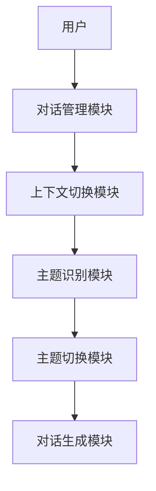
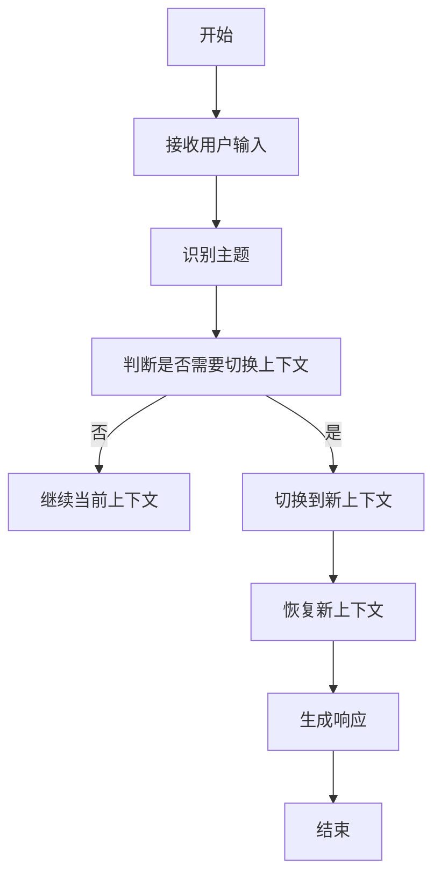
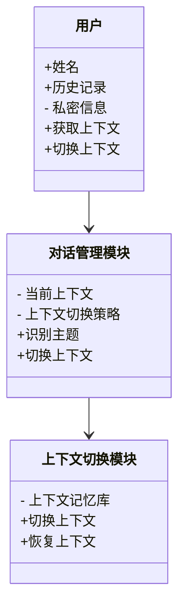
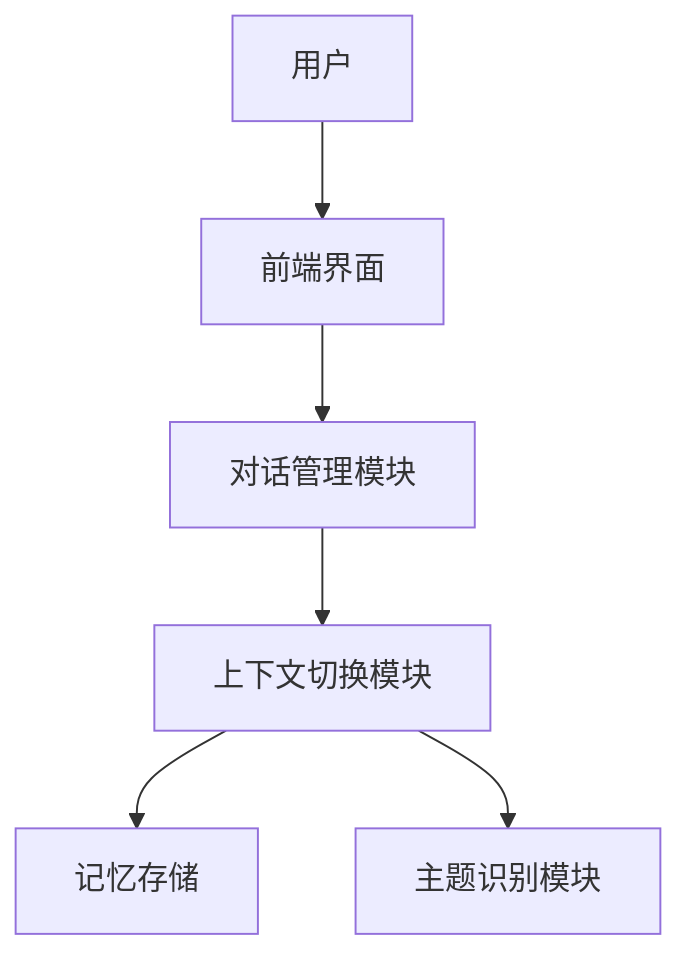
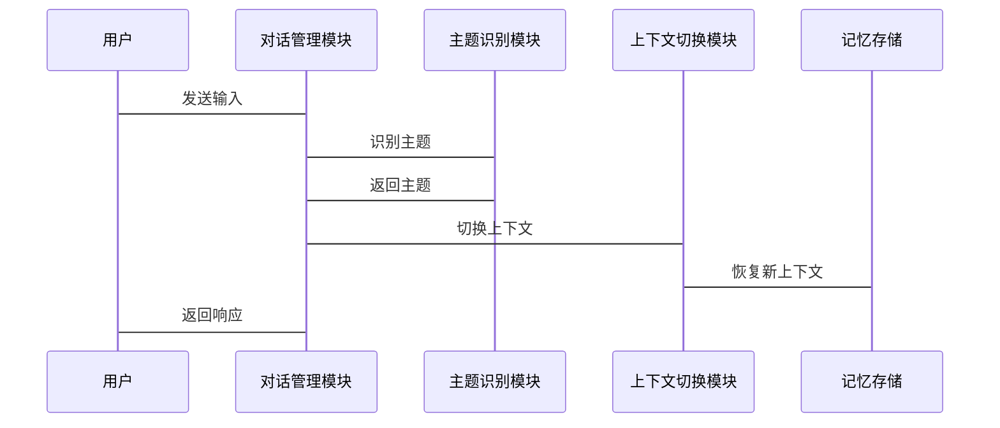

                 


```markdown
# 上下文切换：让AI Agent灵活应对多主题对话

## 关键词
上下文切换, AI Agent, 多主题对话, 对话管理, 内存模型, 策略切换, 模型优化

## 摘要
在多主题对话中，AI Agent需要灵活切换上下文，以应对不同的主题和用户需求。本文系统地探讨了上下文切换的核心概念、算法原理、系统架构以及项目实现，旨在帮助AI开发者和研究人员深入理解并有效实施上下文切换技术。通过对比分析、流程图展示、代码示例和数学模型，本文详细解析了上下文切换的关键技术，并提供了实际应用场景中的解决方案。

---

## 第一部分: 上下文切换的核心概念与背景

### 第1章: 上下文切换的背景与问题背景

#### 1.1 问题背景
##### 1.1.1 多主题对话的挑战
在实际对话中，用户可能会在短时间内切换多个主题，例如从天气讨论转到旅行计划，再到健康建议。这种多主题对话要求AI Agent能够快速调整其理解和生成内容的能力。

##### 1.1.2 AI Agent在多主题对话中的局限性
传统的AI对话模型通常专注于单一主题，无法有效处理上下文切换，导致对话中断或回答错误。

##### 1.1.3 上下文切换的必要性
为了提高AI Agent的对话能力，必须实现上下文切换功能，使其能够根据对话主题的变化调整响应。

#### 1.2 问题描述
##### 1.2.1 多主题对话的定义
多主题对话是指在同一个对话中，用户提出多个不同主题的问题，要求AI Agent能够理解和响应。

##### 1.2.2 AI Agent在对话中的角色
AI Agent作为对话的参与者，需要理解上下文，并在主题切换时保持对话的连贯性。

##### 1.2.3 上下文切换的具体问题
- 如何识别新的主题？
- 如何管理多个上下文？
- 如何确保切换后的上下文一致性？

#### 1.3 问题解决
##### 1.3.1 上下文切换的目标
实现AI Agent在多主题对话中的灵活切换，保持对话的连贯性和准确性。

##### 1.3.2 解决多主题对话问题的思路
- 引入上下文记忆机制。
- 开发主题识别和切换算法。
- 实现上下文切换的控制策略。

#### 1.4 边界与外延
##### 1.4.1 上下文切换的边界
- 上下文切换仅在主题变化时触发。
- 每次切换仅影响当前对话的主题。

##### 1.4.2 多主题对话的外延
多主题对话包括主题识别、主题切换和主题恢复三个阶段。

##### 1.4.3 上下文切换与其他技术的关系
上下文切换与自然语言处理、对话管理、知识图谱等技术密切相关。

#### 1.5 概念结构与核心要素
##### 1.5.1 上下文切换的核心要素
- 上下文记忆模块。
- 主题识别模块。
- 切换控制模块。

##### 1.5.2 多主题对话的结构
- 初始主题识别。
- 主题切换触发。
- 上下文切换实现。

##### 1.5.3 上下文切换的实现机制
- 基于记忆的上下文存储。
- 主题切换的触发条件。
- 切换后的上下文恢复。

### 第2章: 上下文切换的核心概念与联系

#### 2.1 核心概念原理
##### 2.1.1 上下文切换的定义
上下文切换是指AI Agent在对话过程中，根据主题变化动态调整其上下文信息的过程。

##### 2.1.2 多主题对话的实现原理
多主题对话依赖于上下文切换技术，确保AI Agent能够理解并响应不同主题的问题。

##### 2.1.3 上下文切换的实现机制
- 基于记忆的上下文管理。
- 主题识别和切换策略。

#### 2.2 对比分析
##### 2.2.1 对比表格：上下文切换与传统对话管理方法
| 方法 | 优点 | 缺点 |
|------|------|------|
| 传统对话管理 | 实现简单 | 无法处理多主题对话 |
| 上下文切换 | 支持多主题 | 实现复杂 |

##### 2.2.2 对比表格：不同上下文切换策略的优缺点
| 策略 | 优点 | 缺点 |
|------|------|------|
| 基于记忆 | 精准恢复 | 占用内存大 |
| 基于关键词 | 实现简单 | 易出错 |

#### 2.3 实体关系图
##### 2.3.1 Mermaid流程图：上下文切换的实体关系


---

## 第二部分: 上下文切换的算法原理

### 第3章: 上下文切换的算法原理

#### 3.1 算法原理
##### 3.1.1 上下文切换算法的概述
上下文切换算法包括主题识别、切换触发和上下文恢复三个主要步骤。

##### 3.1.2 基于记忆机制的上下文切换
使用记忆模型存储上下文信息，根据主题变化进行切换。

##### 3.1.3 基于对话管理策略的上下文切换
通过对话管理策略决定何时切换上下文。

#### 3.2 算法流程图
##### 3.2.1 Mermaid流程图：上下文切换算法的执行流程


#### 3.3 算法实现
##### 3.3.1 Python代码示例
```python
class ContextSwitcher:
    def __init__(self):
        self.contexts = {}  # 存储上下文信息
        self.current_context = None

    def switch_context(self, new_context):
        if new_context in self.contexts:
            self.current_context = new_context
        else:
            self.contexts[new_context] = {}  # 初始化新上下文
            self.current_context = new_context

    def get_context(self):
        return self.contexts[self.current_context]
```

##### 3.3.2 数学模型与公式
上下文切换的概率可以表示为：
$$ P(\text{切换}|T) = \frac{\text{主题变化次数}}{\text{总对话次数}} $$

其中，T表示主题变化的触发条件。

---

## 第三部分: 系统分析与架构设计

### 第4章: 系统分析与架构设计

#### 4.1 系统问题场景介绍
多主题对话中，AI Agent需要快速切换上下文，以适应用户需求的变化。

#### 4.2 项目介绍
开发一个支持多主题对话的AI Agent系统，重点实现上下文切换功能。

#### 4.3 系统功能设计
##### 4.3.1 Mermaid类图：领域模型


#### 4.4 系统架构设计
##### 4.4.1 Mermaid架构图：系统架构


#### 4.5 系统接口设计
##### 4.5.1 接口1：识别主题
接口定义：`identify_theme(input_text)`，返回主题标签。

##### 4.5.2 接口2：切换上下文
接口定义：`switch_context(new_theme)`，切换到新的主题上下文。

#### 4.6 系统交互
##### 4.6.1 Mermaid序列图：系统交互流程


---

## 第四部分: 项目实战

### 第5章: 项目实战

#### 5.1 环境安装
##### 5.1.1 安装Python和相关库
```bash
pip install python
pip install numpy
pip install scikit-learn
```

#### 5.2 核心代码实现
##### 5.2.1 上下文切换模块实现
```python
class ContextSwitcher:
    def __init__(self):
        self.contexts = {}
        self.current_context = None

    def switch_context(self, new_context):
        if new_context not in self.contexts:
            self.contexts[new_context] = {}
        self.current_context = new_context
        return self.contexts[self.current_context]

    def get_context(self):
        return self.contexts[self.current_context]
```

##### 5.2.2 主题识别模块实现
```python
from sklearn.feature_extraction.text import TfidfVectorizer
from sklearn.metrics.pairwise import cosine_similarity

class ThemeIdentifier:
    def __init__(self):
        self.vectorizer = TfidfVectorizer()

    def identify_theme(self, input_text, context_texts):
        vectors = self.vectorizer.fit_transform([input_text] + context_texts)
        similarities = cosine_similarity(vectors[0], vectors).flatten()
        return similarities.argmax()
```

#### 5.3 代码解读与分析
##### 5.3.1 上下文切换模块解读
- 使用字典存储上下文信息。
- 根据主题切换上下文。

##### 5.3.2 主题识别模块解读
- 使用TF-IDF和余弦相似度进行主题识别。
- 返回最相关的上下文索引。

#### 5.4 实际案例分析
##### 5.4.1 案例1：天气与旅行
用户先讨论天气，然后询问旅行计划。AI Agent应切换到旅行主题。

##### 5.4.2 案例2：健康与饮食
用户先讨论健康，然后询问饮食建议。AI Agent应切换到饮食主题。

#### 5.5 项目小结
通过实际案例，验证了上下文切换模块的有效性，提高了AI Agent的多主题对话能力。

---

## 第五部分: 最佳实践、小结、注意事项和拓展阅读

### 第6章: 最佳实践与总结

#### 6.1 最佳实践
##### 6.1.1 合理设计上下文切换策略
根据具体场景选择合适的上下文切换方法。

##### 6.1.2 定期优化上下文记忆模块
通过数据反馈不断优化记忆模型。

#### 6.2 小结
本文系统地介绍了上下文切换的核心概念、算法原理、系统架构和项目实现，为AI开发者提供了理论和实践指导。

#### 6.3 注意事项
- 确保上下文切换的准确性和及时性。
- 避免上下文切换过于频繁导致性能下降。

#### 6.4 拓展阅读
建议深入研究上下文记忆模型和主题识别算法，探索更高效的上下文切换方法。

---

## 作者：AI天才研究院/AI Genius Institute & 禅与计算机程序设计艺术 /Zen And The Art of Computer Programming
```

