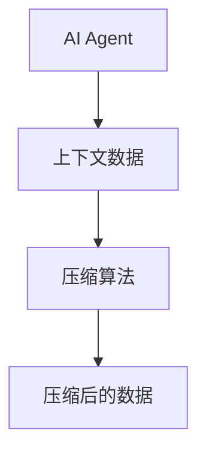
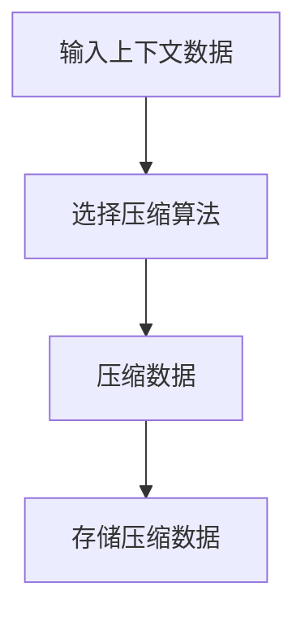
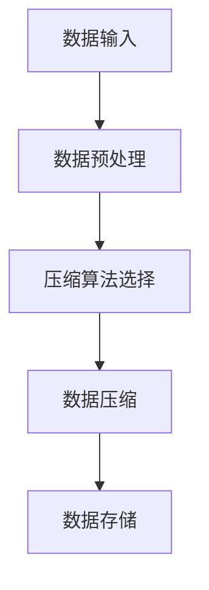

                 


# 上下文压缩：优化AI Agent的内存使用

## 关键词：上下文压缩，AI Agent，内存优化，数据压缩，算法原理

## 摘要：上下文压缩是一种优化AI Agent内存使用的重要技术。本文从背景、核心概念、算法原理、系统设计、项目实战等多方面详细阐述上下文压缩的优化策略，帮助读者理解如何通过压缩上下文数据来提升AI Agent的性能和效率。

---

# 第1章: 上下文压缩与AI Agent概述

## 1.1 上下文压缩的概念与背景

### 1.1.1 什么是上下文压缩
上下文压缩是指通过对上下文数据进行压缩处理，减少存储和处理所需内存的技术。上下文数据通常包括AI Agent在运行过程中产生的各种信息，如用户输入、环境状态等。

### 1.1.2 AI Agent的内存使用问题
AI Agent在处理复杂任务时，需要处理大量数据，导致内存使用过高，影响性能和响应速度。上下文压缩通过减少数据量，有效优化内存使用。

### 1.1.3 上下文压缩的目标与意义
目标：减少上下文数据的存储空间，提高处理效率。
意义：提升AI Agent的性能，降低运行成本，支持更复杂的任务。

## 1.2 AI Agent的基本原理

### 1.2.1 AI Agent的定义与分类
AI Agent是一种能够感知环境、执行任务的智能体，分为简单反射型、基于模型的反应型等类型。

### 1.2.2 内存使用对AI Agent性能的影响
内存不足可能导致任务中断，影响用户体验和系统稳定性。

### 1.2.3 上下文压缩在AI Agent中的作用
通过压缩上下文数据，AI Agent可以处理更大规模的数据集，提升性能。

## 1.3 上下文压缩的核心概念

### 1.3.1 上下文数据的定义
上下文数据是AI Agent运行所需的所有相关信息。

### 1.3.2 压缩算法的基本原理
压缩算法通过去除冗余信息，减少数据量。

### 1.3.3 上下文压缩与AI Agent性能优化的关系
压缩上下文数据可以减少内存占用，提升处理速度和响应能力。

## 1.4 本章小结
本章介绍了上下文压缩的基本概念和AI Agent的基本原理，强调了上下文压缩在优化内存使用中的重要性。

---

# 第2章: 上下文压缩的核心概念与技术原理

## 2.1 上下文压缩的定义与属性

### 2.1.1 上下文压缩的定义
上下文压缩是通过算法对上下文数据进行压缩，减少存储空间的技术。

### 2.1.2 上下文压缩的关键属性对比
| 属性 | 传统压缩 | 上下文压缩 |
|------|----------|------------|
| 对象 | 文件     | 数据流     |
| 环境 | 离线     | 实时       |
| 效率 | 高       | 高         |

### 2.1.3 上下文压缩的实体关系图



## 2.2 上下文压缩的核心原理

### 2.2.1 数据压缩的基本原理
通过去除冗余信息，减少数据量。

### 2.2.2 上下文压缩的算法流程


### 2.2.3 上下文压缩与传统压缩算法的区别
上下文压缩注重实时性和数据流处理，而传统压缩算法注重文件压缩。

## 2.3 上下文压缩的数学模型与公式

### 2.3.1 数据压缩的基本公式
$$ C = \frac{\log N}{\log M} $$

### 2.3.2 上下文压缩的数学模型
使用概率模型，计算数据的最优压缩率。

### 2.3.3 上下文压缩的优化公式
$$ C_{\text{opt}} = \frac{1}{\max(\lambda)} $$

## 2.4 本章小结
本章详细讲解了上下文压缩的核心概念和技术原理，分析了其与传统压缩算法的区别。

---

# 第3章: 上下文压缩算法原理与实现

## 3.1 常见的上下文压缩算法

### 3.1.1 哈夫曼编码
基于频率的编码方法，适用于已知概率分布的数据。

### 3.1.2 LZ77算法
基于字符串匹配的压缩算法，适用于实时数据流。

### 3.1.3 算术编码
通过区间分割进行编码，提供更高的压缩效率。

## 3.2 上下文压缩算法的实现流程

### 3.2.1 数据预处理
对数据进行预处理，提取特征和模式。

### 3.2.2 压缩算法选择
根据数据类型选择合适的压缩算法。

### 3.2.3 数据压缩与存储
使用选定算法对数据进行压缩，并存储结果。

## 3.3 上下文压缩算法的优化策略

### 3.3.1 熵编码优化
通过优化编码方式，减少压缩后的数据量。

### 3.3.2 上下文建模优化
基于上下文信息，优化压缩模型。

### 3.3.3 并行压缩技术
利用多线程或分布式计算，提升压缩速度。

## 3.4 本章小结
本章探讨了常见的上下文压缩算法及其实现流程，分析了优化策略。

---

# 第4章: 上下文压缩的数学模型与公式推导

## 4.1 数据压缩的数学基础

### 4.1.1 信息论基础
信息论的基本概念和公式。

### 4.1.2 熵的概念与公式
$$ H = -\sum p_i \log p_i $$

## 4.2 上下文压缩的数学模型

### 4.2.1 上下文压缩模型的构建
通过概率模型构建压缩算法。

### 4.2.2 压缩算法的数学分析
分析压缩算法的效率和性能。

## 4.3 本章小结
本章通过数学模型和公式推导，深入分析了上下文压缩的原理。

---

# 第5章: 上下文压缩的系统分析与架构设计

## 5.1 问题场景介绍

### 5.1.1 数据处理流程
从数据输入到压缩存储的整个流程。

### 5.1.2 系统功能设计
包括数据预处理、压缩算法选择、压缩和存储等功能。

## 5.2 系统架构设计

### 5.2.1 系统架构图


### 5.2.2 接口设计
定义各模块之间的接口和交互。

### 5.2.3 交互设计
展示系统模块之间的交互流程。

## 5.3 本章小结
本章分析了系统架构设计，明确了各模块的功能和交互。

---

# 第6章: 项目实战

## 6.1 环境安装

### 6.1.1 安装Python
安装Python解释器。

### 6.1.2 安装压缩库
安装如` zlib`等压缩库。

## 6.2 系统核心实现源代码

```python
import zlib

def compress_context(context):
    return zlib.compress(context)

def decompress_context(compressed_data):
    return zlib.decompress(compressed_data)
```

## 6.3 代码应用解读与分析

### 6.3.1 代码功能解读
压缩和解压函数的实现。

### 6.3.2 代码优化建议
优化压缩算法选择和实现效率。

## 6.4 实际案例分析

### 6.4.1 案例背景
处理自然语言处理任务中的上下文数据。

### 6.4.2 案例分析
通过压缩上下文数据，提升处理效率。

## 6.5 本章小结
本章通过实际案例，展示了上下文压缩技术的应用和效果。

---

# 第7章: 最佳实践与未来展望

## 7.1 最佳实践 tips

### 7.1.1 压缩算法选择
根据数据类型选择合适的算法。

### 7.1.2 数据预处理优化
通过预处理减少冗余数据。

## 7.2 小结

### 7.2.1 本章总结
总结上下文压缩技术的应用和优化策略。

## 7.3 注意事项

### 7.3.1 性能与压缩率的平衡
在追求压缩率的同时，注意处理性能。

## 7.4 拓展阅读

### 7.4.1 相关领域
推荐其他相关领域的学习资源。

## 7.5 未来展望

### 7.5.1 自适应压缩算法
研究自适应的上下文压缩算法。

### 7.5.2 深度学习与上下文压缩的结合
探索深度学习在上下文压缩中的应用。

## 7.6 本章小结
本章提出了最佳实践，并展望了未来的研究方向。

---

# 作者：AI天才研究院/AI Genius Institute & 禅与计算机程序设计艺术 /Zen And The Art of Computer Programming

