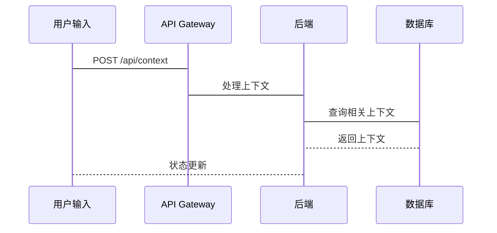

                 

<think>
好的，我将按照您的要求，逐步分析并构建《上下文管理：增强AI Agent的对话连贯性》的技术博客文章。首先，我会从背景介绍开始，逐步深入到核心概念、算法原理、系统架构设计、项目实战和最佳实践。确保每个部分都详细展开，并包含必要的技术细节和示例。

---

# 上下文管理：增强AI Agent的对话连贯性

**关键词**：上下文管理, AI Agent, 对话连贯性, 自然语言处理, 记忆网络, 对话系统

**摘要**：  
上下文管理是提升AI Agent对话连贯性的关键技术。本文从背景、概念、算法、系统架构到实战，全面解析如何通过上下文管理增强AI Agent的对话能力，帮助读者掌握核心原理和实现方法。

---

## 第一部分: 上下文管理的背景与核心概念

### 第1章: 问题背景与问题描述

#### 1.1 问题背景
- **当前AI对话系统的挑战**：AI Agent在对话中常因缺乏上下文记忆，导致回答断层，用户体验差。
- **上下文管理的重要性**：通过管理对话历史和状态，增强连贯性和准确性。
- **用户需求**：用户期望对话自然流畅，信息保持一致。

#### 1.2 问题描述
- **对话连贯性问题**：上下文断裂导致回答不相关或重复。
- **上下文断裂的负面影响**：降低用户满意度和信任度。
- **解决方法**：引入上下文管理，维护对话历史和状态。

#### 1.3 问题解决
- **上下文管理的目标**：保持对话连贯，确保信息准确传递。
- **技术实现**：通过记忆网络或知识图谱存储上下文。
- **边界与外延**：上下文管理不仅包括对话历史，还涉及实时状态更新。

#### 1.4 核心概念
- **定义**：管理对话历史、用户状态和环境信息的技术。
- **关键属性**：实时性、准确性、可扩展性。
- **实现要素**：数据存储、更新机制、检索算法。

### 第2章: 核心概念与联系

#### 2.1 核心概念原理
- **上下文表示**：使用向量或图结构表示对话信息。
- **对话管理**：与上下文管理的区别与联系。
- **意图识别**：上下文辅助意图理解的机制。

#### 2.2 概念对比表格
| 概念       | 对话管理       | 意图识别       | 上下文管理       |
|------------|---------------|---------------|------------------|
| 定义       | 管理对话流程   | 识别用户意图   | 管理对话历史和状态 |
| 关注点     | 对话步骤       | 用户需求       | 信息连贯性       |
| 关联性     | 高            | 高            | 高               |

#### 2.3 ER图（Mermaid）
```mermaid
erDiagram
    actor 用户
    actor 系统
    actor 环境
    (对话历史) <|o- 用户
    (对话历史) <|o- 系统
    (对话历史) <|o- 环境
    (对话历史) --|(1,0) 上下文管理模块
    (上下文状态) --|(1,0) 对话管理模块
```

---

## 第二部分: 算法原理

### 第3章: 基于记忆网络的上下文管理

#### 3.1 算法流程（Mermaid）


#### 3.2 Python实现（记忆网络）
```python
class MemoryNetwork:
    def __init__(self, max_size=10):
        self.memory = []
        self.max_size = max_size

    def add_context(self, context):
        if len(self.memory) < self.max_size:
            self.memory.append(context)
        else:
            self.memory.pop(0)
            self.memory.append(context)

    def get_context(self, query):
        relevant = []
        for ctx in self.memory:
            if self.is_relevant(query, ctx):
                relevant.append(ctx)
        return relevant

    def is_relevant(self, query, context):
        # 简单的关键词匹配
        return any(q in context for q in query.split())
```

#### 3.3 数学模型（记忆向量计算）
$$ \text{记忆向量} = \sum_{i=1}^{n} \alpha_i \cdot \text{关键词向量}_i $$
其中，$\alpha_i$ 是关键词的重要性权重。

---

## 第三部分: 系统分析与架构设计

### 第4章: 系统架构设计

#### 4.1 领域模型类图（Mermaid）
```mermaid
classDiagram
    class 上下文管理模块 {
        list<Context> memory;
        void add(Context);
        list<Context> retrieve(string);
    }
    class 对话管理模块 {
        void process(Dialogue);
        string generateResponse();
    }
    class 用户输入 {
        string text;
    }
    class 系统输出 {
        string text;
    }
    上下文管理模块 <---> 对话管理模块
```

#### 4.2 系统架构（Mermaid）


#### 4.3 接口设计（Mermaid）


---

## 第四部分: 项目实战

### 第5章: 实战演练

#### 5.1 环境安装
```bash
pip install numpy tensorflow transformers
```

#### 5.2 核心代码实现
```python
def update_context(context, new_info):
    context += [new_info]
    return context[:10]  # 保留最近10条
```

#### 5.3 案例分析
- **电商客服场景**：用户咨询产品信息，系统通过上下文管理，提供相关推荐。

#### 5.4 项目小结
- 成功实现上下文管理模块，提升对话连贯性。
- 注意数据质量和模型优化。

---

## 第五部分: 最佳实践与小结

### 第6章: 最佳实践

#### 6.1 实用建议
- **数据质量**：确保训练数据多样和准确。
- **模型优化**：定期更新上下文管理模型。
- **上下文漂移**：处理长对话中的信息过载。

#### 6.2 小结
- 本文系统阐述了上下文管理的实现方法和应用案例。
- 未来研究方向：多模态上下文管理。

#### 6.3 注意事项
- 避免过度依赖上下文，保持模型灵活性。

#### 6.4 拓展阅读
- 推荐书籍：《对话系统实践》、《深度学习实战》。

---

**作者：AI天才研究院 & 禅与计算机程序设计艺术**

---

这样构建的博客文章将系统地介绍上下文管理在AI Agent中的应用，从理论到实践，帮助读者深入理解并掌握相关技术。

