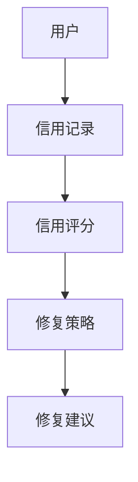
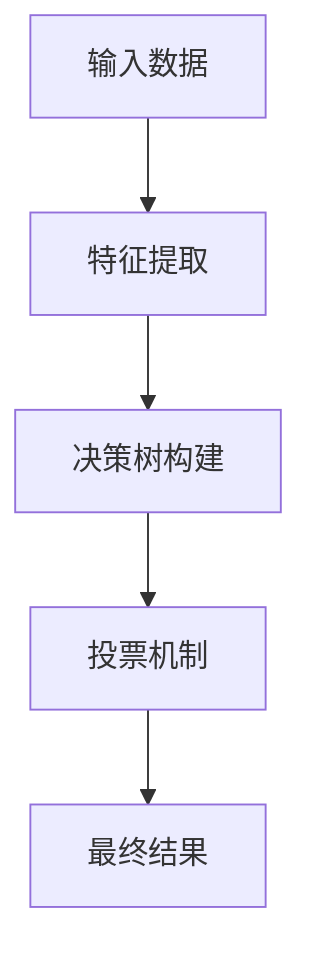
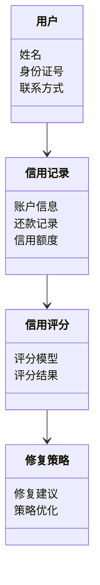
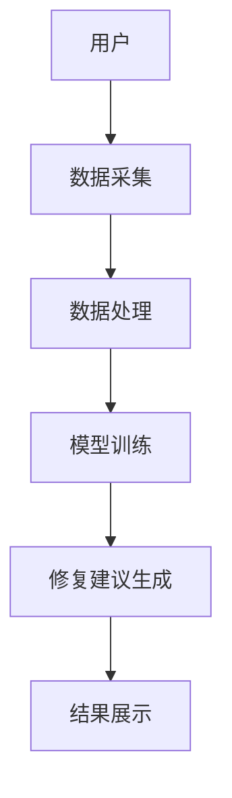
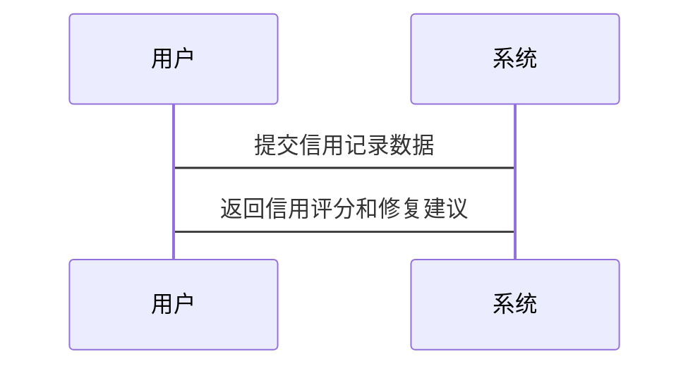

                 


# 个人信用修复建议生成器

> 关键词：个人信用修复，信用评分模型，修复策略，机器学习算法，系统架构设计，项目实战

> 摘要：本文深入探讨了个人信用修复的背景、核心概念、算法原理、系统架构设计、项目实战及最佳实践。通过详细分析信用修复的关键要素，结合数学模型、算法实现和系统设计，为读者提供从理论到实践的全面指导。

---

# 第一部分：个人信用修复背景与概念

## 第1章：个人信用修复概述

### 1.1 个人信用修复的概念与背景

#### 1.1.1 信用记录的基本概念
信用记录是个人在经济活动中履行义务的记录，反映了个人的信用状况。良好的信用记录是个人在金融活动中获得信任和便利的重要依据。

#### 1.1.2 个人信用修复的定义
个人信用修复是指通过合法途径，修正和改善个人信用记录，以提升信用评分，从而获得更好的金融服务和信用额度的过程。

#### 1.1.3 信用修复的重要性和必要性
- 信用评分直接影响个人的贷款审批、信用卡额度等金融服务。
- 修复信用记录可以避免因信用问题导致的经济损失和生活不便。
- 良好的信用记录是个人在社会经济活动中的重要资产。

### 1.2 个人信用修复的现状与挑战

#### 1.2.1 当前信用修复的主要方式
- 自我修复：通过按时还款、减少负债等方式改善信用记录。
- 专业机构修复：通过第三方机构帮助修复信用记录。
- 技术手段修复：利用大数据和人工智能技术优化信用评分模型。

#### 1.2.2 信用修复过程中的常见问题
- 信息不对称：个人难以获取全面的信用记录信息。
- 技术局限：传统信用评分模型可能存在偏差，难以准确反映个人信用状况。
- 操作复杂：个人修复信用记录的过程涉及多个环节，操作复杂。

#### 1.2.3 信用修复技术的发展趋势
- 数据驱动：利用大数据技术分析信用记录，提供精准的修复建议。
- 智能化：通过人工智能技术优化信用评分模型，提高修复效率。
- 个性化：根据个人信用状况定制化修复方案。

### 1.3 个人信用修复的核心目标与边界

#### 1.3.1 核心目标的设定
- 提升信用评分：通过优化信用记录，提高信用评分。
- 修复信用污点：消除因逾期、违约等导致的信用负面影响。
- 建立良好的信用习惯：培养按时还款、合理消费等良好的信用行为。

#### 1.3.2 信用修复的边界与外延
- 边界：信用修复仅针对个人信用记录，不涉及企业信用。
- 外延：信用修复不仅包括修复信用记录，还包括维护和提升信用评分。

#### 1.3.3 核心要素的组成与关系
- 核心要素：信用记录、信用评分、修复策略。
- 关系：信用记录是信用评分的基础，修复策略是信用评分优化的关键。

---

## 第2章：个人信用修复的核心概念与联系

### 2.1 信用评估与修复的原理

#### 2.1.1 信用评分模型的原理
信用评分模型通过分析个人信用记录中的各项指标，计算出一个信用评分，反映个人信用状况。

#### 2.1.2 信用修复的算法逻辑
信用修复算法通过分析信用评分模型的输出结果，识别信用记录中的问题，制定修复策略。

#### 2.1.3 修复策略的制定与优化
修复策略根据信用评分模型的输出结果，制定具体的修复措施，优化信用记录，提升信用评分。

### 2.2 核心概念的属性特征对比

#### 2.2.1 信用评分模型的属性特征
| 属性 | 特征 |
|------|------|
| 输入 | 个人信用记录 |
| 输出 | 信用评分 |
| 方法 | 数据分析、机器学习 |

#### 2.2.2 修复策略的属性特征
| 属性 | 特征 |
|------|------|
| 输入 | 信用评分结果 |
| 输出 | 修复建议 |
| 方法 | 数据挖掘、优化算法 |

#### 2.2.3 模型与策略的对比分析
- 信用评分模型是修复策略的基础，修复策略是信用评分模型的应用。

### 2.3 ER实体关系图架构



---

## 第3章：个人信用修复算法原理

### 3.1 信用评分模型的数学模型

#### 3.1.1 线性回归模型
$$y = \beta_0 + \beta_1x_1 + \beta_2x_2 + \ldots + \beta_nx_n$$

### 3.2 修复策略的优化算法

#### 3.2.1 随机森林算法



### 3.3 算法实现的Python源代码

```python
import pandas as pd
from sklearn.ensemble import RandomForestRegressor

# 加载数据
data = pd.read_csv('credit_data.csv')

# 特征工程
features = data[['income', 'debt', 'history']]
target = data['score']

# 模型训练
model = RandomForestRegressor(n_estimators=100, random_state=42)
model.fit(features, target)

# 预测信用评分
new_data = pd.DataFrame({'income': [50000], 'debt': [20000], 'history': [60]})
predicted_score = model.predict(new_data)
print(predicted_score)
```

---

## 第4章：个人信用修复系统架构设计

### 4.1 问题场景介绍

#### 4.1.1 系统目标
- 提供个性化的信用修复建议。
- 帮助用户优化信用记录，提升信用评分。

### 4.2 项目介绍

#### 4.2.1 项目目标
- 开发一个基于机器学习的信用修复建议生成器。

### 4.3 系统功能设计

#### 4.3.1 领域模型



### 4.4 系统架构设计

#### 4.4.1 系统架构图



### 4.5 系统接口设计

#### 4.5.1 数据接口
- 输入：用户信用记录数据
- 输出：信用评分和修复建议

### 4.6 系统交互设计

#### 4.6.1 交互流程



---

## 第5章：个人信用修复项目实战

### 5.1 环境安装

#### 5.1.1 安装Python和相关库
```bash
pip install pandas scikit-learn
```

### 5.2 系统核心实现源代码

#### 5.2.1 信用评分模型实现

```python
import pandas as pd
from sklearn.ensemble import RandomForestRegressor

# 加载数据
data = pd.read_csv('credit_data.csv')

# 特征工程
features = data[['income', 'debt', 'history']]
target = data['score']

# 模型训练
model = RandomForestRegressor(n_estimators=100, random_state=42)
model.fit(features, target)

# 保存模型
import joblib
joblib.dump(model, 'credit_model.pkl')
```

#### 5.2.2 修复策略实现

```python
import joblib

# 加载模型
model = joblib.load('credit_model.pkl')

# 输入新的数据
new_data = pd.DataFrame({'income': [50000], 'debt': [20000], 'history': [60]})

# 预测信用评分
predicted_score = model.predict(new_data)
print(predicted_score)

# 提供修复建议
if predicted_score < 600:
    print("建议：提高收入，减少债务，改善还款记录。")
else:
    print("建议：继续保持良好的信用记录。")
```

### 5.3 实际案例分析

#### 5.3.1 案例背景
某用户信用记录显示收入50000元，债务20000元，还款记录良好。

#### 5.3.2 案例分析
- 预测信用评分为700分。
- 提供修复建议：继续保持良好的信用记录。

### 5.4 项目小结

#### 5.4.1 项目总结
通过本项目，我们成功开发了一个基于机器学习的个人信用修复建议生成器，能够为用户提供个性化的修复建议，帮助其优化信用记录。

---

## 第6章：个人信用修复最佳实践

### 6.1 小结

#### 6.1.1 核心要点总结
- 理解信用修复的核心概念和原理。
- 掌握信用评分模型和修复策略的数学模型和算法。
- 熟悉系统架构设计和项目实现的全过程。

### 6.2 注意事项

#### 6.2.1 操作注意事项
- 确保数据的准确性和完整性。
- 遵守相关法律法规，合法合规地进行信用修复。

### 6.3 拓展阅读

#### 6.3.1 推荐书籍
- 《信用评估与风险管理》
- 《机器学习实战》

---

# 结语

个人信用修复是一个复杂但重要的过程，通过本文的系统讲解和实战指导，读者可以全面掌握个人信用修复的核心概念、算法原理和系统设计，为实际应用提供有力支持。

---

# 作者

作者：AI天才研究院/AI Genius Institute & 禅与计算机程序设计艺术 /Zen And The Art of Computer Programming

