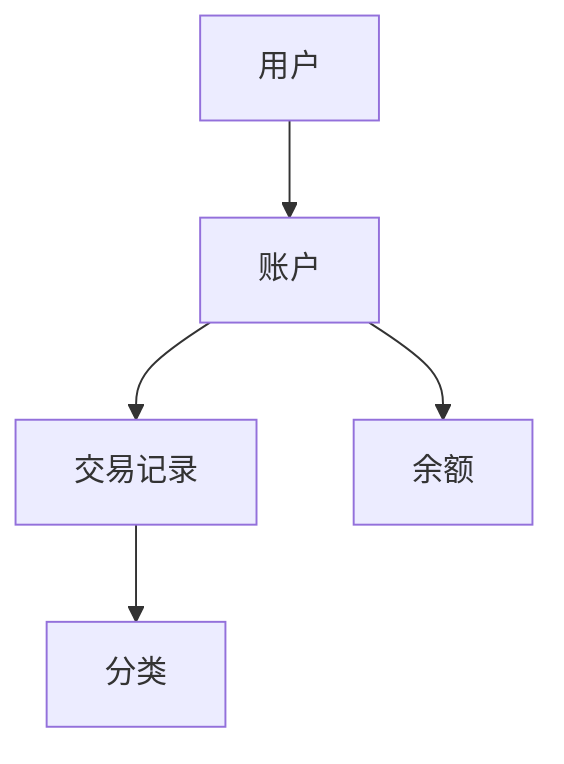
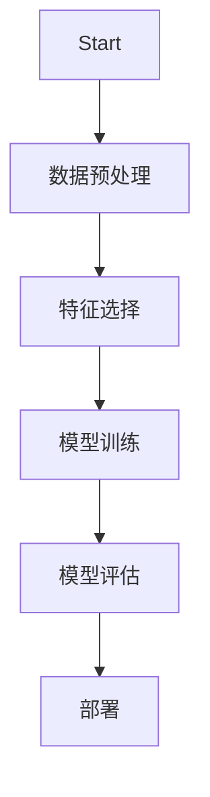

                 


# 个人财务健康指数动态跟踪系统

> 关键词：个人财务健康指数，动态跟踪系统，算法原理，系统架构，项目实战

> 摘要：本文深入探讨了个人财务健康指数动态跟踪系统的构建与实现。通过背景分析、核心概念解析、算法原理阐述、系统架构设计、项目实战指导，全面展示如何利用技术手段实现个人财务健康指数的实时跟踪与评估，帮助用户做出明智的财务决策。

---

## 第一部分：个人财务健康指数动态跟踪系统概述

### 第1章：个人财务健康指数动态跟踪系统背景介绍

#### 1.1 问题背景与描述
个人财务管理在现代生活中至关重要，但传统的财务管理方式存在诸多痛点。首先，财务数据分散在不同的平台（如银行账户、信用卡、投资平台等），难以集中管理；其次，手动计算财务健康指数耗时且容易出错；最后，缺乏实时反馈，难以及时调整财务策略。

#### 1.2 系统的目标与核心功能
- **目标**：实时跟踪和评估个人财务健康指数，提供个性化的财务建议。
- **核心功能**：
  1. 数据采集与整合
  2. 财务健康指数计算
  3. 财务状况可视化
  4. 财务健康趋势分析
  5. 自动化财务建议

#### 1.3 边界与外延
- **边界**：仅关注个人财务数据，不涉及企业财务。
- **外延**：可能扩展至家庭财务管理或多人协作的财务管理。

---

### 第2章：核心概念与联系

#### 2.1 个人财务健康指数的定义与属性
个人财务健康指数是一个综合指标，反映个人的财务状况。其计算基于以下几个核心维度：

| 维度 | 描述 | 类型 | 时间粒度 |
|------|------|------|----------|
| 收入 | 所有收入来源的总和 | 定量 | 日/月 |
| 支出 | 所有支出的总和 | 定量 | 日/月 |
| 资产 | 可用资产（如银行存款、投资） | 定量 | 日/月 |
| 负债 | 所有负债（如贷款、信用卡欠款） | 定量 | 日/月 |
| 信用评分 | 个人信用评分 | 定性 | 月 |

#### 2.2 实体关系图


---

## 第二部分：算法原理与实现

### 第3章：算法原理

#### 3.1 数据预处理
数据预处理是确保模型准确性的基础。步骤如下：
1. 数据清洗：处理缺失值、异常值。
2. 数据标准化：统一数据格式。
3. 特征提取：从交易记录中提取关键特征（如支出类别分布）。

#### 3.2 模型选择与训练
选择基于机器学习的回归模型（如线性回归或随机森林）来预测财务健康指数。

#### 3.3 算法流程图


#### 3.4 代码实现
```python
import pandas as pd
from sklearn.ensemble import RandomForestRegressor
from sklearn.metrics import mean_squared_error

# 数据加载与预处理
data = pd.read_csv('financial_data.csv')
data = data.dropna()  # 删除缺失值

# 特征工程
features = data[['income', 'expenses', 'assets', ' liabilities']]
target = data['credit_score']

# 模型训练
model = RandomForestRegressor()
model.fit(features, target)

# 模型评估
predicted = model.predict(features)
mse = mean_squared_error(target, predicted)
print(f"均方误差：{mse}")
```

---

## 第三部分：系统分析与架构设计

### 第4章：系统架构设计

#### 4.1 系统功能模块
- 数据采集模块：从不同平台获取财务数据。
- 数据处理模块：清洗和整合数据。
- 指数计算模块：基于模型计算健康指数。
- 可视化模块：生成图表和报告。

#### 4.2 系统架构图
```mermaid
graph TD
    User[用户] --> API Gateway[网关]
    API Gateway --> DataCollector[数据采集模块]
    DataCollector --> Database[数据库]
    Database --> DataProcessor[数据处理模块]
    DataProcessor --> Model[模型]
    Model --> ResultVisualizer[结果可视化]
```

---

## 第四部分：项目实战

### 第5章：项目实战

#### 5.1 环境安装
- 安装Python、Pandas、Scikit-learn等库。

#### 5.2 核心代码实现
```python
import pandas as pd
from sklearn.ensemble import RandomForestRegressor
from sklearn.metrics import mean_squared_error

# 数据加载与预处理
data = pd.read_csv('financial_data.csv')
data = data.dropna()

# 特征工程
features = data[['income', 'expenses', 'assets', ' liabilities']]
target = data['credit_score']

# 模型训练
model = RandomForestRegressor()
model.fit(features, target)

# 模型评估
predicted = model.predict(features)
mse = mean_squared_error(target, predicted)
print(f"均方误差：{mse}")
```

---

## 第五部分：最佳实践与总结

### 第6章：最佳实践

- 数据隐私保护：使用加密技术确保数据安全。
- 模型更新：定期更新模型以保持准确性。
- 用户教育：提供用户教育，帮助用户理解财务健康指数的意义。

### 6.1 小结
通过本文的详细讲解，读者可以了解如何构建和实现个人财务健康指数动态跟踪系统，掌握核心算法和系统架构设计的关键点。

### 6.2 注意事项
- 数据来源的多样性可能影响模型的准确性。
- 模型需要定期更新以适应数据变化。

### 6.3 拓展阅读
- 《机器学习实战》
- 《系统设计指南》

---

## 作者

作者：AI天才研究院/AI Genius Institute & 禅与计算机程序设计艺术 /Zen And The Art of Computer Programming

