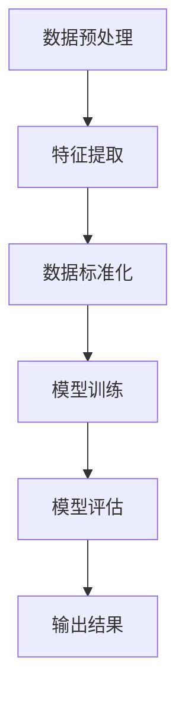
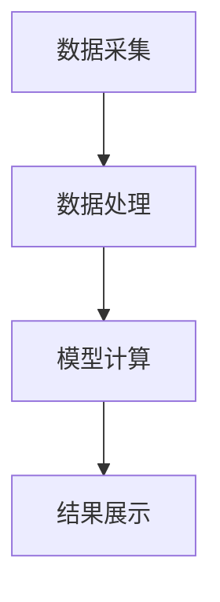

                 


# 个人财务健康指数开发与应用

> **关键词**：个人财务健康指数，财务分析，算法开发，系统架构，项目实战

> **摘要**：本文详细介绍了个人财务健康指数的概念、算法开发、系统架构设计及实际应用。通过背景分析、核心概念解析、数学模型构建、系统设计和项目实战，帮助读者全面理解并掌握个人财务健康指数的开发与应用方法。

---

## 第一章：个人财务健康指数概述

### 1.1 问题背景与重要性

个人财务管理是现代生活中的重要课题，涉及收入、支出、资产和负债等多个方面。随着经济波动和个人财务状况的变化，如何有效评估和管理财务健康状况成为许多人关注的焦点。传统的财务管理方法通常依赖于简单的收支记录，难以全面反映个人的财务健康状况。因此，开发一个能够量化个人财务健康状况的指数显得尤为重要。

### 1.2 问题描述与解决方法

#### 1.2.1 问题背景
- 个人财务问题通常表现为消费超支、债务过高、储蓄不足或投资不当。
- 这些问题可能导致短期流动性风险或长期财务不稳定。

#### 1.2.2 解决方法
- **定义**：个人财务健康指数（Personal Financial Health Index，PFHI）是一个量化指标，用于评估个人或家庭的财务健康状况。
- **目标**：通过分析各项财务数据，提供一个综合的健康评分，帮助用户识别潜在风险并制定改善计划。

#### 1.2.3 边界与外延
- **边界**：主要关注个人或家庭的财务状况，不涉及企业或机构财务。
- **外延**：可扩展至不同生命周期阶段的财务规划，如教育、退休规划等。

### 1.3 核心概念与要素

个人财务健康指数的核心要素包括收入、支出、资产和负债。以下是各要素的详细说明：

| 要素 | 定义 | 示例 |
|------|------|------|
| 收入 | 稍微固定的现金流，包括工资、投资收益等 | 税后月收入10000元 |
| 支出 | 日常生活开支，包括固定和可变支出 | 月均支出8000元 |
| 资产 | 所有净资产，包括现金、房产、投资等 | 总资产500万元 |
| 负债 | 所有债务，包括房贷、信用卡欠款等 | 总负债200万元 |

---

## 第二章：个人财务健康指数的核心概念

### 2.1 财务健康指数的定义与属性

个人财务健康指数（PFHI）是一个综合指标，通过标准化的计算方法，将收入、支出、资产和负债等关键财务指标进行加权计算，得出一个介于0到1之间的评分，0表示财务状况非常不稳定，1表示非常健康。

#### 2.1.1 财务健康指数的公式
$$
PFHI = \frac{资产 - 负债}{资产} \times 100
$$

**解释**：
- 资产和负债的差额代表净资产，净资产与资产的比率反映了财务安全性。
- 例如，若资产为500万元，负债为200万元，则净资产为300万元，PFHI = (300 / 500) × 100 = 60分。

#### 2.1.2 影响PFHI的因素
- **收入稳定性**：收入波动大的人，PFHI较低。
- **支出控制**：支出占收入比例高的，PFHI较低。
- **资产结构**：高流动性资产比例高的，PFHI较高。
- **债务负担**：高负债比例的人，PFHI较低。

### 2.2 实体关系分析

为了更好地理解个人财务健康指数的实体关系，我们可以通过ER图来展示各实体及其关系。

```mermaid
erDiagram
    person {
        name : 文本
        age : 数字
        income : 数字
        expenses : 数字
        assets : 数字
        liabilities : 数字
        financial_health_index : 数字
    }
    account {
        account_number : 文本
        balance : 数字
        account_type : 文本
        owner : person
    }
    transaction {
        transaction_id : 文本
        date : 文本
        amount : 数字
        type : 文本
        description : 文本
        payer : person
        receiver : person
    }
    relation(owns) {
        from : person
        to : account
    }
    relation(transacts) {
        from : person
        to : transaction
    }
```

---

## 第三章：算法原理与数学模型

### 3.1 数据预处理

#### 3.1.1 数据收集与清洗
- **数据来源**：银行账户、信用卡记录、投资账户等。
- **数据清洗**：处理缺失值、异常值和重复数据。

#### 3.1.2 数据标准化
- 使用归一化方法，将不同量纲的数据转换为统一尺度。

### 3.2 特征提取与选择

#### 3.2.1 特征提取
- 提取关键特征，如月收入、月支出、总资产、总负债等。

#### 3.2.2 特征权重
- 根据特征的重要性分配权重，例如收入和资产的权重较高。

### 3.3 模型训练与评估

#### 3.3.1 模型训练
- 使用机器学习算法（如线性回归或随机森林）进行训练。

#### 3.3.2 模型评估
- 使用准确率、召回率等指标评估模型性能。

### 3.4 算法流程图



### 3.5 Python代码实现

```python
import pandas as pd
from sklearn.preprocessing import StandardScaler
from sklearn.linear_model import LinearRegression

# 数据加载与预处理
data = pd.read_csv('financial_data.csv')
data.dropna(inplace=True)
data.drop_duplicates(inplace=True)

# 特征提取
features = data[['income', 'expenses', 'assets', 'liabilities']]
target = data['financial_health_index']

# 数据标准化
scaler = StandardScaler()
features_scaled = scaler.fit_transform(features)

# 模型训练
model = LinearRegression()
model.fit(features_scaled, target)

# 模型预测
predicted = model.predict(features_scaled)
```

---

## 第四章：系统分析与架构设计

### 4.1 系统架构设计

#### 4.1.1 功能模块划分
- 数据采集模块：收集财务数据。
- 数据处理模块：清洗和标准化数据。
- 模型计算模块：计算个人财务健康指数。
- 结果展示模块：以可视化方式呈现结果。

#### 4.1.2 系统架构图



---

## 第五章：项目实战

### 5.1 环境安装与配置

- **开发环境**：Python 3.8+
- **依赖库**：pandas、scikit-learn、matplotlib

### 5.2 核心代码实现

```python
import pandas as pd
import numpy as np
from sklearn.linear_model import LinearRegression
import matplotlib.pyplot as plt

# 数据加载
data = pd.read_csv('financial_data.csv')

# 数据清洗
data.dropna(inplace=True)

# 特征选择
features = data[['income', 'expenses', 'assets', 'liabilities']]
target = data['financial_health_index']

# 数据标准化
from sklearn.preprocessing import StandardScaler
scaler = StandardScaler()
features_scaled = scaler.fit_transform(features)

# 模型训练
model = LinearRegression()
model.fit(features_scaled, target)

# 预测结果
predicted = model.predict(features_scaled)

# 可视化
plt.scatter(target, predicted)
plt.xlabel('真实值')
plt.ylabel('预测值')
plt.show()
```

### 5.3 案例分析

假设一位用户的财务数据如下：

| 收入 | 支出 | 资产 | 负债 |
|------|------|------|------|
| 10000| 8000 | 500000| 200000|

计算PFHI：
$$
PFHI = \frac{500000 - 200000}{500000} \times 100 = 60
$$

---

## 第六章：总结与展望

### 6.1 最佳实践

- 定期更新财务数据，保持模型的准确性。
- 根据个人需求调整权重和算法。

### 6.2 小结

个人财务健康指数是一个实用的工具，能够帮助个人有效管理财务状况。通过本文的详细讲解，读者可以掌握从理论到实践的全过程。

---

**作者：AI天才研究院/AI Genius Institute & 禅与计算机程序设计艺术 /Zen And The Art of Computer Programming**

