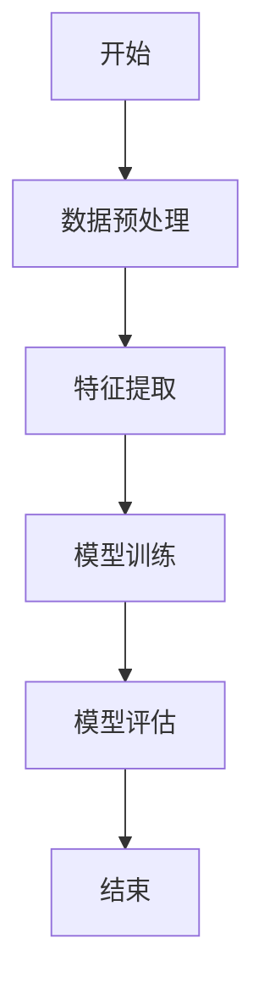

                 


# 个人财务健康评分系统设计

> 关键词：个人财务管理，财务健康评分，评分模型，评分算法，系统设计

> 摘要：本文详细介绍了个人财务健康评分系统的背景、核心概念、算法原理、系统设计及项目实现。通过系统化的分析和设计，提出了一套基于机器学习的评分模型，并结合实际案例，展示了如何通过系统设计和实现，帮助个人用户更好地管理财务健康。

---

# 第一部分：个人财务健康评分系统概述

## 第1章：个人财务健康评分系统背景与问题分析

### 1.1 个人财务健康评分的概念与意义

#### 1.1.1 什么是个人财务健康评分

个人财务健康评分是对个人或家庭的财务状况进行综合评估的一种量化方法。它通过分析用户的收入、支出、资产、负债等多方面数据，结合一定的权重和评分规则，计算出一个综合评分，用以反映用户的财务健康程度。

#### 1.1.2 个人财务健康评分的重要性

随着经济的发展和个人理财需求的增加，越来越多的人开始关注自己的财务健康状况。传统的财务管理方式往往依赖于手动记录和简单的数据分析，难以提供全面和科学的评估。而个人财务健康评分系统通过量化分析，能够帮助用户更直观地了解自己的财务状况，并根据评分结果提出改善建议。

#### 1.1.3 系统设计的目标与价值

本系统的目标是设计一个能够自动收集、分析和评估个人财务数据，并生成相应评分和建议的系统。通过该系统，用户可以实时了解自己的财务健康状况，从而做出更明智的财务决策。系统的设计价值体现在以下几个方面：

1. 提供科学的财务评估标准。
2. 通过评分和建议帮助用户改善财务状况。
3. 为用户提供便捷的财务管理工具。
4. 为金融机构提供潜在客户的信用评估依据。

### 1.2 个人财务健康评分的背景分析

#### 1.2.1 当前个人财务管理的痛点

目前，个人财务管理存在以下痛点：

1. **数据分散**：用户的财务数据可能分布在不同的平台（如银行账户、支付宝、微信等），难以集中管理。
2. **分析复杂**：手动分析财务数据需要较高的财务知识，普通用户难以完成。
3. **缺乏量化标准**：没有统一的量化标准来评估财务健康状况，用户难以直观了解自己的财务状况。
4. **个性化需求**：每个人的财务状况不同，需要个性化的评估和建议。

#### 1.2.2 传统财务管理方式的局限性

传统的财务管理方式主要依赖于手工记录和简单的表格分析，这种方式效率低下，且难以提供全面的评估。具体表现在以下几个方面：

1. **效率低**：手动记录和计算需要大量时间和精力。
2. **不全面**：传统方法往往只关注部分财务数据，缺乏整体分析。
3. **缺乏科学性**：缺乏科学的评分模型和算法支持。

#### 1.2.3 数字化财务管理的需求

随着信息技术的发展，数字化财务管理成为趋势。用户需要一个便捷、高效、智能化的财务管理工具，能够自动收集数据、分析评估并提供建议。

### 1.3 问题描述与解决思路

#### 1.3.1 个人财务健康评分的核心问题

个人财务健康评分的核心问题是如何将分散、复杂的财务数据转化为一个简单的评分，并通过评分反映用户的财务健康状况。具体问题包括：

1. 如何收集和整合多来源的财务数据？
2. 如何设计科学的评分模型和评估指标？
3. 如何确保评分的准确性和可靠性？

#### 1.3.2 系统设计的解决思路

针对上述问题，我们可以采用以下解决思路：

1. **数据整合**：通过API或手动输入，将用户分散的财务数据整合到系统中。
2. **模型设计**：设计一套科学的评分模型，包括评估指标的选择和权重的分配。
3. **算法实现**：基于机器学习算法，实现自动化评分。
4. **结果展示与建议生成**：通过友好的用户界面，展示评分结果并提供建议。

#### 1.3.3 边界与外延分析

系统的边界主要集中在个人用户的财务数据上，不涉及企业的财务数据。系统的外延则可以扩展到家庭财务、投资理财等领域。

---

## 第2章：个人财务健康评分的核心概念与联系

### 2.1 核心概念原理

#### 2.1.1 财务健康评分模型的定义

财务健康评分模型是一种基于多维度财务数据分析的量化评估模型，旨在通过综合分析用户的收入、支出、资产、负债等数据，给出一个反映用户财务健康程度的评分。

#### 2.1.2 模型的输入与输出

- **输入**：用户的财务数据，包括收入、支出、资产、负债等。
- **输出**：财务健康评分，通常是0到100之间的分数，分数越高表示财务状况越好。

#### 2.1.3 核心算法的数学模型

基于加权平均的评分模型：

$$
\text{评分} = \sum (\text{指标权重}_i \times \text{指标得分}_i)
$$

---

### 2.2 核心概念属性特征对比

#### 2.2.1 财务健康指标的属性分析

| 指标名称       | 属性分析                          |
|----------------|-----------------------------------|
| 收入支出比     | 反映用户的消费能力               |
| 资产与负债比   | 反映用户的财务安全性             |
| 应急储备金     | 反映用户应对突发情况的能力       |

#### 2.2.2 指标权重的对比

| 指标名称       | 权重（%）  |
|----------------|------------|
| 收入支出比     | 30         |
| 资产与负债比   | 40         |
| 应急储备金     | 30         |

#### 2.2.3 数据来源的特征分析

- 数据来源：银行账户、支付宝、微信钱包、投资理财平台等。
- 数据类型：结构化数据（收入、支出、资产、负债）。
- 数据频率：每日或每月更新。

### 2.3 ER实体关系图

```mermaid
er
  actor: 用户
  entity: 财务数据
  entity: 评分结果
  entity: 指标权重
  relation: 用户-财务数据
  relation: 财务数据-评分结果
  relation: 指标权重-评分结果
```

---

# 第二部分：个人财务健康评分算法原理

## 第3章：基于机器学习的评分模型

### 3.1 算法选择与原理

#### 3.1.1 选择机器学习算法的原因

机器学习算法能够自动从数据中学习规律，适合用于复杂的评分模型。

#### 3.1.2 算法的数学模型

基于线性回归的评分模型：

$$
y = w_1x_1 + w_2x_2 + \dots + w_nx_n + b
$$

其中：
- \( y \)：财务健康评分
- \( x_i \)：各个评估指标
- \( w_i \)：指标权重
- \( b \)：截距

#### 3.1.3 算法的优缺点分析

- **优点**：能够自动优化权重，适合多指标评估。
- **缺点**：模型简单，可能无法捕捉复杂的财务关系。

### 3.2 算法流程图



---

## 第4章：系统分析与架构设计

### 4.1 系统功能设计

#### 4.1.1 领域模型设计


---

### 4.2 系统架构设计

#### 4.2.1 系统架构图

```mermaid
archi
    服务端
    数据库
    用户端
    接口服务
    财务数据处理
    评分计算
    结果展示
```

---

## 第5章：项目实战与实现

### 5.1 项目环境安装

```bash
pip install numpy pandas scikit-learn
```

### 5.2 核心代码实现

```python
import pandas as pd
from sklearn.linear_model import LinearRegression

# 数据预处理
data = pd.read_csv('financial_data.csv')

# 特征提取
X = data[['收入', '支出', '资产', '负债']]
y = data['评分']

# 模型训练
model = LinearRegression()
model.fit(X, y)

# 模型预测
predicted_score = model.predict(X)
```

---

## 第6章：最佳实践与总结

### 6.1 小结

个人财务健康评分系统通过整合用户财务数据，结合科学的评分模型，能够帮助用户全面了解自己的财务状况，并提供改善建议。

### 6.2 注意事项

- 数据隐私保护
- 算法的可解释性
- 系统的易用性

### 6.3 拓展阅读

- 《个人财务管理的艺术》
- 《机器学习在金融领域的应用》

---

# 作者

**作者：AI天才研究院/AI Genius Institute & 禅与计算机程序设计艺术 /Zen And The Art of Computer Programming**

