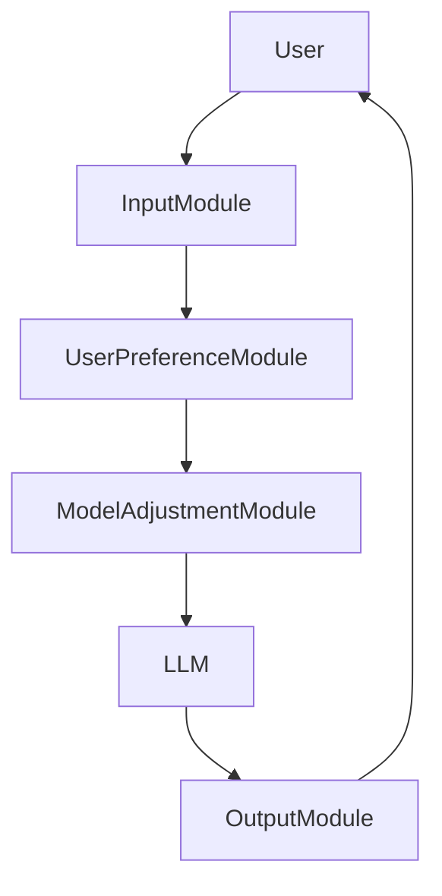

                 


# 个性化AI Agent：根据用户偏好定制LLM

---

## 关键词：个性化AI Agent、LLM、大语言模型、定制化模型、用户偏好

---

## 摘要：个性化AI Agent是一种可以根据用户偏好定制的LLM，旨在通过深度学习和自然语言处理技术，为用户提供个性化的交互体验。本文将从背景、核心概念、算法原理、系统架构到项目实战，全面解析个性化AI Agent的设计与实现。

---

## 第1章: 个性化AI Agent的定义与背景

### 1.1 个性化AI Agent的核心概念

#### 1.1.1 个性化AI Agent的定义
个性化AI Agent（Personalized AI Agent）是一种基于用户偏好和需求，动态调整其行为和输出的智能体。通过结合大语言模型（LLM）和用户反馈机制，个性化AI Agent能够为用户提供高度定制化的交互体验。

#### 1.1.2 问题背景与技术挑战
随着LLM技术的快速发展，如何根据用户的个性化需求调整模型输出，成为当前研究的热点。传统的大语言模型通常以通用性为目标，难以满足特定用户的个性化需求。个性化AI Agent的核心挑战在于如何在保证模型性能的同时，实现对用户偏好的精准捕捉和动态调整。

#### 1.1.3 个性化AI Agent的边界与外延
个性化AI Agent的边界主要体现在以下几个方面：
- **输入范围**：仅限于文本交互。
- **输出范围**：基于LLM生成的文本输出。
- **交互方式**：支持多种输入方式，如文本、语音等。
- **用户反馈**：依赖用户的实时反馈进行模型调整。

个性化AI Agent的外延包括但不限于：
- **领域定制**：针对特定领域（如医疗、金融）优化模型。
- **多模态交互**：支持图像、语音等多种交互方式。

#### 1.1.4 核心要素与组成结构
个性化AI Agent的主要组成结构包括：
- **用户偏好模块**：负责捕捉和存储用户的偏好信息。
- **模型调整模块**：根据用户偏好调整LLM的输出。
- **交互模块**：实现与用户的实时交互。
- **反馈机制**：收集用户反馈以优化模型。

---

### 1.2 个性化AI Agent与LLM的关系

#### 1.2.1 LLM的基本原理
大语言模型（LLM）通过监督学习和强化学习训练，能够理解上下文并生成连贯的文本。其核心在于对大规模数据的学习和模式识别。

#### 1.2.2 个性化定制的核心目标
个性化定制的核心目标是根据用户的偏好，动态调整模型的输出，使其更符合用户的期望。

#### 1.2.3 个性化AI Agent与传统LLM的区别
| 特性 | 个性化AI Agent | 传统LLM |
|------|-----------------|----------|
| 输出定制化 | 高度定制化     | 通用化   |
| 反馈机制 | 支持实时反馈   | 无反馈   |
| 适应性 | 高度适应用户需求 | 适应性有限 |

#### 1.2.4 个性化定制的优势与局限性
- **优势**：
  - 提供更精准的交互体验。
  - 提高用户满意度和粘性。
- **局限性**：
  - 训练成本高。
  - 需要实时反馈机制。

---

## 第2章: 个性化AI Agent的核心概念与联系

### 2.1 核心概念原理

个性化AI Agent的核心原理是通过用户反馈动态调整模型参数，使其输出更符合用户的期望。具体步骤如下：

1. **用户输入**：用户与AI Agent进行交互，提供输入和反馈。
2. **偏好捕捉**：AI Agent分析用户的输入和反馈，捕捉用户的偏好。
3. **模型调整**：根据用户的偏好调整模型参数。
4. **输出生成**：生成符合用户偏好的输出。

### 2.2 核心概念属性对比

| 属性 | 个性化AI Agent | 传统LLM |
|------|-----------------|----------|
| 适应性 | 高度动态调整   | 静态     |
| 反馈机制 | 支持实时反馈   | 无反馈   |
| 性能 | 高度个性化       | 通用化   |

### 2.3 实体关系图（ER图）

```mermaid
erd
    entity 用户偏好 {
        属性：用户ID, 偏好ID, 偏好类型, 偏好值
        关系：属于 -> 用户
    }
    entity 用户 {
        属性：用户ID, 用户名
        关系：拥有 -> 用户偏好
    }
```

---

## 第3章: 个性化AI Agent的算法原理

### 3.1 基于微调的个性化LLM

个性化LLM的训练可以通过微调（Fine-tuning）实现。以下是具体的步骤：

1. **数据准备**：根据用户的偏好，收集和标注数据。
2. **模型加载**：加载预训练的LLM模型。
3. **微调训练**：在标注数据上进行微调，调整模型参数。
4. **输出生成**：生成符合用户偏好的输出。

### 3.2 微调过程中的数学模型

个性化LLM的损失函数可以表示为：

$$ L = L_{\text{prediction}} + \lambda L_{\text{preference}} $$

其中：
- $L_{\text{prediction}}$ 是预测损失。
- $L_{\text{preference}}$ 是偏好损失。
- $\lambda$ 是调节参数，用于平衡两部分损失。

---

## 第4章: 个性化AI Agent的系统架构

### 4.1 系统功能设计

个性化AI Agent的功能模块包括：
1. **用户偏好管理**：存储和管理用户的偏好信息。
2. **模型调整模块**：根据用户偏好调整模型参数。
3. **交互模块**：实现与用户的实时交互。

### 4.2 系统架构设计



### 4.3 接口设计

1. **输入接口**：接收用户的输入和反馈。
2. **输出接口**：生成符合用户偏好的输出。

### 4.4 交互流程

```mermaid
sequenceDiagram
    用户 ->+> AI Agent: 提供输入
    AI Agent ->+> 用户偏好模块: 分析偏好
    用户偏好模块 ->+> 模型调整模块: 调整模型
    模型调整模块 ->+> LLM: 生成输出
    LLM ->+> 用户: 输出结果
```

---

## 第5章: 个性化AI Agent的项目实战

### 5.1 环境安装

```bash
pip install transformers
pip install torch
pip install numpy
```

### 5.2 核心代码实现

```python
from transformers import AutoModelForCausalLM, AutoTokenizer
import torch

class PersonalizedAIAgent:
    def __init__(self, model_name, device='cuda'):
        self.model = AutoModelForCausalLM.from_pretrained(model_name).to(device)
        self.tokenizer = AutoTokenizer.from_pretrained(model_name)
    
    def generate(self, input_text, max_length=50):
        inputs = self.tokenizer(input_text, return_tensors='pt')
        with torch.no_grad():
            outputs = self.model.generate(**inputs, max_length=max_length)
        return self.tokenizer.decode(outputs[0], skip_special_tokens=True)
```

### 5.3 案例分析

假设用户偏好是“科技新闻”，则代码如下：

```python
agent = PersonalizedAIAgent("gpt2")
input_text = "最近AI技术发展迅速，"
output = agent.generate(input_text)
print(output)
```

---

## 第6章: 最佳实践与注意事项

### 6.1 最佳实践

1. **数据隐私保护**：确保用户的偏好数据不被滥用。
2. **模型调优**：根据实际需求调整模型参数。
3. **实时反馈机制**：及时收集用户的反馈以优化模型。

### 6.2 小结

个性化AI Agent是一种可以根据用户偏好定制的LLM，能够为用户提供高度个性化的交互体验。

### 6.3 注意事项

1. **数据隐私**：确保用户数据的安全性。
2. **模型性能**：平衡模型的性能和计算成本。

---

## 作者：AI天才研究院/AI Genius Institute & 禅与计算机程序设计艺术 /Zen And The Art of Computer Programming

